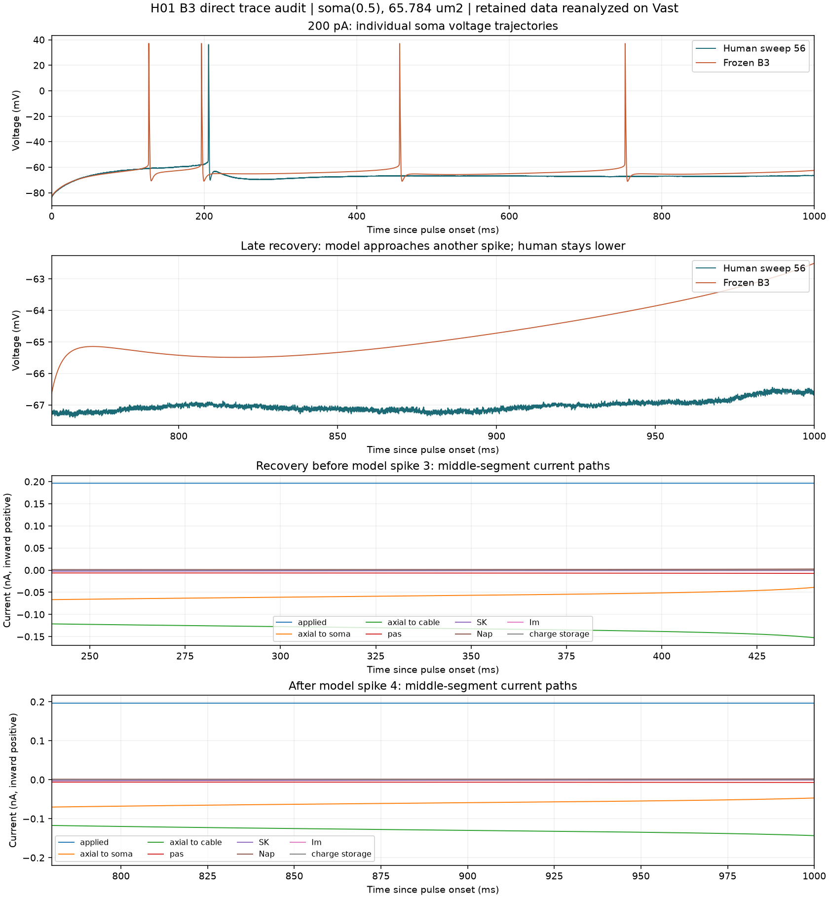

# H01: direct response audit of the B3 explanation

## Result

Reanalysis of retained traces on the Vast executor at `56240d4` confirms a
time-dependent difference in recovery and refiring. It does not identify a missing
human current. Two problems invalidate the stronger interpretation of SP11's
aggregate-derived current offset: uneven temporal sampling, and a post-pulse
window containing only one terminal model sample.

The [machine-readable audit](h01-causal-direct-trace-audit-2026-09-11.json) records
the executor, UTC execution time, complete source hashes, individual voltage/current
observations, and window coverage. It was executed after midnight UTC on September
12, still September 11 in the project's America/Los_Angeles timezone.
This was a fresh analysis on Vast, not a new simulation. SP12 stage 0 was already
running there; this analysis did not change its doses, processes, or results.
The NEURON campaign uses CPU execution on the GPU-equipped host.

## Book basis and comparison design

Hartshorne's Matryoshka example calls for observations connected within a cycle,
with their spatial and temporal references retained, and warns against collapsing
separate observations into one number ([printed p. 110](<C:/Users/J/Documents/Diagnosing Performance and Reliability/pages/p101.jpg>)).
Its next step is to contrast closely related observations, rather than assume
that a difference between differently driven systems isolates one mechanism
([printed p. 111](<C:/Users/J/Documents/Diagnosing Performance and Reliability/pages/p100.jpg>)).
The rotor example retains orientation and production sequence to expose the
pattern that a flatness score discarded ([printed p. 67](<C:/Users/J/Documents/Diagnosing Performance and Reliability/pages/p058.jpg>)).

Accordingly, this audit retains the 200 pA sweep's actual trajectory and individual
spikes. It compares human and B3 on the same pulse clock, then examines B3 recovery
at the observed middle soma segment. It does not average spikes, align different
events as if they corresponded, or infer human currents from model currents.

## Direct observations

The pulse starts at 1020 ms. Upward sampled crossings of -20 mV occur at
1147.18, 1216.28, 1476.13, and 1771.80 ms in B3, and at 1225.46 ms in the human.
These are not peak times or the derivative-defined threshold; the criterion is
kept explicit to avoid mixing event clocks.

| Absolute time (ms) | Human voltage (mV) | B3 voltage (mV) | Observed context |
| ---: | ---: | ---: | --- |
| 1140 | -61.19 | -60.77 | Both before their first spike. |
| 1160 | -60.75 | -64.52 | Model has spiked; human has not. |
| 1260 | -68.09 | -65.13 | Human has spiked once, model twice. |
| 1300 | -69.56 | -65.13 | Recovery trajectories differ. |
| 1850 | -67.13 | -65.47 | After the model's fourth spike. |
| 1900 | -67.28 | -65.00 | Model begins rising again. |
| 1950 | -67.03 | -64.24 | Difference grows during recovery. |
| 2000 | -66.66 | -63.16 | Human remains lower near pulse end. |

At 1260 ms, the local applied current is +0.196288 nA. Axial currents are
-0.066588 nA to adjacent soma segments and -0.121377 nA to attached non-soma
cable. The local ionic currents and capacitive current close this balance to
roundoff at the recorded precision. The JSON retains each signed term at nine
times; these values belong to soma(0.5), area 65.7844 um2, not the whole soma.
The current plot preserves how those paths change through recovery. It does not
identify the downstream cable's storage or ionic paths, or establish excess load
relative to the human cell.

## Aggregate and inference corrections

| Model window (absolute ms) | Old sample mean (mV) | Time-weighted mean (mV) | Coverage |
| --- | ---: | ---: | --- |
| 1100-1200 | -60.2074 | -62.1593 | Recorded samples span the window to less than 0.001 ms. |
| 1300-1500 | -61.9262 | -63.4161 | Recorded samples span the window to less than 0.001 ms. |
| 1800-2000 | -64.7932 | -64.7646 | Recorded samples span the window to less than 0.001 ms. |
| 2100-2300 | -84.3853 | Unavailable | Exactly one sample, at 2100 ms. |

The recorded grid is nonuniform. A plain sample mean or percentile weights
observations by sample density, not elapsed time. Trapezoidal time means above
are a check on the old calculation, not a replacement causal explanation.
The SP11 input-resistance estimate uses the last row as if it characterized a
post-pulse window. Its 98 MOhm value is therefore an apparent ratio involving a
terminal sample, not an established incremental or steady-state resistance.

Consequently, 0.020/0.059 nA are exploratory sizing estimates, not demonstrated
necessary currents. A baseline channel current is also not an upper bound on the
effect of its removal: changing it changes voltage, gates, and axial exchange.
SP11's corrected area does not fix these separate logical issues.

The 110 pA no-spike versus 200 pA post-spike contrast motivates a history-dependent
hypothesis but does not isolate spike history from input dependence. The actual
200 pA trace also contradicts a blanket statement that the human is always below
the model after a model spike: the order reverses at 1160 ms.

SP12's gate is logistic around -20 mV, with a time constant interpolating from
1000 to 1 ms. It is not a hard spike switch. The pre-spike deviation check remains
necessary. A pass of its count and median bands would still require inspection
of the individual recovery trajectories before claiming the proposed behavior.
Two failed doses would reject those tested settings, not every slow outward-current
mechanism. An unrun Im intervention supplies no response verdict.

## Reproduction and limits

Load the two NPZ files and the model JSON named and hashed in the audit. Use
`time_ms` with model `voltage_mv` and human `corrected_voltage_mv`; interpolate
linearly at the explicit times in `pointwise_voltage`. Detect adjacent samples
crossing upward through -20 mV and report the latter sample's time.

For each `window_audit` interval, select `start <= time < stop`, report coverage,
and compare the arithmetic sample mean with the trapezoidal voltage integral
divided by the actual sampled duration. Refuse a time mean for a one-sample window.
For each local current density use `-density * area_um2 * 0.01` to obtain inward
nA. Compute each neighbor's axial current as `(V_neighbor - V_soma)/R_MOhm` and
retain soma and non-soma destinations separately. NEURON capacitive current
enters the closure sum with a negative sign. The plot displays positive charge
storage as the opposite of that term. Plot the original samples without averaging;
the local rendering inputs were hash-checked against the Vast audit.

No new intervention or physiological measurement was made. The sufficient repair,
the human mechanism, and a complete downstream current budget remain unresolved.
The mistake was promoting aggregate sizing and incomplete spatial/window boundaries
into causal exclusions. Future decisions must check time coverage, sample weighting,
spatial extent, and the full intervention trajectory before making that inference.
