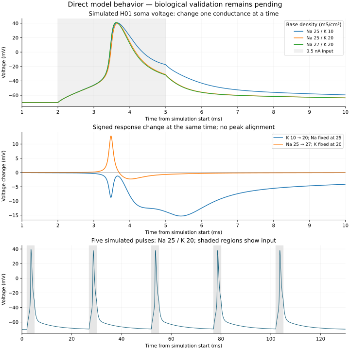

# Measured effects in the H01 simulation

These results compare direct simulated voltage traces.
They do not compare the model with a measured human target trace.
The [causal model](../h01-causal-model.md) states the physical explanation.

Each comparison uses 4,000 samples, from 0.005 to 20 ms.
The sample interval is 0.005 ms. No spike peak was aligned.
The analysis checks source anatomy and unchanged model parameters.
It records source hashes and each signed voltage difference in
[the calculation output](h01-causal-factor-effects.json).

RSS is the square root of the sum of squared voltage changes.
RMS is RSS divided by the square root of the sample count.

| Tested physical change | RSS (mV) | RMS (mV) |
| --- | ---: | ---: |
| Remove sodium conductance: 9.601446023 to 0 mS/cm² | 769.673 | 12.170 |
| Increase potassium conductance: 10 to 20 mS/cm² | 353.617 | 5.591 |
| Increase sodium conductance: 25 to 27 mS/cm² | 65.437 | 1.035 |

Sodium removal has the largest response among these interventions.
Its size differs from the other changes. It uses an older, unaligned mesh.
Thus, this table cannot establish a universal factor ranking.
The potassium comparison changes the falling phase over a longer interval.
The smaller sodium increase changes spike onset and peak voltage.
The signed difference shows effects that a peak value alone would hide.

| Tested numerical change | RSS (mV) | RMS (mV) |
| --- | ---: | ---: |
| Halve time step: 0.0025 to 0.00125 ms | 2.187 | 0.034580 |
| Halve maximum CV length: 2.5 to 1.25 µm | 0.231 | 0.003648 |

Both numerical comparisons use aligned active-region boundaries.
Their physical parameters are fixed at sodium 25 and potassium 10 mS/cm².
The observed time-step effect exceeds the observed spatial effect.
These are refinement differences. They are not proven bounds on exact-solution error.

The five-pulse trace has one spike after each pulse.
Its peaks decrease from 39.46 to approximately 38.01 mV.
See [individual spike observations](h01-active-five-pulse-features.json).
Human trace validation and the matched holding-current condition remain pending.

No factor uncertainty or covariance was supplied for this calculation.
Do not interpret these response scores as uncertainty contributions.
No residual against a raw human pyramidal trace was calculated.

Reproduce the numerical table with `h01_causal_factor_analysis.py`.
Reproduce the figure with `h01_causal_trace_plot.py`.
Both scripts read saved traces. Neither script runs the neuron model.
