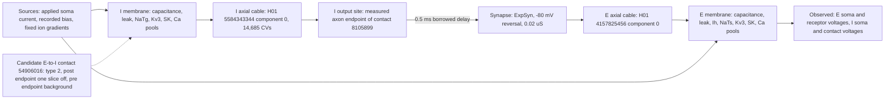

# H01 measured pair: energetic map and what each element represents

One page, in the source-to-load form of Hartshorne 2020 (scan pages p206-p214)
and the energetic framework the causal-diagnosis spec cites. Every boundary
names the paired observation that characterises it and whether the element is
measured, borrowed, or inferred. Nothing on this page is a physiological pass.

| Boundary | Paired observation | Status | Evidence |
| --- | --- | --- | --- |
| Applied current | Soma current and voltage | Command current only: the recorded 31.4 pA is a holding current the published fit absorbed (model rests at the held baseline within 0.07 mV at bias 0, 2.4 mV above it with the bias) | [forensics](h01-pv-bias-forensics.md) |
| I membrane channels | Channel current and driving voltage, charge per boundary per cycle (closure 1e-15 pC) | Borrowed from HL5BN1. Loop: sodium inflow ends within the upstroke (0.18 vs 3.5 pC through the fall). Trough: Kv3 activation carried past the short spike, its tail below -73 mV discharging soma and coupled dendrites through 0.16 nA of axial return; Ca_LVA opposes it 1 mV per unit. Count: axonal SK accumulates. Not explained: post-trough drive, accommodation | [I result](h01-i-energetic-result.md) |
| I cable and region map | Voltage difference and axial current | Measured geometry; electrical regions inferred from sparse labels; the contact path is dendrite fallback | [region map](h01-measured-ie-region-audit.json) |
| I output site | Contact voltage and emitted event | Measured endpoint; an event is emitted only with the diagnostic closing-time override (the G1a member restored to 1.0) | [contact arrival](h01-measured-i-source-closing20-audit.json) |
| Synapse | Conductance and receiving voltage | Anatomically measured contact; conductance, delay, and kinetics borrowed | [paired delivery](h01-measured-delivery20-paired-audit.json) |
| E membrane channels | Channel current and driving voltage, charge per boundary at the fastest rise (closure 1e-14 pC) | Borrowed from Allen 626170538, a perisomatic fit: all active conductances somatic, axon stub and dendrites passive. Rise rate 641 V/s against the human 351 is load-limited (85 to 90 percent of somatic sodium leaves axially) but the soma's sodium sets the peak; the human's two-stage upstroke needs an initiation site the family lacks | [E result](h01-e-energetic-result.md) |
| E cable | Voltage difference and axial current | Measured geometry; regions inferred | [spatial check](h01-measured-E5-overlap-paired-cv5-audit.json) |
| Candidate E-to-I contact | Endpoint labels in the proofread volume | Found through the C3 relationship index; post endpoint reads I one slice away, pre endpoint reads background within 2 voxels; 5-voxel check stalled and untested; inferred | [edge list](h01-resolved-edge-list.json) |

## What the circuit's behaviour represents

- Delivery of an inhibitory conductance from a measured I axon endpoint to a
  measured E receptor site, with the predicted local sign and a bounded onset
  delay, under a diagnostic I channel law. This is demonstrated.
- Human-constrained single-cell behaviour: partly demonstrated for the I cell.
  Under the command-only input the finalist (somatic Kv3 close factor 2.0 on
  the candidate) reproduces the spike loop and the trough at three inputs,
  predicted on the closed 0.23 nA holdout; the early burst, the count and the
  accommodation along the train remain unexplained. The E cell's rise rate is
  load-limited and under a two-arm split; no E row passes yet.
- A reconstructed H01 microcircuit: not claimed. One directed contact is
  anatomically supported; the reciprocal candidate is unverified; the other
  102 cells have no qualified partner mapping yet.

## Dissipation and storage, stated once

Stored energy per compartment is CV^2/2 at the membrane; channel dissipation is
g(V-E)^2 per channel; the ion-gradient reservoirs are fixed and outside the
budget. The applied current and the bias are the only external sources. The
parasitic elements that shaped every campaign result are the ones that were
not in the partition: the leak path that sets the threshold under the recorded
bias, and the slow Ih return under hyperpolarisation.
