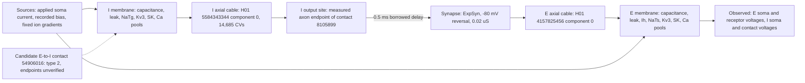

# H01 measured pair: energetic map and what each element represents

One page, in the source-to-load form of Hartshorne 2020 (scan pages p206-p214)
and the energetic framework the causal-diagnosis spec cites. Every boundary
names the paired observation that characterises it and whether the element is
measured, borrowed, or inferred. Nothing on this page is a physiological pass.

| Boundary | Paired observation | Status | Evidence |
| --- | --- | --- | --- |
| Applied current and bias | Soma current and voltage | Recorded bias is part of the input; omitting it changed the I event count from 11 to 22 on the source | [input datum](h01-pv-input-datum.json) |
| I membrane channels | Channel current and driving voltage | Borrowed from HL5BN1; fast inactivation (G1a) sets the first-spike shape and raises the minima 6 mV; axonal SK (G3) brakes the count; the threshold family is untested | [I result](h01-i-campaign-result.md) |
| I cable and region map | Voltage difference and axial current | Measured geometry; electrical regions inferred from sparse labels; the contact path is dendrite fallback | [region map](h01-measured-ie-region-audit.json) |
| I output site | Contact voltage and emitted event | Measured endpoint; an event is emitted only with the diagnostic closing-time override (the G1a member restored to 1.0) | [contact arrival](h01-measured-i-source-closing20-audit.json) |
| Synapse | Conductance and receiving voltage | Anatomically measured contact; conductance, delay, and kinetics borrowed | [paired delivery](h01-measured-delivery20-paired-audit.json) |
| E membrane channels | Channel current and driving voltage | Borrowed from Allen 626170538; F2 carries interval 2, F4 the phases, F3+F5 the count and onset region; the late return is outside F1-F5 | [E result](h01-e-campaign2-result.md) |
| E cable | Voltage difference and axial current | Measured geometry; regions inferred | [spatial check](h01-measured-E5-overlap-paired-cv5-audit.json) |
| Candidate E-to-I contact | Endpoint labels in the proofread volume | Found through the C3 relationship index; both endpoints read background at the annotation voxels; neighbourhood check pending | [edge list](h01-resolved-edge-list.json) |

## What the circuit's behaviour represents

- Delivery of an inhibitory conductance from a measured I axon endpoint to a
  measured E receptor site, with the predicted local sign and a bounded onset
  delay, under a diagnostic I channel law. This is demonstrated.
- Human-constrained single-cell behaviour: not demonstrated. Under the recorded
  input neither frozen cell meets the approved contract, and each campaign
  closed with a named untested family (I threshold; E late return).
- A reconstructed H01 microcircuit: not claimed. One directed contact is
  anatomically supported; the reciprocal candidate is unverified; the other
  102 cells have no qualified partner mapping yet.

## Dissipation and storage, stated once

Stored energy per compartment is CV^2/2 at the membrane; channel dissipation is
g(V-E)^2 per channel; the ion-gradient reservoirs are fixed and outside the
budget. The applied current and the bias are the only external sources. The
parasitic elements that shaped every campaign result are the ones that were
not in the partition: the leak path that sets the threshold under the recorded
bias, and the slow Ih return under hyperpolarisation.
