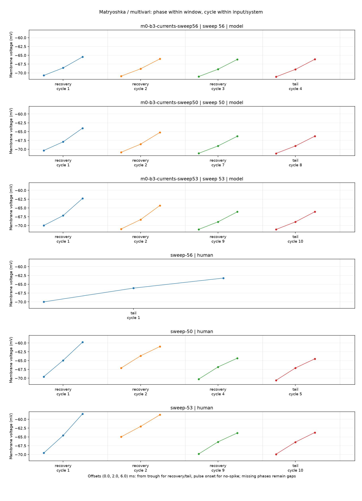
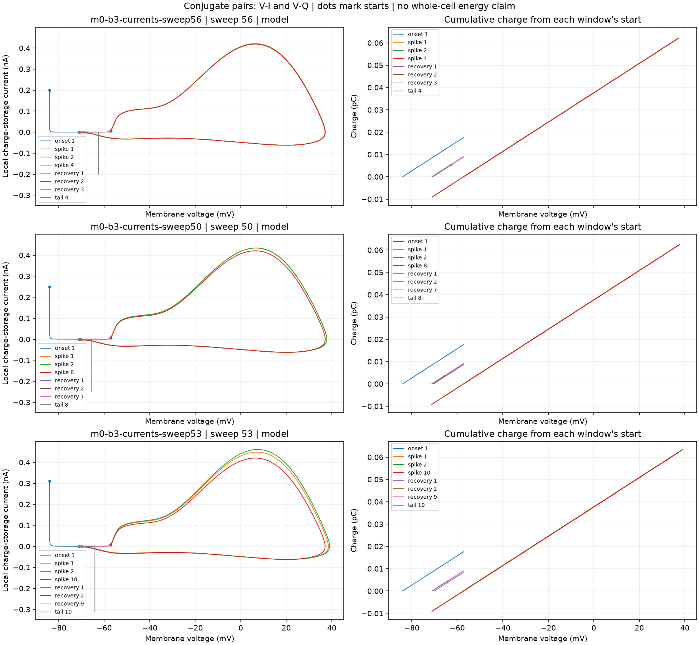
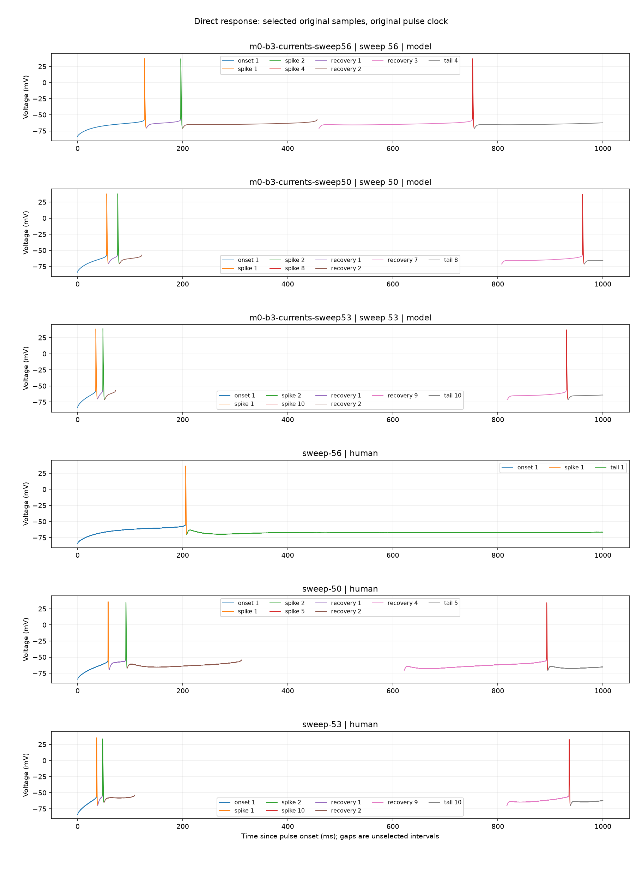
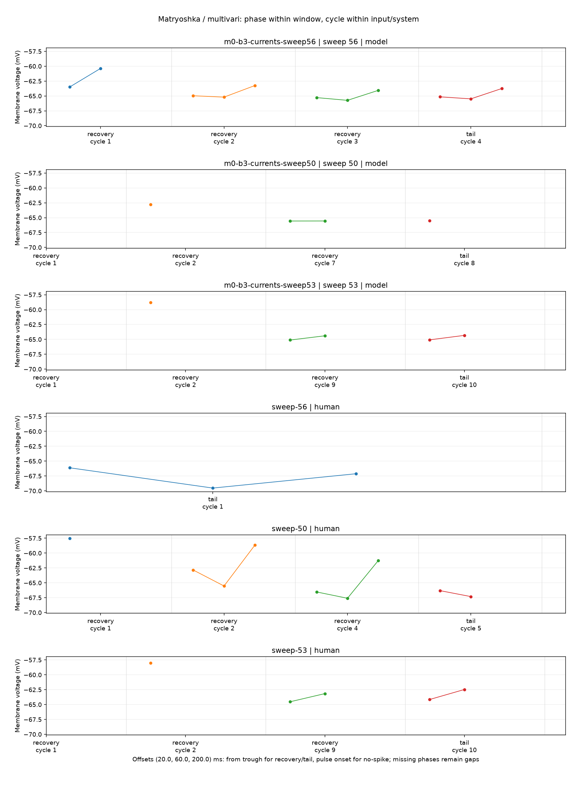

# H01 direct observations

Inspect the multivari and conjugate-pair charts before interpreting a cause.
A small cycle sample retains all original samples within each selected window.
Missing phases and mismatched events are not causal equivalence. Human ionic currents are unavailable.

## m0-b3-currents-sweep56 | sweep 56 | model

Current observations: available. Causal verdict: not established.

| Window | Cycle | Phase | Absolute ms | Voltage mV | Status |
| --- | ---: | --- | ---: | ---: | --- |
| onset | 1 | +0ms | 1020.000000 | -83.9694 | available |
| onset | 1 | +2ms | 1022.000000 | -81.0962 | available |
| onset | 1 | +6ms | 1026.000000 | -78.5436 | available |
| onset | 1 | +20ms | 1040.000000 | -72.9452 | available |
| onset | 1 | +60ms | 1080.000000 | -66.0393 | available |
| onset | 1 | +200ms | 1220.000000 | unavailable | beyond_window |
| spike | 1 | threshold | 1146.920220 | -57.2075 | available |
| spike | 1 | peak | 1147.350087 | 37.176 | available |
| spike | 1 | trough | 1150.592087 | -70.7219 | available |
| spike | 2 | threshold | 1216.024751 | -57.2069 | available |
| spike | 2 | peak | 1216.455761 | 37.0914 | available |
| spike | 2 | trough | 1219.692473 | -70.9021 | available |
| spike | 4 | threshold | 1771.542911 | -57.2081 | available |
| spike | 4 | peak | 1771.973624 | 37.0375 | available |
| spike | 4 | trough | 1775.166379 | -71.105 | available |
| recovery | 1 | +0ms | 1150.592087 | -70.7219 | available |
| recovery | 1 | +2ms | 1152.592087 | -68.5771 | available |
| recovery | 1 | +6ms | 1156.592087 | -65.47 | available |
| recovery | 1 | +20ms | 1170.592087 | -63.4877 | available |
| recovery | 1 | +60ms | 1210.592087 | -60.3668 | available |
| recovery | 1 | +200ms | 1350.592087 | unavailable | beyond_window |
| recovery | 2 | +0ms | 1219.692473 | -70.9021 | available |
| recovery | 2 | +2ms | 1221.692473 | -68.8408 | available |
| recovery | 2 | +6ms | 1225.692473 | -66.0131 | available |
| recovery | 2 | +20ms | 1239.692473 | -64.9685 | available |
| recovery | 2 | +60ms | 1279.692473 | -65.1979 | available |
| recovery | 2 | +200ms | 1419.692473 | -63.2479 | available |
| recovery | 3 | +0ms | 1479.512343 | -71.0415 | available |
| recovery | 3 | +2ms | 1481.512343 | -68.9666 | available |
| recovery | 3 | +6ms | 1485.512343 | -66.1646 | available |
| recovery | 3 | +20ms | 1499.512343 | -65.2801 | available |
| recovery | 3 | +60ms | 1539.512343 | -65.7387 | available |
| recovery | 3 | +200ms | 1679.512343 | -64.0586 | available |
| tail | 4 | +0ms | 1775.166379 | -71.105 | available |
| tail | 4 | +2ms | 1777.166379 | -68.9965 | available |
| tail | 4 | +6ms | 1781.166379 | -66.1387 | available |
| tail | 4 | +20ms | 1795.166379 | -65.1525 | available |
| tail | 4 | +60ms | 1835.166379 | -65.489 | available |
| tail | 4 | +200ms | 1975.166379 | -63.7526 | available |

## m0-b3-currents-sweep50 | sweep 50 | model

Current observations: available. Causal verdict: not established.

| Window | Cycle | Phase | Absolute ms | Voltage mV | Status |
| --- | ---: | --- | ---: | ---: | --- |
| onset | 1 | +0ms | 1020.000000 | -83.9694 | available |
| onset | 1 | +2ms | 1022.000000 | -80.3778 | available |
| onset | 1 | +6ms | 1026.000000 | -77.187 | available |
| onset | 1 | +20ms | 1040.000000 | -70.1606 | available |
| onset | 1 | +60ms | 1080.000000 | unavailable | beyond_window |
| onset | 1 | +200ms | 1220.000000 | unavailable | beyond_window |
| spike | 1 | threshold | 1074.963668 | -57.2191 | available |
| spike | 1 | peak | 1075.388057 | 37.806 | available |
| spike | 1 | trough | 1078.583731 | -70.3558 | available |
| spike | 2 | threshold | 1095.910466 | -57.2438 | available |
| spike | 2 | peak | 1096.334481 | 37.8271 | available |
| spike | 2 | trough | 1099.521617 | -70.8536 | available |
| spike | 8 | threshold | 1980.819182 | -57.214 | available |
| spike | 8 | peak | 1981.249443 | 37.1223 | available |
| spike | 8 | trough | 1984.422889 | -71.182 | available |
| recovery | 1 | +0ms | 1078.583731 | -70.3558 | available |
| recovery | 1 | +2ms | 1080.583731 | -67.9055 | available |
| recovery | 1 | +6ms | 1084.583731 | -64.0226 | available |
| recovery | 1 | +20ms | 1098.583731 | unavailable | beyond_window |
| recovery | 1 | +60ms | 1138.583731 | unavailable | beyond_window |
| recovery | 1 | +200ms | 1278.583731 | unavailable | beyond_window |
| recovery | 2 | +0ms | 1099.521617 | -70.8536 | available |
| recovery | 2 | +2ms | 1101.521617 | -68.5663 | available |
| recovery | 2 | +6ms | 1105.521617 | -65.2309 | available |
| recovery | 2 | +20ms | 1119.521617 | -62.7978 | available |
| recovery | 2 | +60ms | 1159.521617 | unavailable | beyond_window |
| recovery | 2 | +200ms | 1299.521617 | unavailable | beyond_window |
| recovery | 7 | +0ms | 1827.037691 | -71.1659 | available |
| recovery | 7 | +2ms | 1829.037691 | -69.0728 | available |
| recovery | 7 | +6ms | 1833.037691 | -66.3111 | available |
| recovery | 7 | +20ms | 1847.037691 | -65.5641 | available |
| recovery | 7 | +60ms | 1887.037691 | -65.5546 | available |
| recovery | 7 | +200ms | 2027.037691 | unavailable | beyond_window |
| tail | 8 | +0ms | 1984.422889 | -71.182 | available |
| tail | 8 | +2ms | 1986.422889 | -69.0792 | available |
| tail | 8 | +6ms | 1990.422889 | -66.2988 | available |
| tail | 8 | +20ms | 2004.422889 | -65.5187 | available |
| tail | 8 | +60ms | 2044.422889 | unavailable | beyond_window |
| tail | 8 | +200ms | 2184.422889 | unavailable | beyond_window |

## m0-b3-currents-sweep53 | sweep 53 | model

Current observations: available. Causal verdict: not established.

| Window | Cycle | Phase | Absolute ms | Voltage mV | Status |
| --- | ---: | --- | ---: | ---: | --- |
| onset | 1 | +0ms | 1020.000000 | -83.9694 | available |
| onset | 1 | +2ms | 1022.000000 | -79.5157 | available |
| onset | 1 | +6ms | 1026.000000 | -75.5585 | available |
| onset | 1 | +20ms | 1040.000000 | -66.7278 | available |
| onset | 1 | +60ms | 1080.000000 | unavailable | beyond_window |
| onset | 1 | +200ms | 1220.000000 | unavailable | beyond_window |
| spike | 1 | threshold | 1054.216139 | -57.2369 | available |
| spike | 1 | peak | 1054.634426 | 38.5094 | available |
| spike | 1 | trough | 1057.780293 | -69.9802 | available |
| spike | 2 | threshold | 1067.747234 | -57.3528 | available |
| spike | 2 | peak | 1068.161416 | 39.0822 | available |
| spike | 2 | trough | 1071.257157 | -70.9606 | available |
| spike | 10 | threshold | 1950.129978 | -57.2237 | available |
| spike | 10 | peak | 1950.560694 | 37.0766 | available |
| spike | 10 | trough | 1953.717464 | -71.1062 | available |
| recovery | 1 | +0ms | 1057.780293 | -69.9802 | available |
| recovery | 1 | +2ms | 1059.780293 | -67.1692 | available |
| recovery | 1 | +6ms | 1063.780293 | -62.3065 | available |
| recovery | 1 | +20ms | 1077.780293 | unavailable | beyond_window |
| recovery | 1 | +60ms | 1117.780293 | unavailable | beyond_window |
| recovery | 1 | +200ms | 1257.780293 | unavailable | beyond_window |
| recovery | 2 | +0ms | 1071.257157 | -70.9606 | available |
| recovery | 2 | +2ms | 1073.257157 | -68.3159 | available |
| recovery | 2 | +6ms | 1077.257157 | -64.2991 | available |
| recovery | 2 | +20ms | 1091.257157 | -58.8064 | available |
| recovery | 2 | +60ms | 1131.257157 | unavailable | beyond_window |
| recovery | 2 | +200ms | 1271.257157 | unavailable | beyond_window |
| recovery | 9 | +0ms | 1837.785141 | -71.0942 | available |
| recovery | 9 | +2ms | 1839.785141 | -68.9542 | available |
| recovery | 9 | +6ms | 1843.785141 | -66.1017 | available |
| recovery | 9 | +20ms | 1857.785141 | -65.1103 | available |
| recovery | 9 | +60ms | 1897.785141 | -64.3939 | available |
| recovery | 9 | +200ms | 2037.785141 | unavailable | beyond_window |
| tail | 10 | +0ms | 1953.717464 | -71.1062 | available |
| tail | 10 | +2ms | 1955.717464 | -68.9592 | available |
| tail | 10 | +6ms | 1959.717464 | -66.0936 | available |
| tail | 10 | +20ms | 1973.717464 | -65.0791 | available |
| tail | 10 | +60ms | 2013.717464 | -64.3255 | available |
| tail | 10 | +200ms | 2153.717464 | unavailable | beyond_window |

## sweep-56 | human

Current observations: command_only. Causal verdict: not established.

| Window | Cycle | Phase | Absolute ms | Voltage mV | Status |
| --- | ---: | --- | ---: | ---: | --- |
| onset | 1 | +0ms | 1020.000000 | -84 | available |
| onset | 1 | +2ms | 1022.000000 | -81.5 | available |
| onset | 1 | +6ms | 1026.000000 | -79 | available |
| onset | 1 | +20ms | 1040.000000 | -73.2813 | available |
| onset | 1 | +60ms | 1080.000000 | -65.375 | available |
| onset | 1 | +200ms | 1220.000000 | -57.5313 | available |
| spike | 1 | threshold | 1225.220000 | -54.7188 | available |
| spike | 1 | peak | 1225.760000 | 36.2188 | available |
| spike | 1 | trough | 1227.760000 | -70 | available |
| tail | 1 | +0ms | 1227.760000 | -70 | available |
| tail | 1 | +2ms | 1229.760000 | -66.0938 | available |
| tail | 1 | +6ms | 1233.760000 | -63.25 | available |
| tail | 1 | +20ms | 1247.760000 | -66.125 | available |
| tail | 1 | +60ms | 1287.760000 | -69.5313 | available |
| tail | 1 | +200ms | 1427.760000 | -67.125 | available |

## sweep-50 | human

Current observations: command_only. Causal verdict: not established.

| Window | Cycle | Phase | Absolute ms | Voltage mV | Status |
| --- | ---: | --- | ---: | ---: | --- |
| onset | 1 | +0ms | 1020.000000 | -84.2813 | available |
| onset | 1 | +2ms | 1022.000000 | -81.3125 | available |
| onset | 1 | +6ms | 1026.000000 | -78.0938 | available |
| onset | 1 | +20ms | 1040.000000 | -70.8125 | available |
| onset | 1 | +60ms | 1080.000000 | unavailable | beyond_window |
| onset | 1 | +200ms | 1220.000000 | unavailable | beyond_window |
| spike | 1 | threshold | 1077.560000 | -55.8438 | available |
| spike | 1 | peak | 1078.100000 | 36.0313 | available |
| spike | 1 | trough | 1079.980000 | -69.5625 | available |
| spike | 2 | threshold | 1111.400000 | -54.625 | available |
| spike | 2 | peak | 1111.980000 | 35.3125 | available |
| spike | 2 | trough | 1114.240000 | -67.0938 | available |
| spike | 5 | threshold | 1912.560000 | -54.3125 | available |
| spike | 5 | peak | 1913.140000 | 34.5625 | available |
| spike | 5 | trough | 1915.060000 | -70.5938 | available |
| recovery | 1 | +0ms | 1079.980000 | -69.5625 | available |
| recovery | 1 | +2ms | 1081.980000 | -64.9375 | available |
| recovery | 1 | +6ms | 1085.980000 | -59.7813 | available |
| recovery | 1 | +20ms | 1099.980000 | -57.5313 | available |
| recovery | 1 | +60ms | 1139.980000 | unavailable | beyond_window |
| recovery | 1 | +200ms | 1279.980000 | unavailable | beyond_window |
| recovery | 2 | +0ms | 1114.240000 | -67.0938 | available |
| recovery | 2 | +2ms | 1116.240000 | -63.6563 | available |
| recovery | 2 | +6ms | 1120.240000 | -61 | available |
| recovery | 2 | +20ms | 1134.240000 | -62.8438 | available |
| recovery | 2 | +60ms | 1174.240000 | -65.5313 | available |
| recovery | 2 | +200ms | 1314.240000 | -58.6563 | available |
| recovery | 4 | +0ms | 1641.780000 | -70.2813 | available |
| recovery | 4 | +2ms | 1643.780000 | -66.8125 | available |
| recovery | 4 | +6ms | 1647.780000 | -64.3125 | available |
| recovery | 4 | +20ms | 1661.780000 | -66.5313 | available |
| recovery | 4 | +60ms | 1701.780000 | -67.5938 | available |
| recovery | 4 | +200ms | 1841.780000 | -61.25 | available |
| tail | 5 | +0ms | 1915.060000 | -70.5938 | available |
| tail | 5 | +2ms | 1917.060000 | -67.0938 | available |
| tail | 5 | +6ms | 1921.060000 | -64.5 | available |
| tail | 5 | +20ms | 1935.060000 | -66.3125 | available |
| tail | 5 | +60ms | 1975.060000 | -67.3125 | available |
| tail | 5 | +200ms | 2115.060000 | unavailable | beyond_window |

## sweep-53 | human

Current observations: command_only. Causal verdict: not established.

| Window | Cycle | Phase | Absolute ms | Voltage mV | Status |
| --- | ---: | --- | ---: | ---: | --- |
| onset | 1 | +0ms | 1020.000000 | -83.9688 | available |
| onset | 1 | +2ms | 1022.000000 | -80.3125 | available |
| onset | 1 | +6ms | 1026.000000 | -76.3438 | available |
| onset | 1 | +20ms | 1040.000000 | -66.9375 | available |
| onset | 1 | +60ms | 1080.000000 | unavailable | beyond_window |
| onset | 1 | +200ms | 1220.000000 | unavailable | beyond_window |
| spike | 1 | threshold | 1055.740000 | -56.4063 | available |
| spike | 1 | peak | 1056.260000 | 35.3438 | available |
| spike | 1 | trough | 1058.020000 | -69.5625 | available |
| spike | 2 | threshold | 1067.060000 | -55.0313 | available |
| spike | 2 | peak | 1067.660000 | 33.5625 | available |
| spike | 2 | trough | 1070.160000 | -64.9688 | available |
| spike | 10 | threshold | 1955.300000 | -54.2813 | available |
| spike | 10 | peak | 1955.900000 | 32.6875 | available |
| spike | 10 | trough | 1957.880000 | -69.9063 | available |
| recovery | 1 | +0ms | 1058.020000 | -69.5625 | available |
| recovery | 1 | +2ms | 1060.020000 | -64.5938 | available |
| recovery | 1 | +6ms | 1064.020000 | -58.4688 | available |
| recovery | 1 | +20ms | 1078.020000 | unavailable | beyond_window |
| recovery | 1 | +60ms | 1118.020000 | unavailable | beyond_window |
| recovery | 1 | +200ms | 1258.020000 | unavailable | beyond_window |
| recovery | 2 | +0ms | 1070.160000 | -64.9688 | available |
| recovery | 2 | +2ms | 1072.160000 | -62.0313 | available |
| recovery | 2 | +6ms | 1076.160000 | -58.7188 | available |
| recovery | 2 | +20ms | 1090.160000 | -58.0313 | available |
| recovery | 2 | +60ms | 1130.160000 | unavailable | beyond_window |
| recovery | 2 | +200ms | 1270.160000 | unavailable | beyond_window |
| recovery | 9 | +0ms | 1837.120000 | -69.8438 | available |
| recovery | 9 | +2ms | 1839.120000 | -66.4063 | available |
| recovery | 9 | +6ms | 1843.120000 | -63.875 | available |
| recovery | 9 | +20ms | 1857.120000 | -64.5313 | available |
| recovery | 9 | +60ms | 1897.120000 | -63.1563 | available |
| recovery | 9 | +200ms | 2037.120000 | unavailable | beyond_window |
| tail | 10 | +0ms | 1957.880000 | -69.9063 | available |
| tail | 10 | +2ms | 1959.880000 | -66.4688 | available |
| tail | 10 | +6ms | 1963.880000 | -63.75 | available |
| tail | 10 | +20ms | 1977.880000 | -64.1563 | available |
| tail | 10 | +60ms | 2017.880000 | -62.4688 | available |
| tail | 10 | +200ms | 2157.880000 | unavailable | beyond_window |

Visual review: pending. Record which patterns occur within phases, between cycles, and between inputs.
Do not infer a channel identity from the chart alone. Retain the named intervention and its contradicting outcome.
