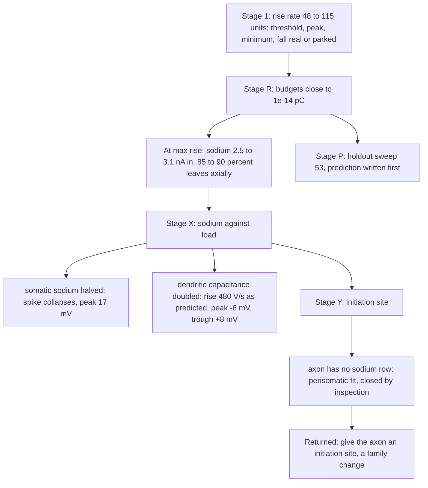

# E cell, Stage 3 energetic search: result

Manifest `h01-e-energetic-manifest.json`, runs in `h01-e-energetic/`, budgets in
`h01-e-energetic-stage-{r,x}-budgets.md`, decisions in
`h01-e-energetic/stage-*-decision.json`. 4 of 8 evaluations used (410 to 872 s
each) plus one holdout run; Stage Y was closed by inspection at no cost.

**Verdict: FAIL, structural.** The unmistakable row (maximum rise rate, 641 to
1019 V/s against the human 351) cannot be reversed inside the model family: the
fit is perisomatic, so the soma initiates its own spike, and the human's
two-stage upstroke needs an initiation site outside the soma. The decision to
change the family is returned to the user.

## Search tree

## What each stage established

| Stage | Question | Answer | Evidence |
| --- | --- | --- | --- |
| R | Where is the upstroke charge spent? | At the fastest rise the soma segment receives 2.5 to 3.1 nA of sodium, passes 2.2 to 2.6 nA to its neighbours and keeps 0.4 to 0.7 nA for its own capacitance; closure 1e-14 pC. The Stage R rejection clause was mis-stated (logic inverted) and withdrawn before Stage X. | stage-r-budgets, stage-r-decision |
| X | Sodium or load? | Load sets the rise rate (480 V/s at doubled dendritic capacitance, predicted 496) but the soma's sodium sets the peak; halving it collapses the spike. Neither arm reverses the row without breaking peak or trough. | stage-x-budgets, stage-x-decision |
| Y | Can initiation move to the axon? | Not in this family: the genome has NaTs, Nap, K, Ca and Ih in the soma only; axon, dend and apic carry leak alone. | stage-y-decision |
| P | What does the model do on the closed holdout? | See [prediction](h01-prediction-e.md). | h01-e-energetic/p-candidate-sweep53 |

## Causal explanation (conditions and mechanism)

The human L2 response at 250 pA: threshold −56 mV, a shoulder of 100 to 250 V/s
between −50 and −45 mV, a main rise of 351 V/s to +36 mV, fall −105 V/s,
trough −70 mV, cycles 60, 34, 220, 307, 273 ms.

**Rise rate.** The soma's dV/dt is the sodium current it receives minus what it
passes on axially and to its own potassium and leak, divided by its capacitance.
In the model the somatic sodium supplies the whole upstroke; because the
dendrites take 85 to 90 percent of it, the rate is load-limited and doubling the
load lowers it as predicted, but the same sodium must still reach +36 mV, so the
peak and the trough move with it. A necessary condition for the human's shape
is that the early rise be driven from outside the soma (the shoulder), with the
somatic sodium activating from a higher voltage and carrying only the peak. This
condition cannot hold in a fit whose only sodium is somatic.

**Threshold.** Set by the somatic sodium's activation voltage in the model (−52
mV) against the initiation site's in the human (−56 mV): the same condition.

**Cycles and trough.** The candidate's late cycles follow the human's
(272/307/294 against 220/307/273 ms) and the trough is inside 1 mV; these rows
are not the search.

**Not explained.** Anything downstream of the initiation site: the shoulder,
the 351 V/s rise, the −56 mV threshold, the −105 V/s fall.

## Decisions returned to the user

1. Whether to change the E model family: insert transient sodium in the axon
   stub, or replace the stub with an initial-segment geometry, and rerun
   Stages R and X (two evaluations, about 15 minutes each).
2. Whether the E cell stays "borrowed, somatic-initiation" in the circuit's
   evidence table until then.
