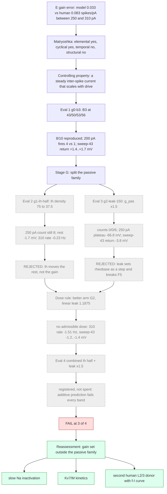

# H01 E cell gain split (SP3): result, FAIL at 3 of 4

Derived from `h01-e-gain/stage-close-decision.json` (closed 2026-09-08). Spec
[2026-09-07-h01-e-gain-split.md](../specs/2026-09-07-h01-e-gain-split.md); stage pages
[Stage 0](h01-e-gain-stage0.md), [Stage G](h01-e-gain-stage-g.md); decisions
`h01-e-gain/stage-g0-decision.json`, `stage-g-decision.json`; log `h01-e-gain/campaign-log.json`.
Image `braintrace-h01-neuron:9.0.2`; donor geometry Allen 541563728; every arm at the recorded
command plus recorded bias, nseg x9, CVode 1e-10, stop 2100 ms.

**Verdict: FAIL** under the manifest fail rule, applied at three of four evaluations (fail-fast,
Hartshorne p034/p179). Evaluation 4, the registered combined arm (Ih half + leak x1.5), is
**registered, not spent**: its additive prediction fails every registered band, so running it
cannot change the decision. The E cell stays at frozen B3, unpromoted; B3's sweep-43 late-return
miss (+1.4 to +1.7 mV) stands as a known defect of B3. Sweep 54 (330 pA) stays sealed.

## Search tree

Struck (grey, dashed): branches eliminated by a registered clause or by a registered prediction.
Green: the branches that remain open, each a new spec with its own cap.

## Gain tables

Human counts 1/5/10/13 at 200/250/310/350 pA.

| Arm | Counts 200/250/310/350 | 200-250 (spikes/pA) | 250-310 | 310-350 | Rate slope 250-310 (Hz/pA; human 0.0869) |
| --- | --- | ---: | ---: | ---: | ---: |
| human | 1 / 5 / 10 / 13 | 0.080 | 0.083 | 0.075 | 0.0869 |
| g0-b3 (B3) | 4 / 8 / 10 / 12* | 0.080 (ratio 1.00) | 0.033 (0.40) | 0.050 (0.67) | 0.0386 |
| g1-ih-half | - / 8 / 10 / - | not run | 0.033 (0.40) | not run | 0.0375 |
| g2-leak-150 | 0 / 0 / 6 / - | 0.000 (0.00) | 0.100 (1.20) | not run | 0.1003 (from 0 Hz) |
| g3 combined | predicted 0 / 0 / <= 6 / - | not run | | | |

\* 350 pA from the retained B3 sweep-55 trace (same flags, same sha256). The error is an excess of
firing at low drive that the 310 pA pin absorbs: B3 matches the human slope between 200 and 250 pA
but sits three spikes above the donor at both, then flattens to meet 310 pA.

Rest and subthreshold return (sweep 43, 110 pA), change relative to g0-b3:

| Arm | Rest (1019 ms) | Late return (1520-2040 ms) | Contract tally |
| --- | ---: | ---: | --- |
| g0-b3 | +0.53 mV residual | +1.40 to +1.72 mV residual (fail) | 5 pass / 4 fail / 1 unavailable |
| g1-ih-half | -1.73 mV | -0.68 to -0.72 mV (allowed) | 5 / 4 / 1 |
| g2-leak-150 | -1.00 mV | -3.06 to -3.78 mV (rejection) | 3 / 6 / 1 |

## Per-arm verdicts

| Eval | Candidate | Verdict | Source |
| --- | --- | --- | --- |
| 1 | g0-b3 | B3 reproduced at 250/310 pA; 200 pA count 4 against the exact band of 1; sweep-43 late return +1.4..+1.7 mV (registered rejection met); axon-first at 50/53/56 | `stage-g0-decision.json#/bands` |
| 2 | g1-ih-half | REJECTED: 250 pA count still 8; the lever moved the rest (-1.7 mV), not the gain | `stage-g-decision.json#/arms/g1-ih-half/rejection` |
| 3 | g2-leak-150 | REJECTED: sweep-43 return moved -3.8 mV and 310 pA count 6 < 8; counts 0/0/6; pure-shift clause not met | `stage-g-decision.json#/arms/g2-leak-150/rejection` |
| 4 | combined Ih half + leak x1.5 | registered, not spent: additive prediction (rest -2.7 mV, 250 pA silent, 310 count <= 6, sweep-43 about -4.5 mV) fails every band; the linear dose rule has no admissible dose | `stage-g-decision.json#/g3_selection` |

## Source-audit amendment (2026-09-08)

The [source audit](h01-e-gain-source-audit.md) supersedes the absence and
necessity language in the historical causal interpretation below. Frozen B3
already applies a nonzero somatic Im mechanism in all four opening runs.
Altered M-current kinetics remain an untested hypothesis; they are not an
identified missing mechanism. The tested passive interventions failed, but
the sampled doses do not exclude every passive parameterization. Historical
decision JSON and all measured numerical results remain unchanged.

## Causal statement (historical stage interpretation; see amendment above)

What WAS established, with conditions and mechanism; what was not is stated as the unresolved link.

1. **SK/Ca set the late rate at 310 pA.** Somatic SK 0.35 with calcium decay 1.0, on this geometry
   with the axonal initiation site, is *sufficient* to set the late inter-spike interval at 310 pA to
   the donor's (10 spikes, 10.05 vs 10.00 Hz, cycles 4-10 inside 110-124 ms) and this setting is
   insensitive to the Ih density (9.82 Hz at Ih half). It is *not sufficient* for the low-drive count
   (8 at 250 pA, 4 at 200 pA under the same dose). Mechanism: SK is a calcium-activated potassium
   current whose size follows the per-spike calcium entry; it applies the same interval correction at
   every input, so it translates the f-I curve and cannot rotate it.
2. **Ih density does not set the low-drive count.** Halving the uniform distributed Ih
   (9.99e-5 to about 5.0e-5 S/cm2) is *not sufficient* to remove any spike at 250 pA (8 -> 8) and
   shortens no late cycle by more than 6 ms; it moves the rest -1.73 mV and the post-pulse return
   -0.7 mV. Mechanism: at this density Ih is a standing depolarising conductance near rest; it sets
   the resting offset and the return, and is not the current carrying the three excess spikes.
3. **Leak sets rheobase as a step, not a slope.** g_pas x1.5 is *sufficient* to raise rheobase above
   250 pA (count 8 -> 0, soma plateau -66.8 mV, about 10 mV under threshold) and takes 310 pA from
   10 to 6; between x1.0 (count 8) and x1.5 (count 0) the count is a step, so no measured leak dose
   lands 250 pA at 5 with the 310 pA rate inside 1.5 Hz. The same lever moves the sweep-43 return
   -3.8 mV per 0.5 factor, past the donor. Mechanism: g_pas sets the input resistance, a fixed
   command moves the plateau in proportion, and the count is a threshold crossing of that plateau;
   plateau and subthreshold return are the same passive quantity, so the leak cannot hold F5 and land
   the count together.
4. **Unresolved link.** The current that removes three spikes at 200-250 pA while leaving the 310 pA
   train and the sweep-43 return fixed. Both passive levers move the f-I curve and F5 in a fixed
   ratio (Ih: -0.7 mV per 0 spikes; leak: -3.8 mV per -8 spikes), so this current is *necessarily*
   voltage- or use-dependent and outside the fit's passive family: a slow sodium inactivation or
   Kv7/M kinetics absent from the Allen genome, or a different donor (a second human L2/3 cell with a
   recorded f-I curve, SP6b lead). Not tested here.

## What a user gets: frozen B3, both tiers, per input

| Input | 1 mV contract | Usable tier |
| --- | --- | --- |
| 110 pA (sweep 43) | 5 pass / 4 fail / 1 unavailable; onset +0.43..+0.91 mV pass, late return +1.40..+1.72 mV fail | subthreshold: no rate rows |
| 200 pA (sweep 56) | count 4 vs 1 fail | count FAIL (exact repeat band 1); first spike 127.4 vs 205.8 ms pass (inside 82.6 ms); axon first |
| 250 pA (sweep 50) | count 8 vs 5 fail; 3 extra events | count FAIL; rate 7.73 vs 4.79 Hz FAIL (limit 0.72); adaptation pass; widths pass (5 paired); AHP unresolvable; axon first |
| 310 pA (sweep 53) | count 10 pass; first peak +3.17 mV fail; third rising crossing 36 ms early fail | count pass; rate 10.05 vs 10.00 Hz pass; adaptation pass; width cycle 2 FAIL; AHP unresolvable; axon first |
| 350 pA (sweep 55, retained) | count 12 vs 13 fail; human event 13 unmatched | rate 11.63 vs 13.27 Hz pass; adaptation pass; width cycle 3 FAIL; AHP unresolvable |

Not a usable shared E profile, not a BrainCell/H01 transfer pass, not a human-qualified cell.

## Files

- `h01-e-gain/stage-close-decision.json` (this page's source)
- `h01-e-gain/stage-g0-decision.json`, `stage-g-decision.json`, `campaign-log.json`
- `h01-e-gain/g0-b3-usable.md`, `g1-ih-half-usable.md`, `g2-leak-150-usable.md`; `h01-e-usable/b3-all-inputs-usable.md`
- `docs/h01-causal-model.md` Y4 closing entry (2026-09-08)
