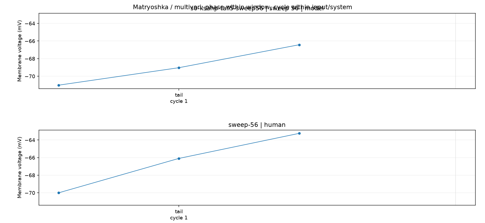
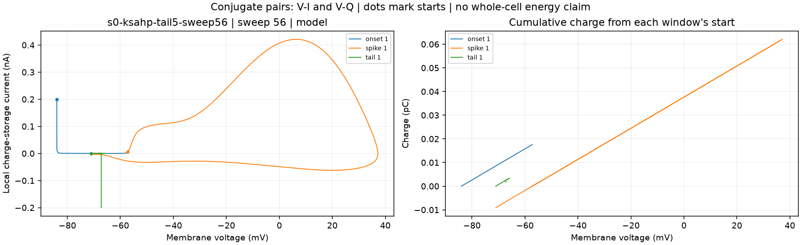
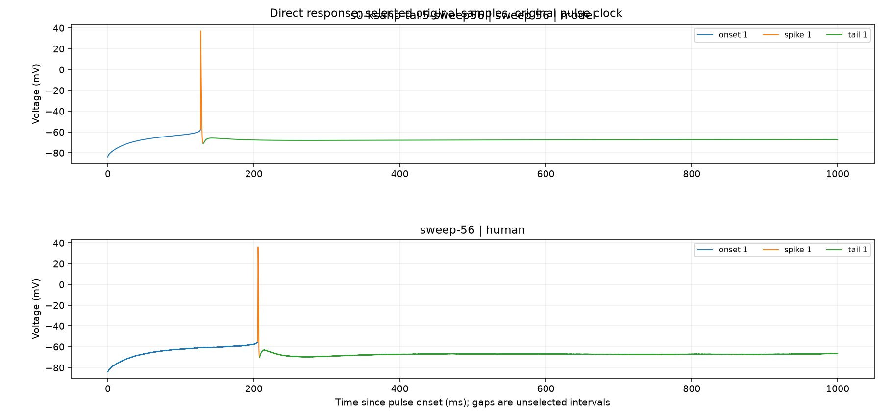
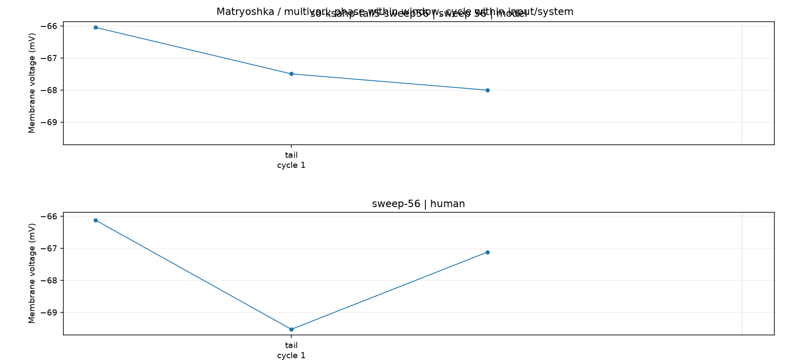

# H01 direct observations

Inspect the multivari and conjugate-pair charts before interpreting a cause.
A small cycle sample retains all original samples within each selected window.
Missing phases and mismatched events are not causal equivalence. Human ionic currents are unavailable.

## s0-ksahp-tail5-sweep56 | sweep 56 | model

Current observations: available. Causal verdict: not established.

| Window | Cycle | Phase | Absolute ms | Voltage mV | Status |
| --- | ---: | --- | ---: | ---: | --- |
| onset | 1 | +0ms | 1020.000000 | -83.9694 | available |
| onset | 1 | +2ms | 1022.000000 | -81.0962 | available |
| onset | 1 | +6ms | 1026.000000 | -78.5436 | available |
| onset | 1 | +20ms | 1040.000000 | -72.9452 | available |
| onset | 1 | +60ms | 1080.000000 | -66.0393 | available |
| onset | 1 | +200ms | 1220.000000 | unavailable | beyond_window |
| spike | 1 | threshold | 1146.920220 | -57.2075 | available |
| spike | 1 | peak | 1147.350090 | 37.1591 | available |
| spike | 1 | trough | 1150.604176 | -71.0143 | available |
| tail | 1 | +0ms | 1150.604176 | -71.0143 | available |
| tail | 1 | +2ms | 1152.604176 | -69.0306 | available |
| tail | 1 | +6ms | 1156.604176 | -66.4255 | available |
| tail | 1 | +20ms | 1170.604176 | -66.0499 | available |
| tail | 1 | +60ms | 1210.604176 | -67.4991 | available |
| tail | 1 | +200ms | 1350.604176 | -68.0054 | available |

## sweep-56 | human

Current observations: command_only. Causal verdict: not established.

| Window | Cycle | Phase | Absolute ms | Voltage mV | Status |
| --- | ---: | --- | ---: | ---: | --- |
| onset | 1 | +0ms | 1020.000000 | -84 | available |
| onset | 1 | +2ms | 1022.000000 | -81.5 | available |
| onset | 1 | +6ms | 1026.000000 | -79 | available |
| onset | 1 | +20ms | 1040.000000 | -73.2813 | available |
| onset | 1 | +60ms | 1080.000000 | -65.375 | available |
| onset | 1 | +200ms | 1220.000000 | -57.5313 | available |
| spike | 1 | threshold | 1225.220000 | -54.7188 | available |
| spike | 1 | peak | 1225.760000 | 36.2188 | available |
| spike | 1 | trough | 1227.760000 | -70 | available |
| tail | 1 | +0ms | 1227.760000 | -70 | available |
| tail | 1 | +2ms | 1229.760000 | -66.0938 | available |
| tail | 1 | +6ms | 1233.760000 | -63.25 | available |
| tail | 1 | +20ms | 1247.760000 | -66.125 | available |
| tail | 1 | +60ms | 1287.760000 | -69.5313 | available |
| tail | 1 | +200ms | 1427.760000 | -67.125 | available |

Visual review: pending. Record which patterns occur within phases, between cycles, and between inputs.
Do not infer a channel identity from the chart alone. Retain the named intervention and its contradicting outcome.
