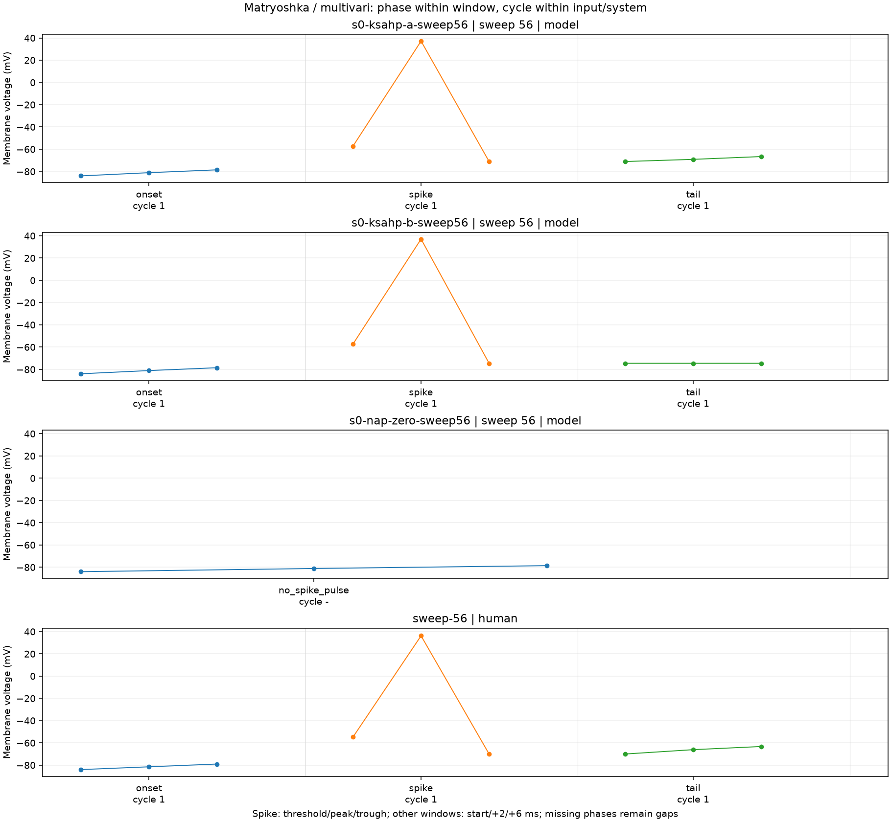
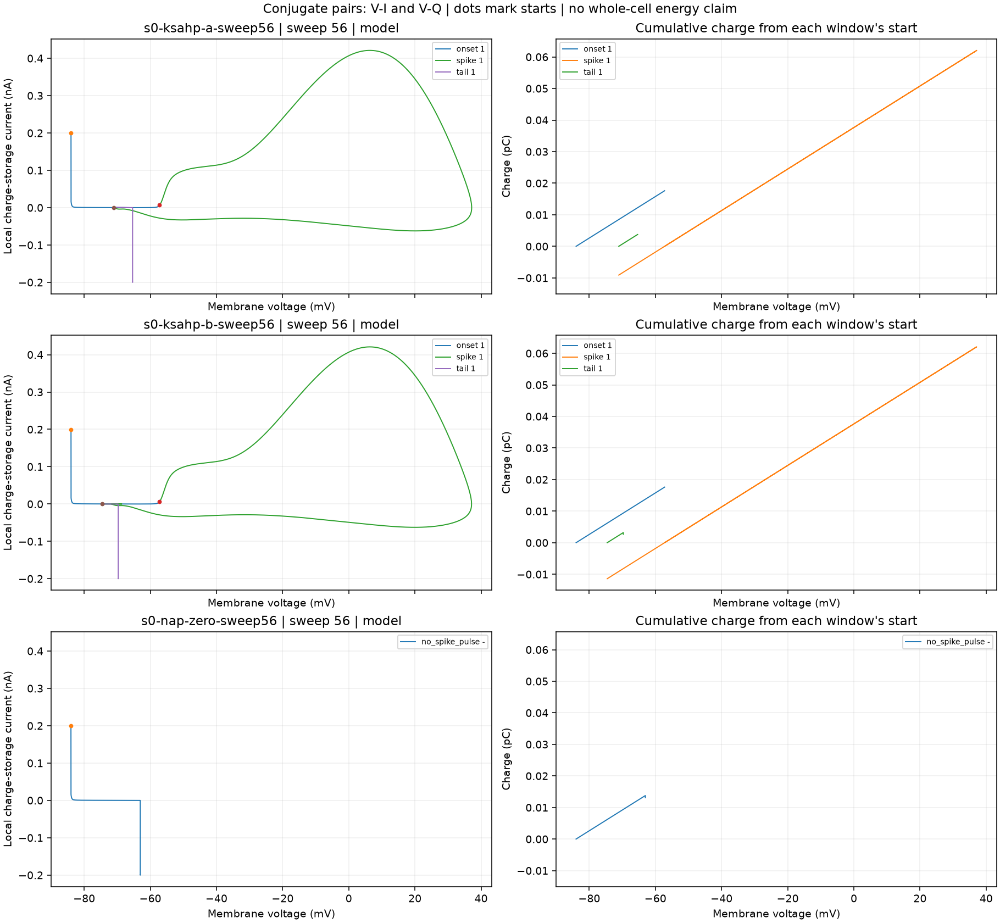
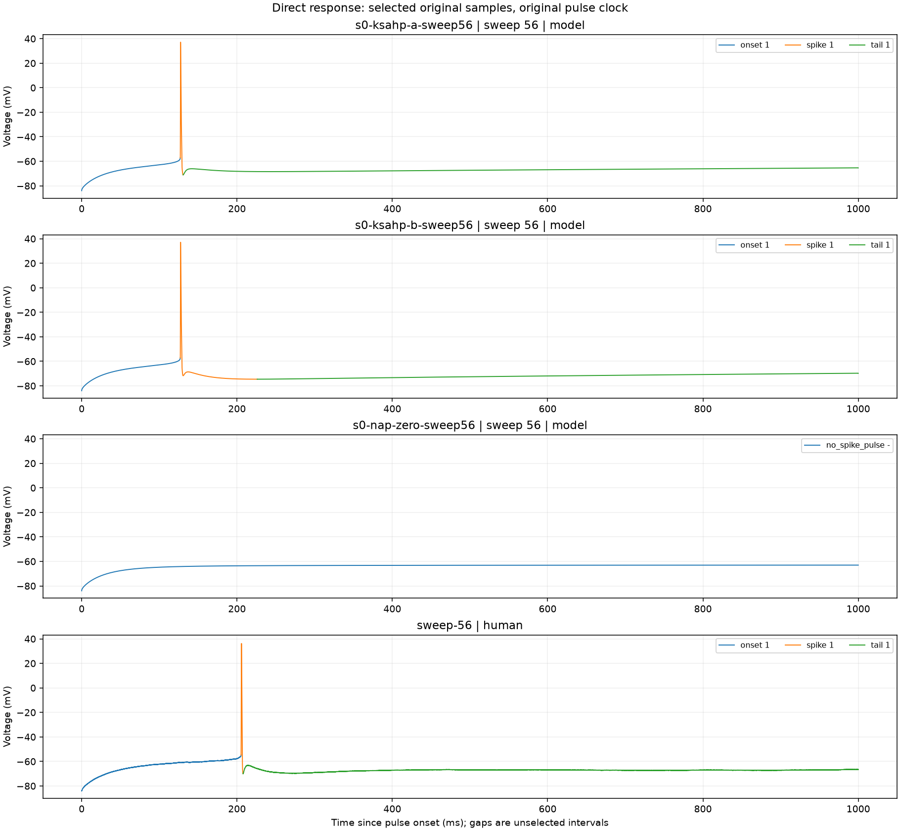

# H01 direct observations

Inspect the multivari and conjugate-pair charts before interpreting a cause.
A small cycle sample retains all original samples within each selected window.
Missing phases and mismatched events are not causal equivalence. Human ionic currents are unavailable.

## s0-ksahp-a-sweep56 | sweep 56 | model

Current observations: available. Causal verdict: not established.

| Window | Cycle | Phase | Absolute ms | Voltage mV | Status |
| --- | ---: | --- | ---: | ---: | --- |
| onset | 1 | +0ms | 1020.000000 | -83.9694 | available |
| onset | 1 | +2ms | 1022.000000 | -81.0962 | available |
| onset | 1 | +6ms | 1026.000000 | -78.5436 | available |
| spike | 1 | threshold | 1146.920220 | -57.2075 | available |
| spike | 1 | peak | 1147.350090 | 37.1563 | available |
| spike | 1 | trough | 1150.606572 | -71.068 | available |
| tail | 1 | +0ms | 1150.606572 | -71.068 | available |
| tail | 1 | +2ms | 1152.606572 | -69.112 | available |
| tail | 1 | +6ms | 1156.606572 | -66.5904 | available |

## s0-ksahp-b-sweep56 | sweep 56 | model

Current observations: available. Causal verdict: not established.

| Window | Cycle | Phase | Absolute ms | Voltage mV | Status |
| --- | ---: | --- | ---: | ---: | --- |
| onset | 1 | +0ms | 1020.000000 | -83.9694 | available |
| onset | 1 | +2ms | 1022.000000 | -81.0962 | available |
| onset | 1 | +6ms | 1026.000000 | -78.5436 | available |
| spike | 1 | threshold | 1146.920220 | -57.2075 | available |
| spike | 1 | peak | 1147.350092 | 37.1179 | available |
| spike | 1 | trough | 1246.010433 | -74.5609 | available |
| tail | 1 | +0ms | 1246.010433 | -74.5609 | available |
| tail | 1 | +2ms | 1248.010433 | -74.5601 | available |
| tail | 1 | +6ms | 1252.010433 | -74.5539 | available |

## s0-nap-zero-sweep56 | sweep 56 | model

Current observations: available. Causal verdict: not established.

| Window | Cycle | Phase | Absolute ms | Voltage mV | Status |
| --- | ---: | --- | ---: | ---: | --- |
| no_spike_pulse | None | +0ms | 1020.000000 | -83.9887 | available |
| no_spike_pulse | None | +2ms | 1022.000000 | -81.1175 | available |
| no_spike_pulse | None | +6ms | 1026.000000 | -78.572 | available |

## sweep-56 | human

Current observations: command_only. Causal verdict: not established.

| Window | Cycle | Phase | Absolute ms | Voltage mV | Status |
| --- | ---: | --- | ---: | ---: | --- |
| onset | 1 | +0ms | 1020.000000 | -84 | available |
| onset | 1 | +2ms | 1022.000000 | -81.5 | available |
| onset | 1 | +6ms | 1026.000000 | -79 | available |
| spike | 1 | threshold | 1225.220000 | -54.7188 | available |
| spike | 1 | peak | 1225.760000 | 36.2188 | available |
| spike | 1 | trough | 1227.760000 | -70 | available |
| tail | 1 | +0ms | 1227.760000 | -70 | available |
| tail | 1 | +2ms | 1229.760000 | -66.0938 | available |
| tail | 1 | +6ms | 1233.760000 | -63.25 | available |

Visual review: pending. Record which patterns occur within phases, between cycles, and between inputs.
Do not infer a channel identity from the chart alone. Retain the named intervention and its contradicting outcome.
