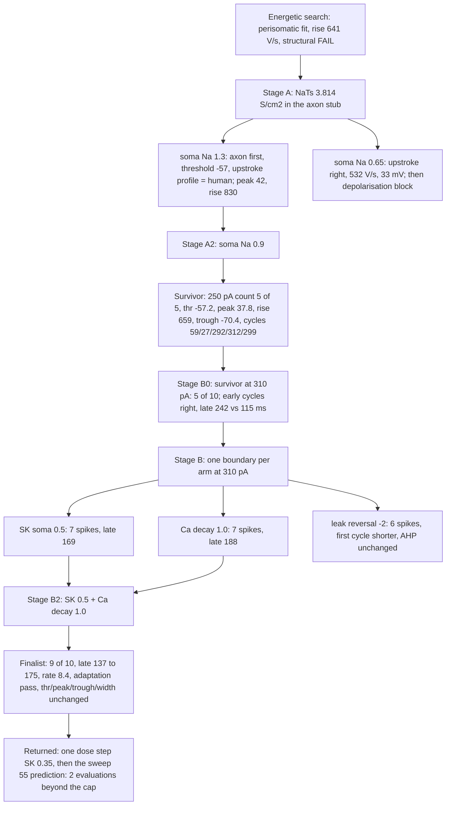

# E cell under the usable tier: result (W3, 2026-09-07)

Manifests `h01-e-usable-manifest.json` (Stages A, A2), `-b0-`, `-b-`, `-b2-` (Stage B
at 310 pA); runs in `h01-e-usable/`; decisions `stage-{a,a2,b0,b,b2}-decision.json`.
8 of 8 evaluations used (427 to 687 s each). Human data: sweeps 50 (250 pA) and 53
(310 pA, spent as a holdout on 2026-09-06). Sweep 55 stays sealed and was not run.

**Verdict: the E cell's family is fixed and its count is one step from the usable
rate; the cap closes before that step and before the sweep 55 prediction.** The
structural FAIL of the energetic search (no initiation site) is lifted; the finalist
passes every usable row but rate at 310 pA (8.4 against 10 Hz, limit 1.5) and rate
and adaptation are inside the limits at 250 pA except adaptation.

## Search tree

## What each stage established

| Stage | Question | Answer | Prediction |
| --- | --- | --- | --- |
| A | Can the 60 µm stub host initiation? | Yes: the axon crosses −20 mV 0.2 ms before the soma, the threshold moves from −52 to −57 mV (human −56), and the human's two-stage upstroke appears as a plateau of dV/dt against V at the human's slope (144 to 185 against 110 to 179 V/s from −52 to −42 mV). Somatic sodium sets the main rise and peak. | axon first and threshold held; the "shoulder" was registered as a local maximum and is a plateau (form wrong); the 0.65 arm's trough band assumed a train that blocked |
| A2 | Is somatic sodium a monotone lever? | Yes: 0.9 lands peak 37.8, rise 659, trough −70.4, count 5 of 5 at 250 pA, no block. | held at every band but one profile point (2 V/s) |
| B0 | Does initiation set the count at 310 pA? | No: 5 of 10 with the first two cycles right (38, 16 against 38, 12 ms) and the late train at half rate (242 against 115 ms). | failed as the rejection clause foresaw |
| B | Which boundary sets the late rate? | The calcium-SK Modulate boundary: SK halved gives 7 spikes and 169 ms, calcium decay 1.0 gives 7 and 188, both without moving threshold, peak, trough or width; the leak shift moves only the first cycle. | SK band missed by 9 ms; calcium beyond its band in the right direction; the leak arm's AHP clause failed |
| B2 | Are the two levers one boundary? | Yes, additive: together 9 of 10, late cycles 137 to 175 (mean 134), rate 8.4 Hz, adaptation 9.8 against 9.95. | held: rate 7.5 to 8.5, late mean 135 to 165, rows unchanged; count 9 against a predicted 8 |

## Causal explanation (conditions and mechanism)

The human L2/3 response at 250 and 310 pA: threshold −56 mV, a two-stage upstroke
(a dV/dt plateau of 110 to 180 V/s from −52 to −42 mV, then a main rise of 351 V/s
to +36 mV), a trough at −70, and a train that settles at 115 ms cycles at 310 pA.

**Threshold and upstroke shape.** Necessary and sufficient: an initiation site
outside the soma. With transient sodium in the axon stub the axon reaches threshold
first and drives the soma through the axial path; the soma's own sodium activates
from a higher voltage and carries only the peak. The plateau is the axonal drive
seen at the soma before the somatic sodium takes over. Without the axonal site the
somatic sodium supplies the whole upstroke from −52 mV in one stage.

**Main rise and peak.** Set by the somatic sodium density: 1.3 gives 830 V/s and 42
mV, 0.9 gives 659 and 37.8, 0.65 cannot sustain a train (block). The human's 351 V/s
is not reached at any density that keeps the train; the remaining rise excess is the
dendritic load's share (the energetic search: 85 to 90 percent of somatic sodium
leaves axially), which no somatic lever moves.

**Late rate and count.** Set by the resistance the calcium displacement builds
cycle to cycle: SK conductance driven by the calcium pool. Halving the SK density
or removing calcium faster (decay 1.0 against 1.33) each shortens the late cycles
without touching the spike; together they act additively (246 → 169 and 188 → 134
ms). The count follows the late cycle length. The early cycles (38, 14) are set by
the supply reaching threshold and are already right.

**Not explained.** The last 10 to 20 ms of late cycle (134 against 115), the first
spike's width (1.01 against 0.91 ms above −20 mV, inside the usable limit and outside
the contract), and the trough family, which is unresolvable at 2 mV because the
human repeats spread 1.01 mV.

## Decisions returned to the user

1. Whether to extend the E cap by two evaluations: one dose step (SK 0.35 with
   calcium decay 1.0; prediction count 10, late cycles 115 to 130 ms, rows unchanged)
   and the sweep 55 prediction, which must be written before the export.
2. Whether the finalist (somatic sodium 0.9, axonal NaTs 3.814 S/cm², SK 0.5,
   calcium decay 1.0 on the kv3-ninety-ca133 candidate) becomes the E profile in
   BrainCell; that needs the transfer gate and its own spec, and the resting
   potential (−84 against the human −72) is untouched.
