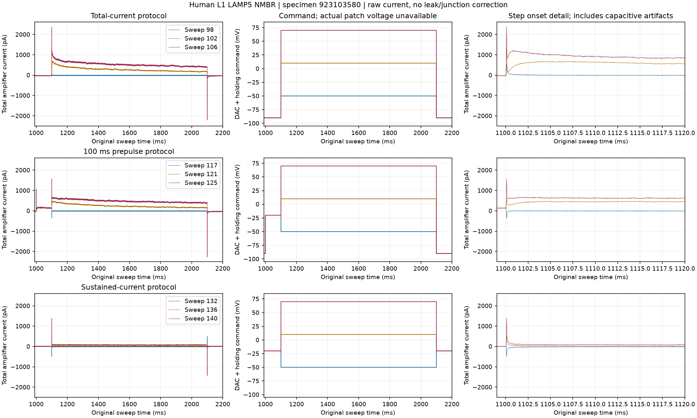
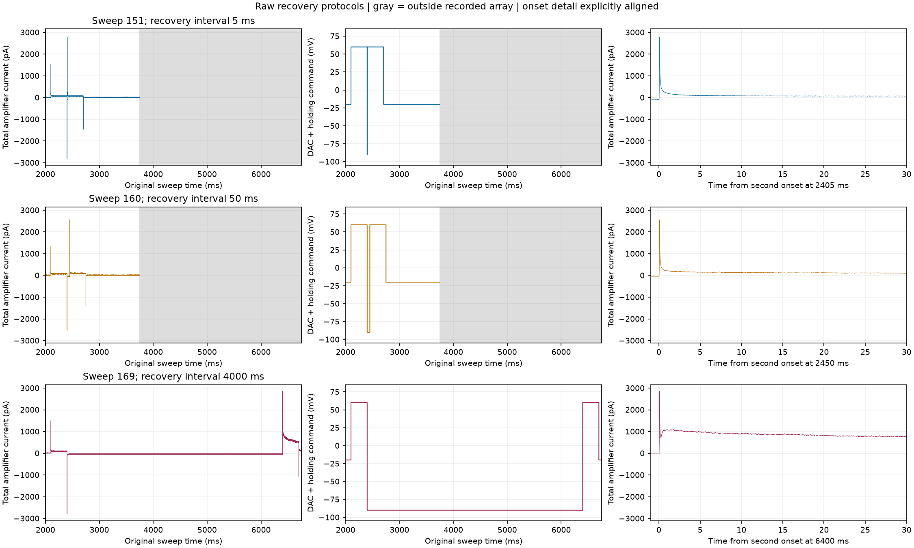

# Human L1 channel-current sources recovered

The missing summary CSV no longer prevents raw channel analysis. Two complete,
hash-verified human recordings contain nucleated-patch step and recovery protocols:

| Role | Cell specimen | Recording session | Human type | Channel sweeps |
| --- | --- | --- | --- | --- |
| Discovery and reproduction | 923103580 | 923103553 | LAMP5 NMBR | 98-169 |
| Prospective kinetic calibration | 840043506 | 840043481 | PAX6 CDH12 | 70-141 |

The PAX6 source matches the selected whole-cell donor's transcriptomic type. It
is a different cell, not proof of identical kinetics. A second PAX6 candidate,
specimen 835648767 from a distinct donor, is reserved for external validation
before its current arrays are decoded. The
[kinetic data contract](pax6-kinetic-data-contract.json) freezes these roles and
requires candidate predictions, QC and scoring rules before external response
access. The original donor 811953283 calibration/holdout split remains unchanged.

## Source identity and acquisition

[DANDI 000630 version 0.230915.2257](https://dandiarchive.org/dandiset/000630/0.230915.2257)
contains the raw experiments. The authors' metadata links cell names to specimen
and recording-result identifiers. The latter match DANDI session identifiers;
DANDI subject IDs identify tissue subjects, not individual cells. Asset
`wasDerivedFrom` independently confirms the cell identifier.

The [LAMP5 source receipt](source.json) retains the upstream asset metadata,
download URL, SHA256, all 170 acquisition identities and 14 exported channel
sweeps. The 72 channel sweeps cover total-current, leak-control, prepulse,
sustained-current, tail and recovery families. Fourteen complete channel sweeps
are exported; additional channel commands and terminal current samples were
inspected during discovery. Whole-cell response arrays were not decoded.
The [PAX6 inventory](pax6-840043481-inventory.json) records all 142
acquisition identities and its independently verified full-file SHA256; its
current arrays remain unopened for the next preparation stage.

Two earlier PAX6 acquisitions contained additional whole-cell protocols but no
nucleated-patch families; their complete negative inventories are retained.
Thus file size alone was an unsuccessful discovery heuristic. Subsequent HTTP
Range probes checked acquisition headers before another full download. The first
64 KiB block cache exceeded the 2 MB per-file bound. A local instrumented read
showed that sparse metadata required many blocks despite only about 82 kB of
requested content. Using 8 KiB blocks kept the three probes under the same bound
(368640, 434176 and 532480 fetched bytes). Exact HTTP 206 ranges were checked.
The [initial](pax6-range-probes.json) and [revised](pax6-range-probes-r2.json)
receipts distinguish capped probes from findings; partial reads do not establish
a whole-file hash or an exhaustive absence of channel protocols.

## Direct observations and visual review

Both figures below were opened and inspected. They retain every original sample
in their displayed windows; no smoothing, resampling, leak subtraction or junction
correction was applied. Full arrays are retained in the adjacent NPZ files.

The total-current family starts near a -90 mV command and steps near -50, +10
and +70 mV in the displayed low/middle/high conditions. Beyond the sharp onset
transient, the positive current grows and then decays during the one-second
command. The higher command produces the larger response. A preceding 100 ms
command near -20 mV reduces the subsequent early positive current. With sustained
holding near -20 mV, the large sharp transients remain but the later current is
much smaller. These are comparisons between recorded conditions, not molecular
channel identifications or fitted kinetics.

The actual nine-step family spans approximately -50 to +70 mV in 15 mV
increments. Future analysis must use these stored commands rather than assume
the generic step increment in the paper. The stored DAC values are increments;
the exporter adds the explicitly enabled notebook holding voltage exactly once.
The resulting command is not a measurement of actual patch voltage.

The displayed recovery intervals are 5, 50 and 4000 ms near -90 mV, between two
300 ms commands near +60 mV. The 4000 ms condition produces a markedly larger
second-pulse current after the initial sharp transient than the shorter intervals.
Those sharp transients persist in every condition, so their raw peaks must not
be used as isolated ionic-current amplitudes. The right panels explicitly align
to each second-pulse onset while retaining its original timestamp. Gray regions
lie beyond the stored arrays and supply no observation. Patch drift, access
error, leak and capacitive contamination remain alternatives to assess before
attributing the differences to particular channel-state transitions.

## Verification and next scientific gate

The new exporter checks source hash, registered sweep and protocol, clamp mode,
SI conversions, offsets, sample clocks and holding-voltage state. Missing holding
voltage cannot silently become zero. Interior zero currents remain literal data;
a terminal zero fails with ambiguous coverage rather than being stripped using
the earlier current-clamp voltage-padding heuristic. This conservative rejection
can include a genuinely zero final current and needs source review in that case.
Instrument compensation settings and original command components remain separate.

The combined preparation suite passes 50 tests; the new exporter has 100% line
coverage ([results](tests.xml), [coverage](coverage.json)). Tested edge cases include
wrong source/type, mismatched clocks, nonfinite data, missing or wrong-unit holding
voltage, zero current, tiny command transitions and attempted overwrite. Channel
QC still needs within-file controls, drift assessment, coverage and access-error
checks; these unit tests do not supply that evidence.

Next: prepare the PAX6 calibration currents, qualify leak/capacitive subtraction
and patch geometry, infer human kinetic parameters, then evaluate the reserved
donor. Sodium and other required mechanisms, whole-cell fitting, anatomy transfer
and full-population driven qualification also remain open. No model or optimizer
ran in this stage, and none of the six population values changed.
