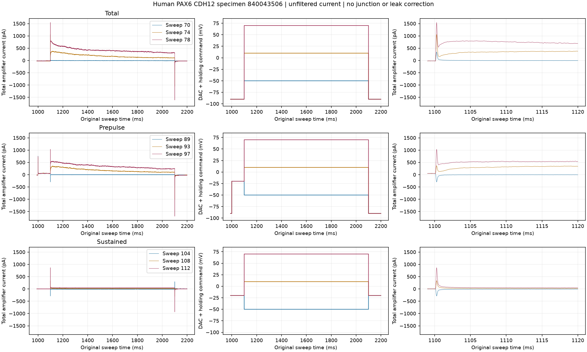
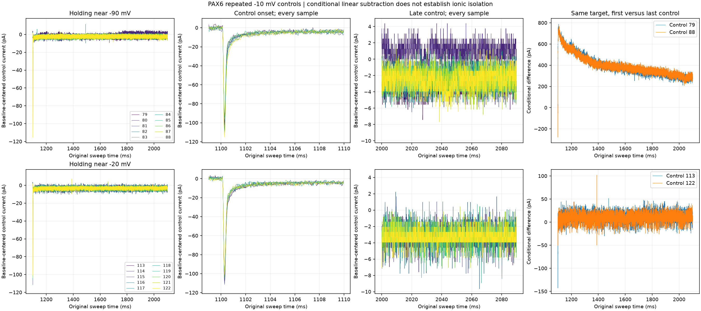
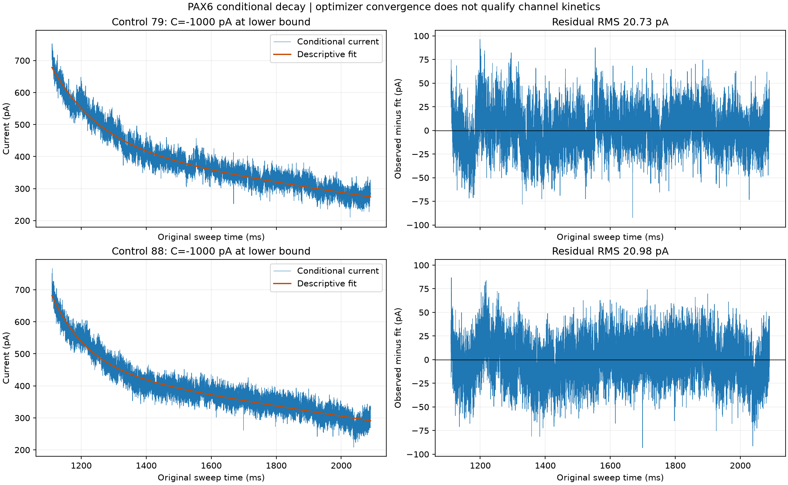

# PAX6 calibration currents and control assessment

Thirty-two source-bound sweeps are now prepared for human PAX6 CDH12 specimen
840043506, session 840043481. All requested exports passed structural checks.
They include total, prepulse, sustained and recovery protocols plus both sets of
ten leak controls. The [preparation receipt](preparation.json) preserves identities,
selection, hashes and outcomes. The actual sampling rate is 25 kHz; no 50 kHz
assumption from another recording was applied. Whole-cell response arrays and
the reserved external donor's currents remain unopened.

The shared exporter now requires an explicitly registered session and binds it
to its own hash, specimen and sweep-family map. The external validation session
835648738 is rejected before file access. This preparation does not alter the
original whole-cell donor 811953283 split.

## Observed current and command

The figure was opened and inspected. All plotted samples are retained without
resampling or smoothing. Total-current steps from about -90 mV produce an onset
transient followed by a slower current that grows with depolarization. At the
largest displayed command, the slower current rises after the sharp transient
and then decays over the pulse. The prepulse reduces that early component;
sustained holding near -20 mV leaves much less current beyond the transient.

The command histories are not interchangeable. In particular, displayed prepulse
sweep 89 returns from its conditioning level to about -90 mV, whereas total
sweep 70 steps to about -50 mV. Family position alone cannot pair these conditions.
Use the stored command segments. DAC increments and holding voltage remain
separate; their sum is a command, not measured patch voltage. The recorded current
is total amplifier current, not isolated potassium current.

## Repeated controls and conditional subtraction

This figure was also opened and inspected. Each -10 mV control has a large, brief
negative onset transient followed by a much smaller current. The repeat traces
largely overlap at onset but differ in their baseline and late levels. For the
-90 mV group, baseline means change from -16.323 pA in control 79 to -11.702 pA
in control 88. Control 80 has a late baseline-centered mean of +0.953 pA, unlike
the negative late levels of the other controls. This disagreement needs temporal
drift assessment; it is retained, not silently excluded. The
[control observations](control-observations.json) report every repeat alongside
the full arrays, rather than replacing them with a single pooled control.

Conditional subtraction centers each trace on 900-990 ms and scales the control
by the command increment. At the largest total-current step the scale is -16;
for the sustained-current target it is -9. The helper checks full coverage,
identical clocks, plain-step history and matching holding potentials. It rejects
prepulse and recovery histories because their capacitive and steady-state offsets
cannot be corrected with this single factor.

The largest total-current response remains a substantial decaying signal with
either the first or last control. However, subtraction produces a sharp negative
onset residual, exposing imperfect transient cancellation. The small sustained
estimate is much more affected by noise and control choice. A single -10 mV
control amplitude cannot establish linear scaling across the depolarizing range.
Neither subtraction is a passed ionic-isolation gate. Raw, scaled-control and
conditional-current arrays are separately retained in the four `conditional-*`
bundles; the original inputs remain intact.

## Decay fitting and decision

The descriptive fits use every sample in 1110-2090 ms, excluding the observed
onset transient. They fit an offset plus two decaying exponential terms. The
figure was opened and inspected: the curves follow the broad decline, while the
residuals retain structured excursions as well as rapid variability.

| Control | Shorter fitted time scale, ms | Longer fitted time scale, ms | Offset, pA | Residual RMS, pA |
| --- | ---: | ---: | ---: | ---: |
| 79 | 148.85 | 8462.55 | -1000 | 20.73 |
| 88 | 110.79 | 8348.93 | -1000 | 20.98 |

These are diagnostic fit outputs, not measured channel time constants. Both
optimizations reach the registered offset lower bound, and the longer scale lies
far beyond the observed fit window. The [decision](decay-decision.json) rejects
both for kinetic deployment. Optimizer convergence did not close the scientific
gate. Do not widen bounds to obtain a nominal pass or label the fitted terms as
molecular A/D channels.

The next analysis must address control drift and use prepulse plus recovery
conditions jointly to constrain inactivation and recovery. Full command histories
and compensation/access effects matter, especially at onset. Patch area, voltage
reference and other channel families remain to be qualified before whole-cell
fitting and H01 transfer. No external validation response was used to choose this
analysis, and none of the six population values changed.

## Verification

The combined suite passes 81 tests with 100% line coverage on the three changed
analysis modules ([tests](tests.xml), [coverage](coverage.json)). Analytic oracles
check current subtraction and two-scale fitting; edge cases cover missing windows,
sampling mismatch, prepulses, wrong holding voltage, zero controls, invalid samples,
source mismatch and external-response rejection. The first test fixture used an
integer command array and failed on a fractional voltage perturbation; fixtures
now use floating voltages. A regression also reproduced the absent explicit
boundary flag, then passed after adding it. Future consumers must inspect boundary
status independently of optimizer success.

All work ran on local CPU. The two descriptive fits took less than one second
combined. No neuronal dynamics, optimizer for a whole-cell model, or remote compute
ran. Rendering scripts and source arrays accompany the report; hashes bind each
derived bundle to its inputs.
