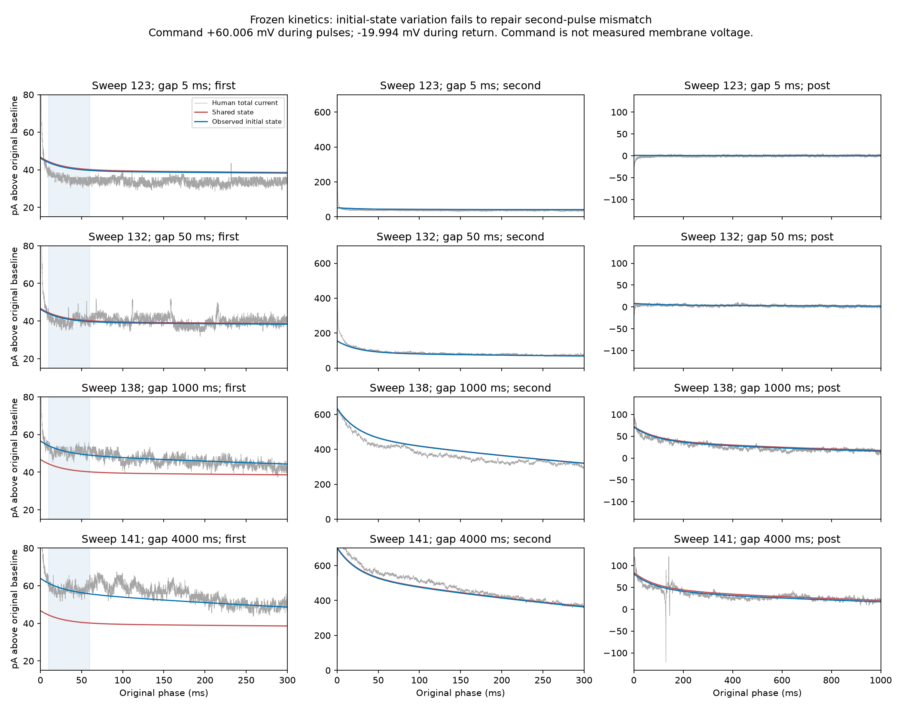

# Initial-state variation does not repair the recovery candidate

The frozen candidate still misses the second pulse after estimating each sweep's
initial availability. This is a negative result for the tested repair, not a
qualified human mechanism or an improvement in any of the six acceptance scores.
Stop this state-only fitting path; do not broaden bounds or add gains to force it
through. All 19 conditions and all original observations remain in the record.

| Current window | Shared-state RMS, pA | Conditioned-state RMS, pA |
| --- | ---: | ---: |
| First pulse, 60-280 ms | 7.2974 | 4.6570 |
| Second pulse, 10-280 ms | 14.2951 | 14.4014 |
| Holding return, 10-980 ms | 3.8462 | 3.7846 |

These are calibration diagnostics. The state estimate sees only first-pulse
10-60 ms, but the frozen global parameters were already fitted using later
currents. Those later windows are not independent validation. No external donor
currents or new protocol response arrays were opened.

## Measured history and constrained observation

The hash-bound source exports for sweeps 123-141 confirm constant command
-19.993700 mV from 55.04 to 2100 ms, with every original interval checked at
0.04 ms. We estimate two fractions at the beginning of that holding interval,
bounded to [0,1], then propagate them for 2044.96 ms using the frozen holding
kinetics. Baseline availability is averaged over the actual -100 to -10 ms
baseline window and contributes its implied current correction; there is no
extra fitted offset. All 15 global parameters remain exactly unchanged from
commit 59531e9. The candidate manifest was written before state estimation.

Only 0.000029758 of fast-state variation and 0.1686225 of slow-state variation
survive that holding interval under this candidate. The design has numerical
rank two, but the fast state is weakly observable, not physiologically identified.
Both initial holding-start estimates hit their lower bounds for the first 12
sweeps. The fast estimate reaches a bound in every sweep. These flags are retained;
do not interpret the bound values as measured channel occupancy.

## Direct visual review

The plot was opened and inspected. In sweep 123 the first response after 10 ms
remains below both predictions; changing the bounded state hardly moves the
curve. In sweeps 138 and 141, inferred slow availability lifts the first response
closer to the observations. Yet the second response of sweep 138 remains broadly
below both predictions and sweep 141 remains above them over the early and middle
pulse. This mismatch survives the first-response improvement. The return still
contains sweep 141's large negative and positive excursion near 130-142 ms; it is
retained on the full -140 to 140 pA return scale. No cause is assigned to it.
Pulse viewports emphasize the modeled phases and clip the unmodeled onset
transients; the NPZ retains every original sample without clipping or smoothing.
Commands are not measured membrane voltages, and these total amplifier currents
are not isolated ionic currents.

## Verification and decision

The new helper passed 13 tests and 97% line coverage. All 165 affected tests
passed. Independent synthetic calculations check the holding history and baseline
average, the original shared-state limit, endpoint carry and the long-return
limit. Later first-pulse samples cannot influence state estimation. Edge cases
cover malformed clocks, missing windows, nonfinite values, invalid states and
parameters, sparse sampling, and an unobservable population. Optimizer failure
raises an error; it cannot produce an accepted estimate.

The local CPU calculation took 0.042 seconds. No neuronal simulation was run.
Raw samples, source clocks, frozen predictions, conditioned predictions, residuals,
state estimates and bounds are saved in `observation.npz`; source hashes and
direct phase readings are in `observation.json`. Reproduction starts with
`analyze.py` in a fresh evidence prefix, followed by `plot_observation.py`.

The process mistake was allowing improvements to a conditional current fit to
consume repeated checkpoints without moving a population acceptance gate. The
prevention is to name the gate an experiment can change before extending it.
This candidate cannot yet support a human-qualified anatomy-transfer run. No
six-term score changes, donor promotions or physiology claims follow this result.
