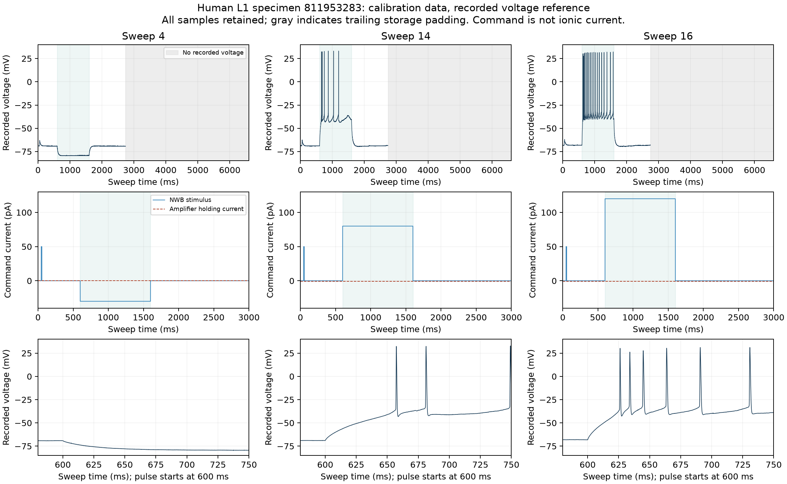

# Human L1 recording preparation and quality checks

The selected human specimen now has eight calibration and nine held-out sweeps
that pass the pinned IPFX offline recording-quality criteria. No model was fitted
and no population score changed. The [fitting-input receipt](fitting-inputs.json)
retains the original split, exclusions and remaining protocol requirements.

## Data-use boundary and observed quality

The split was recorded in
`docs/specs/2026-09-14-h01-human-l1-qualification.md` before optimization.
Calibration candidates are 4-12, 14 and 16. Held-out candidates are 13, 15 and
17-34. All short-pulse and ramp families remain held out. The spec discloses prior
access to metadata, array finiteness and source spike-array lengths; this is an
independent-input split, not untouched external-specimen validation.

The [author cell-QC record](author-cell-qc.json) reports failed_qc=False.
Separately, IPFX 2.1.2 at source commit
c607a36e25618a6bb8ba5438c1cd945fb429e659 recomputed sweep QC locally with its
unchanged Ephys QC Criteria v1.1. The [complete r2 result](ipfx-qc-r2.json)
retains original features, failure reasons, criteria and source identity:

- Eight calibration sweeps pass: 4, 5, 6, 7, 8, 12, 14, 16.
- Nine held-out sweeps pass: 13, 15, 28, 29, 30, 31, 32, 33, 34.
- Sweep 27 fails because the recording ends before the required experiment epoch.
- Thirteen search sweeps are outside the standard IPFX QC evaluation: 9-11,
  17-26. They are not silently counted as passed or failed.
- Six voltage-clamp setup/ending checks are outside this current-clamp set.

All 37 acquisitions are accounted for. Online MIES stimulus acceptance flags
are retained separately; they are not interchangeable with offline recording QC.

## Two preparation hazards addressed

MIES stores global online QC in notebook scope 8, while holding current is in
headstage scope 0. Reading only headstage 0 would falsely report the global QC
observations as missing. The new reader requires an explicit scope and uses the
last finite value for the selected sweep. Holding current defaults to zero only
when the enable flag explicitly says it is disabled. Enabled but missing current
raises an error. Bridge balance is retained as metadata and not applied twice.

The raw arrays also contain trailing storage zeros. They are finite, but they do
not represent measured voltage. This convention is explicitly handled by IPFX's
`_nan_trailing_zeros`. In the three inspected calibration sweeps:

| Sweep | Stored samples | Last recorded time, ms | Trailing padding samples |
| --- | ---: | ---: | ---: |
| 4 | 180000 | 2739.44 | 43027 |
| 14 | 330000 | 2739.70 | 193014 |
| 16 | 330000 | 2739.42 | 193028 |

The new exporter retains the original voltage array separately, a recorded-sample
mask, and NaN in the recorded-voltage array outside that mask. Thus no fit can
mistake the 3.6/6.6-second storage allocation for full observed coverage. An all-zero
response is unavailable. Initial unmasked exports are retained only in the local
cache under `calibration-initial-unmasked`; `calibration-r2` is the retained output.

The initial exporter omitted that mask. Two regression tests reproduced the
mistake, then passed after repair. Prevention: verify the acquisition tool's
missing-data convention independently of finite-array and clock checks.

## Direct observations and visual review

The rendered figure was opened and inspected. Every source sample is retained,
with common scales across conditions. A separate 50 pA instrument test pulse
appears around 45-55 ms. The experimental square pulse occupies 600-1600 ms.
The main commands are -30, 80 and 120 pA for sweeps 4, 14 and 16 respectively.
Amplifier holding current is separately recorded as 0, -0.632111 and -0.632111 pA.

Sweep 4 relaxes downward from roughly -69 mV toward -79 mV during the negative
pulse and recovers after its end. Sweep 14 depolarizes gradually before its first
spike, then shows progressively separated spikes and a late depolarized interval
without spikes. Sweep 16 starts spiking earlier and sustains a denser train;
the early interspike intervals visibly change. These are descriptive readings,
not a channel-causality diagnosis. Both active sweeps recover after the pulse.
The voltage abruptly runs out near 2.74 seconds; the gray area is missing data.

The command is measured at the stimulation apparatus. Ionic and axial currents
were not recorded, so current-path and membrane-power claims remain unavailable.
Voltage is retained on its recorded reference. The notebook's near-zero Celsius
values are unsuitable as a calibrated bath-temperature reading. The methods and
liquid-junction convention must be resolved before channel fitting; no B3-derived
temperature or voltage offset was substituted.

## Implementation verification and reproducibility

`h01_l1_recording.py` rejects held-out response export before opening an NWB file,
verifies its pinned SHA256, checks clamp and sweep identities, units, conversions,
offsets and clocks, and preserves source/instrument metadata. The affected suite
passes 25 tests. The recording module has 100% line coverage; the QC wrapper has
over 90% coverage in its real-data execution. See [tests](preparation-tests.xml),
[recording coverage](recording-coverage.json) and [QC coverage](qc-coverage.json).

IPFX ran on local CPU. The first installation attempt failed because pip's default
wheel-cache directory was outside the writable worktree; installation succeeded
with a worktree-local cache. PyNWB's import-time cache was likewise redirected
locally without changing scientific calculations. The pipeline's pinned source
and unchanged criteria are recorded in the QC result. No model or GPU job ran.

Upstream references:
[IPFX QC tutorial](https://ipfx.readthedocs.io/en/latest/tutorial.html),
[pinned missing-data convention](https://github.com/AllenInstitute/ipfx/blob/c607a36e25618a6bb8ba5438c1cd945fb429e659/ipfx/dataset/ephys_data_set.py),
[pinned QC stimulus filter](https://github.com/AllenInstitute/ipfx/blob/c607a36e25618a6bb8ba5438c1cd945fb429e659/ipfx/qc_feature_extractor.py).
