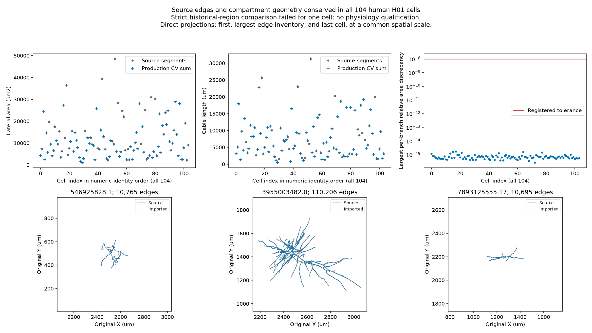

# Source geometry conserved through all 104 production compartment meshes

All 104 selected human H01 source components preserve every directed source
edge, endpoint coordinate and radius through the production importer. All
808,495 compartments preserve per-branch lateral area and length and cover
each branch once. This extends the prior one-cell CVPerBranch check to the
actual population's MaxCVLen(10 um) policy and electrical-region boundaries.

The separate historical-region comparison is **failed** for one cell. It is
not silently absorbed into the geometry pass or a successful process exit.
No physiology, source-mesh completeness, channel provenance, donor accuracy,
population timestep or driven window is qualified by this result. All six
acceptance scores remain unchanged.

| Verified observation | Result |
| --- | ---: |
| Cell/component identities and original archive rows | 104/104 |
| Directed source edges | 2,804,445 |
| Maximum endpoint/radius discrepancy | 0 um |
| Source branches checked individually | 657,566 |
| Production compartments; every per-cell count matches the pinned build | 808,495 |
| Largest per-branch relative area discrepancy | 1.7269e-15 |
| Largest per-branch relative length discrepancy | 9.8590e-16 |
| Registered relative area/length tolerance | 1e-8 |
| Strict historical-region agreement | 103/104 cells |

Source coordinates are unique within every selected component. The directed
edge comparison therefore has unambiguous source endpoint identity. The test
retains each branch's individual area and length; errors that cancel at the
whole-cell level cannot pass. All original rows, physical edges, branch edge
counts, branch area/length and CV interval/area/length observations are retained
in the 104 NPZs and bound by per-cell SHA256 receipts.

## Historical region discrepancy

Cell 1830470325 has two soma-region boundary entries exceeding the retained
1e-12 normalized comparison, with maximum discrepancy 1.3102852e-12. Their
branch identities and interval structure agree. Across all cells and regions,
the maximum corresponding cable-coordinate displacement is 8.55599e-13 um.
All other cells pass the strict historical-region comparison. Current and
historical intervals are both preserved in every NPZ.

This small discrepancy does not alter the observed compartment counts or
violate the independent area/length checks. Its unique cause has not been
established, so it is not labeled a repaired rounding bug. The overall result
remains `region_comparison_failed`; `source_edge_and_cv_geometry_passed` is a
separate measured result. The earlier attempt's failure and tolerance remain
unchanged in [its original prefix](../population-geometry/README.md).

## Direct visual review

The final plot was opened and inspected. Source and CV sums overlap for all
104 individually displayed cells, including the largest area and length
observations. The per-branch discrepancies remain well below the registered
line. The first, largest-edge and last cell projections retain every edge at a
common spatial scale and their original coordinate datums. Their branching
forms differ strongly in size and direction; imported paths overlay the source
paths without the artificial radial connections of the historical malformed
converter. These projections inspect cable geometry, not correspondence with
the full surface mesh or missing biological membrane.

## Execution and verification

The local CPU process completed in 217.069 seconds under its 600-second cap,
exit code 0. It evaluated geometry and region selectors only. Channel and
network definitions were imported to use the production region policy; no
biological mechanism was painted, initialized or simulated. The pinned
construction reference SHA256 is
`a32286fa4dbe2fd1865a7cc50415df32a13906d76b6ac3c217ca7891a94cfd68`.

`verify_records.py` independently reread all original archive members, checked
their exact hashes and retained rows, verified every NPZ hash and per-cell
record, recomputed whole-cell area from source segments, and verified all
current/reference region flags. It does not turn a failed comparison into a pass.
Runtime environment: Python 3.13.14, NumPy 2.5.2, BrainCell 0.1.0,
BrainState 0.5.4, BrainUnit 0.5.2, JAX 0.11.1. Verification and plotting used
the separate human-audit environment with NumPy 2.5.3.

All 26 affected tests pass; the new partition validator has 100% line coverage.
Tests cover compensating area errors on different branches, gaps, overlaps,
missing branches, changed edge endpoints/radii, nonfinite and nonpositive
values, fractional/out-of-range branch identifiers, incomplete endpoints and
reordered CV rows. The first runtime failure revealed a reporting weakness:
one comparison stopped collection of otherwise independent checks. The second
runner retains that failure and collects the remaining evidence; it changes
neither the source model nor the acceptance threshold.

The source-to-compartment geometric conservation prerequisite now has evidence
for the entire retained population. Remaining anatomy-transfer work concerns
surface-mesh/domain completeness and human-qualified physiological predictions,
plus the separately failed strict historical-region comparison. Repeating this
geometric conservation audit is unnecessary unless its inputs or implementation
change.
