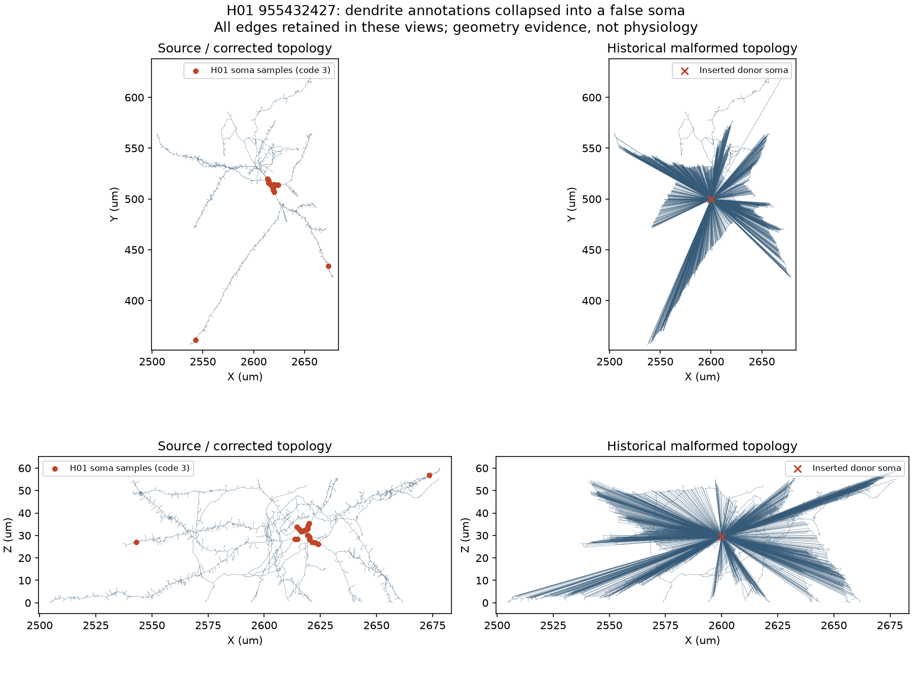

# H01 source-conversion repair and remaining human qualification

The first implementation stage found and repaired a diagnostic conversion defect.
The original six numerical values remain unchanged. Anatomy transfer is now
reported as unavailable: its historical negative interpretation used malformed
geometry. No new physiological simulation or human-only model has been qualified.

## Observed defect and repair

The retained source archive member is `955432427.0.swc`, SHA256
`cc52cc1b8d396bc840648faee816f3e02b2702539c7235129625e5cbba8b9f27`.
H01 annotations differ from standard SWC: 1 means dendrite, 2 astrocyte, 3 soma.
The old diagnostic converter collapsed 1,550 dendrite-labeled samples into one
donor sphere, mislabeled astrocyte samples as axon, and guessed apical branches.
It attached the remaining fragments back to that false soma, producing long
radial cables. Its length summary omitted those introduced attachments.

| Geometry reading | Original component | Historical conversion | Corrected export |
| --- | ---: | ---: | ---: |
| Nodes | 11,524 | 9,975 | 11,524 |
| Edges | 11,523 | 9,974 | 11,523 |
| Total cable length, um | 3,343.088280 | 91,056.138722 | 3,343.088280 |
| Lateral frustum area, um2 | 4,307.493077 | 1,976,498.653095 | 4,307.493077 |

These are geometrical SWC measurements, not NEURON post-import membrane areas
or measured human capacitances. The old 2,459.97 um cable summary excluded its
new soma connections. The verified correction checks every original identifier,
annotation, coordinate, radius and parent edge: maximum coordinate discrepancy
is 4.55e-13 um and radius discrepancy 8.89e-16 um (decimal serialization).

The corrected export retains neutral SWC labels and reversible original H01
annotations, as the existing production importer does. It applies no radius
floor, soma replacement, apical inference or axon stub. Preparation writes an
anatomy sidecar rather than an invalid donor.json for the incompatible L2 driver.
The original stage-1 artifacts and decision remain unchanged.

Evidence: [correction decision](conversion-correction.json),
[corrected anatomy sidecar](source-preserved/anatomy.json),
[corrected SWC](source-preserved/h01-955432427.swc).

## Visual interpretation

The XY and XZ images were opened and visually inspected. The source tree follows
branching neurites; the malformed export adds a dense fan of straight radial
edges to an inserted central point. That fan is visible in both projections,
so this is not merely projection overlap. The source's soma-coded samples mostly
cluster near X 2610-2625 um, but a few are distant outliers. Consequently even
the correct code cannot justify collapsing every soma-coded sample into one
centroid. The new export preserves these labels without treating them as proven
whole-cell anatomy. All plotted edges are retained; no random subsampling.

The intervention from old converter to source-preserving export restores exact
source topology and geometry. This explains the geometric distortion, not the
entire historical electrical response. A corrected transfer run is still needed.

## Surface mesh acquisition and remaining correspondence

The finest released mesh (LOD 0) was retrieved for the same segment: a 2,655,615
byte mesh payload, checked against the 64 MiB cap before download. CloudVolume
12.14.4 and DracoPy 1.7.0 decoded it with source metadata transforms into physical
nanometres. The local array SHA256 is
`4e7811eb037323147c6eff0c220c213c42e3ed60a07b220db5c86876fbcd6c75`.
Raw arrays and acquisition/cache records are in `.cache/human-anatomy/` in this
worktree; the committed [audit](anatomy-mesh-lod0-r2.json) records their hashes.

The mesh has 2,322,552 triangles before duplicate-face handling. Its unique
nondegenerate area is 6,285.701 um2. Exact coordinate deduplication reports
22,318 repeated vertices, 4,527 duplicate faces, 3,341 boundary edges and
1,655 nonmanifold edges. The 2,811 resulting connected sets are algorithmic
mesh components, not identified biological components. The SWC archive has
19 components for this segment. No whole-mesh/selected-component ratio is
qualified without resolving those domains and reconstruction boundaries.
This audit does not change anatomy_transfer to 1.000.

## Verification and failure prevention

The final affected test run passed **81 tests in 8.82 seconds** on local CPU,
Python 3.14.6. Every changed code module exceeds 90% line coverage (lowest 92%,
overall 97%). See [JUnit results](tests.xml) and [coverage](coverage.json).
This is audit/export/ledger validation, not the full package suite or a model run.

The label-error regression failed against the original converter, then passed
after repair. Tests also cover node and parent preservation, source annotation
identity, anisotropic units, positive radii, no soma substitution, archive and
mesh hash mismatches, missing fragments, payload caps, exact mesh seams, duplicate
and degenerate faces, and open/nonmanifold edges. CLI tests reject overwriting
evidence and ensure preparation does not require electrophysiology scorer imports.

The initial new audit repeated the old code-1 soma assumption in one reporting
field. That field was corrected after a failing source-label regression; the
retained r2 report uses code 3. Unregistered draft reports were removed before
integration. The prevention is to test H01's source vocabulary independently of
the converted SWC and validate every mapped original identifier, not only totals.

## Work still required by the full objective

Resolve mesh-component correspondence and extend geometry checks to the final
population and discretization; qualify human
mechanisms in place of unsupported nonhuman assumptions; cover and validate all
donor types; obtain physiological transfer readings; extend timestep qualification
across the final population; and complete the full driven controls. The historical
NaTg human-sodium experiments must be reviewed before choosing a new mechanism
experiment. No animal-data fallback, relaxed score or smaller-population result
will close the objective. All six numerical values remain at their previous levels.

## Actual BrainCell post-import geometry

The production H01Archive importer and installed BrainCell geometry stage were
executed on local CPU for cell 955432427, component 0. Every one of the 11,523
directed edges matched its source endpoint coordinates and radii exactly. Source
coordinates are unique for this component, so that correspondence is unambiguous.
With CVPerBranch, all 2,569 control volumes had finite positive lateral areas.
Their summed length was 3,343.088280093296 um and summed lateral area was
4,307.493077002364 um2, matching the original source-frustum calculation within
the preregistered 1e-8 relative tolerance. The previously inspected source plot
therefore represents the imported edge geometry as well.

The measured import/geometry phase took 4.09 seconds; the complete process finished
within its 60-second cap. No channels, membrane simulation or GPU were used.
This closes the static source-to-import and CVPerBranch area check for this one
component. It does not close source-mesh correspondence, membrane completeness,
final-population discretization or anatomy-transfer physiology.

See [post-import report](post-import.json) for all CV observations and executed
source-file hashes, and [direct edge arrays](post-import.npz) for every source and
imported edge. The script is `docs/evidence/h01_post_import_audit.py` and the exact
archive is the pinned proofread104 release. Ten additional sibling tests pass,
covering edge loss, nonfinite data, reordered edges, endpoint displacement and
radius changes. [Test results](post-import-tests.xml) and [actual-run coverage](post-import-coverage.json)
are retained separately from the original 81-test repair suite.

## All-104 production compartment geometry

The [population geometry check](population-geometry-r2/README.md) now verifies
all 2,804,445 directed source edges and per-branch area/length conservation
through the exact 808,495-compartment production policy for all 104 cells.
Every cell's compartment count matches the pinned construction reference.
The separate strict historical-region comparison fails for one cell by a
maximum normalized discrepancy of 1.3103e-12 against its retained 1e-12 threshold;
that failure remains explicit. No physiological or six-term score promotion
follows from this static geometry result.

## Human pyramidal channel inputs

The [human channel source checkpoint](human-pyramidal-channels/README.md)
identifies pooled human/mouse inactivation and recovery fitting in the existing
Wilbers potassium model. Its human label is insufficient for this campaign.
The pinned experimental tables now supply 19 human sodium and 13 human potassium
recordings with source identities and missing values preserved. Original NWB
traces remain unavailable locally; source QC and unit discrepancies are explicit.
This acquisition changes no model parameter or six-term score and supplies the
input for a separately registered human-only potassium estimate.

The subsequent [human-only recovery estimate](human-potassium-recovery/README.md)
fits 120 experimental amplitude ratios from 12 recordings and tests prediction
across two filename groups. Two exponentials improve grouped RMSE only 0.34%
over one exponential (0.15234 versus 0.15286), with substantial per-record errors.
Effective current recovery constants of 215.3 and 1438.4 ms remain observation-model
estimates; they are not installed as channel-gate rates. Full experimental command
and original-trace validation remain necessary. The six-term ledger is unchanged.
