# h01-i-campaign result

Bounded Search Dissection of the inhibitory candidate against the recorded input (bias applied) on HL5BN1 donor geometry. Specification: docs/specs/2026-09-06-h01-progressive-search-plan.md.

Cap 24 evaluations; abort 900 s per run; inputs 019, 027, n011, n005.

**Verdict.** FAIL at 19 of 24 evaluations: no cell of the G1a x G3 x G4 matrix (G1b and G2 at candidate values) meets the count row at both calibration inputs; the closest are 001 (24/43) and 000 (26/45). The passive/threshold family is the sub-system outside G1-G4 named by the residual pattern.

Container runs: 76, total 3951.3 s, longest 900.0 s, aborted: s0-candidate-axon2187 019, s0-candidate-axon2187 027.

## stage0-decision.json

Decision: count rows excluded at these settings: 019:event_count, 027:event_count; ranking uses the remaining rows

| Record | 019:event_count | 027:event_count |
| --- | ---: | ---: |
| source | 22 | 39 |
| candidate | 26 | 59 |
| s0-candidate-x27 | 25 | 53 |

- **aborted.** s0-candidate-axon2187 exceeded the 900 s per-run abort at 0.19 and 0.27 nA under the recorded bias (its passive inputs completed in 34 s and 32 s). The axon x2187 mesh is unaffordable under the campaign cap; decision limits use the x9/x27 pair (Dixon factor 2.95).
- **count_rows.** Both count rows are excluded: at 0.19 nA the source-to-candidate contrast (22 vs 26) is below five limits (limit 2.95 events); at 0.27 nA the x9/x27 repeat itself moves the count 59 to 53. Count is unrankable at these settings and the fail rule on count stays open.
- **prediction_check.** {"source_over_fires_0.19": "22 vs 12: held", "source_first_peak_over_20mV_high": "+24.8 mV: held", "candidate_over_fires_more": "26 and 59: held", "minima_source_within_3mV": "first minima +2.5 mV (0.19): held; see residuals", "candidate_minima_5_to_8mV": "held", "mesh_moves_no_early_row_beyond_0.05": "intervals 1-3, first-event rows and minima limits below 0.05 ms / 0.2 mV: held; late crossings move up to 263 ms: held"}
- **elemental_finding.** Every passive sample at -0.11 and -0.05 nA with the recorded bias is +2.0 to +4.1 mV above the human sample in both the source and the candidate, and the two are equal to 0.01 mV. The passive family (leak, reversal, Ih) is outside G1-G4 and cannot be ranked by this dissection; it is the first sub-system named by the fail rule.
- **stage_a_setting.** nseg x9, CVode 1e-10; 311 rows selected over onsets, peaks, phases, intervals 1-4 at 0.19 and 1-5 at 0.27, minima, and subthreshold (subthreshold rows are equal in S and C and will rank no family).

## stage-a-decision.json

Decision: no group reversed by a single swap; count is an interdependency of G1a (sodium inactivation law) and G3 (axonal calcium/SK); Stage B pair G1a+G3

Steep X by group: {"subthreshold": "G4"}

## stage-a-ranking.json

Decision: steep X by group: {"subthreshold": "G4"}; Stage B pair: G3+G1a

| Record | 019:event_count | 027:event_count |
| --- | ---: | ---: |
| source | 22 | 39 |
| candidate | 26 | 59 |
| a-into-G1a | 65 | 3 |
| a-into-G1b | 22 | 39 |
| a-into-G2 | 24 | 45 |
| a-into-G3 | 5 | 8 |
| a-into-G4 | 22 | 38 |
| a-out-G1a | 5 | 9 |
| a-out-G1b | 24 | 58 |
| a-out-G2 | 20 | 41 |
| a-out-G3 | 84 | 143 |
| a-out-G4 | 24 | 4 |

Steep X by group: {"subthreshold": "G4"}

## stage-b-decision.json

Decision: pair G1a+G3 does not reproduce the count: b-into-G1aG3 blocks at 0.27 nA (3 events) and under-fires at 0.19 nA (17); b-out-G1aG3 gives 24/43. Rejection rule met; third player G4 (somatic NaTg x1.1 with Ca_LVA x0.5) is required at 0.27 nA. Stage C completes the 2^3 matrix over G1a, G3, G4 on the candidate's G1b+G2 background.

## stage-c-decision.json

Decision: FAIL at 19 of 24 evaluations: no cell of the G1a x G3 x G4 matrix (G1b and G2 at candidate values) meets the count row at both calibration inputs; the closest are 001 (24/43) and 000 (26/45). The passive/threshold family is the sub-system outside G1-G4 named by the residual pattern.

## Search tree

```mermaid
flowchart TD
    Y[Candidate differs from human] --> G[Observation group]
    G --> onsets[onsets: 45 rows]
    onsets --> onsets_G2[G2: RSS 1724.2; not dominant]
    onsets --> onsets_G1b[G1b: RSS 1089.2; not dominant]
    onsets --> onsets_G1a[G1a: incomplete; not dominant]
    onsets --> onsets_G3[G3: incomplete; not dominant]
    onsets --> onsets_G4[G4: incomplete; not dominant]
    G --> peaks[peaks: 51 rows]
    peaks --> peaks_G2[G2: RSS 38786.1; not dominant]
    peaks --> peaks_G1b[G1b: RSS 13394.5; not dominant]
    peaks --> peaks_G1a[G1a: incomplete; not dominant]
    peaks --> peaks_G3[G3: incomplete; not dominant]
    peaks --> peaks_G4[G4: incomplete; not dominant]
    G --> phases[phases: 102 rows]
    phases --> phases_G2[G2: RSS 54437.2; not dominant]
    phases --> phases_G1b[G1b: RSS 7137.6; not dominant]
    phases --> phases_G1a[G1a: incomplete; not dominant]
    phases --> phases_G3[G3: incomplete; not dominant]
    phases --> phases_G4[G4: incomplete; not dominant]
    G --> intervals[intervals: 9 rows]
    intervals --> intervals_G2[G2: RSS 525.1; not dominant]
    intervals --> intervals_G1b[G1b: RSS 26.8; not dominant]
    intervals --> intervals_G1a[G1a: incomplete; not dominant]
    intervals --> intervals_G3[G3: incomplete; not dominant]
    intervals --> intervals_G4[G4: incomplete; not dominant]
    G --> minima[minima: 89 rows]
    minima --> minima_G2[G2: RSS 6692.8; not dominant]
    minima --> minima_G1b[G1b: RSS 1063.8; not dominant]
    minima --> minima_G1a[G1a: incomplete; not dominant]
    minima --> minima_G3[G3: incomplete; not dominant]
    minima --> minima_G4[G4: incomplete; not dominant]
    G --> subthreshold[subthreshold: 15 rows]
    subthreshold --> subthreshold_G4[G4: RSS 209.1; Steep X]
    subthreshold --> subthreshold_G1b[G1b: RSS 12.9; not dominant]
    subthreshold --> subthreshold_G2[G2: RSS 8.8; not dominant]
    subthreshold --> subthreshold_G3[G3: RSS 0.8; not dominant]
    subthreshold --> subthreshold_G1a[G1a: RSS 0.6; not dominant]
```

