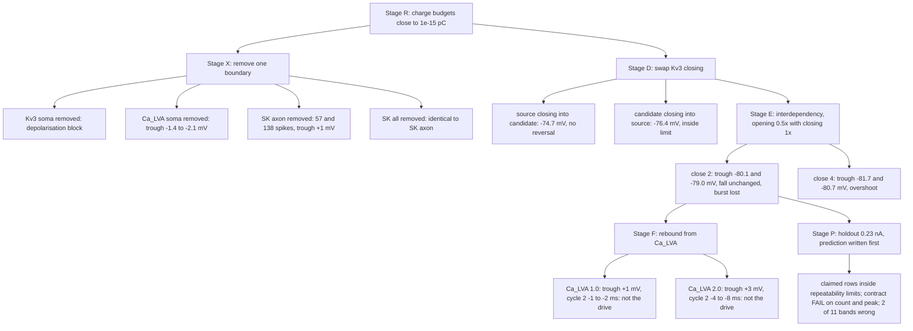

# I cell, Stage 3 energetic search: result

Manifest `h01-i-energetic-manifest.json`, runs in `h01-i-energetic/`, budgets in
`h01-i-energetic-stage-{r,x,d,e,f}-budgets.md`, decisions in
`h01-i-energetic/stage-*-decision.json`. Input datum: command current only
(Stage 0 forensics). 15 of 16 evaluations used, one in reserve, each 12 to 170 s.

**Verdict: explanation holds on the claimed rows at repeatability resolution;
the holdout FAILS the approved contract.** The elemental loop and the trough
are explained and predicted on the holdout within the Stage 1 limits (peak 2.07
mV, minimum 1.24 mV, cycle 12.8 ms), but against the contract (exact count, 1
mV) the holdout fails on count (26 vs 31) and on the first peak (1.15 mV). The
early burst, the count and the accommodation along the train are not explained
and are returned to the user. The finalist is an experimental candidate, not an
accepted cell; the 0.23 nA holdout is now spent.

## Search tree

## What each stage established

| Stage | Question | Answer | Evidence |
| --- | --- | --- | --- |
| R | Do the budgets close, and where is the charge spent? | Residual 1e-15 pC. Source: 3.5 pC of sodium flows through the fall and 3.8 pC of Kv3 repolarises it; candidate: 0.18 and 0.53 pC. At the trough both carry 0.04 to 0.2 nA of Kv3 against 0.12 to 0.16 nA of axial return. | stage-r-budgets |
| X | Which boundary is necessary for the trough? | Somatic Kv3 (block without it). Ca_LVA opposes the trough by 1.4 to 2.1 mV. Axonal SK is the count brake, not the trough. | stage-x-budgets |
| D | Is the Kv3 closing rate the lever? | No: restoring the source's closing moves the trough 1.4 to 1.8 mV, the trough Kv3 current stays 0.03 nA; the reverse swap moves 1 mV. | stage-d-budgets |
| E | Is the lever the activation carried past the spike (opening × closing)? | Yes: opening 0.5× with closing 1× gives −80.1 and −79.0 mV against the human −78.8 and −78.9, fall −343 against −336, peak, rise and threshold unchanged. Dose monotone (close 4: −81.7). | stage-e-budgets |
| F | Does somatic Ca_LVA supply the post-trough burst? | No: cycle 2 shortens 1 to 8 ms against a 12.8 ms limit; the trough lifts as predicted. | stage-f-budgets |
| P | Does the explanation predict the closed holdout? | Within repeatability limits, yes on every claimed row; 2 of 11 bands (both cycle lengths) were set 1 to 2 ms high; the late fall rate failed unpredicted. Against the contract the holdout fails on count and first peak. | [prediction](h01-prediction-i.md) |

## Causal explanation (conditions and mechanism)

The human PV response has a short spike (peak +19 mV, fall −336 V/s), a trough
at −79 mV, an early burst of 6 to 10 ms cycles, then cycles of 25 to 120 ms
with the threshold climbing 8 mV along the train.

**Loop.** Necessary and sufficient: sodium inflow must end within the upstroke.
When it does (0.18 pC of sodium through the fall), 0.5 pC of potassium
repolarises the soma and the peak sits at +18 mV; when it does not (3.5 pC, the
published fit), 3.8 pC of potassium is needed and the peak reaches +44 mV with
the fall at −141 V/s. The peak is the voltage at which the net membrane current
reverses, so a sodium that persists through the fall both lifts the peak and
slows the fall.

**Trough.** Necessary: somatic Kv3 (no repolarisation without it). Sufficient,
given the short spike: the Kv3 activation carried past the end of the spike.
Its tail below −73 mV takes the soma, and through the 0.16 nA axial path the
coupled dendrites, to −80 mV before the passive return balances. The depth is
not a local current balance (0.036 nA of Kv3 at the trough whether it is −73 or
−80 mV) and not a total-charge effect (0.53 to 0.62 pC); it is where in
voltage the potassium tail is spent. Opening and closing rates form one
interdependent lever: fast opening sets how much activation the short spike
reaches, the closing rate sets how far below −73 mV it persists. Somatic Ca_LVA
opposes the trough by about 1 mV per unit of its density.

**Count and late cycles.** Necessary: axonal SK, accumulating cycle to cycle;
without it the cell fires 57 and 138 spikes instead of 14 and 37. This is the
temporal family of the response.

**Not explained.** (1) The post-trough inward drive that refires the human
within 6 to 10 ms of a −79 mV trough, at every input; not somatic Ca_LVA.
(2) The accommodation along the train: threshold climbing from −61 to −55 mV
with the late spike slowing to −294 V/s; the model's threshold stays at −60.
Both point at a slow state the model lacks (sodium availability at the
initiation site, or an axonal or dendritic sodium boundary that the human's
upstroke shoulder near −45 mV suggests). One evaluation remains in reserve.

## Decisions returned to the user

1. Whether to spend the reserve, and further evaluations, on the post-trough
   drive and the accommodation, which lie outside the somatic boundaries this
   manifest can change (axon and dendrite sodium, slow inactivation, Ih).
2. Whether the trough finalist (Kv3 close factor 2.0 on the candidate) is
   promoted to the BrainCell defaults; promotion is its own spec and needs the
   transfer gate.
