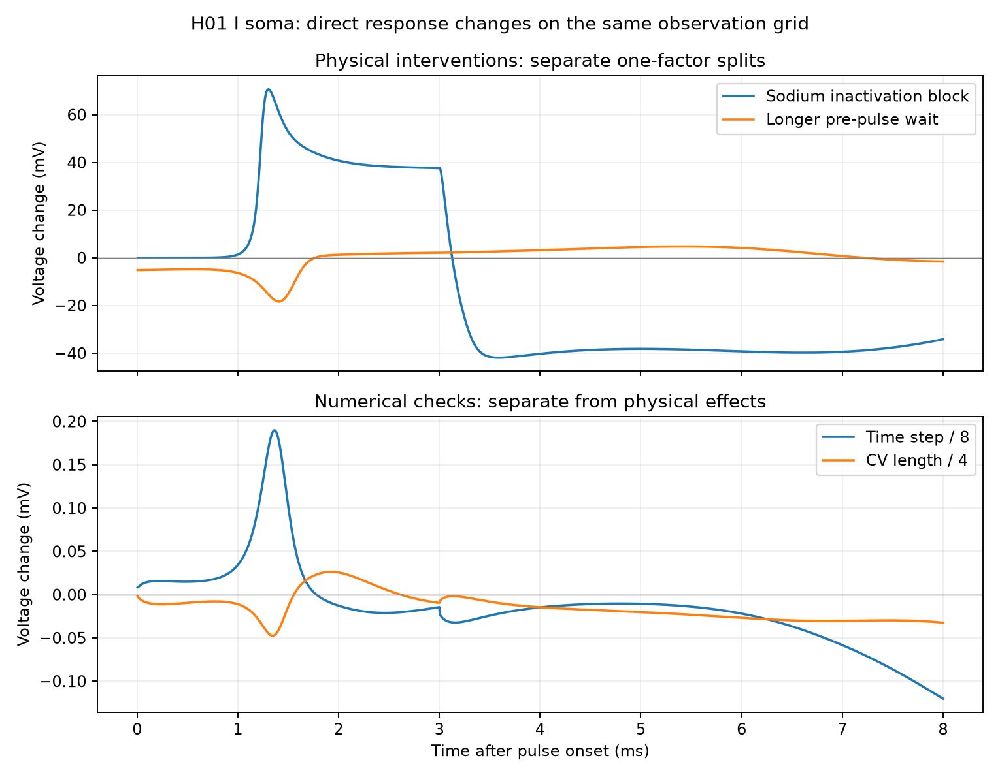
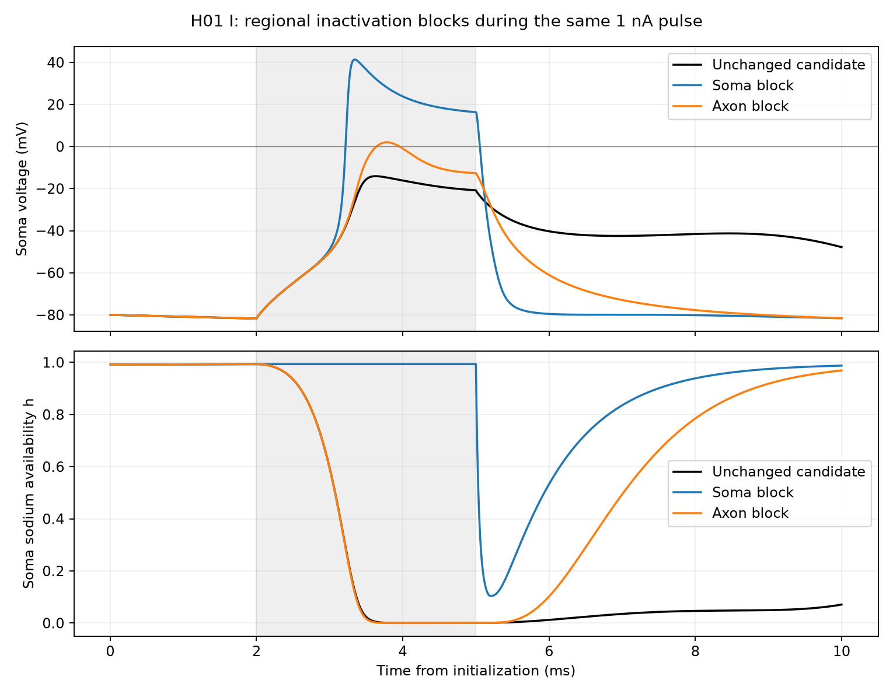

# H01 I response factors

Datum: source soma voltage, inside minus outside, in mV. Time is relative
to pulse onset. RSS here means root sum of squared paired voltage changes.
Use 1600 samples from 0.005 to 8 ms, at 0.005 ms intervals. Finer traces are
interpolated to this grid. Keep each direct trace and its paired control.

| Tested intervention | Response-change RSS (mV) | Positive voltage restored? |
| --- | ---: | --- |
| Block NaTg inactivation during pulse | 1475.394 | Yes, at both tested time steps |
| Block soma NaTg inactivation only | 1449.779 | Yes, at both tested time steps |
| Block axon NaTg inactivation only | 996.524 | Yes, at both tested time steps |
| Restore source NaTg closing-time factor | 1167.739 | Yes, under joint time/space refinement |
| Increase pre-pulse wait from 2 to 270 ms | 192.555 | No |
| Reduce time step eightfold | 1.990 | No |
| Reduce maximum CV length fourfold | 0.859 | No |

The five physical interventions share the original physical baseline. Numerical checks
retain their own matched controls and are not physical-factor estimates.
Intervention sizes differ. These values rank only the stated response changes;
they are not uncertainty contributions, normalized sensitivities, or errors
against a measured human target. H01 has no voltage trace for this cell.
The positive-voltage criterion is a diagnostic step, not human validation.

The [machine-readable record](h01-i-factor-response-rss.json) stores source
hashes and measurements. The [inactivation audit](h01-i-inactivation-split-audit.json)
retains both time-step results. The selected default remains unchanged.

## Progressive diagnosis

1. Circuit boundary: E delivery works; I emits no feedback event.
2. Cell boundary: a direct soma pulse also fails to produce positive voltage.
3. Numerical and state checks: tested refinements and longer wait do not rescue it.
4. Channel boundary: blocking NaTg availability loss permits positive voltage.
5. Spatial split: either soma-only or axon-only block permits positive soma
   voltage. The soma block has the larger tested response RSS. The axon block
   works while soma availability still falls.
6. Next boundary: measure local axial and membrane current balance before
   attributing the effect to a specific cable path.

Each step narrows a model explanation. None establishes a unique human cause.

## Direct regional responses

At dt 0.005 ms, soma-only block gives peak +41.340 mV; axon-only block gives
+2.001 mV. At dt 0.0025 ms, the peaks are +41.384 and +1.999 mV. Each coarse
run preserves the exact pre-intervention voltage. Soma availability stays
high for the soma block and falls for the axon block. The
[regional audit](h01-i-inactivation-regions-audit.json) retains each crossing,
peak, gate check, RSS, and trace hash. The two regional effects must not be
added as independent contributions: this is a nonlinear connected system.

The source closing-time restoration retains dynamic gates. It is a more direct
candidate for further model validation than a gate block, but its response-change
RSS is not a human-fit score. Its refinement changes peak by 0.177 mV, so it
has not passed a 0.1 mV precision gate. See the
[source restoration audit](h01-i-source-closing-refinement-audit.json).
