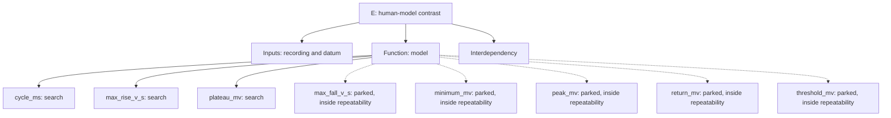

# Isolation split, E cell

## Decision limits

| Landmark | Human repeat limit | Model repeat limit |
| --- | --- | --- |
| cycle_ms | nan | 0.0154 |
| latency_ms | 82.5 | nan |
| max_fall_v_s | 5.74 | 0.000268 |
| max_rise_v_s | 5.74 | 1.71 |
| minimum_mv | 1.01 | 0.0026 |
| peak_mv | 0.551 | 0.0186 |
| plateau_mv | 0.592 | 0.0655 |
| return_mv | 0.865 | 0.0332 |
| threshold_mv | 0.965 | 0.0419 |

## sweep 50, source

Human 5 spikes, model 7.

| Phase | Spike | Landmark | Human | Model | Contrast | Limit | Ratio | Tier |
| --- | --- | --- | --- | --- | --- | --- | --- | --- |
| early | 1 | threshold_mv | -55.84 | -52.39 | +3.452 | 0.966 (human and model) | 3.6 | real |
| early | 1 | peak_mv | 36.03 | 37.21 | +1.177 | 0.552 (human and model) | 2.1 | real |
| early | 1 | max_rise_v_s | 350.8 | 1019 | +668.1 | 5.99 (human and model) | 111.5 | search |
| early | 1 | max_fall_v_s | -104.7 | -97.04 | +7.646 | 5.74 (human and model) | 1.3 | real |
| early | 1 | minimum_mv | -69.56 | -71.07 | -1.503 | 1.01 (human and model) | 1.5 | real |
| early | 1 | cycle_ms | 59.98 | 58.81 | -1.175 | 0.0154 (model) | 76.5 | search |
| early | 2 | threshold_mv | -54.63 | -52.28 | +2.342 | 0.966 (human and model) | 2.4 | real |
| early | 2 | peak_mv | 35.31 | 36.86 | +1.547 | 0.552 (human and model) | 2.8 | real |
| early | 2 | max_rise_v_s | 314.8 | 1002 | +687.2 | 5.99 (human and model) | 114.7 | search |
| early | 2 | max_fall_v_s | -85.94 | -97.01 | -11.07 | 5.74 (human and model) | 1.9 | real |
| early | 2 | minimum_mv | -67.09 | -71.5 | -4.404 | 1.01 (human and model) | 4.4 | real |
| early | 2 | cycle_ms | 34.26 | 27.34 | -6.919 | 0.0154 (model) | 450.6 | search |
| early | 3 | threshold_mv | -54.44 | -52.06 | +2.377 | 0.966 (human and model) | 2.5 | real |
| early | 3 | peak_mv | 34.88 | 35.98 | +1.106 | 0.552 (human and model) | 2.0 | real |
| early | 3 | max_rise_v_s | 314.1 | 960.7 | +646.6 | 5.99 (human and model) | 107.9 | search |
| early | 3 | max_fall_v_s | -101.6 | -96.76 | +4.8 | 5.74 (human and model) | 0.8 | parked |
| early | 3 | minimum_mv | -70.22 | -71.52 | -1.3 | 1.01 (human and model) | 1.3 | real |
| early | 3 | cycle_ms | 220.1 | 123.8 | -96.33 | 0.0154 (model) | 6273.5 | search |
| late | 4 | threshold_mv | -54.06 | -52.04 | +2.023 | 0.966 (human and model) | 2.1 | real |
| late | 4 | peak_mv | 34.78 | 35.99 | +1.21 | 0.552 (human and model) | 2.2 | real |
| late | 4 | max_rise_v_s | 311.7 | 961.2 | +649.5 | 5.99 (human and model) | 108.4 | search |
| late | 4 | max_fall_v_s | -103.9 | -96.85 | +7.058 | 5.74 (human and model) | 1.2 | real |
| late | 4 | minimum_mv | -70.28 | -71.56 | -1.281 | 1.01 (human and model) | 1.3 | real |
| late | 4 | cycle_ms | 307.4 | 189.8 | -117.6 | 0.0154 (model) | 7661.9 | search |
| late | 5 | threshold_mv | -54.31 | -52.05 | +2.261 | 0.966 (human and model) | 2.3 | real |
| late | 5 | peak_mv | 34.56 | 35.98 | +1.42 | 0.552 (human and model) | 2.6 | real |
| late | 5 | max_rise_v_s | 307.8 | 960.8 | +653 | 5.99 (human and model) | 109.0 | search |
| late | 5 | max_fall_v_s | -104.7 | -96.86 | +7.829 | 5.74 (human and model) | 1.4 | real |
| late | 5 | minimum_mv | -70.59 | -71.57 | -0.9714 | 1.01 (human and model) | 1.0 | parked |
| late | 5 | cycle_ms | 273.3 | 185.6 | -87.66 | 0.0154 (model) | 5708.9 | search |
| subthreshold | 0 | return_mv | -87.12 | -86.81 | +0.3069 | 0.865 (human and model) | 0.4 | parked |

## sweep 50, candidate

Human 5 spikes, model 5.

| Phase | Spike | Landmark | Human | Model | Contrast | Limit | Ratio | Tier |
| --- | --- | --- | --- | --- | --- | --- | --- | --- |
| early | 1 | threshold_mv | -55.84 | -52.04 | +3.8 | 0.966 (human and model) | 3.9 | real |
| early | 1 | peak_mv | 36.03 | 35.96 | -0.07149 | 0.552 (human and model) | 0.1 | parked |
| early | 1 | max_rise_v_s | 350.8 | 641 | +290.2 | 5.99 (human and model) | 48.4 | search |
| early | 1 | max_fall_v_s | -104.7 | -95.61 | +9.079 | 5.74 (human and model) | 1.6 | real |
| early | 1 | minimum_mv | -69.56 | -69.5 | +0.05868 | 1.01 (human and model) | 0.1 | parked |
| early | 1 | cycle_ms | 59.98 | 61.95 | +1.975 | 0.0154 (model) | 128.6 | search |
| early | 2 | threshold_mv | -54.63 | -51.92 | +2.706 | 0.966 (human and model) | 2.8 | real |
| early | 2 | peak_mv | 35.31 | 35.51 | +0.1939 | 0.552 (human and model) | 0.4 | parked |
| early | 2 | max_rise_v_s | 314.8 | 628.2 | +313.3 | 5.99 (human and model) | 52.3 | search |
| early | 2 | max_fall_v_s | -85.94 | -95.45 | -9.511 | 5.74 (human and model) | 1.7 | real |
| early | 2 | minimum_mv | -67.09 | -69.96 | -2.863 | 1.01 (human and model) | 2.8 | real |
| early | 2 | cycle_ms | 34.26 | 25.62 | -8.639 | 0.0154 (model) | 562.6 | search |
| early | 3 | threshold_mv | -54.44 | -51.78 | +2.661 | 0.966 (human and model) | 2.8 | real |
| early | 3 | peak_mv | 34.88 | 34.98 | +0.1086 | 0.552 (human and model) | 0.2 | parked |
| early | 3 | max_rise_v_s | 314.1 | 613.7 | +299.7 | 5.99 (human and model) | 50.0 | search |
| early | 3 | max_fall_v_s | -101.6 | -95.24 | +6.323 | 5.74 (human and model) | 1.1 | real |
| early | 3 | minimum_mv | -70.22 | -70.06 | +0.1573 | 1.01 (human and model) | 0.2 | parked |
| early | 3 | cycle_ms | 220.1 | 272 | +51.87 | 0.0154 (model) | 3378.1 | search |
| late | 4 | threshold_mv | -54.06 | -51.78 | +2.279 | 0.966 (human and model) | 2.4 | real |
| late | 4 | peak_mv | 34.78 | 34.97 | +0.1898 | 0.552 (human and model) | 0.3 | parked |
| late | 4 | max_rise_v_s | 311.7 | 613.4 | +301.7 | 5.99 (human and model) | 50.4 | search |
| late | 4 | max_fall_v_s | -103.9 | -95.27 | +8.641 | 5.74 (human and model) | 1.5 | real |
| late | 4 | minimum_mv | -70.28 | -70.1 | +0.1838 | 1.01 (human and model) | 0.2 | parked |
| late | 4 | cycle_ms | 307.4 | 307.2 | -0.2629 | 0.0154 (model) | 17.1 | search |
| late | 5 | threshold_mv | -54.31 | -51.77 | +2.54 | 0.966 (human and model) | 2.6 | real |
| late | 5 | peak_mv | 34.56 | 34.96 | +0.3981 | 0.552 (human and model) | 0.7 | parked |
| late | 5 | max_rise_v_s | 307.8 | 613.2 | +305.3 | 5.99 (human and model) | 51.0 | search |
| late | 5 | max_fall_v_s | -104.7 | -95.28 | +9.409 | 5.74 (human and model) | 1.6 | real |
| late | 5 | minimum_mv | -70.59 | -70.11 | +0.4792 | 1.01 (human and model) | 0.5 | parked |
| late | 5 | cycle_ms | 273.3 | 293.9 | +20.61 | 0.0154 (model) | 1342.4 | search |
| subthreshold | 0 | return_mv | -87.12 | -87.69 | -0.5718 | 0.865 (human and model) | 0.7 | parked |

## sweep 43, source

Human 0 spikes, model 0.

| Phase | Spike | Landmark | Human | Model | Contrast | Limit | Ratio | Tier |
| --- | --- | --- | --- | --- | --- | --- | --- | --- |
| subthreshold | 0 | plateau_mv | -75.66 | -71.58 | +4.081 | 0.595 (human and model) | 6.9 | search |
| subthreshold | 0 | return_mv | -85.37 | -82.04 | +3.33 | 0.865 (human and model) | 3.8 | real |

## sweep 43, candidate

Human 0 spikes, model 0.

| Phase | Spike | Landmark | Human | Model | Contrast | Limit | Ratio | Tier |
| --- | --- | --- | --- | --- | --- | --- | --- | --- |
| subthreshold | 0 | plateau_mv | -75.66 | -74.01 | +1.654 | 0.595 (human and model) | 2.8 | real |
| subthreshold | 0 | return_mv | -85.37 | -83.76 | +1.617 | 0.865 (human and model) | 1.9 | real |

## Tree

