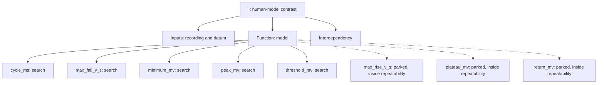

# Isolation split, I cell

## Decision limits

| Landmark | Human repeat limit | Model repeat limit |
| --- | --- | --- |
| cycle_ms | nan | 12.8 |
| latency_ms | 25 | nan |
| max_fall_v_s | 19.5 | 0.137 |
| max_rise_v_s | 19.5 | 245 |
| minimum_mv | 1.24 | 0.0177 |
| peak_mv | 2.07 | 0.00835 |
| plateau_mv | 1.12 | 3.94 |
| return_mv | 0.935 | 0.0865 |
| threshold_mv | 1.29 | 0.033 |

## 0.19 nA, source

Human 12 spikes, model 11.

| Phase | Spike | Landmark | Human | Model | Contrast | Limit | Ratio | Tier |
| --- | --- | --- | --- | --- | --- | --- | --- | --- |
| early | 1 | threshold_mv | -60.5 | -60.53 | -0.02891 | 1.29 (human and model) | 0.0 | parked |
| early | 1 | peak_mv | 19.56 | 44.25 | +24.69 | 2.07 (human and model) | 11.9 | search |
| early | 1 | max_rise_v_s | 596.9 | 1388 | +791.4 | 246 (human and model) | 3.2 | real |
| early | 1 | max_fall_v_s | -335.9 | -140.7 | +195.2 | 19.5 (human and model) | 10.0 | search |
| early | 1 | minimum_mv | -78.84 | -77.41 | +1.437 | 1.24 (human and model) | 1.2 | real |
| early | 1 | cycle_ms | 21.68 | 34.37 | +12.69 | 12.8 (model) | 1.0 | parked |
| early | 2 | threshold_mv | -59.88 | -60.51 | -0.6378 | 1.29 (human and model) | 0.5 | parked |
| early | 2 | peak_mv | 18.59 | 44.12 | +25.52 | 2.07 (human and model) | 12.3 | search |
| early | 2 | max_rise_v_s | 575.8 | 1388 | +812.5 | 246 (human and model) | 3.3 | real |
| early | 2 | max_fall_v_s | -316.4 | -144 | +172.4 | 19.5 (human and model) | 8.8 | search |
| early | 2 | minimum_mv | -78.72 | -77.55 | +1.165 | 1.24 (human and model) | 0.9 | parked |
| early | 2 | cycle_ms | 7.62 | 8.981 | +1.361 | 12.8 (model) | 0.1 | parked |
| early | 3 | threshold_mv | -58.53 | -60.05 | -1.519 | 1.29 (human and model) | 1.2 | real |
| early | 3 | peak_mv | 18.62 | 43.94 | +25.32 | 2.07 (human and model) | 12.2 | search |
| early | 3 | max_rise_v_s | 567.2 | 1370 | +802.5 | 246 (human and model) | 3.3 | real |
| early | 3 | max_fall_v_s | -321.9 | -148.8 | +173.1 | 19.5 (human and model) | 8.9 | search |
| early | 3 | minimum_mv | -78.91 | -78.76 | +0.1442 | 1.24 (human and model) | 0.1 | parked |
| early | 3 | cycle_ms | 10.18 | 11.3 | +1.115 | 12.8 (model) | 0.1 | parked |
| late | 10 | threshold_mv | -51.72 | -60.3 | -8.582 | 1.29 (human and model) | 6.7 | search |
| late | 10 | peak_mv | 14.22 | 44.21 | +30 | 2.07 (human and model) | 14.5 | search |
| late | 10 | max_rise_v_s | 445.3 | 1380 | +935.1 | 246 (human and model) | 3.8 | real |
| late | 10 | max_fall_v_s | -274.2 | -153.4 | +120.8 | 19.5 (human and model) | 6.2 | search |
| late | 10 | minimum_mv | -79.12 | -80.42 | -1.3 | 1.24 (human and model) | 1.0 | real |
| late | 10 | cycle_ms | 197 | 120.4 | -76.56 | 12.8 (model) | 6.0 | search |
| late | 11 | threshold_mv | -53.03 | -60.3 | -7.273 | 1.29 (human and model) | 5.7 | search |
| late | 11 | peak_mv | 14.97 | 44.22 | +29.25 | 2.07 (human and model) | 14.1 | search |
| late | 11 | max_rise_v_s | 452.3 | 1381 | +928.4 | 246 (human and model) | 3.8 | real |
| late | 11 | max_fall_v_s | -282 | -153.4 | +128.6 | 19.5 (human and model) | 6.6 | search |
| late | 11 | minimum_mv | -79.41 | -80.42 | -1.018 | 1.24 (human and model) | 0.8 | parked |
| late | 11 | cycle_ms | 117.1 | 122.5 | +5.382 | 12.8 (model) | 0.4 | parked |
| late | 12 | threshold_mv | -52.03 | -60.33 | -8.299 | 1.29 (human and model) | 6.4 | search |
| late | 12 | peak_mv | 14.78 | 44.22 | +29.44 | 2.07 (human and model) | 14.2 | search |
| late | 12 | max_rise_v_s | 452.3 | 1381 | +928.7 | 246 (human and model) | 3.8 | real |
| late | 12 | max_fall_v_s | -275 | -153.4 | +121.6 | 19.5 (human and model) | 6.2 | search |
| late | 12 | minimum_mv | -79.25 | -80.42 | -1.174 | 1.24 (human and model) | 0.9 | parked |
| late | 12 | cycle_ms | 98.84 | 124.4 | +25.58 | 12.8 (model) | 2.0 | real |
| subthreshold | 0 | return_mv | -86.87 | -87.5 | -0.6278 | 0.939 (human and model) | 0.7 | parked |

## 0.19 nA, candidate

Human 12 spikes, model 15.

| Phase | Spike | Landmark | Human | Model | Contrast | Limit | Ratio | Tier |
| --- | --- | --- | --- | --- | --- | --- | --- | --- |
| early | 1 | threshold_mv | -60.5 | -60.68 | -0.1818 | 1.29 (human and model) | 0.1 | parked |
| early | 1 | peak_mv | 19.56 | 17.62 | -1.946 | 2.07 (human and model) | 0.9 | parked |
| early | 1 | max_rise_v_s | 596.9 | 639.1 | +42.25 | 246 (human and model) | 0.2 | parked |
| early | 1 | max_fall_v_s | -335.9 | -343.4 | -7.467 | 19.5 (human and model) | 0.4 | parked |
| early | 1 | minimum_mv | -78.84 | -73.33 | +5.51 | 1.24 (human and model) | 4.4 | real |
| early | 1 | cycle_ms | 21.68 | 30.04 | +8.358 | 12.8 (model) | 0.7 | parked |
| early | 2 | threshold_mv | -59.88 | -60.6 | -0.7255 | 1.29 (human and model) | 0.6 | parked |
| early | 2 | peak_mv | 18.59 | 17.43 | -1.16 | 2.07 (human and model) | 0.6 | parked |
| early | 2 | max_rise_v_s | 575.8 | 631.1 | +55.35 | 246 (human and model) | 0.2 | parked |
| early | 2 | max_fall_v_s | -316.4 | -341.8 | -25.37 | 19.5 (human and model) | 1.3 | real |
| early | 2 | minimum_mv | -78.72 | -73.26 | +5.458 | 1.24 (human and model) | 4.4 | real |
| early | 2 | cycle_ms | 7.62 | 9.226 | +1.606 | 12.8 (model) | 0.1 | parked |
| early | 3 | threshold_mv | -58.53 | -60.48 | -1.946 | 1.29 (human and model) | 1.5 | real |
| early | 3 | peak_mv | 18.62 | 17.24 | -1.38 | 2.07 (human and model) | 0.7 | parked |
| early | 3 | max_rise_v_s | 567.2 | 626.4 | +59.19 | 246 (human and model) | 0.2 | parked |
| early | 3 | max_fall_v_s | -321.9 | -339.5 | -17.64 | 19.5 (human and model) | 0.9 | parked |
| early | 3 | minimum_mv | -78.91 | -73.61 | +5.295 | 1.24 (human and model) | 4.3 | real |
| early | 3 | cycle_ms | 10.18 | 10.02 | -0.1607 | 12.8 (model) | 0.0 | parked |
| late | 10 | threshold_mv | -51.72 | -60.44 | -8.726 | 1.29 (human and model) | 6.8 | search |
| late | 10 | peak_mv | 14.22 | 17.28 | +3.065 | 2.07 (human and model) | 1.5 | real |
| late | 10 | max_rise_v_s | 445.3 | 626.6 | +181.3 | 246 (human and model) | 0.7 | parked |
| late | 10 | max_fall_v_s | -274.2 | -339.7 | -65.48 | 19.5 (human and model) | 3.4 | real |
| late | 10 | minimum_mv | -79.12 | -74.43 | +4.691 | 1.24 (human and model) | 3.8 | real |
| late | 10 | cycle_ms | 197 | 87.76 | -109.2 | 12.8 (model) | 8.5 | search |
| late | 11 | threshold_mv | -53.03 | -60.42 | -7.393 | 1.29 (human and model) | 5.7 | search |
| late | 11 | peak_mv | 14.97 | 17.29 | +2.321 | 2.07 (human and model) | 1.1 | real |
| late | 11 | max_rise_v_s | 452.3 | 626.8 | +174.4 | 246 (human and model) | 0.7 | parked |
| late | 11 | max_fall_v_s | -282 | -339.8 | -57.76 | 19.5 (human and model) | 3.0 | real |
| late | 11 | minimum_mv | -79.41 | -74.44 | +4.967 | 1.24 (human and model) | 4.0 | real |
| late | 11 | cycle_ms | 117.1 | 88.27 | -28.87 | 12.8 (model) | 2.3 | real |
| late | 12 | threshold_mv | -52.03 | -60.46 | -8.424 | 1.29 (human and model) | 6.5 | search |
| late | 12 | peak_mv | 14.78 | 17.3 | +2.515 | 2.07 (human and model) | 1.2 | real |
| late | 12 | max_rise_v_s | 452.3 | 626.9 | +174.5 | 246 (human and model) | 0.7 | parked |
| late | 12 | max_fall_v_s | -275 | -339.9 | -64.87 | 19.5 (human and model) | 3.3 | real |
| late | 12 | minimum_mv | -79.25 | -74.44 | +4.806 | 1.24 (human and model) | 3.9 | real |
| late | 12 | cycle_ms | 98.84 | 88.77 | -10.07 | 12.8 (model) | 0.8 | parked |
| subthreshold | 0 | return_mv | -86.87 | -87.45 | -0.5718 | 0.939 (human and model) | 0.6 | parked |

## 0.27 nA, source

no zero-bias trace on record; Stage 3 reference run

## 0.27 nA, candidate

Human 43 spikes, model 43.

| Phase | Spike | Landmark | Human | Model | Contrast | Limit | Ratio | Tier |
| --- | --- | --- | --- | --- | --- | --- | --- | --- |
| early | 1 | threshold_mv | -61.66 | -61.11 | +0.5465 | 1.29 (human and model) | 0.4 | parked |
| early | 1 | peak_mv | 19.44 | 17.94 | -1.497 | 2.07 (human and model) | 0.7 | parked |
| early | 1 | max_rise_v_s | 602.3 | 646.6 | +44.25 | 246 (human and model) | 0.2 | parked |
| early | 1 | max_fall_v_s | -336.7 | -346.6 | -9.853 | 19.5 (human and model) | 0.5 | parked |
| early | 1 | minimum_mv | -78.91 | -71.9 | +7.009 | 1.24 (human and model) | 5.7 | search |
| early | 1 | cycle_ms | 12.68 | 12.65 | -0.0323 | 12.8 (model) | 0.0 | parked |
| early | 2 | threshold_mv | -60 | -61.37 | -1.373 | 1.29 (human and model) | 1.1 | real |
| early | 2 | peak_mv | 17.31 | 17.69 | +0.3809 | 2.07 (human and model) | 0.2 | parked |
| early | 2 | max_rise_v_s | 570.3 | 637.1 | +66.77 | 246 (human and model) | 0.3 | parked |
| early | 2 | max_fall_v_s | -314.8 | -342.4 | -27.55 | 19.5 (human and model) | 1.4 | real |
| early | 2 | minimum_mv | -78.12 | -70.59 | +7.535 | 1.24 (human and model) | 6.1 | search |
| early | 2 | cycle_ms | 6.28 | 4.919 | -1.361 | 12.8 (model) | 0.1 | parked |
| early | 3 | threshold_mv | -59.66 | -61.42 | -1.761 | 1.29 (human and model) | 1.4 | real |
| early | 3 | peak_mv | 16.94 | 17.05 | +0.1085 | 2.07 (human and model) | 0.1 | parked |
| early | 3 | max_rise_v_s | 550 | 622.2 | +72.15 | 246 (human and model) | 0.3 | parked |
| early | 3 | max_fall_v_s | -304.7 | -334.1 | -29.4 | 19.5 (human and model) | 1.5 | real |
| early | 3 | minimum_mv | -78.03 | -69.97 | +8.065 | 1.24 (human and model) | 6.5 | search |
| early | 3 | cycle_ms | 5.94 | 4.25 | -1.69 | 12.8 (model) | 0.1 | parked |
| late | 41 | threshold_mv | -57.03 | -60.2 | -3.165 | 1.29 (human and model) | 2.5 | real |
| late | 41 | peak_mv | 17.5 | 16.63 | -0.8665 | 2.07 (human and model) | 0.4 | parked |
| late | 41 | max_rise_v_s | 542.2 | 613 | +70.77 | 246 (human and model) | 0.3 | parked |
| late | 41 | max_fall_v_s | -310.2 | -329 | -18.89 | 19.5 (human and model) | 1.0 | parked |
| late | 41 | minimum_mv | -79.66 | -73.62 | +6.037 | 1.24 (human and model) | 4.9 | real |
| late | 41 | cycle_ms | 26.08 | 26.01 | -0.07108 | 12.8 (model) | 0.0 | parked |
| late | 42 | threshold_mv | -57.72 | -60.19 | -2.467 | 1.29 (human and model) | 1.9 | real |
| late | 42 | peak_mv | 17.78 | 16.63 | -1.146 | 2.07 (human and model) | 0.6 | parked |
| late | 42 | max_rise_v_s | 532.8 | 613 | +80.19 | 246 (human and model) | 0.3 | parked |
| late | 42 | max_fall_v_s | -307 | -329.1 | -22.02 | 19.5 (human and model) | 1.1 | real |
| late | 42 | minimum_mv | -79.78 | -73.62 | +6.161 | 1.24 (human and model) | 5.0 | real |
| late | 42 | cycle_ms | 25 | 26.01 | +1.011 | 12.8 (model) | 0.1 | parked |
| late | 43 | threshold_mv | -56.91 | -60.19 | -3.286 | 1.29 (human and model) | 2.6 | real |
| late | 43 | peak_mv | 17.5 | 16.64 | -0.8636 | 2.07 (human and model) | 0.4 | parked |
| late | 43 | max_rise_v_s | 529.7 | 613 | +83.34 | 246 (human and model) | 0.3 | parked |
| late | 43 | max_fall_v_s | -308.6 | -329.1 | -20.48 | 19.5 (human and model) | 1.0 | real |
| late | 43 | minimum_mv | -79.75 | -73.62 | +6.129 | 1.24 (human and model) | 4.9 | real |
| late | 43 | cycle_ms | 26.68 | 26.01 | -0.6666 | 12.8 (model) | 0.1 | parked |
| subthreshold | 0 | return_mv | -87.48 | -87.28 | +0.2059 | 0.939 (human and model) | 0.2 | parked |

## -0.11 nA, source

Human 0 spikes, model 0.

| Phase | Spike | Landmark | Human | Model | Contrast | Limit | Ratio | Tier |
| --- | --- | --- | --- | --- | --- | --- | --- | --- |
| subthreshold | 0 | plateau_mv | -95.17 | -94.51 | +0.6663 | 4.09 (human and model) | 0.2 | parked |
| subthreshold | 0 | return_mv | -86.47 | -85.92 | +0.5521 | 0.939 (human and model) | 0.6 | parked |

## -0.11 nA, candidate

no zero-bias trace on record; Stage 3 reference run

## -0.05 nA, source

Human 0 spikes, model 0.

| Phase | Spike | Landmark | Human | Model | Contrast | Limit | Ratio | Tier |
| --- | --- | --- | --- | --- | --- | --- | --- | --- |
| subthreshold | 0 | plateau_mv | -91.69 | -90.13 | +1.557 | 4.09 (human and model) | 0.4 | parked |
| subthreshold | 0 | return_mv | -87.82 | -86.19 | +1.636 | 0.939 (human and model) | 1.7 | real |

## -0.05 nA, candidate

no zero-bias trace on record; Stage 3 reference run

## Tree

