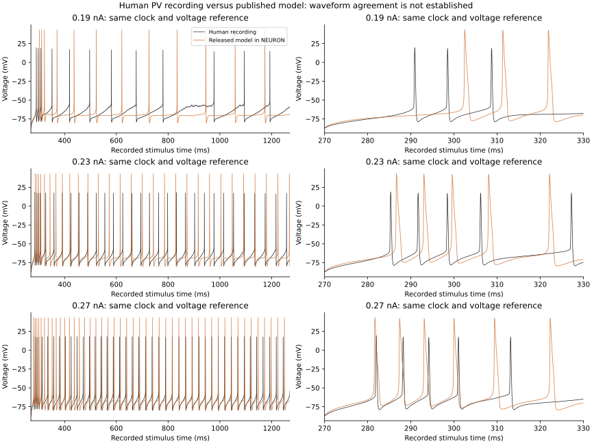

# Published inhibitory cell: direct reference assessment

The original HL5BN1 cell runs in NEURON 9.0.2.
Its source is ModelDB 267587, commit `82cdd91bc93942ba19315371330a2412e064baf5`.
The [source manifest](h01-pv-neuron-reference-sources.json) records paths and hashes.
The source equations and HOC template were not changed.
They remain in the local cache, outside the BrainTrace package.

The template replaces the axon with two 30 µm sections.
It derives their diameters from the source axon.
The first section attaches to the soma at position 1.
This is an inferred axon, not a complete measured axon.
The template sets each remaining section to `1 + 2 * int(L/40)` segments.
The [reference geometry](h01-pv-neuron-019.json) records the resulting sections.

The driver uses the released circuit settings: 34 °C and initial voltage −80 mV.
It applies no background synaptic current.
The current step starts at 270 ms and ends at 1270 ms.
The default time step is 0.025 ms.

| Current (nA) | Human spikes | Model spikes | Direct voltage RMS error (mV) |
| ---: | ---: | ---: | ---: |
| 0.19 | 12 | 12 | 12.14 |
| 0.23 | 31 | 29 | 16.25 |
| 0.27 | 43 | 46 | 19.18 |

The comparison uses the recording clock and recorded voltage values.
It does not shift voltage or align spike peaks.
Each window contains 50,000 human samples at 0.02 ms intervals.
The model trace is interpolated onto those times.
The [comparison output](h01-pv-direct-comparison.json) retains individual spike observations.
The corresponding NPZ files retain the direct residual traces.

Model spike peaks are near 43 mV. Human peaks are near 17 mV.
The difference also affects spike timing and voltage between spikes.
The model does not pass direct waveform validation.
A matching spike count does not remove this failure.

Halving the model time step to 0.0125 ms retains 12 spikes at 0.19 nA.
However, the last spike moves from 1173.75 to 1162.46 ms.
Further numerical refinement is required before a final biological assessment.
See [the finer reference](h01-pv-neuron-019-fine.json).

At 0.003125 ms, the fixed-step response has 13 spikes.
NEURON's adaptive CVode solver also produces 13 spikes.
Absolute tolerances of 1e-8 and 1e-10 give sampled peak times within 0.000292 ms.
The spike peaks remain near 44 mV at these settings.
Thus, the coarse 12-spike match does not establish numerical convergence.
See [the adaptive comparison](h01-pv-neuron-adaptive-comparison.json).

Adaptive samples are not equally spaced in time.
An arithmetic mean of those samples biased the first baseline report.
A regression test reproduced this error with a linear voltage trace.
The driver now integrates voltage over the baseline interval and divides by elapsed time.
All saved baseline reports were recalculated from their unchanged voltage arrays.
Use time weights for future averages from adaptive samples.

This is the released circuit-cell reference, not a rerun of the original optimizer.
The cause of the remaining biological mismatch is not established.
Do not correct it with an arbitrary voltage offset.
The next transfer must preserve geometry, channel equations, and voltage conventions.
It must then separate numerical differences from a need for physiological calibration.

The container is defined by [the Dockerfile](Dockerfile.h01-neuron-reference).
The initial build lacked `make`; the actual mechanism compilation exposed that dependency.
The Dockerfile now installs both `g++` and `make` explicitly.
All eleven channel mechanisms compile without changing their equations.
The [driver](h01_pv_neuron_reference.py) advances NEURON through one `continuerun` call.
The [comparison script](h01_pv_compare.py) reads saved arrays and plots the observations.
