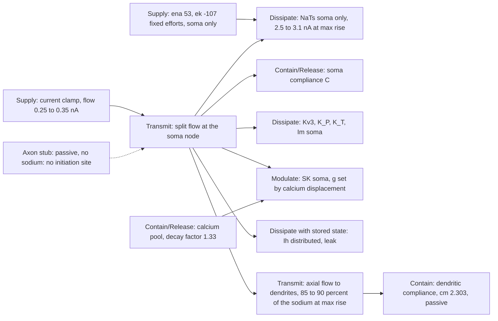

# E cell (Allen 541563728 L2 pyramid on H01 4157825456): energetic map

Same conventions as the [I map](h01-z-map-i.md). Numbers from the E Stage R and
Stage X budgets ([result](h01-e-energetic-result.md), closure 1e-14 pC), sweep 50
(250 pA) with the recorded bias.

## Boundaries: property, paired observation, and what the human shows

| Boundary | Property | Model observation (pair) | Human observation | Usable row it controls |
| --- | --- | --- | --- | --- |
| Current clamp | Flow source | applied current, soma voltage | same | rate at each input |
| Soma compliance and dendritic load | Compliance; the dendrites are a parallel compliance fed through the axial Transmit | at max rise the soma keeps 0.4 to 0.7 nA of 2.5 to 3.1 nA of sodium; doubling dendritic cm lowers the rise 641 → 480 V/s as predicted | rise 351 V/s with a shoulder at −50 to −45 mV | width, rise (not usable rows; diagnosis only) |
| NaTs soma | Resistance gated by V, stored h | supplies the whole upstroke; halving it collapses the spike (peak 17 mV) | threshold −56 mV, two-stage upstroke | width, peak, threshold |
| Axon stub | Transmit only (passive) | no sodium row in the fit; the human's shoulder needs an initiation site here | shoulder present | the whole upstroke family (W3 Stage A) |
| Kv3, K_P, K_T, Im | Resistance gated by V | repolarisation; Kv3 closing 0.9 in the candidate | fall −105 V/s | width, AHP |
| SK soma | Modulate: resistance set by calcium displacement | calcium decay 1.33 in the candidate | cycles 60, 34, 220, 307, 273 ms at 250 pA; 10 spikes at 310 pA | rate, adaptation ratio |
| Ih distributed, leak reversal −4 | Dissipation with a slow stored state | sets the subthreshold return and the supply reaching threshold | late return inside the repeat limit | rate (supply reaching threshold) |

## Usable row → controlling property → lever, with the prediction

Written before the usable-tier scoring (W1) and before any run.

| Usable row | Where the human and model differ | Controlling property | Single lever | Predicted effect |
| --- | --- | --- | --- | --- |
| rate | 6 vs 10 at 310 pA; late cycles 196 to 264 vs 110 to 124 ms: the model's train thins to half the human's rate | the Modulate boundary: SK resistance growing with the calcium displacement, and the supply reaching threshold | `regional_density SK:soma:0.5` (`b-sk-half`); `calcium_decay_factor` 1.0 (`b-ca-decay`); `leak_reversal_shift_mv` −2 (`b-leak-rev`) | SK half: late cycles shorten by a third or more, count 8 to 10 at 310 pA, AHP unchanged within 1 mV; calcium decay 1.0: smaller effect (cycles shorten by 10 to 20 %); leak −2: threshold reached sooner, count +1, AHP 1 mV shallower |
| adaptation ratio | human 60 → 273 (ratio about 4.5); model 40 → 294 (ratio about 7) | same | same | SK half brings the ratio toward 4 |
| width | model 0.9 vs human 1.1 ms above −20 mV (rise too fast) | initiation site and load | W3 Stage A (axonal NaTs) | the second arm lengthens the width toward the human's |
| AHP | −69.3 vs −69.6, inside the limit | Kv3 and the passive return | none needed | unchanged by the Stage B levers within 1 mV |

Order in Stage B: SK half first (largest predicted effect on the usable row),
then calcium decay, then leak reversal; stop at the first arm inside the rate
limit at both sweeps without breaking AHP or width.
