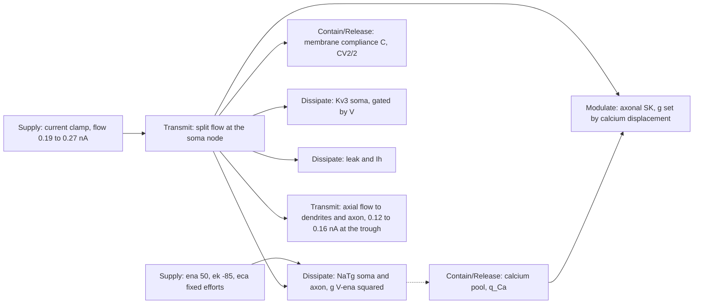

# I cell (PV, HL5BN1 on H01 5584343344): energetic map

Source-to-load form of the energetic framework (`ENERGETIC_FRAMEWORK.md`,
Hartshorne 2020 p206–p214). Domain: electrical. Effort = membrane voltage
(delta to the extracellular ground), flow = membrane current, displacement =
charge, momentum not applicable. The current clamp is a **flow source** (Norton):
it fixes the flow into the soma node and the membrane load determines the
effort. Numbers are the Stage R and Stage X budgets of the energetic search
([result](h01-i-energetic-result.md), closure 1e-15 pC), command current only.

## Boundaries: property, paired observation, and what the human shows

| Boundary | Property | Model observation (pair) | Human observation | Usable row it controls |
| --- | --- | --- | --- | --- |
| Current clamp | Flow source | applied current, soma voltage | same (voltage recorded) | rate at each input (supply level) |
| Membrane compliance C | Compliance (potential storage) | capacitive current C·dV/dt against V: the phase-plane loop | V and dV/dt from the trace | width (time above −20 mV), peak |
| NaTg | Resistance gated by V, with a stored inactivation state h (Contain/Release) | sodium charge per cycle: 0.18 pC through the fall (candidate) vs 3.5 (source) | none direct; the loop shape | width, peak, rise; the human's threshold climb from −61 to −55 mV along the train points at a slow h state the model lacks |
| Kv3 soma | Resistance gated by V (fast open, slow close: activation carried past the spike) | 0.53 pC through the fall; tail below −73 mV sets the trough | trough at −79 mV | AHP depth |
| Axonal SK | Modulate: resistance set by the calcium displacement accumulated cycle to cycle | SK gate z and calcium; 57 and 138 spikes when removed | cycles lengthen 6 → 25 to 120 ms | rate, adaptation ratio |
| Ca_LVA soma | Resistance gated by V; charges the pool | opposes the trough 1 mV per unit; not the burst drive (Stage F) | none | AHP (minor) |
| Leak, Ih | Dissipation; Ih a slow state under hyperpolarisation | leak sets the threshold under bias | rest −87 mV | rate (supply reaching threshold) |
| Axial to dendrites | Transmit (split flow) | 0.16 nA return at the trough discharges the coupled dendrites | none | AHP depth (through the Kv3 tail) |

## Usable row → controlling property → lever, with the prediction

Written before the usable-tier scoring (W1) and before any run.

| Usable row | Where the human and model differ | Controlling property | Single lever | Predicted effect |
| --- | --- | --- | --- | --- |
| rate (count per pulse) | 26 vs 31 at 0.23 nA; the deficit is the early burst (cycles 2 and 3 of 6 to 10 ms missing), not the late train | the post-trough inward drive: a Release of stored energy after the trough that the model lacks; SK sets the late cycles | none somatic (Stage F closed Ca_LVA); an axonal or dendritic sodium boundary, or slower h recovery | no somatic flag moves the early burst; SK scaling moves the late cycles only |
| adaptation ratio (last / first full cycle) | human 6 → 40 ms (ratio about 6); model 18 → 43 ms (ratio about 2.4) | same as rate: the first full cycle is the burst | same | same |
| width (time above −20 mV) | model 0.22 ms against the human 0.27 to 0.30 at every input: 20 percent narrow (the loop's peak, rise and fall are inside the repeat limits; its duration is not) | NaTg inflow ending within the upstroke; C | `sodium_h_tau_factor`, `somatic_kv3_close_factor` | unchanged by any Stage B lever; a width change is a regression signal |
| AHP (cycle minimum) | −79.4 vs −78.9 at 0.23 nA, inside the limit | Kv3 activation carried past the spike, axial return | `somatic_kv3_close_factor` (2.0 is the finalist) | unchanged unless the close factor moves; Ca_LVA lifts it 1 mV per unit |

The I cell's usable-tier failure, if the scoring confirms it, is one property:
the release after the trough. It lives outside the somatic flags, so the I
reserve is held (W5) until the E axonal-initiation stage shows whether an
initiation site outside the soma supplies such a release on this morphology.
