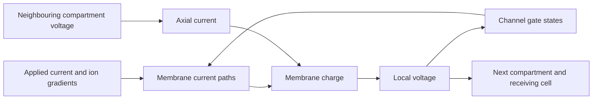
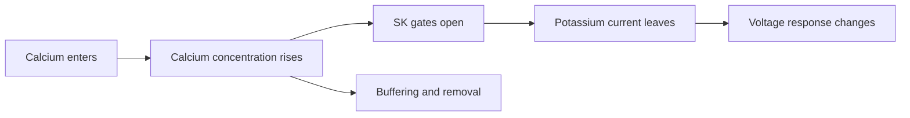

# H01 cell and circuit: causal explanation

This document states physical relationships and supported causal conclusions.
Each conclusion applies only within its stated boundary.
Replace a conclusion when stronger evidence contradicts it.
Experiment methods, settings, scores, and decisions belong in [evidence](evidence/).
The language uses short sentences and defined terms. Formal ASD-STE100 review is pending.

## What the observations represent

H01 supplies reconstructed anatomy and annotations. It does not supply voltage
recordings from the imported cells. Our active models combine anatomy and
physiology from different cells. They do not reproduce the H01 donor's physiology.

The inhibitory reference is a human-fitted putative PV cell. Its channel laws
include borrowed kinetics. Its direct spike waveform is not yet validated.
The excitatory reference uses human pyramidal channel measurements. Its holding
protocol and direct waveform validation remain incomplete.

A direct observation retains location, time, input, and response.
A firing rate or spike count cannot explain a voltage trajectory.
Equal counts can conceal different spike times. Equal peaks can conceal different
rising and falling phases.

## Datum

| Quantity | Reference |
| --- | --- |
| Voltage | Inside minus outside. Retain the source junction correction. |
| Time | The stimulus clock. Retain pulse onset, end, and sample convention. |
| Position | The source cell, component, node, origin, and coordinate scale. |
| Current | State the direction and whether the value is total current or current density. |
| Initial state | Voltage, channel gates, calcium, temperature, and preceding input. |
| Biological identity | Recording identifier, protocol, and source version. |

BrainCell outputs use the end of each step. Geometry and synapse exports use
different coordinate scales. Radius has its own unit. These conversions define
the observed system; they are not free fitting parameters.

The released PV calibration traces already include the junction correction.
Applying it again changes the datum and invalidates the comparison.
The acquisition bias current is separate from the test pulse. Omitting that
current changes the input. Adding it to an already fitted model does not by
itself repair its spike shape. The fitted leak may compensate for omitted bias;
that last explanation remains unconfirmed.

## Charge flow explains voltage change

For a compartment with constant total capacitance:

\[
C\frac{dV}{dt}=I_{applied}+I_{axial}+I_{synapse}+\sum_k I_k.
\]

All currents in this equation are positive into the compartment.
NEURON channel-current exports use the opposite sign. Convert signs explicitly.
Net current changes stored membrane charge. That charge change changes voltage.
Large opposing currents can produce a small voltage change.
Voltage alone therefore cannot identify which current caused the response.

For a channel branch:

\[
I_k=g_k(E_k-V).
\]

Conductance includes membrane area, channel density, and gate state.
The reversal potential represents the ion's electrochemical driving condition.
A channel is not a resistor connected only to electrical ground.
Ion gradients can supply electrical energy. Their maintenance is outside the
present short-duration model when concentrations or reversal potentials are fixed.

For constant capacitance, stored electrical energy is \(CV^2/2\).
At an electrical boundary, voltage difference times signed current gives power.
This product is useful only with the same boundary and sign convention.
Channel dissipation uses the channel driving voltage, not membrane voltage alone:
\(g_k(V-E_k)^2\) for a nonnegative ohmic conductance.
A complete energy budget must also include the ion-gradient reservoirs.

## The nested causal map

Each boundary has an input and a response. The complete circuit path remains
unvalidated. Agreement within one channel does not validate the whole cell.
Agreement in one cell does not validate a connected circuit.

| Boundary | Paired direct observations | Additional state needed |
| --- | --- | --- |
| Membrane | Voltage and signed current | Gates, calcium, capacitance |
| Cable connection | Voltage difference and axial current | Geometry and axial resistivity |
| Channel | Driving voltage and channel current | Conductance and gate state |
| Calcium pool | Calcium entry and concentration change | Effective volume, buffering, removal |
| Synapse | Synaptic current and receiving voltage | Conductance, reversal potential, delay |

A voltage-current pair characterizes a boundary. It does not uniquely determine
all hidden states of a nonlinear neuron. Fixed-voltage observations separate
channel response from voltage feedback. Current-driven observations retain that
feedback. Both are needed to distinguish competing explanations.

## Why the spike rises and falls

Sodium activation permits inward current. Rising voltage can open more sodium
channels, which supplies positive feedback during the rise.
Inactivation reduces sodium availability. Outward potassium current supports
repolarization, the return toward a lower voltage.

In the borrowed PV model, sodium activation remains high during the early fall.
As voltage falls, sodium driving voltage grows. Inward sodium current can therefore
increase while the inactivation gate closes. Kv3 current opposes that current.
These opposing currents contribute to the trajectory, but do not alone explain
the local voltage. Current also flows between connected compartments.

At the observed soma peak, neighbouring soma membrane supplies axial current
to the probe compartment. Its attached dendrites draw current away.
The net axial outflow balances most of the applied and net ionic inflow.
Little current remains to change stored charge, so the local voltage stops rising.
This explains why the peak cannot be understood from sodium and potassium alone.
The [local charge balance](evidence/h01-pv-charge-balance-audit.json) accounts
for these separate paths. It does not establish which topology would reproduce
the human waveform or close a whole-cell energy budget.

Faster sodium inactivation causes a shorter first spike in this model while
preserving spike generation. This effect persists across the two checked meshes.
Accelerating recovery alone does not reproduce that shortening under the same input.
Thus, inactivation timing contributes causally to the excessive duration.
It is not established as the only cause of the waveform error.

The increased firing after faster inactivation also occurs when recovery speed
is unchanged. Faster recovery alone therefore does not explain that increase.
Recovery still affects individual spike times. Its role cannot be dismissed
because the number of spikes stays the same.

The pathway from the shorter spike to later spike times remains unresolved.
Calcium entry and potassium activation are possible links, not established causes.
SK current is not necessary for the observed second-spike delay after faster
sodium inactivation. That delay persists when SK current is removed.
This excludes SK as the sole explanation of that particular timing difference.
It does not exclude SK from later adaptation or establish the alternative path.
The [SK necessity evidence](evidence/h01-pv-sk-necessity-audit.json) applies to
that defined event, not to every feature of the train.
The diagnostic split of inactivation and recovery is not a measured human channel law.

## Why state and structure matter

Initial voltage does not uniquely specify channel availability.
Slow gates retain prior input history after voltages become similar.
Consequently, equal voltage at pulse onset does not ensure an equal response.
A causal account must include conditioning and the relevant internal states.

Somatic active current contributes to excitation of the connected axon.
Unchanged axonal sodium conductance does not guarantee axonal spike generation.
The electrical load and the current supplied by connected membrane also matter.
The present observations do not locate the exact site of spike initiation.

Membrane area grows with cylinder radius times length. Axial conductance grows
with radius squared and falls with length and resistivity.
Radius therefore changes both charge storage and coupling to adjacent membrane.
A fitted channel density cannot establish that the underlying geometry is correct.
Sparse AIS annotations do not define a complete electrical compartment.

The spatial mesh determines how local voltage and channel state are represented.
Those local states feed back into membrane currents. Equal total area does not
ensure equal simulated voltage. Temporal accuracy alone cannot remove spatial error.
Numerical robustness of one causal effect is not full convergence of the model.

## Calcium and delayed potassium current

Calcium entry raises concentration in the model's submembrane pool.
Buffering and removal limit that rise. Calcium activates SK channels.
SK carries potassium. Above the potassium reversal potential, SK current opposes
an increase in voltage. This is a supported local model mechanism.
Its responsibility for a particular later spike is not yet isolated.

## Connection effects depend on the receiving state

A synaptic conductance moves voltage toward its reversal potential.
It also changes the load seen by other current sources.
An inhibitory conductance can suppress excitation without a negative voltage
change. Its direct effect depends on receiving voltage and ongoing input.
An anatomical connection alone does not specify conductance, delay, or its
physiological effect. These circuit mechanisms still require validation here.

## Limits of the energetic description

The source-load and conjugate-variable framework helps locate observation
boundaries and split current paths. In this system, voltage and current form
the electrical pair; chemical potential and molar flow describe ion transport.
Membrane capacitance stores charge. Gate kinetics add internal state and delay.
A delayed voltage-current response does not by itself prove physical inductance.

A fixed linear source-load equivalent can describe a passive subsystem or a
specified local linearization. It cannot replace the full spiking dynamics.
Do not infer a unique topology from one voltage-current trace when several
hidden mechanisms can produce it.

## Evidence and interpretation

[Source and datum evidence](evidence/h01-pv-acquisition-audit.md),
[human pyramidal sources](evidence/h01-active-wilbers-sources.json),
[H01 anatomy](https://h01-release.storage.googleapis.com/landing.html),
[channel-current evidence](evidence/h01-pv-spike-current-audit.json),
[inactivation and recovery evidence](evidence/h01-pv-recovery-causal-test.md),
[spatial robustness](evidence/h01-pv-inactivation-mesh-audit.json), and
[numerical evidence](evidence/h01-pv-numerical-audit.json) support the boundaries above.

RSS calculations rank specified interventions on a fixed observation grid.
They do not prove mediation, identify a unique cause, or supply missing biological
uncertainty. Detailed calculations remain in the evidence files.

A yes/no decision applies to a specified causal claim and its tested conditions.
Keep the continuous direct response that supports the decision.
Distinguish a contradicted prediction, an invalid test, and an unresolved explanation.
Only supported conclusions belong in this account. Unresolved links stay explicit.
