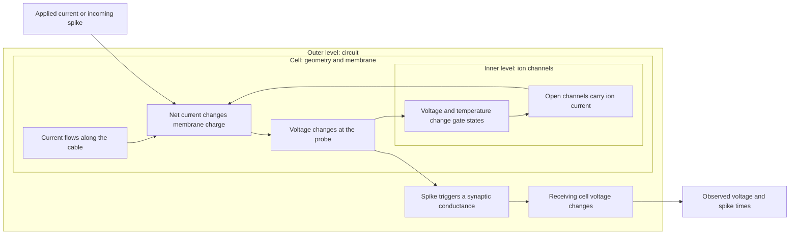

# H01 cell and circuit: causal model

This document states how the model can produce the required response.
It defines the reference points, physical causes, and limits of the evidence.
It is a living explanation. Replace an incorrect claim when evidence changes.
Keep run records and experiment instructions in [the evidence folder](evidence/).

Use short sentences and defined technical terms, as required by ASD-STE100.
This document has not had a formal controlled-language compliance audit.

## Required observable response

Observe membrane voltage at a named cell location over time.
Record the applied current on the same time axis.
Record each spike time and each response after a spike.
For a circuit, also record the synaptic current in the receiving cell.

A peak voltage or mean firing rate cannot establish the required behavior.
Two cells can have the same mean rate and different spike times.
Two spikes can have the same peak and different rising or falling phases.

Keep a biological recording separate from a simulation output.
H01 supplies reconstructed anatomy. It does not supply voltage recordings
from the imported cells. The present model combines anatomy and dynamics
from different human cells. It is not a reproduction of the H01 donor cell.

## Datum and reference conditions

A datum is a fixed reference for a measurement.
Do not change a datum to make a model agree with a target.

| Quantity | Datum and required record |
| --- | --- |
| Voltage | Membrane voltage is inside minus outside, in mV. Record the source voltage correction. Do not shift each trace to its own minimum. |
| Time | Use the stimulus clock. Record every pulse onset and end. BrainCell samples represent the end of each step: `(index + 1) * dt`. |
| Location | Name the cell, source component, and source node. The present soma probe uses node 1345 of H01 cell 810151953, component 0. |
| Position | Retain the source origin. Skeleton coordinates use 32, 32, and 33 nm per unit. Synapse coordinates use 8, 8, and 33 nm per unit. |
| Radius | The source radius is in nm. Do not apply the position scale to it. |
| Current | Positive applied current flows into the cell. Record nA for total current and mS/cm² for conductance density. |
| Initial state | Record voltage and channel gate states. Initial voltage does not establish a stable resting state. |
| Temperature | Record temperature with the channel rates. The present borrowed channel model uses 34 °C. |
| Target identity | Retain the recording identifier, stimulus, sample interval, and source version. Keep each recording separate. |

Wilbers recorded pyramidal cells held at −70 mV, with 3 ms current pulses.
The released model applies a −10 mV channel voltage shift.
That shift reconciles its voltage-clamp and current-clamp conventions.
It is not an extra correction to apply to all human recordings.
See [Wilbers, methods and results](https://research-portal.uu.nl/ws/files/206755646/sciadv.ade3300.pdf)
and the [pinned source files](evidence/h01-active-wilbers-sources.json).

The present H01 simulation starts at −70 mV and then changes under active currents.
It does not yet reproduce the experimental holding-current condition.
Correct this protocol difference before claiming agreement with those recordings.

## Reference evidence

| Reference | What it supports | What it does not support |
| --- | --- | --- |
| [H01 release](https://h01-release.storage.googleapis.com/landing.html) | Source geometry, cell annotations, and released synapse annotations. | Exact channel density, voltage response, or complete wiring of the imported circuit. |
| [Wilbers data, version 3.0](https://doi.org/10.34894/L5J0SD) | Human pyramidal current measurements, channel equations, and AP measurements. | Physiology of the H01 donor cell. |
| [Human AP reference data](evidence/h01-human-40hz-targets.json) | First-spike feature distributions from the released 40 Hz rows. | A measured target voltage trace. These summaries cannot replace raw recordings. |
| [Human putative-PV recordings](evidence/h01-pv-recording-audit.json) | Individual voltage traces and current steps for cell 528687520. | Proof of PV protein expression or physiology of every inhibitory cell. |
| [PV model paper](https://doi.org/10.1093/cercor/bhac348) | A published inhibitory model constrained by human recordings. | Automatic validation of a new BrainCell implementation. |
| [Allen model source audit](evidence/h01-pv-allen-source-audit.json) | A second fitted model for cell 528687520, with source hashes. | Human origin for all channel kinetics. Some mechanisms use mouse measurements. |

The downloaded pyramidal reference contains extracted features.
A raw pyramidal target trace is not yet available in our evidence set.
The inhibitory evidence contains sampled voltage traces.
Use these direct observations when that model is ready for comparison.
Do not calculate a trace error against a population median waveform that was never measured.

The current H01 evidence saves soma voltage.
It does not yet save each channel current or the axial current balance.
Those inner-level observations remain required to test the complete causal path.

## Nested causal structure: the matryoshka method

Start with the required circuit response. Open one level at a time.
Each inner level must explain an observable response at the next level.
Agreement at an inner level does not establish agreement at an outer level.

This diagram shows a proposed causal path. It is not evidence that the
current implementation contains every part of the path.

| Level | Input and internal state | Direct output to inspect |
| --- | --- | --- |
| Circuit | Presynaptic spike, delay, conductance, reversal potential, receiving-cell state. | Synaptic current and receiving-cell voltage versus time. |
| Whole cell | Applied current, channel currents, axial currents, and membrane charge. | Voltage at the soma and other named locations. |
| Cable compartment | Radius, length, membrane area, axial resistivity, and neighboring voltages. | Current between compartments and local voltage. |
| Channel | Voltage, temperature, and the fractions of open or inactive channels. | Gate state and ion current versus time. |
| Numerical method | The same equations, initial state, time step, and spatial mesh. | The change in each observed trace when the numerical resolution changes. |

## Physical explanation

For one compartment, conservation of charge gives:

\[
C\frac{dV}{dt}=I_{applied}+I_{axial}+I_{synapse}+\sum_k I_k.
\]

Here, `C` is total capacitance. Each current is positive into the compartment.
For an ion channel, `I_k = g_k * (E_k - V)`.
`E_k` is its reversal potential. `g_k` includes area, density, and gate state.
Thus, channel count alone does not determine current.
The driving voltage and the open fraction also matter.
See [BrainCell integration](https://brainx.chaobrain.com/braincell/concepts/integration.html).

Sodium current can raise voltage and open more sodium channels.
This feedback can initiate a spike.
Sodium inactivation and potassium current then limit the rise and support the fall.
Gate recovery between pulses affects the next spike.
These causes link channel state to the full voltage trajectory.

A longer or wider cable also changes the electrical load.
For a uniform cylinder, membrane area is proportional to radius times length.
Axial conductance is proportional to radius squared divided by length and resistivity.
Thus, radius errors change both membrane load and current flow along the cable.
A fitted conductance can hide a geometry error. It cannot prove that geometry is correct.

The location of active channels also matters.
An active region near the soma and an active axon can produce different initiation paths.
Sparse AIS labels do not define a complete electrical region.
The present inferred active region excludes the AIS-labelled samples.
Its spike is evidence for that chosen model configuration only.

An excitatory synapse usually moves voltage toward a more positive reversal potential.
An inhibitory conductance can oppose that change or reduce its size by shunting current.
Its effect depends on the receiving voltage and reversal potential.
An inhibitory connection need not produce a negative voltage deflection in every state.
Observe its effect on the receiving trace and spike timing.

## Factor effects and RSS

RSS here means root-sum-square. Residual sum of squares is a different quantity.
Use distinct calculations for target error, factor response, and uncertainty.

For a measured target trace, define the residual at each sample:

\[
r_j=V_{model}(t_j)-V_{recording}(t_j).
\]

Keep the residual trace. A scalar score can conceal a timing error.
Do not align spike peaks when the required behavior includes spike timing.

For a controlled change to factor `x_i`, define its observed response change:

\[
\Delta V_{ij}=V(t_j;x_i+\Delta x_i)-V(t_j;x_i),\qquad
R_i=\sqrt{\sum_j(\Delta V_{ij})^2}.
\]

Use the same sample grid, stimulus, observation window, and unchanged factors.
State the factor change beside `R_i`. A larger change can produce a larger score.
This score ranks the tested interventions. It does not rank biological uncertainty.
For different sample counts, also report `R_i / sqrt(N)`.

For an uncertainty budget, first obtain uncertainty `u_i` for each factor.
Estimate sensitivity `S_ij = dV(t_j)/dx_i` near the operating point.
For independent factors, the propagated uncertainty at each time is:

\[
u_V(t_j)=\sqrt{\sum_i(S_{ij}u_i)^2}.
\]

For correlated factors, use `u_V² = S Σ Sᵀ`, with covariance matrix `Σ`.
Do not add correlated contributions as if they were independent.
Near a spike threshold, small changes can create or remove a spike.
Check the nonlinear response before using a local sensitivity estimate.

The [factor evidence](evidence/h01-causal-factor-effects.json) gives calculated
response changes for the available paired traces.
It records the largest observed effects and their limits.
It does not give a complete uncertainty ranking.
Parameter uncertainties and joint effects are not yet measured.
See the [direct trace plots](evidence/h01-causal-traces.svg) and
[factor interpretation](evidence/h01-causal-factor-effects.md) for the current observations.

The current causal priorities are:

1. Establish a matched stimulus, voltage reference, and initial state.
2. Resolve active-region placement and membrane load.
3. Constrain sodium activation, potassium current, and recovery between spikes.
4. Qualify synaptic conductance, delay, and receiving-cell response.

These priorities follow causal dependencies. They are not claimed RSS ranks.
Keep physical-factor effects separate from numerical error.
A stable solver can solve an incorrect physical model accurately.

## Rules for revising this explanation

Attach each causal claim to a source or direct observation.
State whether the support is biological data, simulation data, or an inference.
Use a controlled change to test the proposed cause.
Check the full response at the next outer level.
If the response contradicts the claim, revise the claim and its limits.
If two causes fit the same trace, retain both explanations until evidence separates them.

Keep current explanations here. Keep dated runs, commands, and failed trials elsewhere.
The [implementation specification](specs/2026-09-04-h01-active-circuit.md)
tracks the remaining work. This document must not become its change log.
