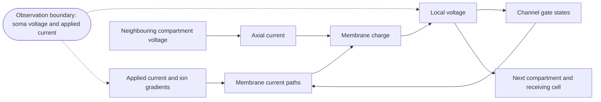
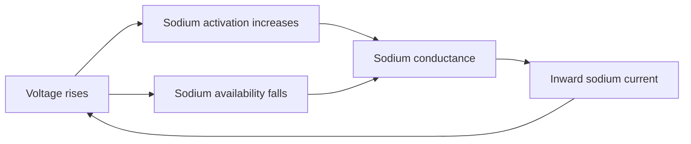
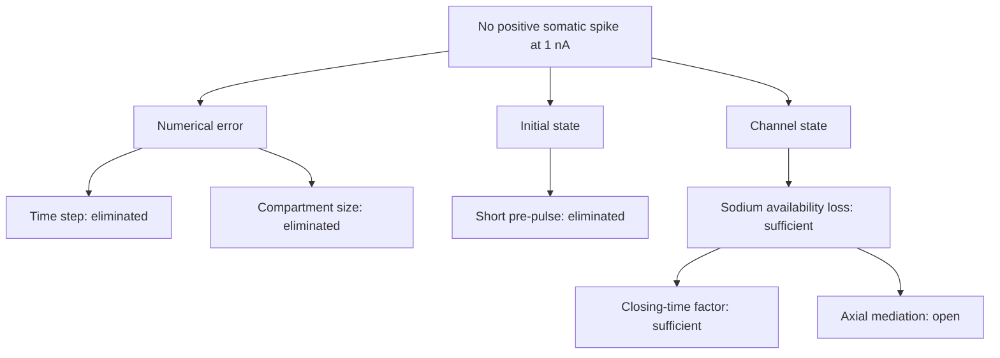
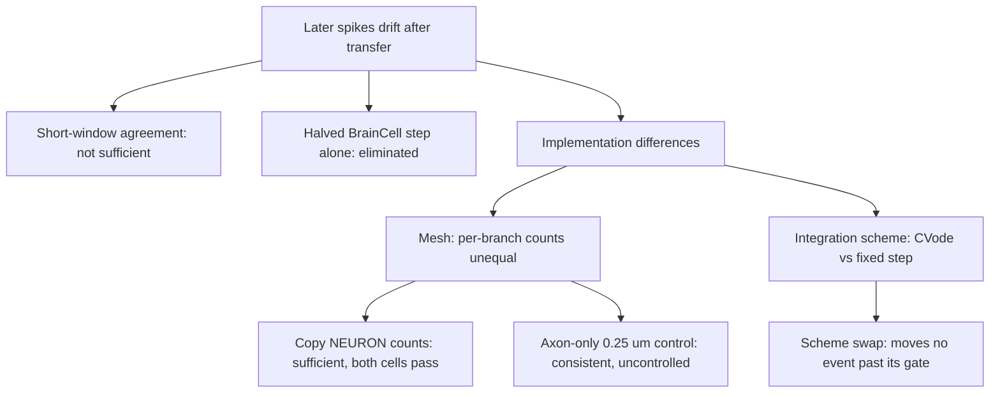
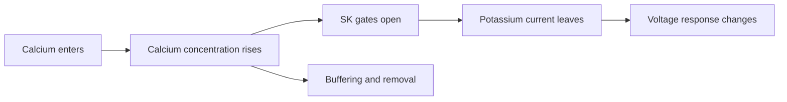
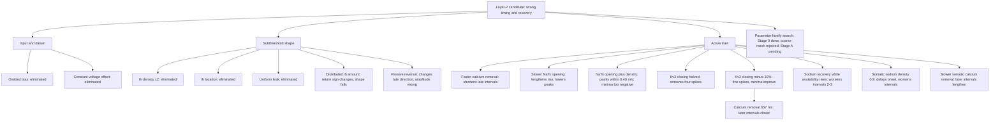
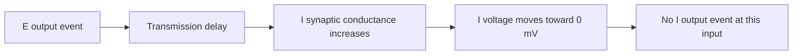
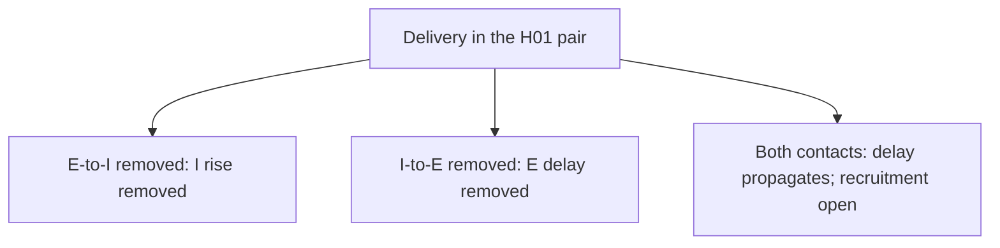
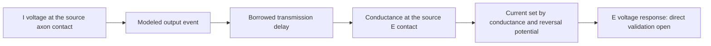

# H01 cell and circuit: causal explanation

This document states the causal explanation for each observed behavior of
the H01 cell and circuit models. A causal explanation names the behavior,
the necessary and sufficient conditions, and the how-why mechanism that
produces it. Each explanation applies only within its stated boundary.
Replace an explanation when stronger evidence contradicts it.

Each behavior has one search tree. The tree records every split that was
run, which branches it eliminated, and which branch remains open. Eliminated
branches are not repeated in the explanation text. Experiment methods,
settings, scores, and decisions belong in [evidence](evidence/).
Numerical qualification of the simulation is reported in its own section,
separate from the physical explanations.
The language uses short sentences and defined terms. Formal ASD-STE100 review is pending.

## What the observations represent

H01 supplies reconstructed anatomy and annotations. It does not supply voltage
recordings from the imported cells. Our active models combine anatomy and
physiology from different cells. They do not reproduce the H01 donor's physiology.

The inhibitory reference is a human-fitted putative PV cell. Its channel laws
include borrowed kinetics. Its direct spike waveform is not yet validated.
The selected excitatory reference uses an Allen human pyramidal cell fit.
Its channel laws include borrowed mechanisms. The Wilbers channel model remains
a separate reference. Direct waveform validation remains incomplete.

H01 labels identify a pyramidal cell and an interneuron for the selected pair.
The interneuron label does not identify a PV subtype. The assigned electrical
regions and PV dynamics remain model assumptions. Neither a cell tag nor a
synapse position supplies a missing partner identity.

The circuit topology sets which cell can supply synaptic current to another
cell. A wrong partner assignment changes that causal path, even when the
channel equations are correct. Proofread-cell IDs and C3 segment IDs are
different identity systems. A measured edge needs a checked mapping from
each synapse endpoint to its cell. The proofreading archive supplies base
segment membership; the synapse export supplies endpoint base IDs. Spatial
checks must also resolve cut or ambiguous segments. These records establish
anatomical support. They do not measure synaptic conductance or delay.

A direct observation retains location, time, input, and response.
A firing rate or spike count cannot explain a voltage trajectory.
Equal counts can conceal different spike times. Equal peaks can conceal different
rising and falling phases. Total spike duration can conceal opposing rising and
falling errors, because it is their sum.

## Datum

| Quantity | Reference |
| --- | --- |
| Voltage | Inside minus outside. Retain the source junction correction. |
| Time | The stimulus clock. Retain pulse onset, end, and sample convention. |
| Position | The source cell, component, node, origin, and coordinate scale. |
| Current | State the direction and whether the value is total current or current density. |
| Initial state | Voltage, channel gates, calcium, temperature, and preceding input. |
| Biological identity | Recording identifier, protocol, and source version. |

BrainCell outputs use the end of each step. Geometry and synapse exports use
different coordinate scales. Radius has its own unit. These conversions define
the observed system; they are not free fitting parameters.

The released PV calibration traces already include the junction correction.
Applying it again changes the datum and invalidates the comparison.
The acquisition bias current is separate from the test pulse. Omitting that
current changes the input. The
[source and datum evidence](evidence/h01-pv-acquisition-audit.md) records
these conventions.

Repeated human threshold trials can have the same measured command and
bias but different spike outcomes. Measured input alone is therefore
insufficient to specify the observed human response at that input. The
[repeated-input evidence](evidence/h01-l2-repeatability200.md) applies at
200 pA; it does not establish uncertainty at the calibration input.

## Physical relations used

For a compartment with constant total capacitance:

\[
C\frac{dV}{dt}=I_{applied}+I_{axial}+I_{synapse}+\sum_k I_k.
\]

All currents in this equation are positive into the compartment.
NEURON channel-current exports use the opposite sign. Convert signs explicitly.
Net current changes stored membrane charge. That charge change changes voltage.
Large opposing currents can produce a small voltage change.
Voltage alone therefore cannot identify which current caused a response.

For a channel branch:

\[
I_k=g_k(E_k-V).
\]

Conductance includes membrane area, channel density, and gate state.
Conductance density times membrane area gives maximum total conductance.
Moving the same density to a different area changes total conductance. Cable
length, radius, and attachment change axial current. Membrane area grows with
radius times length; axial conductance grows with radius squared and falls
with length and resistivity. Matching channel laws therefore does not imply
that two cells have the same soma voltage response.

A channel name does not define its complete law. The Allen persistent sodium
channel has immediate activation and one dynamic inactivation gate. The PV
channel has a dynamic activation gate and uses its third power. These laws give
different currents at the same voltage and gate state. A transfer must retain
the source law, its temperature rule, and its region-specific parameters.

Voltage changes gate states and calcium. These states change current, which
changes the next voltage. A response therefore depends on its preceding state
history. Initial voltage does not specify channel availability; slow gates
retain prior input after voltages become similar. A causal account must
include conditioning and the relevant internal states. In a gate law, the
time constant sets the speed of motion toward the equilibrium gate value and
does not change that equilibrium at fixed voltage.

The reversal potential represents the ion's electrochemical driving condition.
A channel is not a resistor connected only to electrical ground. Ion gradients
supply electrical energy; their maintenance is outside the present
short-duration model when concentrations or reversal potentials are fixed.
For constant capacitance, stored electrical energy is \(CV^2/2\). Channel
dissipation uses the channel driving voltage, \(g_k(V-E_k)^2\), not membrane
voltage alone. A complete energy budget must include the ion-gradient reservoirs.
The source-load framework locates observation boundaries and splits current
paths. A fixed linear source-load equivalent describes a passive subsystem or
a local linearization; it cannot replace the spiking dynamics, and a delayed
voltage-current response does not by itself prove physical inductance.

| Boundary | Paired direct observations | Additional state needed |
| --- | --- | --- |
| Membrane | Voltage and signed current | Gates, calcium, capacitance |
| Cable connection | Voltage difference and axial current | Geometry and axial resistivity |
| Channel | Driving voltage and channel current | Conductance and gate state |
| Calcium pool | Calcium entry and concentration change | Effective volume, buffering, removal |
| Synapse | Synaptic current and receiving voltage | Conductance, reversal potential, delay |

A voltage-current pair characterizes a boundary. It does not uniquely determine
the hidden states of a nonlinear neuron. Fixed-voltage observations separate
channel response from voltage feedback. Current-driven observations retain that
feedback. Both are needed to distinguish competing explanations.

## Y1. The H01 inhibitory cell fires no positive somatic spike at 1 nA

**Behavior.** With the selected H01 I region map and the tested 1 nA pulse,
the soma voltage never becomes positive.

**Explanation.** Inward sodium current requires two conditions: the activation
gate must open and the availability gate must remain open. In this model the
candidate's accelerated inactivation closes availability before the rise
completes, so sodium conductance falls while activation is still high and the
regenerative rise stops. Restoring only the inactivation closing-time factor to
the published source value is sufficient to produce a positive excursion and
recovery on this H01 geometry. Preventing the availability loss in soma alone
or in axon alone is also sufficient; in the axon-only case soma availability
still falls, and the matched local balance shows less current leaving the soma
injection compartment through axial connections than the increased local
membrane loss, so the remaining current continues to charge the membrane.

**Prediction confirmed.** Both regional blocks and the source closing-time
restoration were predicted to persist under refinement, and they do: the
blocks persist at a smaller time step and the restoration persists under joint
time and space refinement.

**Steep X.** The sodium inactivation closing-time factor. Its direct voltage
response is much larger than the pre-pulse change, and numerical changes are
smaller still.

**Action.** The source closing-time value is the lever that restores a
positive response in the diagnostic circuit. Time step, compartment size, and
pre-pulse period are not levers for this behavior. This explanation does not
establish a valid human spike, does not justify removing inactivation from the
default model, and does not identify a generally correct closing rate. The
electrical region map remains unqualified.

| Node | Split | Result | Evidence |
| --- | --- | --- | --- |
| N1 | Smaller time steps over the tested range | No positive spike; eliminated | [spike-time audit](evidence/h01-i-defaults-spike-time-audit.json) |
| N2 | Smaller compartments at the fine step | No positive spike; eliminated over the tested range | [spike-space audit](evidence/h01-i-defaults-spike-space-audit.json) |
| S1 | Longer pre-pulse period | Starting voltage changes; no positive spike; eliminated | [pre-pulse audit](evidence/h01-i-prepulse-audit.json) |
| C1 | Block availability loss in soma, axon, or both | Positive excursion in each case; persists at smaller step | [regional audit](evidence/h01-i-inactivation-regions-audit.json) |
| C2 | Restore source closing-time factor only | Positive excursion and recovery; persists under joint refinement | [source-value audit](evidence/h01-i-source-closing-refinement-audit.json) |
| C3 | Matched current balance, axon-only case | Reduced axial outflow explains the local rise; upstream segment not identified | [current balance audit](evidence/h01-i-regional-current-balance-audit.json) |
| rank | Direct response size of each intervention | Inactivation > pre-pulse >> numerical | [factor evidence](evidence/h01-i-factor-response-rss.md) |

## Y2. The transferred PV donor model does not retain its full response

**Behavior.** The frozen inhibitory donor model in BrainCell reproduces the
early spike peaks and widths of its source, but its later rise crossings drift
from event 7 onward (1.2 ms at event 8 over 270-329.5 ms at 0.27 nA). This
behavior concerns transfer on donor anatomy; it is separate from Y1.

**Explanation.** The drift is a spatial discretization difference, not a
simulator difference. The earlier comparisons matched the two meshes only by
mean segment length, so several dendritic branches held fewer BrainCell
compartments than NEURON segments. Copying the NEURON per-branch counts into
BrainCell is sufficient to remove the drift: with equal counts and the same
fixed step, the two simulators agree at every one of the eight events to below
1e-8 ms, and with equal counts against NEURON CVode the largest rise error is
0.044 ms, inside the 0.1 ms gate. Changing the NEURON integration from CVode
to a fixed step at the BrainCell dt moves no event by more than its gate, so
the integration scheme and the gate time level are not measurable contributors
at this dt.

**Prediction confirmed.** Stated before running: if mesh is the dominant
element, both matched-mesh cells pass and both MaxCVLen cells fail on rise
only. That pattern occurred. Halving dt in each simulator at the matched mesh
moved event 8 by 0.002 ms, so the gate is a valid decision limit.

**Steep X.** The per-branch compartment count.

**Action.** Every BrainCell-versus-NEURON comparison must copy the NEURON
per-branch counts (`--mesh-from`) rather than choose a maximum compartment
length. The earlier drift evidence and the axon-only 0.25 um control were read
through unequal meshes. This result qualifies the transfer for the first eight
events at this input and dt only; it does not identify a channel cause, does
not validate the human waveform, and does not cover the full 1270 ms train or
other inputs.

| Node | Split | Result | Evidence |
| --- | --- | --- | --- |
| W | Full-response comparison against the source | Early spikes agree; later events and counts differ | [full-response comparison](evidence/h01-pv-candidate-transfer-full.md) |
| T | Halve the BrainCell time step, physical parameters unchanged | First failed crossing remains outside the timing limit | [paired comparison](evidence/h01-pv-candidate-transfer-drift-halfdt-audit.json) |
| A0 | Refine only the BrainCell axon to 0.25 um | All gates pass 8/8; not a controlled swap | [axon-only control](evidence/h01-i-axon025-transfer-audit.json) |
| A1, B1 | 2x2 half-split: mesh x integration, everything else held equal | Decision "mesh": matched cells pass, MaxCVLen cells fail on rise; scheme swap within gate | [isolation split](evidence/h01-pv-transfer-isolation.md), [audit](evidence/h01-pv-transfer-isolation-audit.json) |

## Y3. The PV candidate's spike train differs from the human recording

**Behavior.** Against the human recording, the candidate's first spike lasts
too long, its post-spike minimum is too shallow and too late, its approach to
the first spike is too slow at low input, and at high input it does not
sustain late firing.

**Explanation.** Four partial mechanisms are supported; no single sufficient
condition reproduces the whole train.

1. *First-spike duration.* Faster sodium inactivation shortens the first spike
   while preserving spike generation, so inactivation timing contributes
   causally to the excessive duration. During the early fall, sodium
   activation remains high and the driving voltage grows, so inward sodium
   current can increase while the inactivation gate closes; Kv3 current
   opposes it.
2. *Peak.* At the observed soma peak, neighbouring soma membrane supplies
   axial current to the probe compartment and the attached dendrites draw
   current away. Net axial outflow balances most of the applied and net ionic
   inflow, so little current remains to change stored charge and the local
   voltage stops rising. The peak cannot be understood from sodium and
   potassium alone.
3. *Return and minimum.* Reducing somatic Ca_LVA conductance, increasing
   somatic Kv3 conductance, and faster Kv3 gating each advance the voltage
   return. Faster opening and faster closing have opposite effects on the
   falling crossing and the minimum, so the two phases are not
   interchangeable. Total duration can hide these opposing phase errors.
4. *Late firing.* Stronger axonal SK conductance is sufficient to reproduce the
   added first-spike delay seen when SK increases in both regions; the
   soma-only change is not. Calcium removal acts on concentration above rest,
   so slower removal alters later intervals while leaving first onset nearly
   unchanged; this separates a memory of prior activity from an immediate
   conductance change. A steeper inactivation curve restores late firing at
   high input; the raw slope parameter changes both equilibrium availability
   and gate speed, so the rescue is not attributed to either alone.

**Prediction confirmed.** The first-spike shortening from faster inactivation
persists across the two checked meshes. The high-input absence of late spikes
persists on the finer mesh. The slope rescue persists on the finer mesh, with
the first-return mismatch. On fine axonal meshes, the final-onset shift follows
the predicted squared-compartment-length dependence within the declared limit.

**Steep X.** Not separated across the whole train. Sodium inactivation timing
dominates first-spike duration. Early and late timing require separate
constraints; total spike count cannot establish the adaptation history.

**Action.** Calibration must constrain the post-spike minimum voltage and its
time from the peak, and the rising and falling phases separately. Interventions
that only change one of peak, minimum, or interval are not independent
controls: added somatic sodium advances onset and raises the peak; a Kv3
conductance increase also delays onset and narrows the spike; faster recovery
alone and slower recovery alone both fail to restore high-input late firing;
SK is not necessary for the second-spike delay after faster inactivation.
Somatic SK observations alone cannot explain the onset effect. None of the
tested candidates is a human waveform fit. Every Y3 result was obtained in
NEURON; the Y2 split shows that a BrainCell reading of these results requires
the copied per-branch mesh.

```mermaid
flowchart TD
    Y3[PV train differs from human] --> D[First-spike duration]
    Y3 --> P[Peak and onset]
    Y3 --> R[Return and minimum]
    Y3 --> L[Late firing and adaptation]
    D --> D1[Faster inactivation: shortens; contributes]
    D --> D2[Faster recovery alone: does not shorten]
    P --> P1[Axial outflow sets the peak]
    P --> P2[Somatic sodium density: not an independent onset control]
    P --> P3[Applied current alone does not set the local slope]
    R --> R1[Ca_LVA reduction: advances return]
    R --> R2[Kv3 conductance: advances return, shifts onset]
    R --> R3[Kv3 gating speed: opening and closing oppose]
    R --> R4[Minimum depth and delay: located, cause open]
    L --> L1[SK necessity for second-spike delay: eliminated]
    L --> L2[Axonal SK: sufficient for onset delay]
    L --> L3[Calcium removal and entry: change late intervals, not early]
    L --> L4[Recovery speed either direction: not sufficient]
    L --> L5[Steeper inactivation curve: restores high-input firing]
    L --> L6[Late-interval mesh sensitivity: axonal discretization]
```

| Node | Split | Result | Evidence |
| --- | --- | --- | --- |
| D1, D2 | Faster inactivation; faster recovery alone | Shorter first spike; recovery alone does not shorten; increased firing also without recovery change | [inactivation and recovery test](evidence/h01-pv-recovery-causal-test.md), [spatial robustness](evidence/h01-pv-inactivation-mesh-audit.json) |
| P1 | Local charge balance at the peak | Net axial outflow balances inflow | [charge balance](evidence/h01-pv-charge-balance-audit.json), [channel currents](evidence/h01-pv-spike-current-audit.json) |
| P2 | Somatic vs axon-only sodium increase | Somatic advances onset and raises peak; axon-only does not | [regional sodium](evidence/h01-pv-onset-sodium.md) |
| P3 | Independent local balance during the approach | Slower low-input approach consistent with axial and membrane flows | [onset balance](evidence/h01-pv-onset-balance.md) |
| R1 | Reduce somatic Ca_LVA | Deeper, later minimum; reaches falling levels earlier relative to peak; still lags human | [conductance split](evidence/h01-pv-calva-return.md), [falling crossings](evidence/h01-pv-return-crossings.md) |
| R2 | Increase somatic Kv3 conductance | Advances return, deepens minimum, delays onset, narrows spike | [Kv3 split](evidence/h01-pv-kv3-return.md) |
| R3 | Faster Kv3 gating; opening vs closing | Smaller onset shift; opening and closing give opposite return effects; exact equivalence rejected | [timing split](evidence/h01-pv-kv3-fast.md), [phase comparison](evidence/h01-pv-kv3-phases.md) |
| R4 | Direct minima against the recording | Minimum too shallow and too late; cause not isolated | [direct minima](evidence/h01-pv-postspike-minima.md) |
| L1 | Remove SK after faster inactivation | Second-spike delay persists | [SK necessity](evidence/h01-pv-sk-necessity-audit.json) |
| L2 | Axonal vs somatic SK increase | Axonal sufficient for first-spike delay; somatic not | [regional SK](evidence/h01-pv-sk-region-audit.json) |
| L3 | Calcium removal, entry scaling, and their combination | Late intervals change with little first-onset change; entry scaling overshoots and is rejected; early and late timing need separate constraints | [calcium removal](evidence/h01-pv-calcium-candidate-audit.json), [adaptation comparison](evidence/h01-pv-opening-adaptation.md), [entry scaling](evidence/h01-pv-calcium-entry.md), [burst comparison](evidence/h01-pv-burst-adaptation.md), [response-time comparison](evidence/h01-pv-calcium-response.md) |
| L4 | Faster recovery; slower recovery | Neither restores high-input late firing; recovery speed does not test equilibrium sodium | [recovery split](evidence/h01-pv-recovery-rescue.md), [opposite direction](evidence/h01-pv-recovery-slow.md), [gate account](evidence/h01-pv-gate-equilibrium.md) |
| L5 | Steeper inactivation curve | Restores high-input late firing; first return still too slow and too shallow | [slope intervention](evidence/h01-pv-slope5.md) |
| L6 | Refine axon, soma, or dendrites alone | Only axonal refinement reproduces the late-interval change | [regional mesh](evidence/h01-pv-regional-mesh.md) |

## Y4. The layer-2 excitatory candidate fires with wrong timing and recovery

**Behavior.** Under the recorded 110 pA input (sweep 43) the candidate does not fire and
its voltage shows excess depolarization and the wrong post-pulse return. Under
the active input it fires the recorded five spikes, but every interval is too
long, recovery minima are too negative, each rise from -20 mV to the peak is
too short, and four returns to -20 mV are too long.

**Explanation.** No sufficient condition has been established for the combined
response. Supported conditional effects: sodium amount and opening speed have
distinct effects, and together they restore all five peaks to within 0.40 mV
while retaining part of the rising-phase improvement; Kv3 closing time
determines whether recovery completes, since halving it leaves the first onset
and peak nearly unchanged and removes the four later spikes, whereas reducing
it by 10% retains five spikes and reduces every minimum error; calcium removal
time changes later intervals while leaving the first interval and minima nearly
unchanged. Baseline and response deflection must be tracked separately, and
location and amount of a conductance must remain separate factors.

At the tested coarse mesh, the source gives seven spikes. Changing sodium
opening and somatic density together gives six; the full candidate gives
five. Those sodium changes alone are therefore insufficient for the
candidate count under this input. The remaining candidate changes act as a
group in this comparison. Their individual roles and interactions are not
isolated by these three responses. The source's seven events and the
sodium-only model's six events persist on both tested meshes. The sodium-only
count error is therefore not removed by this refinement. Full preservation
of the three-model comparison remains open.
See the [complete event records](evidence/h01-l2-campaign/coarse-active-three-controls.json)
and [sodium-only mesh comparison](evidence/h01-l2-campaign/corner-active-mesh-comparison.json).

**Prediction confirmed.** The subthreshold error directions persist under
tighter tolerance and spatial refinement, so they are model errors, not solver
errors. The density candidate's peaks and phases persist within declared limits
under both refinements. The predicted rising-phase effect of slower NaTs
opening is observed.

The candidate sodium-opening change is neither necessary nor sufficient
for five spikes in the tested active input. Adding it alone to the source
gives six spikes; removing it from the full candidate retains five. It does
change individual spike times. Count and timing therefore impose distinct
constraints; retaining the count does not show that the gate has no effect.
See the [forward intervention](evidence/h01-l2-campaign-fine/f1-into-source-two-inputs.json)
and [reverse intervention](evidence/h01-l2-campaign-fine/f1-out-of-candidate-active-partial.json).

**Steep X.** Not separated. The eliminated levers are listed in the tree; the
open levers are the parameter families not yet split. The bounded family
campaign is specified and its Stage 0 is complete: the coarse mesh (nseg 3)
does not preserve decisions on five phase measurements, so the family search
runs at the fine mesh. The [acceptance table](evidence/h01-l2-acceptance-table.md)
fixes every required observation; no allowance is agreed, so the campaign
issues no pass.

**Action.** Omitted bias, a constant voltage offset, solver tolerance, mesh,
somatic Ih density, Ih location, uniform leak, and passive reversal are not
sufficient levers for this behavior; each was tested and each leaves the
adaptation or the return wrong. A close late voltage, a correct event count,
or accurate peaks does not establish the correct dynamic response. Recovery
timing and later firing must be constrained together with the minima; a closer
minimum does not ensure a closer next spike. Stop single-parameter tuning
launches; a bounded simultaneous fit across all calibration inputs is the
required next campaign (see the
[validation reassessment](specs/2026-09-05-h01-validation-reassessment.md)).

| Node | Split | Result | Evidence |
| --- | --- | --- | --- |
| B1 | Add the recorded negative bias | Delays first spike; extra events remain; initial offset nearly removed in sweep 43 (110 pA) but adaptation and return still wrong | [bias split, active](evidence/h01-l2-recorded-bias-result.md), [bias split, subthreshold](evidence/h01-l2-sweep43-bias-result.md) |
| B2 | Subtract the starting voltage | Excess depolarization and wrong return remain | [subthreshold comparison](evidence/h01-l2-midpoint-sweep43-comparison.md) |
| Q1 | Double somatic Ih density | Adaptation and below-baseline return not restored | [Ih split](evidence/h01-l2-sweep43-ih-result.md) |
| Q2 | Move Ih to uniform soma and dendrite, same total | Shape not restored | [location split](evidence/h01-l2-ih-location-result.md) |
| Q3 | Increase regional passive leak together | Late depolarization reduced; adaptation not restored; two spikes where reference has five | [leak split](evidence/h01-l2-sweep43-leak-result.md), [active check](evidence/h01-l2-leak-active-result.md) |
| Q4 | Larger distributed Ih amount | Return slightly below start; start shifts up; adaptation wrong | [amount split](evidence/h01-l2-distributed-ih75-result.md) |
| Q5 | More negative passive reversal with Q4 fixed | Late response rising to falling; five spikes under active input; every interval too long | [passive-reversal split](evidence/h01-l2-leak-reversal-result.md), [active response](evidence/h01-l2-reversal-active-result.md), [separate phases](evidence/h01-l2-reversal-spike-phases.md) |
| A1 | Faster calcium removal in the Q5 setting | Later intervals shorten; one overshoots; minima unchanged | [removal split](evidence/h01-l2-reversal-calcium125-result.md) |
| A2 | Slower NaTs opening | Rise lengthens; peaks too low; three minima too shallow | [opening split](evidence/h01-l2-sodium-opening-result.md) |
| A3 | Slower opening plus more NaTs conductance | All five peaks within 0.40 mV; minima too negative; later spikes late; subthreshold directions preserved | [density split](evidence/h01-l2-sodium-opening-density130-result.md), [subthreshold response](evidence/h01-l2-density130-subthreshold-result.md) |
| A4 | Halve Kv3 closing time | One spike; sustained depolarized response | [closing split](evidence/h01-l2-kv3-closing-half-result.md) |
| A5 | Reduce Kv3 closing time by 10% | Five spikes; three minima within 0.19 mV; second minimum too negative; first interval too short | [smaller split](evidence/h01-l2-kv3-closing-ninety-result.md) |
| A6 | Removal time 679.277 to 657.046 ms on A5 | Each later interval shorter and closer; first interval changes 0.013 ms; second interval still too long | [calcium split](evidence/h01-l2-kv3-ninety-ca133-result.md) |
| A7 | Slow sodium recovery only while availability rises | First interval lengthens; next two interval errors worsen | [layer-2 sodium split](evidence/h01-l2-sodium-recovery-result.md) |
| A8 | Somatic sodium density 0.9 | First spike delayed and lower; narrower; first three interval errors worsen | [density split](evidence/h01-l2-sodium-density090-result.md) |
| A9 | Slower somatic calcium removal | Later intervals lengthen; first peak and minimum unchanged; first interval still too short | [layer-2 removal split](evidence/h01-l2-calcium-removal-result.md) |
| FAM | Search Dissection over five families, cap 24 | Stage 0: coarse mesh changes five phase measurements by more than one fifth of the smallest contrast; rejected as a search setting | [campaign spec](specs/2026-09-05-h01-l2-family-campaign.md), [Stage 0 preservation](evidence/h01-l2-campaign/stage0-active-preservation.json), [manifest](evidence/h01-l2-campaign-manifest.json) |

## Y5. Synaptic delivery in the illustrative H01 pair

**Behavior.** In the prior illustrative pair (`810151953`, `678539249`), an E output event is followed by a
delayed conductance increase and a voltage rise in I, and I does not fire. With
the I model using the source closing-time restoration, an I event is followed
by an earlier fall and a later spike in E.

**Explanation.** The E-to-I projection is necessary and sufficient for the
initial I voltage rise: removing only that projection removes the conductance,
and the I voltage is unchanged before delivery and rises when conductance
arrives. The I-to-E projection is necessary and sufficient for the E delay:
removing only that projection preserves the I response and the E voltage
before arrival. A synaptic conductance moves voltage toward its reversal
potential and changes the load seen by other current sources, so an inhibitory
conductance can delay excitation without a negative voltage change. With both
contacts enabled, the delayed E event delays the arrival of excitation at I, so
an inhibitory timing change propagates through the next connection.

**Prediction confirmed.** The E delay persists at both tested time steps.

**Steep X.** Not applicable; each projection was tested by removal.

**Action.** Delivery alone does not establish a firing response or inhibitory
feedback. Both cells receive external input in the four-way check, and I fires
before E input arrives, so the circuit does not show that E recruits I or that
activity sustains itself. The contacts are inferred; these conclusions apply to
the diagnostic model, not to a measured connection in the donor, and full
numerical and human qualification remain open.

| Node | Split | Result | Evidence |
| --- | --- | --- | --- |
| E1 | Remove only the E-to-I projection | Conductance and voltage rise removed; no I event either way | [E delivery audit](evidence/h01-ei-circuit-e-delivery-audit.json) |
| I1 | Remove only the I-to-E projection | E fires earlier without inhibition; delay persists at both steps | [I delivery audit](evidence/h01-i-restored-circuit-delivery-audit.json) |
| F1 | Both contacts, both cells driven | Delayed E event delays excitation at I; I fires before E input arrives | [four-control audit](evidence/h01-i-restored-four-control-audit.json) |

The measured default uses a different pair: I `5584343344` to E `4157825456`.
Its source endpoint identities and cable placements are checked. Those checks
establish the anatomical path, not its physiological response. The delivery
results above must not be transferred to this pair without a direct test.
The synthetic wiring fixture confirms the same implementation rule: with E
above the inhibitory reversal potential, a delivered conductance lowers E
voltage; removing only the edge removes that effect. Real-cell firing,
propagation to the axon contact, and full numerical qualification remain open.

## Measurement function qualification

The simulation is the measurement function. Its numerical error must be small
against the human error it must resolve before a physical split can be read.
The checks below support that discrimination for the named observations only.
They do not prove convergence at every time or input, and a small numerical
change never identifies a channel cause.

Current samples must use the same time level. The staggered solver advances
voltage before it updates channel gates; a current computed from the updated
gates is not the current law used for that voltage step, and mixing the samples
leaves a residual without a failure of the discrete charge balance.

| Candidate and observation | Check | Result | Evidence |
| --- | --- | --- | --- |
| H01 I, voltage-step balance | Matching time levels | Balance closes within its stated limit; bookkeeping only | [balance](evidence/h01-i-current-balance-discrete.json) |
| PV candidate, selected observations | Time step and mesh | Refinement differences recorded | [numerical audit](evidence/h01-pv-numerical-audit.json) |
| PV, first-spike shortening | Two meshes | Effect persists | [spatial robustness](evidence/h01-pv-inactivation-mesh-audit.json) |
| PV, high-input late-spike absence | Finer mesh | Absence persists; full voltage still changes | [failure mesh](evidence/h01-pv-failure-mesh.md) |
| PV, slope rescue | Finer mesh | Rescue and first-return mismatch persist; later times and count change | [candidate spatial check](evidence/h01-pv-slope5-mesh.md) |
| PV, late intervals | Tighter CVode tolerance at fixed mesh | Onsets much closer than under spatial refinement; count preserved | [regional mesh](evidence/h01-pv-regional-mesh.md) |
| PV, final onset | Fine axonal meshes | Shift follows squared compartment length within the limit; event sequence within successive-mesh limits | [fine-mesh qualification](evidence/h01-pv-axon2187-qualification.md) |
| L2 control, 43 pA samples | Tolerance tightened by ten | Error directions persist | [tolerance check](evidence/h01-l2-subthreshold-tolerance-comparison.md) |
| L2 control, 43 pA samples | Successive spatial refinement | Error directions persist with small changes | [spatial refinement](evidence/h01-l2-subthreshold-spatial-comparison.md) |
| L2 reversal candidate, 43 pA | Tighter tolerance; spatial refinement | Directions persist | [tolerance](evidence/h01-l2-reversal-tolerance-result.md), [spatial](evidence/h01-l2-reversal-spatial-result.md) |
| L2 reversal candidate, spike phases | Spatial refinement; tighter tolerance | Error signs persist with small phase changes | [spatial](evidence/h01-l2-reversal-active-spatial-result.md), [tolerance](evidence/h01-l2-reversal-active-tolerance-result.md) |
| L2 slower-opening candidate, phases | Tighter tolerance | Each phase changes below 0.000422 ms | [tolerance check](evidence/h01-l2-sodium-opening-tolerance-result.md) |
| L2 control, minima | Tighter tolerance; two meshes | Below 0.000002658 mV and 0.001330 mV; human errors much larger | [minimum review](evidence/h01-l2-density130-minima-numerical-review.md) |
| L2 density candidate, spikes | Tighter tolerance | Each phase below 0.000417 ms; rising-phase human errors above 0.12 ms persist | [tolerance check](evidence/h01-l2-density130-tolerance-result.md) |
| L2 density candidate, spikes | Segments threefold | Onset changes at most 0.0357 ms; each phase below 0.000347 ms | [spatial comparison](evidence/h01-l2-density130-spatial-result.md) |
| L2 Kv3 half candidate, post-spike voltages | Tighter tolerance | One-spike outcome persists; below 0.000000830 mV | [tolerance comparison](evidence/h01-l2-kv3-half-tolerance-result.md) |
| L2 Kv3 ninety candidate, minima | Tighter tolerance | Spike limits pass; each minimum below 0.000001881 mV | [tolerance comparison](evidence/h01-l2-kv3-ninety-tolerance-result.md) |
| L2 sodium-recovery candidate | Independent solver; successive spatial refinement | Direct events pass at this input | [layer-2 sodium split](evidence/h01-l2-sodium-recovery-result.md) |
| PV transfer, matched mesh, events 1-8 | Halve dt in NEURON and in BrainCell | Event 8 moves 0.002 ms in each; all gates pass | [isolation split](evidence/h01-pv-transfer-isolation.md) |
| PV transfer, matched mesh | NEURON CVode 1e-10 vs fixed dt 0.000625 | Largest rise change 0.044 ms; gates pass | [isolation audit](evidence/h01-pv-transfer-isolation-audit.json) |
| L2 campaign controls | nseg 3 vs nseg 9 at CVode 1e-10, active input | Five phase changes exceed one fifth of the smallest source-candidate-corner contrast; coarse setting rejected | [Stage 0 preservation](evidence/h01-l2-campaign/stage0-active-preservation.json) |

The response-size ranking in the [factor evidence](evidence/h01-i-factor-response-rss.md)
compares specified interventions on a fixed observation grid. It selects the
next diagnostic boundary. It does not prove mediation or supply missing
biological uncertainty.

## Unresolved

- Y1: which upstream axonal segment reduces the outflow in the axon-only case;
  whether the electrical region map is correct.
- Y2: transfer of the full 1270 ms train and the other inputs at the copied
  mesh; whether equal counts also equal compartment placement on every branch.
- Y3: the pathway from the shorter first spike to later spike times; the
  channel cause of the shallow, late minimum; the spike initiation site; a
  human recovery constant; the Kv3 candidate's spatial sensitivity; the
  full-cell energy budget; the topology that reproduces the human waveform.
- Y4: the channel source of the interval errors; the transition to the
  sustained depolarized response between the two Kv3 closing changes; the
  separate contributions of entry and removal, and of each current path,
  after any coupled intervention; the human cell's densities.
- Y5: numerical robustness, reciprocal behavior, and qualified cell models.

## Evidence index

Sources: [source and datum evidence](evidence/h01-pv-acquisition-audit.md),
[human pyramidal sources](evidence/h01-active-wilbers-sources.json),
[H01 anatomy](https://h01-release.storage.googleapis.com/landing.html).
The per-behavior tables above index the remaining records.

A yes/no decision applies to a specified causal claim and its tested conditions.
Keep the continuous direct response that supports the decision.
Distinguish a contradicted prediction, an invalid test, and an unresolved explanation.
Only supported conclusions belong in the explanations. Unresolved links stay explicit.
