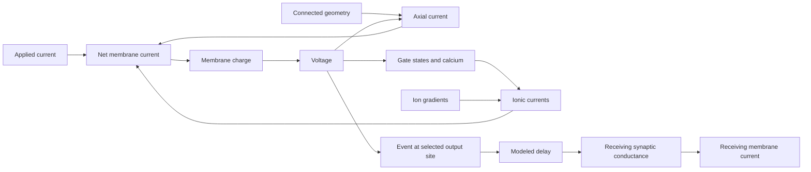

# H01 cell and circuit: causal model

Explanation review: 2026-09-11, against saved evidence at `56240d4` on
`campaign/h01-currents-2026-09-11` in the main checkout.
The initial review included SP10, the SP11 erratum in `16c4f85`, and SP12
registration with manifest concurrency 2. The subsequent SP12 stage-0 results
are incorporated below; both tested KsAHP doses failed the complete gate.
The earlier implementation review covered `41eb735` and diagram records through
`da552a7`; this update does not repeat a full implementation audit. The direct
observation analysis was rerun on Vast using the saved B3 and SP12 traces.

The model combines H01 anatomy with electrical properties from other cells.
It predicts a response under specified inputs and initial states.
It does not establish the physiology of the H01 donor.

[Open the H01 EFAST diagram](h01-efast.svg).

## Explanations established, and explanations still missing

The question is how the specified system produces the observed response, including
the differences between locations, spike phases, cycles, and inputs.
Hartshorne defines a causal explanation through the necessary and sufficient
conditions and the mechanism producing a particular effect
([printed p. 21](<C:/Users/J/Documents/Diagnosing Performance and Reliability/pages/p013.jpg>)).
An intervention can establish one causal contribution under fixed conditions
without supplying a complete explanation of a human-model difference.

| Observed response | Causal account and present boundary |
| --- | --- |
| Historical H01 I candidate does not cross positive soma voltage | Accelerated sodium inactivation cuts off regenerative inward current. Restoring the source closing time restores a positive excursion and recovery. This explains a tested model failure, not human physiology. See Y1. |
| Donor response changes between implementations | Mesh mismatch and fixed-step integration error account for different, separately tested transfer discrepancies. The two-input numerical requirement remains unmet. See Y2. |
| PV finalist's recovery interval grows along a train | Calcium-dependent axonal SK supplies an outward path; removing it alone preferentially shortens late recovery while early waveform bands hold. This isolates a contributor to model adaptation, not the complete cause of human timing errors. See Y3. |
| B3 keeps firing after the human stops at low input | The retained traces show a post-spike response contrast. A slow outward conductance is a registered explanation to test; neither a missing human channel nor the sufficient repair has been established. See Y4. |
| Historical component develops invalid calcium | Its frozen-current update produces negative calcium, making the next Nernst evaluation invalid. An implicit update repairs that route, but does not repair extreme voltage or qualify anatomy. See Y5. |
| Population runtime, functional inhibition, and additional donor mismatches | Construction, delivery, or count discrepancies alone do not explain these outcomes. The required response or isolating evidence remains missing. See Y5 and Y6. |

For each account below, **conditions** define the tested boundary; **mechanism**
connects states and currents to behavior; **test** names the discriminating evidence;
and **limit** states what the account does not explain. The full tested configuration
is the background for any sufficiency claim. No finite set of repairs proves a
unique cause or universal necessity.

Means, medians, counts, and pass totals are summaries. They cannot replace the
spatial and temporal response that an explanation must reproduce. In particular,
a voltage offset divided by input resistance estimates a dose; it does not identify
the current responsible for that offset. This follows the book's distinction between
summarizing performance and retaining behavior for diagnosis
([printed pp. 65](<C:/Users/J/Documents/Diagnosing Performance and Reliability/pages/p056.jpg>)
and [67](<C:/Users/J/Documents/Diagnosing Performance and Reliability/pages/p058.jpg>)).

The [direct-observation contract](specs/2026-09-11-h01-direct-observation-contract.md)
is implemented in the SP11/SP12 scorer defaults. It retains original samples in
selected cycles, local voltage/current and voltage/charge pairs, early and slow
multivari views, and explicit missing observations. Read the
[visual review](evidence/h01-direct-observation-review-2026-09-11.md) with the
charts: the human's rapid initial rebound and later depression are distinct
features that one average or one set of early samples cannot represent.

## Y1. No positive somatic spike in the diagnostic H01 I cell

**Conditions and response.** This is the historical diagnostic H01 inhibitory
candidate, on its selected anatomy and initial state, under the saved 1 nA pulse.
It produces no positive soma excursion. It is not the donor-finalist system in Y3.

**Mechanism.** Sodium activation increases during the rise, but accelerated inactivation reduces sodium availability.
The regenerative rise stops as sodium conductance falls.
Restoring only the source closing-time factor produces a positive excursion and recovery.
The effect persists under the tested time and space refinement.

Preventing availability loss in the soma alone or axon alone also restores a positive excursion.
In the axon-only case, reduced axial outflow supports continued charging of the soma.
These interventions show sufficient repairs under the recorded conditions.
They do not establish a unique repair or a valid human waveform.

The causal chain is accelerated availability loss during depolarization -> reduced
sodium inward current -> failure to sustain regenerative charging -> no positive
soma excursion. The regional interventions show that both local current and axial
exchange can alter this balance; they do not make the soma and axon independent.

**Open.** The upstream axial contribution and the assigned electrical regions need further evidence.
Smaller tested steps and compartments did not repair this response.
That result does not exclude every numerical effect.

Evidence: [closing-time comparison](evidence/h01-i-source-closing-refinement-audit.json),
[regional interventions](evidence/h01-i-inactivation-regions-audit.json),
[current balance](evidence/h01-i-regional-current-balance-audit.json).

## Y2. Donor response changes during transfer

**Conditions and mechanism.** These comparisons hold donor dynamics and input
fixed while examining spatial discretization or time integration. A changed mesh
changes the compartment representation of the cable; a finite time step introduces
trajectory error that can accumulate into shifted or missing threshold crossings.
These are two distinct routes to a transfer discrepancy, not evidence of a missing
physiological current.

**Tests.** Two different comparisons exposed different numerical effects.
In the early eight-event comparison, matching branch compartment counts removed the large transfer drift.
In the later full-train comparison, fixed-step error accumulated against the variable-step CVode reference.
The early result did not establish full-train accuracy.

With matched mesh and time step, BrainCell and NEURON produced 36 events at 0.27 nA over 270–1270 ms.
Their largest rise-time difference was about 1.4e-7 ms.
Their largest raw voltage difference was about 8.3e-5 mV.
The saved decision accepts simulator identity under its amended rule.
The separate strict prediction of 1e-6 mV and 1e-8 ms at every event failed.

Against CVode, both fixed-step runs missed the same events and produced 36 rather than 37 spikes.
At 0.27 nA, a 0.000625 ms step met the 1 ms crossing limit.
At 0.19 nA, the largest crossing error remained 1.864 ms at that step.
The two-input requirement was not met within the run cap.

**Open.** The remaining time-step requirement and the unrun full BrainCell comparison at 0.19 nA remain separate from human accuracy.
A passing transfer comparison does not qualify the donor waveform.

Evidence: [early isolation](evidence/h01-pv-transfer-isolation.md),
[full-train decision and prediction outcomes](evidence/h01-i-transfer/sp2-close-decision.json).

## Y3. The PV finalist differs from the human spike train

**Conditions.** The mechanistic comparison below uses the donor finalist
`e-kv3-close2`, HL5BN1 donor morphology, command-only 0.19 and 0.27 nA pulses
from 270 to 1270 ms, ninefold mesh refinement, and CVode tolerance 1e-10.
Somatic NaTg remains at 1.1 times source density, Kv3 closing factor at 2.0,
and axonal calcium removal time at 300 ms. The comparison removes only axonal SK.
These are donor simulations, not a physiological test of an H01 reconstruction.
The [SP10 manifest](evidence/h01-i-sk-manifest.json) records the full configuration.

**Observed limit.** The 0.23 nA reserved-input test produced 26 spikes; the human recording had 31.
The first peak differed by 1.15 mV.
Thus, the finalist failed the approved count and voltage limits.
Some predicted waveform values met the wider repeatability limits.

**Measured current path.** At 6 ms after the first trough, sodium availability is 0.986 at 0.19 nA.
All eight recorded soma neighbors have lower voltage than the soma.
Axial outflow carries 0.18058 nA, about 95% of the applied current.
The signed current balance leaves 0.00198 nA to increase soma charge.
Recovered sodium availability therefore does not imply rapid soma charging.

The same path appears in the selected early and late samples at 0.19 and 0.23 nA.
Axonal calcium and SK activation increase along these trains as the next-threshold delay grows.
These observations locate current and state changes; they do not isolate the cause of the human timing error.
The downstream cable currents remain unresolved.

**Cause-test boundary.** Earlier comparisons support a role for sodium duration and retained Kv3 activation in the spike fall and trough.
Removing somatic Kv3 produced depolarization block in that earlier candidate.
However, the axonal SK removal arm also dropped the baseline somatic sodium increase.
It used Kv3 closing factor 0.5; the finalist uses 2.0.
Its 57/138-spike result cannot establish an isolated SK effect in the finalist.

Increasing axonal NaTg density by 1.5 times failed the registered recovery prediction.
That tested dose does not exclude all axonal density changes.

**Causal explanation: axonal SK contributes to growing late recovery delay.**
With calcium-dependent SK present, rising axonal calcium increases its activation.
At voltage above potassium reversal, this conductance carries outward current.
Together with the connected cable and other active currents, this changes the
voltage trajectory and postpones the next regenerative rise. Sodium availability
can have recovered while the net current available to charge the membrane remains small.
This is a state-dependent feedback mechanism, not a fixed delay added to each spike.

**Discriminating test (2026-09-11).**
The matched single-change test was run on the Vast executor after the finalist reproduced its container counts, cycle 2 and troughs 1-3 within 0.1 ms and 0.1 mV
([stage 0](evidence/h01-i-sk/stage-0-decision.json)).
Setting axonal SK density to zero, with every other finalist setting retained,
strongly reduced the growth of the recovery interval along the train.
At 0.19 nA the last trough-to-threshold delay fell from 80.8 to 32.2 ms and the count rose from 14 to 29; at 0.27 nA the delay fell from 27.2 to 14.1 ms and the count rose from 37 to 59.
Cycle 2 moved by less than 4 ms, widths, peaks and troughs 1-3 stayed inside their bands, initiation stayed axon-first, and no depolarisation block occurred
([stage 1](evidence/h01-i-sk/stage-1-decision.json), 22 of 22 bands).
The current-removal and delay observations support this causal contribution under
the tested conditions. Zero SK is sufficient to produce the shorter late delays
in these comparisons; it does not eliminate all delay or establish SK as the sole
determinant of timing. Removal gives 29 versus human 12 spikes at 0.19 nA and 59
versus human 43 at 0.27 nA, worsening both absolute count errors.

The same tables show the human's late cycle to be about 100 ms at 0.19 nA and about 25 ms at 0.27 nA.
The finalist's late cycle is 84 ms and 30 ms; without axonal SK it is 33 ms and 17 ms.
The human late cycle therefore lies between the two model settings at 0.27 nA but beyond both at 0.19 nA.
The tested removal therefore moves the late interval toward the human at one input
and away at the other. This does not prove that every intermediate SK dose or
interaction fails: there is no measured dose-response surface supporting that claim.
Nor does calcium growth alone predict the ordering of intervals between inputs;
applied current, voltage, and other conductances change that balance too.

**Unexplained response contrasts.** At 0.19 nA the human early cycles 2-3 are
about 7.6 and 10.2 ms, compared with model 34.8 and 39.2 ms. At 0.27 nA the human
cycles 2-4 are about 6.3, 5.9, and 7.0 ms. Axonal SK removal does not restore this
early burst. The current balance that would restore early refiring remains unidentified.
The mechanism that slows the human's late cycle at low input more than at high input remains unidentified.
The finalist remains experimental.

**Characterised (SP15 stage 0, 2026-09-12, retained traces, no simulation).**
The human's four single-spike repeats give the decision limits: level 0.17 mV, threshold 0.38 mV, maximum rise 5 V/s, first spike 8 ms
([decision](evidence/h01-topographic/stage-0-decision.json), [figures](evidence/h01-topographic/)).
The maximum rise of spike 1 is the same in human and model (597 and 592 V/s), but the human leaves threshold abruptly (a kink at -58 mV) while the model soma rises through a gradual foot from -64 to -40 mV.
The human threshold climbs 4.8 mV over the 0.27 nA train and its maximum rise falls to 450 V/s by the last cycle at 0.19 nA; the model climbs 0.9 mV and holds 590 V/s (10 sigma).
The early cycle-2 contrast (6.3 against 16.4 ms) is 0.8 of the 12.8 ms repeat limit and is not a steep X by the contrast rule.
Load curves after the first spike at 0.19 and 0.27 nA: between -78 and -65 mV the human absorbs 0 to -0.1 nA of the injected current (a net inward current carries it to the next spike in 6 to 8 ms); the model absorbs 0.16 to 0.25 nA there.
After the last spike the two curves overlap.
Thus, the I cell's difference is also in time after a spike: an early post-spike inward balance that the model lacks, which fades along the train, while the threshold climb and rise decline accumulate.
The onset capacitance differs by 19 percent (human 70 pF, model 57 pF); this is a candidate inputs contrast not yet referred to a repeat limit.

The [I response chart](evidence/h01-multivari-i.png) shows model widths approximately 0.06 ms below the human values.
It also shows different changes in rise rate along the train.
A repeated difference does not establish one unique mechanism.

Evidence: [charge and intervention results](evidence/h01-i-energetic-result.md),
[trough observation](evidence/h01-i-trough-audit.json),
[reserve decision](evidence/h01-i-reserve/stage-1-decision.json),
[current measurements and intervention correction](evidence/h01-causal-current-observations-2026-09-09.md).

## Y4. B3 has excess low-input spikes and waveform errors

**Conditions.** Frozen B3 uses Allen specimen 541563728 donor anatomy in NEURON,
the recorded command plus bias, ninefold mesh refinement, and CVode tolerance
1e-10. The pulse is 1020-2020 ms. Absolute trace times below use that clock;
subtract 1020 ms for latency from pulse onset. These are not H01 transfer tests.
The [SP11 manifest](evidence/h01-e-currents-manifest.json) and
[candidate](evidence/h01-e-currents/m0-b3-currents.candidate.json) fix the settings.

**Response to explain.** Frozen B3 has axon-first initiation at the tested active inputs.

Its counts are 4, 8, 10, and 12 at 200, 250, 310, and 350 pA.
The corresponding recorded counts are 1, 5, 10, and 13.
The count error changes from +3 to −1 across these inputs.
Thus, a constant count offset cannot describe the defect.
Early widths and the late sweep-43 return also remain defective.
Correct initiation order is therefore insufficient for correct response.

Halving Ih density retained eight spikes at 250 pA and shifted rest by −1.73 mV.
Increasing leak by 1.5 times silenced 250 pA and reduced the 310 pA count to six.
It also moved the subthreshold return beyond its allowed range.
These tested interventions failed to preserve the protected responses.
The combined intervention was not run.
Its additive prediction cannot establish its actual response or exclude an interaction.

**Source correction.** B3 already contains a somatic M current, `Im`.
The applied maximum density is 0.0003009224287506406 S/cm².
The earlier claim that this current was absent was incorrect.
Alternative kinetics or distributions remain hypotheses.

The failed Ih and leak doses do not prove that every passive parameter choice fails.
Ih and SK are state-dependent conductances; grouping them as a passive family hides that distinction.

**Explanatory boundary.** A change must correct the low-input trajectory while
preserving higher-input and subthreshold responses. A spike-triggered outward
current is one registered hypothesis, not a deduction that a particular channel
is missing. Comparing a spiking 200 pA trial with a non-spiking 110 pA trial changes
input as well as spike history; it does not isolate which change caused the contrast.
No sufficient repair is established. B3 remains unpromoted.

**Measured: the B3 soma currents at every tested input (2026-09-11, corrected the same day).**
Unchanged B3 was rerun on the Vast executor with every soma current recorded and reproduced `g0-b3` exactly
([stage 0](evidence/h01-e-currents/stage-0-decision.json), 12 of 12 bands).
The tables give the balance of the middle soma segment, one of nine (65.8 of 592 um2).
An earlier statement that the soma passes 96 percent of the input into the cable described that segment and is withdrawn
([erratum](evidence/h01-e-currents/stage-close-decision.json)).
The erratum reports whole-soma interspike estimates at 200 pA of approximately
-0.069 nA net ionic current: leak -0.058, Kv3 -0.017, SK -0.016, NaTs +0.010,
Nap +0.012 and Im -0.0002 nA, against applied current 0.196 nA.
These are window summaries, not instantaneous values throughout recovery.
The retained current trace directly measures only the middle soma segment.
It must not be multiplied by nine without establishing the currents in the other segments.
B3 also inserts axonal NaTs and distributes Ih; the earlier claim that every active
mechanism was confined to the soma was incorrect. Nap and Im are the somatic levers
under discussion, not an inventory of all active mechanisms in B3.

**Direct observations, reanalyzed on Vast.** At 200 pA the model crosses -20 mV
at 1147.18, 1216.28, 1476.13, and 1771.80 ms; the human crosses at 1225.46 ms.
These are sampled upward crossings, not peak times or the 10 V/s threshold datum.
At 1160 ms the model is below the human (-64.52 versus -60.75 mV): it has already
spiked while the human is still approaching its first spike. At 1300 ms it is above
the human (-65.13 versus -69.56 mV). Between 1850 and 2000 ms the model recovers
from -65.47 to -63.16 mV; the human remains near -67 mV (-67.13 and -66.66 mV
at those endpoints). The contrast is a time-dependent recovery and refiring
trajectory, not a constant voltage offset. See the
[direct trace audit](evidence/h01-causal-direct-trace-audit-2026-09-11.md).

That audit also identifies two problems in the old offset estimate. The model's
adaptive sample grid gives unequal time intervals: its unweighted 1300-1500 ms
mean is -61.93 mV, while trapezoidal time weighting gives -63.42 mV. The declared
2100-2300 ms post-pulse window contains only the terminal model sample at 2100 ms.
Thus the quoted 98 MOhm is not a validated input resistance measured over that
window. Dividing a voltage summary by this estimate does not measure a required
missing current. Neither those ratios nor a channel's baseline mean current
bound its full intervention effect: voltage, gates, and axial exchange feed back.

Nap is active outside spikes, which motivates the comparison against a slow
post-spike conductance. Its removal is registered as the SP12 comparison arm;
registration does not mean an evaluation completed. The Im evaluation was not run.
Claims that these unrun interventions cannot work or necessarily remove the 310 pA
train are predictions, not established explanations. The SP11
[erratum](evidence/h01-e-currents/stage-close-decision.json) already withdrew the
original Nap exclusion based on segment area; this audit additionally limits
the inference from aggregates.

**Proposed causal explanation (SP12).** Depolarization during a spike activates
a slowly closing potassium conductance; retained activation carries outward
current during recovery; the changed net current keeps the membrane below the
next regenerative rise. This predicts fewer low-input spikes while preserving
the pre-spike response and the protected higher-input trains. Those predictions
are essential because adding outward current can also silence wanted spikes.

The implemented [KsAHP gate](evidence/h01-l2-mechanisms/KsAHP.mod) is smooth:
its steady-state activation is logistic with midpoint -20 mV and slope 2 mV;
its time constant interpolates between 1000 and 1 ms. It is nearly closed at
subthreshold voltage, not identically zero below -20 mV. A pre-spike neutrality
check is therefore an empirical requirement, not a consequence of an exact switch.
The recorded calcium trajectory does not establish a biological carrier for this
effect. This phenomenological test cannot identify sAHP, KNa, or any human channel.

The approved [SP12 specification](specs/2026-09-11-h01-e-spike-triggered-outward.md)
registers doses 3.4968e-4 and 1.0316e-3 S/cm2 and a Nap-zero comparison.
They remain fixed exploratory doses, but their 0.020/0.059 nA sizing rationale
is an aggregate-based estimate subject to the limitations above. Keep the
[registered predictions](evidence/h01-e-sahp-manifest.json) separate from a direct
trace verdict: matching mid/late medians cannot establish the intervening
trajectory, and failure at two doses cannot exclude an entire biological family.
A conductance nearly inactive before the first spike also does not explain B3's
approximately 78 ms premature first spike in this recording.

**Tested (SP12 stage 0, 2026-09-12).** Both KsAHP doses gave one spike at 200 pA, at B3's time (1147.35 ms), with the trace before it unchanged to 0.000 mV.
Dose A (3.50e-4 S/cm2) followed the human within 0.5 mV from 1240 to 1700 ms and then rose by 1.4 mV as the gate decayed; the human's level did not rise.
Its late-pulse median was 1.26 mV above the human's, so the registered bands failed and stage 1 was not opened
([decision](evidence/h01-e-sahp/stage-0-reanalysis.json), [result](evidence/h01-e-sahp-result.md)).
Dose B (1.03e-3 S/cm2) held the level 3 to 6 mV below the human.
Thus, a spike-triggered outward current is sufficient to remove the three excess spikes at 200 pA without changing the response before the first spike.
The 1 s tail is not sufficient for the human's level over the whole pulse.
This does not identify the channel, and it does not explain the early first spike.

The comparison arm (Nap soma density 0) gave no spike at 200 pA.
Nap is therefore a necessary condition for the first spike under B3's settings at this input.
Its baseline current (0.012 nA) did not bound its intervention effect, as the audit above cautioned.
Its removal does not reproduce the human's response, which has one spike.

**Registered (SP13).** The same gate with a 5 s tail at 3.12e-4 S/cm2, sized from the two SP12 doses ([spec](specs/2026-09-12-h01-e-sahp-tail.md)).
The derived prediction is -67.06 mV late and -67.43 mV mid pulse with one spike.
Stage 1 at 250, 310 and 110 pA is the discriminating test: a gate that accumulates along the 310 pA train predicts a lower count there, which the registered rejection names.

**Tested (SP13, 2026-09-12).** At 200 pA the 5 s gate gave one spike at B3's time, a mid-pulse median of -67.94 mV and a late median of -67.32 mV (human -67.47 and -67.06); all six bands held
([stage 0](evidence/h01-e-sahp-tail/stage-0-decision.json)).
At 110 pA the five onset rows equal B3 to 0.000 mV, so the gate is silent without a spike.
At 250 pA the model fired three times (a doublet, then one spike 442 ms later) against the human's five; at 310 pA it fired seven times with 184 ms late cycles against the human's ten at 120 ms
([stage 1](evidence/h01-e-sahp-tail/stage-1-decision.json), 11 of 16 bands; [result](evidence/h01-e-sahp-tail-result.md)).
The gate reached 0.83 and 0.96 along those trains.
Thus, a spike-triggered brake that persists for seconds is sufficient for the 200 pA response and is not sufficient for the three inputs together, because it accumulates while the human's 310 pA cycles equal unchanged B3's.
Two accounts remain untested: the human's brake saturates after one spike and B3 lands 310 pA only through a compensating gain error (the cross-cell pattern of a steeper human gain), or the 200 pA shift is not a brake that persists into a train.
SP13 is closed; a saturating brake paired with one gain lever is the drafted next test ([SP14](specs/2026-09-12-h01-e-brake-plus-gain.md), not approved, now deferred behind SP15).

**Characterised (SP15 stage 0, 2026-09-12, retained traces, no simulation).**
The human's five 200 pA repeats give the decision limits: level 0.3 mV, threshold 0.25 mV, maximum rise 1.5 V/s, first spike 23 ms
([decision](evidence/h01-topographic/stage-0-decision.json), [figures](evidence/h01-topographic/)).
Against them, the largest contrast is the spike upstroke: the human's maximum rise is 332 V/s at every cycle and input, the model's 598 V/s (177 sigma).
The post-spike level at 200 pA (model 2.1 mV above, 6.9 sigma) and the threshold climb over the 310 pA train (human +2.1 mV, model +0.1 mV, 8.1 sigma) follow.
The first spike, 78 ms early, is 3.3 sigma and marginal; the cycle-2 interval at 310 pA is inside the repeat limit.
The onset capacitance is the same in both (128 and 125 pF), so the upstroke contrast is not a difference in near-soma charging.
Load curves (injected current minus capacitive current, against voltage) after the first spike at 200 pA: the human absorbs the whole 0.196 nA between -70 and -65 mV and holds; the model absorbs 0.09 nA there and reaches 0.19 nA only at -62 mV.
After the last spike at 250 and 310 pA the two curves converge.
Thus, the post-spike difference is in time after a spike, not in voltage: a use-dependent branch of the function, as SP13 found by intervention.
The upstroke is a separate elemental contrast whose branch (somatic sodium in the function, or cable load in the inputs) is the first split to run.

**Tested (SP15 stage 1, 2026-09-12).** The B3 genome was run on an H01 L2 pyramidal skeleton (955432427, 2460 um of cable, the B3 soma held) beside the donor anatomy at the same mesh
([decision](evidence/h01-e-morphology/stage-1-decision.json)).
The mesh control held: 653 V/s at nseg 1 against 598 at nseg 9, with count, first spike and threshold unchanged.
The H01 anatomy did not spike at 200 pA: the plateau sat at -78 mV, the onset capacitance was 785 pF against 125 pF, and the input resistance about 38 MOhm against 98.
Thus, the cable load moves the low-input response by more than any tested channel change, but this change was too large to read the upstroke; the registered no-reading outcome applies.
Whether the H01 load is physical or inflated by the skeleton conversion is not established.
A graded change of the donor cable (membrane area scaled by 1.5 and 2) is the registered way to read the upstroke's branch.

**Measured: the human cell's own cable load (2026-09-12).**
At 110 pA neither cell spikes, so the passive load is read directly from the retained traces
([measurement](evidence/h01-e-cable-load/human-passive-load.json)).
The human's input resistance is 80.4 MOhm and B3's is 90.9 MOhm; the onset capacitances are 128 and 124 pF; the time constants are 10.3 and 11.3 ms.
Thus, the human cell has 1.13 times the model's membrane conductance and 1.03 times its capacitance.
This is the observed range of this input, and a cable explanation of any response difference must work inside it.

**Tested (SP15 stages 2 to 4, 2026-09-12).** The dendritic and apical membrane area was scaled at fixed geometry, which changes the cable load and nothing else.
The doses act on the load as intended and monotonically: input resistance 95, 75, 60 and 45 MOhm at x1, x1.5, x2 and x3.
At 200 pA every dose silenced the cell, because B3 sits just above its rheobase there
([stage 2](evidence/h01-e-cable-load/stage-2-decision.json)).
At 310 pA, where the model and the human both fire ten spikes, the spike-1 rise fell with the dose: 639.1, 569.5 and 512.5 V/s, with the x3 dose silent
([stage 4](evidence/h01-e-cable-load/stage-4-decision.json)).
Thus, the cable load does change the upstroke, at about -254 V/s for each unit of conductance ratio.
At the human's own load of 1.13 times, that slope predicts 606 V/s against the human's 347.7 V/s.
The cable therefore accounts for about one tenth of the upstroke difference, and the remainder is in the function.
Higher doses grow the threshold climb the human shows, but they destroy the protected spike count while doing it.

**Method corrections in the same tests.** Two measurement errors were found and fixed.
First, a control at a coarser mesh reproduced the spike-1 rise within 9 percent but fired 72 times at 310 pA against the reference 10; a control must reproduce the response, not one summary value, and the scorer now requires the reference spike count
([stage 3](evidence/h01-e-cable-load/stage-3-decision.json)).
Second, every rise had been measured on the solver's adaptive grid, which is dense through the upstroke and inflates the value; all rises are now measured after resampling to a uniform 0.02 ms grid.
With that correction a fresh fine-mesh control reproduces the retained fine-mesh reference to 0.1 V/s.

**Registered (SP16).** The sodium mechanisms of both fits are the same Colbert and Pan 2002 template, which has fast inactivation only.
A slow inactivation gate was added to both, with a depth of zero as the default so that the unchanged model is unchanged
([specification](specs/2026-09-12-h01-sodium-slow-inactivation.md), [mechanisms](evidence/h01-l2-mechanisms/slow-inactivation-provenance.json)).
The registered signature is cyclical: the gate must leave the first spike unchanged, because it is open at rest, and it must grow the threshold along the train.
It is not predicted to change the spike-1 rise, which is the separate elemental contrast.

The human threshold also climbs along the train (-56.4 to -52.8 mV at 310 pA); the model's stays at -57.2 mV at every input.
This is a response difference the recorded soma currents do not explain.

The [E response chart](evidence/h01-multivari-e.png) shows a broader second human spike at several inputs.
The model lacks a comparable change and has a much faster rise.
These patterns identify response differences; they do not determine the number or identity of their causes.

Evidence: [frozen continuation](evidence/h01-e-continuation-result.md),
[gain decision](evidence/h01-e-gain/stage-close-decision.json),
[source correction](evidence/h01-e-gain-source-audit.json),
[implemented densities](../braintrace/datasets/_h01_ei_parameters.py),
[B3 evidence boundary and next tests](evidence/h01-causal-current-observations-2026-09-09.md).

## Y5. Anatomy, delivery, and population execution

### Contact identity and delivery

**Conditional mechanism.** Given a selected presynaptic event, its modeled delay,
an accepted contact, and a receiving membrane voltage, delivery changes synaptic
conductance. The product of conductance and reversal driving force changes the
receiving current and hence charge balance. The sign and size depend on that
voltage and on concurrent currents; an anatomical contact alone is insufficient
to predict spike suppression or recruitment.

The illustrative pair and the measured pair are different systems.
Removing individual illustrative projections removes their associated conductance and timing effects.
Those results apply to the illustrative wiring.
They do not establish the measured pair's response.

A delivered conductance changes current according to the receiving voltage and reversal potential.
Its effect can include a voltage shift and a change in membrane load.
Delivery does not by itself establish spike suppression, recruitment, or sustained feedback.
The planned 300 ms functional-inhibition comparison produced no completed arm.
Its result remains untested.

The simulated graph contains two supported contacts.
Source identity, cable placement, and electrical parameters remain separate checks.
The cached nine-shard exact-base scan found no between-cell pair under that mapping.
That result covers only those files and that mapping.
It does not invalidate separately checked annotation contacts or establish an empty biological graph.

Evidence: [illustrative controls](evidence/h01-i-restored-four-control-audit.json),
[functional-inhibition decision](evidence/h01-ie-inhibition/decision.json),
[exact-base scan](evidence/h01-cached-full-base-join.json).

### Component choice

The component with the most nodes does not necessarily contain the cell body supported by independent source evidence.
Four cells needed explicit component corrections.
The loader retains their separate source components and does not invent connecting cable.

The corrected four-cell test completed 10 ms at a 0.000625 ms step.
All saved arrays were finite; three cells emitted one event each.
Cell 7196644737, now using component 6, reached 48.182 mV.
The remaining cell emitted no event.
These results apply to the corrected components and their assumed input.

Evidence: [source-anchor comparison](evidence/h01-soma-component-anchor-comparison.json),
[corrected four-cell result](evidence/h01-four-soma-runtime-decision.json).

### Negative calcium in the historical component

**Conditions and mechanism.** This account concerns the historical selected
component, its driven electrical model, and its frozen-current calcium update.
An outward signed calcium flux can deplete the concentration during that update
without accounting for the changing calcium reversal within the step. If the
update crosses zero, the next logarithmic Nernst evaluation is outside its domain.
This is a numerical feedback failure route, not an explanation of a biological
calcium concentration becoming negative.

The historical component of cell 7196644737 failed without other cells or projections.
At a 0.005 ms step, its observed output calcium became negative at 3.270 ms.
The output voltage had already reached approximately 378 mV at the preceding sample.
The exact frozen-current update reproduces the negative calcium value.
The subsequent Nernst calculation leaves its valid domain.

This establishes a numerical failure route at the observed location.
It does not identify the first invalid state across every compartment.

Keeping Nernst feedback inside an implicit calcium solve restored positive calcium and finite voltage in the isolated test.
The extreme voltage response remained approximately 384 mV on the historical anatomy.
Consecutive time-step comparisons decreased to 0.933343 mV at 0.000625/0.0003125 ms.
That pair meets its registered voltage limit for this cell and window.
It is not a general numerical error bound.

The numerical repair and the component correction address different problems.
The former changes state integration; the latter changes the modeled anatomy.
A finite run cannot establish which anatomy represents the biological cell.

Evidence: [state diagnosis](evidence/h01-ready-cell7196644737-state-decision.json),
[implicit repair](evidence/h01-ready-cell7196644737-implicit-decision.json),
[isolated refinement](evidence/h01-ready-cell7196644737-refinement-decision.json).

### Current population boundary

| Configuration | Saved result | Remaining limit |
| --- | --- | --- |
| Historical 104 components | Construction and finite 1 ms execution passed with 808,495 compartments. | The driven 10 ms test failed. |
| Four corrected components | Finite driven 10 ms execution passed. | This does not qualify all 104 cells or numerical refinement. |
| Corrected 104 components | Construction passed with 807,588 compartments and two contacts. Initialization also passed. | Compiled 10 ms runtime ended without a trace verdict. |

The corrected construction pass supersedes the earlier construction timeout.
The runtime timeout does not establish numerical failure or memory exhaustion.
The corrected population has no completed driven runtime qualification in the reviewed records.

Evidence: [historical short run](evidence/h01-ready-104-ei-1ms-decision.json),
[historical driven failure](evidence/h01-ready-104-ei-10ms-decision.json),
[corrected construction](evidence/h01-104-corrected-construction-decision.json),
[corrected initialization and runtime limit](evidence/h01-104-corrected-initialization-decision.json).

## Y6. Additional donor fits do not reproduce all recorded counts

The imported HL5MN1 fit produced 16 and 30 spikes against recorded counts of 14 and 34.
The imported Allen 527952884 fit produced 19 and 8 against 20 and 12.
Both failed their registered reproduction rules.
A published fit and a matching type label do not guarantee reproduction under this project's conditions.

**Open.** The condition responsible for each count difference remains unidentified.
These runs do not establish a missing biological mechanism.
The imported fits remain labeled with their measured limitations.

Evidence: [HL5MN1 decision](evidence/h01-donors/stage-hl5mn1-decision.json),
[Allen L4 decision](evidence/h01-donors/stage-allen-l4-decision.json).

## Concepts and truth conditions

A causal model explains how a change produces a response.
A list of parts is not a causal explanation.
A complete explanation states the conditions, the mechanism, and the expected response.

| Term | Meaning in this document |
| --- | --- |
| Fact | A source property, mathematical result, or observation with a stated basis. |
| Assumption | A model choice that the source data do not establish. |
| Hypothesis | An explanation that still needs a test. |
| State | The values that affect the next model step, including voltage, gates, and calcium. |
| Boundary | The selected system, location, time window, and operating conditions. |
| Necessary condition | The response cannot occur without this condition within the stated boundary. |
| Sufficient condition | This condition, with the stated background conditions, produces the response. |
| Interaction | The effect of one change depends on the setting of another variable. |
| Decision limit | The difference that the specified test can resolve. |
| Acceptance limit | The largest error that the approved requirement permits. |

An absolute claim needs a proof and explicit assumptions.
A finite experiment establishes a result only for its tested conditions.
Restoring a response with one change does not prove that this change is the only possible repair.
A failed dose does not exclude every dose, combination, or mechanism in that family.

The following distinctions apply throughout this model:

- Correct anatomy does not establish correct electrical properties.
- Agreement between simulators does not establish agreement with a human recording.
- Equal spike counts do not establish equal spike times or waveforms.
- A finite voltage does not establish valid internal states.
- A pass before stimulation does not establish a pass during stimulation.
- A stopped test without a response trace supplies no response verdict.

## Physical relations

The equations below define the electrical model.
Their conclusions depend on the stated units, signs, and model assumptions.

### Charge and voltage

For one compartment with constant total capacitance:

\[
C\frac{dV}{dt}=I_{applied}+I_{axial}+I_{synapse}+\sum_k I_k.
\]

Here, voltage is inside minus outside.
Each current is positive into the compartment.
Each term is a total current, not a current density.
Net inward current increases membrane charge and voltage.
Large opposing currents can leave a small net current.
Thus, voltage alone cannot identify the separate current paths.

For an ohmic channel branch:

\[
I_k=g_k(E_k-V),\qquad g_k=A\bar g_k f_k(\text{gates}).
\]

Here, \(A\) is membrane area, \(\bar g_k\) is maximum conductance density, and \(E_k\) is reversal potential.
The gate factor \(f_k\) depends on the channel law.
The same density on a different area gives a different total conductance.
The same applied current on a different area gives a different current density.

Axial current depends on connected geometry, resistivity, and voltage differences.
A geometry change can alter the response even when every channel parameter stays fixed.
Disconnected source branches do not conduct axial current between them unless the model adds a connection.

### Gates and calcium

A common gate law is:

\[
\frac{dx}{dt}=\frac{x_\infty(V)-x}{\tau_x(V)}.
\]

The time constant controls movement toward equilibrium at fixed voltage.
Changing only this time constant does not change that equilibrium.
Changing separate opening or closing rates can change both quantities.
Equal initial voltages do not imply equal gate states.
The preceding input can therefore affect later spikes.

The H01 calcium model uses signed calcium flux and removal toward a resting concentration:

\[
\frac{dc}{dt}=\alpha i_{Ca}+\frac{c_{rest}-c}{\tau_c},
\qquad E_{Ca}=\frac{RT}{2F}\ln\frac{c_{out}}{c}.
\]

Here, \(i_{Ca}\) is inward-positive current density.
The positive factor \(\alpha\) converts current density to concentration change.
The Nernst expression requires positive concentrations.
A numerical update that makes calcium negative leaves this equation's valid domain.

### Energy

With constant capacitance, membrane electrical energy is \(CV^2/2\).
Voltage and signed current together specify electrical power at a boundary.
An ohmic channel dissipates \(g_k(V-E_k)^2\).
Ion gradients supply energy through their reversal potentials.
A complete energy budget therefore includes the ion reservoirs.
A voltage-current loop alone does not prove physical inductance or identify a channel.

## Source data and code

H01 supplies reconstructed geometry and annotations.
The imported cells have no matching voltage recordings in this project.
The donor models include fitted parameters and borrowed channel laws.
A pyramidal or interneuron label does not establish a complete electrical model or a PV subtype.

| Function | Code | Boundary that matters |
| --- | --- | --- |
| Load anatomy | [h01.py](../braintrace/datasets/h01.py), [_h01_swc.py](../braintrace/datasets/_h01_swc.py) | Cell identity, selected component, source geometry, and units. |
| Assign electrical properties | [h01_ei_cell.py](../braintrace/datasets/h01_ei_cell.py), [profiles](../braintrace/datasets/h01_ei_profiles.py) | Donor, mode, regions, density, and applied current. |
| Compute channel response | [L2 channels](../braintrace/datasets/h01_l2_channels.py), [PV channels](../braintrace/datasets/h01_pv_channels.py) | Gate law, temperature, reversal potential, and parameter values. |
| Update calcium | [calcium state](../braintrace/datasets/h01_pv_calcium.py), [implicit solver](../braintrace/datasets/h01_calcium_solver.py) | Signed flux, concentration, and update order. |
| Construct and step the cell | [construction](../braintrace/datasets/h01_construction.py), [compiled solver](../braintrace/datasets/h01_dhs_scan.py) | Compartment geometry, solver, time step, and precision. |
| Select and deliver contacts | [connectivity](../braintrace/datasets/h01_connectivity.py), [network](../braintrace/datasets/h01_network.py) | Both endpoint identities, cable placement, conductance, delay, and controls. |
| Emit an event | [output site](../braintrace/datasets/h01_spike_output.py) | One selected membrane compartment and the cell's event rule. |
| Compare responses | [contract score](evidence/h01_contract_score.py), [usable score](evidence/h01_usable_tier.py) | Recorded input, event definition, matching rule, uncertainty, and acceptance limits. |

The default profile mode is `candidate`.
The `b3` and `finalist` modes are separate experimental selections.
Evidence for one mode does not qualify another mode.

The network uses assumed synaptic conductance, decay, reversal potential, and delay.
An anatomical contact does not measure these quantities.
The selected output site is a model rule, not a measured axon terminal.
The network rejects contacts that require it to join disconnected components.

## Observation and diagnosis

Each observation needs a cell identity, location, input, time window, and response.
The comparison also needs the initial state, temperature, solver, mesh, and source version.
Unit conversions and clock conventions define the comparison; they are not fitting parameters.

The BrainCell traces in these comparisons use step-end samples.
NEURON ionic-current exports use the opposite sign from the inward-positive equations above.
Those signs must agree before a current comparison is valid.

The recorded junction correction applies once.
The PV fit's held baseline uses command-only input in the accepted diagnostic comparison.
Adding the recorded holding current again changes that comparison.
This convention follows the [input audit](evidence/h01-pv-bias-forensics.md); it is not a rule for every donor.

A useful response record retains each spike's rise, peak, fall, and recovery.
The record also retains intervals and subthreshold voltage samples.
Averages can hide opposing phase errors or drift along a train.
Repeated human responses can differ under the same recorded command.
Numerical repeatability does not measure that biological variation.

The contract scorer pairs events by their order in the pulse window.
If an event is missing or extra, that pairing alone does not establish correspondence between later events.
The count verdict and the full trace remain essential.

Hartshorne's book supplies four useful ways to reduce the search space:

| Book concept | H01 use |
| --- | --- |
| Matryoshka: compare nested variation | Compare within a spike, between spikes, between cells, and between repeated trials. |
| Isolation: separate input from function | Match the input and initial state before comparing model implementations. Retain an interaction branch. |
| Dissection: swap parts between contrasting systems | Compare all relevant combinations. Check whether the response follows a part or its combination. |
| Z strategy: examine energy paths | Observe voltage and signed current at the same boundary. Check charge balance and internal states. |

The book's strongest-variable concept helps select a test.
It is not a proof that one variable always dominates an active neuron.
A response ranking depends on the tested doses, units, and operating conditions.
A source-load explanation must retain voltage feedback and state history.

A proposed test needs a predicted response and a result that would contradict the explanation.
A test that changes anatomy, input, and solver together cannot separate their effects.
If the observation cannot resolve the predicted difference, the explanation remains open.
An unrun combination remains a prediction, even when its separate changes failed.

## Qualification rules

The approved human contract requires exact counts, 1 ms timing, 1 mV voltage, and 0.05 ms spike-phase errors.
Each required row needs its own verdict.
The separate usable tier has different limits and retains uncertainty.
An unavailable or unresolvable row is not a pass.
The [contract](specs/2026-09-05-h01-recorded-response-acceptance-proposal.md) defines the full comparison.

Numerical qualification needs the same physical model at the compared numerical settings.
Transfer qualification needs the same donor, input, state, mesh, and parameter laws across implementations.
Human qualification needs agreement with the specified recording.
H01 donor qualification would need matching H01 physiological evidence that this project does not have.

Construction, initialization, compilation, stepping, and trace analysis are separate runtime stages.
A duration that includes compilation does not measure steady simulation speed.
A timeout needs a stage record before it can support a performance explanation.
Example 21 integration and learning behavior require their own [adapter checks](specs/2026-09-08-h01-example21-adapter-contract.md).

## Sources and review record

Book: David J. Hartshorne, *Diagnosing Performance and Reliability*.
The explanation standard comes from the introduction, printed pp. 21-23:
conditions and mechanism, diagnosis from behavior, and the distinction between
understanding a mechanism and choosing a repair. Chapter 2, printed pp. 65-67,
explains the information lost in performance aggregates. Chapter 3, printed
pp. 110-111, requires tightly connected observations within a cycle.
The [review record](evidence/h01-causal-model-review-2026-09-09.md) maps those concepts to the source files and corrections.
The [chart data](evidence/h01-multivari-data.json) retain the per-cycle values behind the E and I response charts.

The existing [Reasoning Studio graph](evidence/h01-reasoning/h01-current-reality.reasoning.json)
was inspected through its MCP. Its saved explanation predates the SP11 erratum
and SP12 approval: it still excludes somatic levers and calls SP12 a draft.
Those claims are superseded by the evidence and limits above. A graph edge or
its `supported` label does not independently validate a causal inference.

This document uses short sentences and defined technical terms.
The writing basis is [ASD-STE100, Issue 9, descriptive writing](https://www.asd-ste100.org/assets/files/ASD-STE100_ISSUE9.pdf).
Full dictionary compliance has not been certified.

The [previous document](h01-causal-model-history-2026-09-09.md) preserves the search history and superseded statements.
Its old conclusions do not override the current explanations above.
This review reads saved results; it does not repeat their simulations.
The [2026-09-11 direct trace audit](evidence/h01-causal-direct-trace-audit-2026-09-11.md)
reruns the B3 observation analysis on Vast and preserves the individual response,
current boundary, and aggregate/window corrections. The subsequent
[B3 bundle](evidence/h01-e-currents/direct-contract-reanalysis-direct.md) and
[SP12 bundle](evidence/h01-e-sahp/direct-contract-reanalysis-direct.md) apply the
implemented contract to completed saved traces. This was CPU analysis on the
Vast GPU host, not a new GPU simulation or physiological qualification.
The [follow-up analysis](evidence/h01-causal-current-observations-2026-09-09.md) also calculates current observations from retained traces.
Its then-missing B3 current observations and proposed SK test are superseded by
SP11 and SP10 respectively; its earlier configuration boundaries still apply.
