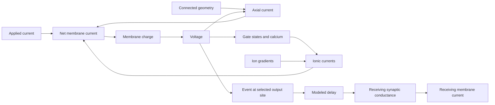

# H01 cell and circuit: causal model

Explanation review: 2026-09-11, against saved evidence at `56240d4` on
`campaign/h01-currents-2026-09-11` in the main checkout.
The initial review included SP10, the SP11 erratum in `16c4f85`, and SP12
registration with manifest concurrency 2. The subsequent SP12 stage-0 results
are incorporated below; both tested KsAHP doses failed the complete gate.
The earlier implementation review covered `41eb735` and diagram records through
`da552a7`; this update does not repeat a full implementation audit. The direct
observation analysis was rerun on Vast using the saved B3 and SP12 traces.

The model combines H01 anatomy with electrical properties from other cells.
It predicts a response under specified inputs and initial states.
It does not establish the physiology of the H01 donor.

[Open the H01 EFAST diagram](h01-efast.svg).

## Explanations established, and explanations still missing

The question is how the specified system produces the observed response, including
the differences between locations, spike phases, cycles, and inputs.
Hartshorne defines a causal explanation through the necessary and sufficient
conditions and the mechanism producing a particular effect
([printed p. 21](<C:/Users/J/Documents/Diagnosing Performance and Reliability/pages/p013.jpg>)).
An intervention can establish one causal contribution under fixed conditions
without supplying a complete explanation of a human-model difference.

| Observed response | Causal account and present boundary |
| --- | --- |
| Historical H01 I candidate does not cross positive soma voltage | Accelerated sodium inactivation cuts off regenerative inward current. Restoring the source closing time restores a positive excursion and recovery. This explains a tested model failure, not human physiology. See Y1. |
| Donor response changes between implementations | Mesh mismatch and fixed-step integration error account for different, separately tested transfer discrepancies. The two-input numerical requirement remains unmet. See Y2. |
| PV finalist's recovery interval grows along a train | Calcium-dependent axonal SK supplies an outward path; removing it alone preferentially shortens late recovery while early waveform bands hold. This isolates a contributor to model adaptation, not the complete cause of human timing errors. See Y3. |
| B3 fires too often at low input and rises too fast at every input | Rise rate falls as membrane load rises. Although the cable load contributes, at the recorded cell's own load it covers about a tenth of the rise difference and cannot supply the count. The recorded cell's take-off is set by the trajectory that reaches it: it falls as the approach quickens and rises after a spike. The fit's take-off is one voltage at every approach and every spike, because it is imposed by the axonal initiation; so every lever that only changes the somatic inward current is a rise lever in this fit, and neither the cable nor slow inactivation of the fitted sodium will produce the recorded response. See Y4. |
| Historical component develops invalid calcium | Its frozen-current update produces negative calcium, making the next Nernst evaluation invalid. An implicit update repairs that route, but does not repair extreme voltage or qualify anatomy. See Y5. |
| Population runtime, functional inhibition, and additional donor mismatches | Construction, delivery, or count discrepancies alone do not explain these outcomes. The required response or isolating evidence remains missing. See Y5 and Y6. |

For each account below, **conditions** define the tested boundary; **mechanism**
connects states and currents to behavior; **test** names the discriminating evidence;
and **limit** states what the account does not explain. The full tested configuration
is the background for any sufficiency claim. No finite set of repairs proves a
unique cause or universal necessity.

Means, medians, counts, and pass totals are summaries. They cannot replace the
spatial and temporal response that an explanation must reproduce. In particular,
a voltage offset divided by input resistance estimates a dose; it does not identify
the current responsible for that offset. This follows the book's distinction between
summarizing performance and retaining behavior for diagnosis
([printed pp. 65](<C:/Users/J/Documents/Diagnosing Performance and Reliability/pages/p056.jpg>)
and [67](<C:/Users/J/Documents/Diagnosing Performance and Reliability/pages/p058.jpg>)).

The [direct-observation contract](specs/2026-09-11-h01-direct-observation-contract.md)
is implemented in the SP11/SP12 scorer defaults. It retains original samples in
selected cycles, local voltage/current and voltage/charge pairs, early and slow
multivari views, and explicit missing observations. Read the
[visual review](evidence/h01-direct-observation-review-2026-09-11.md) with the
charts: the human's rapid initial rebound and later depression are distinct
features that one average or one set of early samples cannot represent.

## Y1. No positive somatic spike in the diagnostic H01 I cell

**Conditions and response.** This is the historical diagnostic H01 inhibitory
candidate, on its selected anatomy and initial state, under the saved 1 nA pulse.
It produces no positive soma excursion. It is not the donor-finalist system in Y3.

**Mechanism.** Sodium activation increases during the rise, but accelerated inactivation reduces sodium availability.
The regenerative rise stops as sodium conductance falls.
Restoring only the source closing-time factor produces a positive excursion and recovery.
The effect persists under the tested time and space refinement.

Preventing availability loss in the soma alone or axon alone also restores a positive excursion.
In the axon-only case, reduced axial outflow supports continued charging of the soma.
These interventions show sufficient repairs under the recorded conditions.
They do not establish a unique repair or a valid human waveform.

The causal chain is accelerated availability loss during depolarization -> reduced
sodium inward current -> failure to sustain regenerative charging -> no positive
soma excursion. The regional interventions show that both local current and axial
exchange can alter this balance; they do not make the soma and axon independent.

**Open.** The upstream axial contribution and the assigned electrical regions need further evidence.
Smaller tested steps and compartments did not repair this response.
That result does not exclude every numerical effect.

Evidence: [closing-time comparison](evidence/h01-i-source-closing-refinement-audit.json),
[regional interventions](evidence/h01-i-inactivation-regions-audit.json),
[current balance](evidence/h01-i-regional-current-balance-audit.json).

## Y2. Donor response changes during transfer

**Conditions and mechanism.** These comparisons hold donor dynamics and input
fixed while examining spatial discretization or time integration. A changed mesh
changes the compartment representation of the cable; a finite time step introduces
trajectory error that can accumulate into shifted or missing threshold crossings.
These are two distinct routes to a transfer discrepancy, not evidence of a missing
physiological current.

**Tests.** Two different comparisons exposed different numerical effects.
In the early eight-event comparison, matching branch compartment counts removed the large transfer drift.
In the later full-train comparison, fixed-step error accumulated against the variable-step CVode reference.
The early result did not establish full-train accuracy.

With matched mesh and time step, BrainCell and NEURON produced 36 events at 0.27 nA over 270–1270 ms.
Their largest rise-time difference was about 1.4e-7 ms.
Their largest raw voltage difference was about 8.3e-5 mV.
The saved decision accepts simulator identity under its amended rule.
The separate strict prediction of 1e-6 mV and 1e-8 ms at every event failed.

Against CVode, both fixed-step runs missed the same events and produced 36 rather than 37 spikes.
At 0.27 nA, a 0.000625 ms step met the 1 ms crossing limit.
At 0.19 nA, the largest crossing error remained 1.864 ms at that step.
The two-input requirement was not met within the run cap.

**Open.** The remaining time-step requirement and the unrun full BrainCell comparison at 0.19 nA remain separate from human accuracy.
A passing transfer comparison does not qualify the donor waveform.

Evidence: [early isolation](evidence/h01-pv-transfer-isolation.md),
[full-train decision and prediction outcomes](evidence/h01-i-transfer/sp2-close-decision.json).

## Y3. The PV finalist differs from the human spike train

**Conditions.** The mechanistic comparison below uses the donor finalist
`e-kv3-close2`, HL5BN1 donor morphology, command-only 0.19 and 0.27 nA pulses
from 270 to 1270 ms, ninefold mesh refinement, and CVode tolerance 1e-10.
Somatic NaTg remains at 1.1 times source density, Kv3 closing factor at 2.0,
and axonal calcium removal time at 300 ms. The comparison removes only axonal SK.
These are donor simulations, not a physiological test of an H01 reconstruction.
The [SP10 manifest](evidence/h01-i-sk-manifest.json) records the full configuration.

**Observed limit.** The 0.23 nA reserved-input test produced 26 spikes; the human recording had 31.
The first peak differed by 1.15 mV.
Thus, the finalist failed the approved count and voltage limits.
Some predicted waveform values met the wider repeatability limits.

**Measured current path.** At 6 ms after the first trough, sodium availability is 0.986 at 0.19 nA.
All eight recorded soma neighbors have lower voltage than the soma.
Axial outflow carries 0.18058 nA, about 95% of the applied current.
The signed current balance leaves 0.00198 nA to increase soma charge.
Recovered sodium availability therefore does not imply rapid soma charging.

The same path appears in the selected early and late samples at 0.19 and 0.23 nA.
Axonal calcium and SK activation increase along these trains as the next-threshold delay grows.
These observations locate current and state changes; they do not isolate the cause of the human timing error.
The downstream cable currents remain unresolved.

**Cause-test boundary.** Earlier comparisons support a role for sodium duration and retained Kv3 activation in the spike fall and trough.
Removing somatic Kv3 produced depolarization block in that earlier candidate.
However, the axonal SK removal arm also dropped the baseline somatic sodium increase.
It used Kv3 closing factor 0.5; the finalist uses 2.0.
Its 57/138-spike result cannot establish an isolated SK effect in the finalist.

Increasing axonal NaTg density by 1.5 times failed the registered recovery prediction.
That tested dose does not exclude all axonal density changes.

**Causal explanation: axonal SK contributes to growing late recovery delay.**
With calcium-dependent SK present, rising axonal calcium increases its activation.
At voltage above potassium reversal, this conductance carries outward current.
Together with the connected cable and other active currents, this changes the
voltage trajectory and postpones the next regenerative rise. Sodium availability
can have recovered while the net current available to charge the membrane remains small.
This is a state-dependent feedback mechanism, not a fixed delay added to each spike.

**Discriminating test.**
The matched single-change test was run on the Vast executor after the finalist reproduced its container counts, cycle 2 and troughs 1-3 within 0.1 ms and 0.1 mV
([stage 0](evidence/h01-i-sk/stage-0-decision.json)).
Setting axonal SK density to zero, with every other finalist setting retained,
strongly reduced the growth of the recovery interval along the train.
At 0.19 nA the last trough-to-threshold delay fell from 80.8 to 32.2 ms and the count rose from 14 to 29; at 0.27 nA the delay fell from 27.2 to 14.1 ms and the count rose from 37 to 59.
Cycle 2 moved by less than 4 ms, widths, peaks and troughs 1-3 stayed inside their bands, initiation stayed axon-first, and no depolarisation block occurred
([stage 1](evidence/h01-i-sk/stage-1-decision.json), 22 of 22 bands).
The current-removal and delay observations support this causal contribution under
the tested conditions. Zero SK is sufficient to produce the shorter late delays
in these comparisons; it does not eliminate all delay or establish SK as the sole
determinant of timing. Removal gives 29 versus human 12 spikes at 0.19 nA and 59
versus human 43 at 0.27 nA, worsening both absolute count errors.

The same tables show the human's late cycle to be about 100 ms at 0.19 nA and about 25 ms at 0.27 nA.
The finalist's late cycle is 84 ms and 30 ms; without axonal SK it is 33 ms and 17 ms.
The human late cycle therefore lies between the two model settings at 0.27 nA but beyond both at 0.19 nA.
The tested removal therefore moves the late interval toward the human at one input
and away at the other. This does not prove that every intermediate SK dose or
interaction fails: there is no measured dose-response surface supporting that claim.
Nor does calcium growth alone predict the ordering of intervals between inputs;
applied current, voltage, and other conductances change that balance too.

**Unexplained response contrasts.** At 0.19 nA the human early cycles 2-3 are
about 7.6 and 10.2 ms, compared with model 34.8 and 39.2 ms. At 0.27 nA the human
cycles 2-4 are about 6.3, 5.9, and 7.0 ms. Axonal SK removal does not restore this
early burst. The current balance that would restore early refiring remains unidentified.
The mechanism that slows the human's late cycle at low input more than at high input remains unidentified.
The finalist remains experimental.

**Mechanism: what the recorded cell does along a train that the finalist does not.**
The recording's own repeat spread, 0.17 mV in level, 0.38 mV in threshold, 5 V/s in rise and
8 ms in first-spike latency, comes from four 120 pA sweeps that each fire one spike
([decision](evidence/h01-topographic/stage-0-decision.json), [figures](evidence/h01-topographic/)).
It qualifies the first spike near rheobase. No repeat exists at 0.19 or 0.27 nA, so the
along-train differences below are stated in millivolts and volts per second without a sigma;
they are large, but their repeatability is not measured.
The first spike of the two cells rises at the same rate, 597 against 592 V/s, so no
difference in sodium density or in near-soma charging is available to explain the train.
Along the train the two separate in the threshold and in the rise, and the shape of the
separation depends on the drive. At 0.27 nA the recorded threshold rises 4 mV over the first
five spikes, inside 43 ms, and then holds near -58.4 mV for forty more spikes while the
finalist's holds at -60.5 mV; the recorded rise falls from 602 to 550 V/s over the same
five spikes and then holds. At 0.19 nA the recorded threshold climbs across the whole
second, from -60.5 to -52 mV, and the rise falls to 450 V/s, as the intervals lengthen; the
finalist holds both flat ([cycle tables](evidence/h01-topographic/cycle-tables.md)). Between
spikes the two cells also differ by time since the spike rather than by voltage. Just after
a spike, between -78 and -65 mV, the recorded cell is carried to its next threshold in six
to eight milliseconds by a small net inward current, while the finalist absorbs 0.16 to
0.25 nA at the same voltages; after the last spike of a train the two meet again. The early
cycle difference that follows from this is inside the campaign's repeat limit for a cycle
and is not treated as a separate effect.

The finalist's onset capacitance is 57 pF against the recorded cell's 70 pF. That is a
difference in the input, not in the channels, and it has no repeat spread of its own yet.

**Consequence.** A threshold that rises with a falling rise, appearing only along a train,
entering within a few spikes and recovering between trains, is what sodium channels do when
they inactivate slowly: entry is fast while the membrane is depolarised and recovery is slow
at rest. Both this fit and the pyramidal fit carry the same Colbert and Pan 2002 sodium
equations, which inactivate quickly and not slowly, so the same missing element would
produce this signature in both cells. [SP16](specs/2026-09-12-h01-sodium-slow-inactivation.md)
applied that one change to both, with separate entry and recovery time constants, and it
is refuted in both: in this fit, removing 40 percent of the sodium availability along the
train takes the rise to 0.69 of spike 1 at 0.27 nA and raises the threshold 1.9 mV, where
the recorded cell keeps 0.91 of its rise while its threshold climbs 4 mV
([stage 2](evidence/h01-i-sodium-slow/stage-2-decision.json)). In both fits a loss of
sodium availability is a rise lever and not a threshold lever, 12 to 19 percent of the
rise per millivolt; in both recorded cells the threshold climbs with only a modest loss of
rise, 2 to 10 percent per millivolt. So what a spike leaves behind in the recorded cells
raises the threshold by another route than the availability of the fitted sodium, and it
is present in both cells. Changing the axonal SK dose will not
produce it, because that conductance is calcium-driven and grows with input, while the
recorded cell's late slowing shrinks with input.

The recorded cell's first spike also takes off lower the faster it is approached: -58 mV
when the 120 pA sweeps reach it at 0.7 mV/ms, -60.5 mV at 1.1 mV/ms under 0.19 nA and
-61.7 mV at 1.7 mV/ms under 0.27 nA, a 4 mV slide, ten times the spike-1 spread, under two
threshold definitions. The finalist slides 0.7 mV over a wider range of approach rates and
holds within 0.3 mV along each train
([stage 7](evidence/h01-topographic/threshold-approach.md)). Its take-off is therefore not
as fixed as the pyramidal fit's, but it answers to the approach at a fifth of the recorded
rate, and it does not rise after a spike as the recorded cell's does.

The [I response chart](evidence/h01-multivari-i.png) shows model widths approximately 0.06 ms below the human values.
It also shows different changes in rise rate along the train.
A repeated difference does not establish one unique mechanism.

Evidence: [charge and intervention results](evidence/h01-i-energetic-result.md),
[trough observation](evidence/h01-i-trough-audit.json),
[reserve decision](evidence/h01-i-reserve/stage-1-decision.json),
[current measurements and intervention correction](evidence/h01-causal-current-observations-2026-09-09.md).

## Y4. B3 fires too often at low input and rises too fast at every input

**Conditions.** Frozen B3 is the Allen 541563728 perisomatic fit on that donor's anatomy
in NEURON, driven by the recorded command plus its recorded bias, at ninefold mesh
refinement and CVode tolerance 1e-10, over the 1020 to 2020 ms pulse. It is compared with
one human layer 2/3 pyramidal cell recorded under the same command. Rise rates are
measured on a uniform time grid, and every difference is stated against the repeat spread
of that recording, which is 0.3 mV in level, 0.25 mV in threshold and 1.5 V/s in rise.
The [manifest](evidence/h01-e-currents-manifest.json) and
[candidate](evidence/h01-e-currents/m0-b3-currents.candidate.json) fix the settings.

**Response to explain.** B3 initiates in the axon at every active input and still produces
the wrong response. It fires 4, 8, 10 and 12 times at 200, 250, 310 and 350 pA against the
recorded 1, 5, 10 and 13, so the count error changes sign across the inputs and no constant
offset describes it. Three further differences are large against the recording's own spread:

| difference | human | model | spreads |
| --- | ---: | ---: | ---: |
| spike rise, every cycle and input | 347.7 V/s | 639.1 V/s | 177 |
| threshold step from spike 1 to spike 2, 310 pA train | +1.4 mV | +0.0 mV | 6 |
| threshold at spike 5 against spike 1, 310 pA train | +3.6 mV | +0.0 mV | 14 |
| rise of spike 2 against spike 1, 310 pA train | 0.86 | 1.04 | 40 |
| spike-1 take-off, approach 0.2 against 0.75 mV/ms | -54.7 against -57.2 mV | -57.2 against -57.2 mV | 9 |
| later spikes above the spike-1 take-off at the same approach | +1.9 mV | +0.0 mV | 8 |
| steady level at 200 pA, spike or no spike | -67.0 mV | -65.0 mV | 7 |

The model's first spike is also early, by less than four spreads of the recording's own
first-spike scatter, which is too small to treat as a separate effect. The 200 pA count is
not in the table: the recorded cell fires once in five of seven repeats and not at all in
the other two, so 200 pA is its rheobase and a count there lies inside its own spread. The
fit's four spikes at 200 pA say that its rheobase is lower, which the load curves already
say; they are not a fourth count error.

**Mechanism.** The rate of rise falls as membrane load rises, at about 254 volts per second
for each unit of whole-cell conductance ratio, and the spike count collapses once the load
passes about 1.3 times the fitted value. The recorded cell's own load, measured where
neither cell spikes, is 1.13 times the model's conductance and 1.03 times its capacitance.
Although the cable load contributes, at the recorded cell's own load it covers about a tenth
of the rise difference, and it cannot supply the count. Given the recorded cell's own
conductance, this model stops firing at 200 pA and enters depolarisation block at 310 pA,
while the recorded cell fires once and ten times. Carrying the recorded load therefore needs
more inward drive than this fit has, so the excess count at the fit's own lighter load is not
evidence of excess excitability. The recorded cell also carries 1.13 times the conductance
with only 1.03 times the capacitance, a shorter membrane time constant than any scaling of
membrane area can produce, so its load differs in kind and not only in size.

Charge does not accumulate in the soma either. Between spikes at 200 pA the whole soma
sinks about 0.069 nA of the applied 0.196 nA, the rest leaving axially, and the largest
soma candidate is the persistent sodium current at 0.012 nA. Removing all of it silences
200 pA rather than reducing the count to the recorded one, so that current is necessary for
the first spike and not an explanation of the count.

What remains is use-dependent, and the 200 pA level is not part of it. The seven 200 pA
repeats are twins: the five that fire one spike and the two that fire none sit at the same
level 800 ms later, -66.3 to -67.0 mV, and recover along the same path after the pulse
([twins](evidence/h01-topographic/threshold-approach.md)). A spike therefore leaves nothing
in the level, and the 2 mV by which the fit sits above the recording at 200 pA is a
steady-state difference of the two cells at that current, continuous with the recorded
cell's subthreshold staircase, whose input resistance is 75 MOhm over -110 to 70 pA and
91 MOhm over 90 to 190 pA, fitted separately because the holding current differs by 6.2 pA
between the two groups. Where neither cell spikes the two agree within 1 mV; the net membrane currents
after a spike differ by time since the spike and meet again after the last spike of a train.
A conductance that opens with a spike and stays open for seconds is sufficient to reproduce
the single-spike response at 200 pA, with the pre-spike trace and the first spike unchanged,
and it is not sufficient for the trains, because the dose that holds the 200 pA level
accumulates along the faster trains and removes spikes the recording keeps; the twins now
say that what it was holding was never a post-spike level. Read spike by spike, the recorded change has one shape at every drive from 230 to
350 pA: the threshold steps up and the rise steps down between spike 1 and spike 2, inside
the first interval, keep moving through spike 5, and then hold for the rest of the second;
spike 1 is the same in every sweep, so the change has recovered by the next sweep; and at
200 pA one spike is followed by 800 ms without another, so it has not recovered inside
800 ms ([cycle tables](evidence/h01-topographic/cycle-tables.md)). The model holds
threshold and rise flat at every drive. Both fits carry the same Colbert and Pan 2002
sodium equations, which inactivate quickly and not slowly. A slow inactivation gate that
enters during a spike and recovers at rest, added to the sodium this fit carries, leaves
the first spike alone and lowers the rise of the later spikes, but it does not move the
threshold: removing 40 percent of the sodium availability by spike 10 takes the rise to
0.72 of spike 1 and the threshold up 1.5 mV, and at spike 2 it gives +0.4 mV where the
recording gives +1.4 with the rise at 0.86 ([stage 1](evidence/h01-e-sodium-slow/stage-1-decision.json));
the stage's 200 pA rows, count 4 and level, are below the discrimination line and carry no
information. In
this fit the rise answers to sodium availability at about 19 percent per millivolt of
threshold; in the recorded cells the two move together at 4 to 10 percent per millivolt.
The fit's threshold is therefore set by its axonal initiation and not by the availability
of its sodium, and no depth of that gate reproduces the recorded step, because the depth
that would move the threshold would take the rise far below the recording. What a spike
leaves behind in the recorded cell raises its threshold with only a modest loss of rise;
in this fit nothing that lowers sodium availability raises the threshold by that much.

**Where the take-off is set.** The recorded cell's first spike takes off at -54.5 to -55.2 mV
when the pulse approaches it at 0.17 to 0.22 mV/ms (200 pA), at -57.2 mV when it approaches
at 0.75 mV/ms (350 pA), and at -61.9 mV under a 3 ms, 1260 pA pulse that approaches at
7 mV/ms (campaign definition only; a ramp faster than 10 V/s has no crossing reading). Over
the long pulses that is a 2.2 mV slide, nine spreads, the same under the campaign's
threshold definition and under a fixed 10 V/s crossing. Its later spikes take off
1.9 mV above that relation at the same approach, all 41 of them. The fit takes off at -57.0
to -57.2 mV at every spike of every train, from 0.23 to 1.16 mV/ms, under both definitions
([stage 7](evidence/h01-topographic/threshold-approach.md)). Two different things set the
take-off in the two cells. In the recording it is set locally by the trajectory: a slow
approach lets whatever the depolarisation itself removes from the inward current, or adds
to the outward current, act before the crossing, so the crossing comes later and higher;
a spike leaves more of that behind; and a fast pulse arrives before it acts. In the fit the
soma is carried over by a current arriving from the axonal initiation site, whose own
crossing is reached at one somatic voltage whatever the approach. This is the relation that
made SP16 predictable before it was run: in a cell whose take-off is imposed from elsewhere,
any lever that only changes the somatic inward current changes the rise and not the
take-off, and a lever that changes the initiation site's availability moves both together
at the site's own ratio. A candidate can now be rejected on paper if it acts only on the
somatic inward current, or if it does not make the take-off a function of the approach.

**Consequence.** Matching the model's cable to the recorded cell will have little effect on
the rise, and enlarging the cable enough to move it removes the spikes the recording keeps.
Doses of the soma channels this fit already carries cannot supply the low-input count.
Slow inactivation of the sodium this fit carries will not produce the recorded threshold
step at any depth
([SP16 stage 1](evidence/h01-e-sodium-slow/stage-1-decision.json)); it is a rise lever in
this fit, not a threshold lever, and the same is true of the interneuron fit, whose
initiation is not a dense axonal insertion
([stage 2](evidence/h01-i-sodium-slow/stage-2-decision.json)); so the insensitivity is not
this fit's geometry alone, and the take-off relation above says why: neither fit's take-off
is a function of the approach, and a gate on the somatic sodium does not make it one. The next split is
an isolation, not a lever: at the onset of each spike, does the somatic phase plane show a
gradual take-off, the local membrane turning over, or a kink, a current arriving from
elsewhere; in both recordings, and in the fits at the soma and at the axon initial segment
([stage 8](specs/2026-09-12-h01-topographic-strategy.md)). If the recorded onset is gradual
and the fit's is a kink, the recorded take-off is somatic and the fit's initiation site is
the input that has to change; if both are kinks, the recorded initiation site itself must
answer to the approach, and the axonal sodium and its neighbours are the family to split.

**Limit.** No sufficient repair is established, and B3 stays unpromoted. The measured facts
are that the recorded take-off slides with the approach and rises after a spike while the
fit's does not move; the account of where the fit's take-off is imposed, a current arriving
from the axonal initiation site, is the hypothesis that stage 8 is registered to test, and
the account of what the slow approach removes in the recorded cell names no channel. Slow inactivation
of the fitted sodium is refuted as the shared-function element for this fit at depths up to
0.6 with the registered time course; other time courses and other carriers of what a spike
leaves behind are not excluded. A gate fitted to
a response cannot name a channel. The membrane area of an H01 skeleton, converted from
skeleton radii, is not established as physical, so that anatomy's failure to spike says
nothing about the recorded cell.

Evidence: [soma currents and their erratum](evidence/h01-e-currents/stage-close-decision.json),
[direct trace audit](evidence/h01-causal-direct-trace-audit-2026-09-11.md),
[spike-triggered gate, one second](evidence/h01-e-sahp/stage-0-reanalysis.json),
[spike-triggered gate, five seconds](evidence/h01-e-sahp-tail/stage-1-decision.json),
[families and load curves](evidence/h01-topographic/stage-0-decision.json),
[cable-load slope](evidence/h01-e-cable-load/stage-4-decision.json),
[the recorded cell's own load](evidence/h01-e-cable-load/human-passive-load.json),
[gain decision](evidence/h01-e-gain/stage-close-decision.json),
[implemented densities](../braintrace/datasets/_h01_ei_parameters.py).

## Y5. Anatomy, delivery, and population execution

### Contact identity and delivery

**Conditional mechanism.** Given a selected presynaptic event, its modeled delay,
an accepted contact, and a receiving membrane voltage, delivery changes synaptic
conductance. The product of conductance and reversal driving force changes the
receiving current and hence charge balance. The sign and size depend on that
voltage and on concurrent currents; an anatomical contact alone is insufficient
to predict spike suppression or recruitment.

The illustrative pair and the measured pair are different systems.
Removing individual illustrative projections removes their associated conductance and timing effects.
Those results apply to the illustrative wiring.
They do not establish the measured pair's response.

A delivered conductance changes current according to the receiving voltage and reversal potential.
Its effect can include a voltage shift and a change in membrane load.
Delivery does not by itself establish spike suppression, recruitment, or sustained feedback.
The planned 300 ms functional-inhibition comparison produced no completed arm.
Its result remains untested.

The simulated graph contains two supported contacts.
Source identity, cable placement, and electrical parameters remain separate checks.
The cached nine-shard exact-base scan found no between-cell pair under that mapping.
That result covers only those files and that mapping.
It does not invalidate separately checked annotation contacts or establish an empty biological graph.

Evidence: [illustrative controls](evidence/h01-i-restored-four-control-audit.json),
[functional-inhibition decision](evidence/h01-ie-inhibition/decision.json),
[exact-base scan](evidence/h01-cached-full-base-join.json).

### Component choice

The component with the most nodes does not necessarily contain the cell body supported by independent source evidence.
Four cells needed explicit component corrections.
The loader retains their separate source components and does not invent connecting cable.

The corrected four-cell test completed 10 ms at a 0.000625 ms step.
All saved arrays were finite; three cells emitted one event each.
Cell 7196644737, now using component 6, reached 48.182 mV.
The remaining cell emitted no event.
These results apply to the corrected components and their assumed input.

Evidence: [source-anchor comparison](evidence/h01-soma-component-anchor-comparison.json),
[corrected four-cell result](evidence/h01-four-soma-runtime-decision.json).

### Negative calcium in the historical component

**Conditions and mechanism.** This account concerns the historical selected
component, its driven electrical model, and its frozen-current calcium update.
An outward signed calcium flux can deplete the concentration during that update
without accounting for the changing calcium reversal within the step. If the
update crosses zero, the next logarithmic Nernst evaluation is outside its domain.
This is a numerical feedback failure route, not an explanation of a biological
calcium concentration becoming negative.

The historical component of cell 7196644737 failed without other cells or projections.
At a 0.005 ms step, its observed output calcium became negative at 3.270 ms.
The output voltage had already reached approximately 378 mV at the preceding sample.
The exact frozen-current update reproduces the negative calcium value.
The subsequent Nernst calculation leaves its valid domain.

This establishes a numerical failure route at the observed location.
It does not identify the first invalid state across every compartment.

Keeping Nernst feedback inside an implicit calcium solve restored positive calcium and finite voltage in the isolated test.
The extreme voltage response remained approximately 384 mV on the historical anatomy.
Consecutive time-step comparisons decreased to 0.933343 mV at 0.000625/0.0003125 ms.
That pair meets its registered voltage limit for this cell and window.
It is not a general numerical error bound.

The numerical repair and the component correction address different problems.
The former changes state integration; the latter changes the modeled anatomy.
A finite run cannot establish which anatomy represents the biological cell.

Evidence: [state diagnosis](evidence/h01-ready-cell7196644737-state-decision.json),
[implicit repair](evidence/h01-ready-cell7196644737-implicit-decision.json),
[isolated refinement](evidence/h01-ready-cell7196644737-refinement-decision.json).

### Current population boundary

| Configuration | Saved result | Remaining limit |
| --- | --- | --- |
| Historical 104 components | Construction and finite 1 ms execution passed with 808,495 compartments. | The driven 10 ms test failed. |
| Four corrected components | Finite driven 10 ms execution passed. | This does not qualify all 104 cells or numerical refinement. |
| Corrected 104 components | Construction passed with 807,588 compartments and two contacts. Initialization also passed. | Compiled 10 ms runtime ended without a trace verdict. |

The corrected construction pass supersedes the earlier construction timeout.
The runtime timeout does not establish numerical failure or memory exhaustion.
The corrected population has no completed driven runtime qualification in the reviewed records.

Evidence: [historical short run](evidence/h01-ready-104-ei-1ms-decision.json),
[historical driven failure](evidence/h01-ready-104-ei-10ms-decision.json),
[corrected construction](evidence/h01-104-corrected-construction-decision.json),
[corrected initialization and runtime limit](evidence/h01-104-corrected-initialization-decision.json).

## Y6. Additional donor fits do not reproduce all recorded counts

The imported HL5MN1 fit produced 16 and 30 spikes against recorded counts of 14 and 34.
The imported Allen 527952884 fit produced 19 and 8 against 20 and 12.
Both failed their registered reproduction rules.
A published fit and a matching type label do not guarantee reproduction under this project's conditions.

**Open.** The condition responsible for each count difference remains unidentified.
These runs do not establish a missing biological mechanism.
The imported fits remain labeled with their measured limitations.

Evidence: [HL5MN1 decision](evidence/h01-donors/stage-hl5mn1-decision.json),
[Allen L4 decision](evidence/h01-donors/stage-allen-l4-decision.json).

## Concepts and truth conditions

A causal model explains how a change produces a response.
A list of parts is not a causal explanation.
A complete explanation states the conditions, the mechanism, and the expected response.

| Term | Meaning in this document |
| --- | --- |
| Fact | A source property, mathematical result, or observation with a stated basis. |
| Assumption | A model choice that the source data do not establish. |
| Hypothesis | An explanation that still needs a test. |
| State | The values that affect the next model step, including voltage, gates, and calcium. |
| Boundary | The selected system, location, time window, and operating conditions. |
| Necessary condition | The response cannot occur without this condition within the stated boundary. |
| Sufficient condition | This condition, with the stated background conditions, produces the response. |
| Interaction | The effect of one change depends on the setting of another variable. |
| Decision limit | The difference that the specified test can resolve. |
| Acceptance limit | The largest error that the approved requirement permits. |

An absolute claim needs a proof and explicit assumptions.
A finite experiment establishes a result only for its tested conditions.
Restoring a response with one change does not prove that this change is the only possible repair.
A failed dose does not exclude every dose, combination, or mechanism in that family.

The following distinctions apply throughout this model:

- Correct anatomy does not establish correct electrical properties.
- Agreement between simulators does not establish agreement with a human recording.
- Equal spike counts do not establish equal spike times or waveforms.
- A finite voltage does not establish valid internal states.
- A pass before stimulation does not establish a pass during stimulation.
- A stopped test without a response trace supplies no response verdict.

## Physical relations

The equations below define the electrical model.
Their conclusions depend on the stated units, signs, and model assumptions.

### Charge and voltage

For one compartment with constant total capacitance:

\[
C\frac{dV}{dt}=I_{applied}+I_{axial}+I_{synapse}+\sum_k I_k.
\]

Here, voltage is inside minus outside.
Each current is positive into the compartment.
Each term is a total current, not a current density.
Net inward current increases membrane charge and voltage.
Large opposing currents can leave a small net current.
Thus, voltage alone cannot identify the separate current paths.

For an ohmic channel branch:

\[
I_k=g_k(E_k-V),\qquad g_k=A\bar g_k f_k(\text{gates}).
\]

Here, \(A\) is membrane area, \(\bar g_k\) is maximum conductance density, and \(E_k\) is reversal potential.
The gate factor \(f_k\) depends on the channel law.
The same density on a different area gives a different total conductance.
The same applied current on a different area gives a different current density.

Axial current depends on connected geometry, resistivity, and voltage differences.
A geometry change can alter the response even when every channel parameter stays fixed.
Disconnected source branches do not conduct axial current between them unless the model adds a connection.

### Gates and calcium

A common gate law is:

\[
\frac{dx}{dt}=\frac{x_\infty(V)-x}{\tau_x(V)}.
\]

The time constant controls movement toward equilibrium at fixed voltage.
Changing only this time constant does not change that equilibrium.
Changing separate opening or closing rates can change both quantities.
Equal initial voltages do not imply equal gate states.
The preceding input can therefore affect later spikes.

The H01 calcium model uses signed calcium flux and removal toward a resting concentration:

\[
\frac{dc}{dt}=\alpha i_{Ca}+\frac{c_{rest}-c}{\tau_c},
\qquad E_{Ca}=\frac{RT}{2F}\ln\frac{c_{out}}{c}.
\]

Here, \(i_{Ca}\) is inward-positive current density.
The positive factor \(\alpha\) converts current density to concentration change.
The Nernst expression requires positive concentrations.
A numerical update that makes calcium negative leaves this equation's valid domain.

### Energy

With constant capacitance, membrane electrical energy is \(CV^2/2\).
Voltage and signed current together specify electrical power at a boundary.
An ohmic channel dissipates \(g_k(V-E_k)^2\).
Ion gradients supply energy through their reversal potentials.
A complete energy budget therefore includes the ion reservoirs.
A voltage-current loop alone does not prove physical inductance or identify a channel.

## Source data and code

H01 supplies reconstructed geometry and annotations.
The imported cells have no matching voltage recordings in this project.
The donor models include fitted parameters and borrowed channel laws.
A pyramidal or interneuron label does not establish a complete electrical model or a PV subtype.

| Function | Code | Boundary that matters |
| --- | --- | --- |
| Load anatomy | [h01.py](../braintrace/datasets/h01.py), [_h01_swc.py](../braintrace/datasets/_h01_swc.py) | Cell identity, selected component, source geometry, and units. |
| Assign electrical properties | [h01_ei_cell.py](../braintrace/datasets/h01_ei_cell.py), [profiles](../braintrace/datasets/h01_ei_profiles.py) | Donor, mode, regions, density, and applied current. |
| Compute channel response | [L2 channels](../braintrace/datasets/h01_l2_channels.py), [PV channels](../braintrace/datasets/h01_pv_channels.py) | Gate law, temperature, reversal potential, and parameter values. |
| Update calcium | [calcium state](../braintrace/datasets/h01_pv_calcium.py), [implicit solver](../braintrace/datasets/h01_calcium_solver.py) | Signed flux, concentration, and update order. |
| Construct and step the cell | [construction](../braintrace/datasets/h01_construction.py), [compiled solver](../braintrace/datasets/h01_dhs_scan.py) | Compartment geometry, solver, time step, and precision. |
| Select and deliver contacts | [connectivity](../braintrace/datasets/h01_connectivity.py), [network](../braintrace/datasets/h01_network.py) | Both endpoint identities, cable placement, conductance, delay, and controls. |
| Emit an event | [output site](../braintrace/datasets/h01_spike_output.py) | One selected membrane compartment and the cell's event rule. |
| Compare responses | [contract score](evidence/h01_contract_score.py), [usable score](evidence/h01_usable_tier.py) | Recorded input, event definition, matching rule, uncertainty, and acceptance limits. |

The default profile mode is `candidate`.
The `b3` and `finalist` modes are separate experimental selections.
Evidence for one mode does not qualify another mode.

The network uses assumed synaptic conductance, decay, reversal potential, and delay.
An anatomical contact does not measure these quantities.
The selected output site is a model rule, not a measured axon terminal.
The network rejects contacts that require it to join disconnected components.

## Observation and diagnosis

Each observation needs a cell identity, location, input, time window, and response.
The comparison also needs the initial state, temperature, solver, mesh, and source version.
Unit conversions and clock conventions define the comparison; they are not fitting parameters.

The BrainCell traces in these comparisons use step-end samples.
NEURON ionic-current exports use the opposite sign from the inward-positive equations above.
Those signs must agree before a current comparison is valid.

The recorded junction correction applies once.
The PV fit's held baseline uses command-only input in the accepted diagnostic comparison.
Adding the recorded holding current again changes that comparison.
This convention follows the [input audit](evidence/h01-pv-bias-forensics.md); it is not a rule for every donor.

A useful response record retains each spike's rise, peak, fall, and recovery.
The record also retains intervals and subthreshold voltage samples.
Averages can hide opposing phase errors or drift along a train.
Repeated human responses can differ under the same recorded command.
Numerical repeatability does not measure that biological variation.

The contract scorer pairs events by their order in the pulse window.
If an event is missing or extra, that pairing alone does not establish correspondence between later events.
The count verdict and the full trace remain essential.

Hartshorne's book supplies four useful ways to reduce the search space:

| Book concept | H01 use |
| --- | --- |
| Matryoshka: compare nested variation | Compare within a spike, between spikes, between cells, and between repeated trials. |
| Isolation: separate input from function | Match the input and initial state before comparing model implementations. Retain an interaction branch. |
| Dissection: swap parts between contrasting systems | Compare all relevant combinations. Check whether the response follows a part or its combination. |
| Z strategy: examine energy paths | Observe voltage and signed current at the same boundary. Check charge balance and internal states. |

The book's strongest-variable concept helps select a test.
It is not a proof that one variable always dominates an active neuron.
A response ranking depends on the tested doses, units, and operating conditions.
A source-load explanation must retain voltage feedback and state history.

A proposed test needs a predicted response and a result that would contradict the explanation.
A test that changes anatomy, input, and solver together cannot separate their effects.
If the observation cannot resolve the predicted difference, the explanation remains open.
An unrun combination remains a prediction, even when its separate changes failed.

## Qualification rules

The approved human contract requires exact counts, 1 ms timing, 1 mV voltage, and 0.05 ms spike-phase errors.
Each required row needs its own verdict.
The separate usable tier has different limits and retains uncertainty.
An unavailable or unresolvable row is not a pass.
The [contract](specs/2026-09-05-h01-recorded-response-acceptance-proposal.md) defines the full comparison.

A control qualifies only if it reproduces the compared response, not one summary value of it. A control that matched a spike rise within 9 percent while firing 72 times against a reference 10 is not a control.
A rate of change is qualified only on a uniform time grid. The variable-step solver samples densely through a spike upstroke, which inflates a sampled maximum rise; every rise in this document is measured after resampling.
A slope is qualified only over the observed range of its own variable. A dose outside the range the recorded cell occupies measures the model, not the difference from the recording.
A response along a train is qualified only cycle by cycle. One number per train, such as the threshold first to last, hides whether the change is a step inside one interval or an accumulation over the second, and those two shapes name different time constants.
A count is qualified only at a drive where the recording's own repeats agree on it. At the recorded cell's rheobase the repeats give 0 or 1, so a count there is inside the spread and is not scored; the information at that drive is the rheobase itself and the level, and the level is read from the repeats with and without a spike before it is called a post-spike effect.
A repeat spread qualifies only the quantity, the drive and the cycle it was measured on. The I recording's spread comes from single-spike 120 pA sweeps and qualifies spike 1; an along-train I contrast has no sigma and is reported without one.
A threshold is qualified only with the approach that reached it, and under two definitions. A take-off that moves with the approach is not a threshold error of the model; it is a different mechanism of take-off, and a lever that does not make the take-off a function of the approach cannot reproduce it.
Numerical qualification needs the same physical model at the compared numerical settings.
Transfer qualification needs the same donor, input, state, mesh, and parameter laws across implementations.
Human qualification needs agreement with the specified recording.
H01 donor qualification would need matching H01 physiological evidence that this project does not have.

Construction, initialization, compilation, stepping, and trace analysis are separate runtime stages.
A duration that includes compilation does not measure steady simulation speed.
A timeout needs a stage record before it can support a performance explanation.
Example 21 integration and learning behavior require their own [adapter checks](specs/2026-09-08-h01-example21-adapter-contract.md).

## Sources and review record

Book: David J. Hartshorne, *Diagnosing Performance and Reliability*.
The explanation standard comes from the introduction, printed pp. 21-23:
conditions and mechanism, diagnosis from behavior, and the distinction between
understanding a mechanism and choosing a repair. Chapter 2, printed pp. 65-67,
explains the information lost in performance aggregates. Chapter 3, printed
pp. 110-111, requires tightly connected observations within a cycle.
The [review record](evidence/h01-causal-model-review-2026-09-09.md) maps those concepts to the source files and corrections.
The [chart data](evidence/h01-multivari-data.json) retain the per-cycle values behind the E and I response charts.

The existing [Reasoning Studio graph](evidence/h01-reasoning/h01-current-reality.reasoning.json)
was inspected through its MCP. Its saved explanation predates the SP11 erratum
and SP12 approval: it still excludes somatic levers and calls SP12 a draft.
Those claims are superseded by the evidence and limits above. A graph edge or
its `supported` label does not independently validate a causal inference.

This document uses short sentences and defined technical terms.
The writing basis is [ASD-STE100, Issue 9, descriptive writing](https://www.asd-ste100.org/assets/files/ASD-STE100_ISSUE9.pdf).
Full dictionary compliance has not been certified.

The [previous document](h01-causal-model-history-2026-09-09.md) preserves the search history and superseded statements.
Its old conclusions do not override the current explanations above.
This review reads saved results; it does not repeat their simulations.
The [2026-09-11 direct trace audit](evidence/h01-causal-direct-trace-audit-2026-09-11.md)
reruns the B3 observation analysis on Vast and preserves the individual response,
current boundary, and aggregate/window corrections. The subsequent
[B3 bundle](evidence/h01-e-currents/direct-contract-reanalysis-direct.md) and
[SP12 bundle](evidence/h01-e-sahp/direct-contract-reanalysis-direct.md) apply the
implemented contract to completed saved traces. This was CPU analysis on the
Vast GPU host, not a new GPU simulation or physiological qualification.
The [follow-up analysis](evidence/h01-causal-current-observations-2026-09-09.md) also calculates current observations from retained traces.
Its then-missing B3 current observations and proposed SK test are superseded by
SP11 and SP10 respectively; its earlier configuration boundaries still apply.
