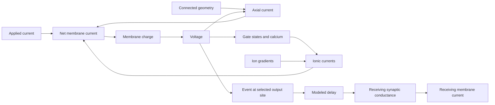

# H01 cell and circuit: causal model

Reviewed on 2026-09-09 against the H01 worktree and its saved evidence.
The code review starts from `feat/h01-braincell` at `41eb735`.
The review also includes the diagram records committed through `da552a7`.
Later code edits need separate verification.

The model combines H01 anatomy with electrical properties from other cells.
It predicts a response under specified inputs and initial states.
It does not establish the physiology of the H01 donor.

[Open the H01 EFAST diagram](h01-efast.svg).

## Concepts and truth conditions

A causal model explains how a change produces a response.
A list of parts is not a causal explanation.
A complete explanation states the conditions, the mechanism, and the expected response.

| Term | Meaning in this document |
| --- | --- |
| Fact | A source property, mathematical result, or observation with a stated basis. |
| Assumption | A model choice that the source data do not establish. |
| Hypothesis | An explanation that still needs a test. |
| State | The values that affect the next model step, including voltage, gates, and calcium. |
| Boundary | The selected system, location, time window, and operating conditions. |
| Necessary condition | The response cannot occur without this condition within the stated boundary. |
| Sufficient condition | This condition, with the stated background conditions, produces the response. |
| Interaction | The effect of one change depends on the setting of another variable. |
| Decision limit | The difference that the specified test can resolve. |
| Acceptance limit | The largest error that the approved requirement permits. |

An absolute claim needs a proof and explicit assumptions.
A finite experiment establishes a result only for its tested conditions.
Restoring a response with one change does not prove that this change is the only possible repair.
A failed dose does not exclude every dose, combination, or mechanism in that family.

The following distinctions apply throughout this model:

- Correct anatomy does not establish correct electrical properties.
- Agreement between simulators does not establish agreement with a human recording.
- Equal spike counts do not establish equal spike times or waveforms.
- A finite voltage does not establish valid internal states.
- A pass before stimulation does not establish a pass during stimulation.
- A stopped test without a response trace supplies no response verdict.

## Physical relations

The equations below define the electrical model.
Their conclusions depend on the stated units, signs, and model assumptions.

### Charge and voltage

For one compartment with constant total capacitance:

\[
C\frac{dV}{dt}=I_{applied}+I_{axial}+I_{synapse}+\sum_k I_k.
\]

Here, voltage is inside minus outside.
Each current is positive into the compartment.
Each term is a total current, not a current density.
Net inward current increases membrane charge and voltage.
Large opposing currents can leave a small net current.
Thus, voltage alone cannot identify the separate current paths.

For an ohmic channel branch:

\[
I_k=g_k(E_k-V),\qquad g_k=A\bar g_k f_k(\text{gates}).
\]

Here, \(A\) is membrane area, \(\bar g_k\) is maximum conductance density, and \(E_k\) is reversal potential.
The gate factor \(f_k\) depends on the channel law.
The same density on a different area gives a different total conductance.
The same applied current on a different area gives a different current density.

Axial current depends on connected geometry, resistivity, and voltage differences.
A geometry change can alter the response even when every channel parameter stays fixed.
Disconnected source branches do not conduct axial current between them unless the model adds a connection.

### Gates and calcium

A common gate law is:

\[
\frac{dx}{dt}=\frac{x_\infty(V)-x}{\tau_x(V)}.
\]

The time constant controls movement toward equilibrium at fixed voltage.
Changing only this time constant does not change that equilibrium.
Changing separate opening or closing rates can change both quantities.
Equal initial voltages do not imply equal gate states.
The preceding input can therefore affect later spikes.

The H01 calcium model uses signed calcium flux and removal toward a resting concentration:

\[
\frac{dc}{dt}=\alpha i_{Ca}+\frac{c_{rest}-c}{\tau_c},
\qquad E_{Ca}=\frac{RT}{2F}\ln\frac{c_{out}}{c}.
\]

Here, \(i_{Ca}\) is inward-positive current density.
The positive factor \(\alpha\) converts current density to concentration change.
The Nernst expression requires positive concentrations.
A numerical update that makes calcium negative leaves this equation's valid domain.

### Energy

With constant capacitance, membrane electrical energy is \(CV^2/2\).
Voltage and signed current together specify electrical power at a boundary.
An ohmic channel dissipates \(g_k(V-E_k)^2\).
Ion gradients supply energy through their reversal potentials.
A complete energy budget therefore includes the ion reservoirs.
A voltage-current loop alone does not prove physical inductance or identify a channel.

## Source data and code

H01 supplies reconstructed geometry and annotations.
The imported cells have no matching voltage recordings in this project.
The donor models include fitted parameters and borrowed channel laws.
A pyramidal or interneuron label does not establish a complete electrical model or a PV subtype.

| Function | Code | Boundary that matters |
| --- | --- | --- |
| Load anatomy | [h01.py](../braintrace/datasets/h01.py), [_h01_swc.py](../braintrace/datasets/_h01_swc.py) | Cell identity, selected component, source geometry, and units. |
| Assign electrical properties | [h01_ei_cell.py](../braintrace/datasets/h01_ei_cell.py), [profiles](../braintrace/datasets/h01_ei_profiles.py) | Donor, mode, regions, density, and applied current. |
| Compute channel response | [L2 channels](../braintrace/datasets/h01_l2_channels.py), [PV channels](../braintrace/datasets/h01_pv_channels.py) | Gate law, temperature, reversal potential, and parameter values. |
| Update calcium | [calcium state](../braintrace/datasets/h01_pv_calcium.py), [implicit solver](../braintrace/datasets/h01_calcium_solver.py) | Signed flux, concentration, and update order. |
| Construct and step the cell | [construction](../braintrace/datasets/h01_construction.py), [compiled solver](../braintrace/datasets/h01_dhs_scan.py) | Compartment geometry, solver, time step, and precision. |
| Select and deliver contacts | [connectivity](../braintrace/datasets/h01_connectivity.py), [network](../braintrace/datasets/h01_network.py) | Both endpoint identities, cable placement, conductance, delay, and controls. |
| Emit an event | [output site](../braintrace/datasets/h01_spike_output.py) | One selected membrane compartment and the cell's event rule. |
| Compare responses | [contract score](evidence/h01_contract_score.py), [usable score](evidence/h01_usable_tier.py) | Recorded input, event definition, matching rule, uncertainty, and acceptance limits. |

The default profile mode is `candidate`.
The `b3` and `finalist` modes are separate experimental selections.
Evidence for one mode does not qualify another mode.

The network uses assumed synaptic conductance, decay, reversal potential, and delay.
An anatomical contact does not measure these quantities.
The selected output site is a model rule, not a measured axon terminal.
The network rejects contacts that require it to join disconnected components.

## Observation and diagnosis

Each observation needs a cell identity, location, input, time window, and response.
The comparison also needs the initial state, temperature, solver, mesh, and source version.
Unit conversions and clock conventions define the comparison; they are not fitting parameters.

The BrainCell traces in these comparisons use step-end samples.
NEURON ionic-current exports use the opposite sign from the inward-positive equations above.
Those signs must agree before a current comparison is valid.

The recorded junction correction applies once.
The PV fit's held baseline uses command-only input in the accepted diagnostic comparison.
Adding the recorded holding current again changes that comparison.
This convention follows the [input audit](evidence/h01-pv-bias-forensics.md); it is not a rule for every donor.

A useful response record retains each spike's rise, peak, fall, and recovery.
The record also retains intervals and subthreshold voltage samples.
Averages can hide opposing phase errors or drift along a train.
Repeated human responses can differ under the same recorded command.
Numerical repeatability does not measure that biological variation.

The contract scorer pairs events by their order in the pulse window.
If an event is missing or extra, that pairing alone does not establish correspondence between later events.
The count verdict and the full trace remain essential.

Hartshorne's book supplies four useful ways to reduce the search space:

| Book concept | H01 use |
| --- | --- |
| Matryoshka: compare nested variation | Compare within a spike, between spikes, between cells, and between repeated trials. |
| Isolation: separate input from function | Match the input and initial state before comparing model implementations. Retain an interaction branch. |
| Dissection: swap parts between contrasting systems | Compare all relevant combinations. Check whether the response follows a part or its combination. |
| Z strategy: examine energy paths | Observe voltage and signed current at the same boundary. Check charge balance and internal states. |

The book's strongest-variable concept helps select a test.
It is not a proof that one variable always dominates an active neuron.
A response ranking depends on the tested doses, units, and operating conditions.
A source-load explanation must retain voltage feedback and state history.

A proposed test needs a predicted response and a result that would contradict the explanation.
A test that changes anatomy, input, and solver together cannot separate their effects.
If the observation cannot resolve the predicted difference, the explanation remains open.
An unrun combination remains a prediction, even when its separate changes failed.

## Y1. No positive somatic spike in the diagnostic H01 I cell

**Observed.** The selected inhibitory candidate produces no positive soma excursion under the tested 1 nA pulse.

**Mechanism.** Sodium activation increases during the rise, but accelerated inactivation reduces sodium availability.
The regenerative rise stops as sodium conductance falls.
Restoring only the source closing-time factor produces a positive excursion and recovery.
The effect persists under the tested time and space refinement.

Preventing availability loss in the soma alone or axon alone also restores a positive excursion.
In the axon-only case, reduced axial outflow supports continued charging of the soma.
These interventions show sufficient repairs under the recorded conditions.
They do not establish a unique repair or a valid human waveform.

**Open.** The upstream axial contribution and the assigned electrical regions need further evidence.
Smaller tested steps and compartments did not repair this response.
That result does not exclude every numerical effect.

Evidence: [closing-time comparison](evidence/h01-i-source-closing-refinement-audit.json),
[regional interventions](evidence/h01-i-inactivation-regions-audit.json),
[current balance](evidence/h01-i-regional-current-balance-audit.json).

## Y2. Donor response changes during transfer

**Observed.** Two different comparisons exposed different numerical effects.
In the early eight-event comparison, matching branch compartment counts removed the large transfer drift.
In the later full-train comparison, fixed-step error accumulated against the variable-step CVode reference.
The early result did not establish full-train accuracy.

With matched mesh and time step, BrainCell and NEURON produced 36 events at 0.27 nA over 270–1270 ms.
Their largest rise-time difference was about 1.4e-7 ms.
Their largest raw voltage difference was about 8.3e-5 mV.
The saved decision accepts simulator identity under its amended rule.
The separate strict prediction of 1e-6 mV and 1e-8 ms at every event failed.

Against CVode, both fixed-step runs missed the same events and produced 36 rather than 37 spikes.
At 0.27 nA, a 0.000625 ms step met the 1 ms crossing limit.
At 0.19 nA, the largest crossing error remained 1.864 ms at that step.
The two-input requirement was not met within the run cap.

**Open.** The remaining time-step requirement and the unrun full BrainCell comparison at 0.19 nA remain separate from human accuracy.
A passing transfer comparison does not qualify the donor waveform.

Evidence: [early isolation](evidence/h01-pv-transfer-isolation.md),
[full-train decision and prediction outcomes](evidence/h01-i-transfer/sp2-close-decision.json).

## Y3. The PV finalist differs from the human spike train

**Observed limit.** The 0.23 nA reserved-input test produced 26 spikes; the human recording had 31.
The first peak differed by 1.15 mV.
Thus, the finalist failed the approved count and voltage limits.
Some predicted waveform values met the wider repeatability limits.

**Measured current path.** At 6 ms after the first trough, sodium availability is 0.986 at 0.19 nA.
All eight recorded soma neighbors have lower voltage than the soma.
Axial outflow carries 0.18058 nA, about 95% of the applied current.
The signed current balance leaves 0.00198 nA to increase soma charge.
Recovered sodium availability therefore does not imply rapid soma charging.

The same path appears in the selected early and late samples at 0.19 and 0.23 nA.
Axonal calcium and SK activation increase along these trains as the next-threshold delay grows.
These observations locate current and state changes; they do not isolate the cause of the human timing error.
The downstream cable currents remain unresolved.

**Cause-test boundary.** Earlier comparisons support a role for sodium duration and retained Kv3 activation in the spike fall and trough.
Removing somatic Kv3 produced depolarization block in that earlier candidate.
However, the axonal SK removal arm also dropped the baseline somatic sodium increase.
It used Kv3 closing factor 0.5; the finalist uses 2.0.
Its 57/138-spike result cannot establish an isolated SK effect in the finalist.

Increasing axonal NaTg density by 1.5 times failed the registered recovery prediction.
That tested dose does not exclude all axonal density changes.

**Isolated: axonal SK carries the late delay (2026-09-11).**
The matched single-change test was run on the Vast executor after the finalist reproduced its container counts, cycle 2 and troughs 1-3 within 0.1 ms and 0.1 mV
([stage 0](evidence/h01-i-sk/stage-0-decision.json)).
Setting axonal SK density to zero, with every other finalist setting retained, removed the growth of the cycle along the train.
At 0.19 nA the last trough-to-threshold delay fell from 80.8 to 32.2 ms and the count rose from 14 to 29; at 0.27 nA the delay fell from 27.2 to 14.1 ms and the count rose from 37 to 59.
Cycle 2 moved by less than 4 ms, widths, peaks and troughs 1-3 stayed inside their bands, initiation stayed axon-first, and no depolarisation block occurred
([stage 1](evidence/h01-i-sk/stage-1-decision.json), 22 of 22 bands).
Thus, under the finalist settings, the calcium-activated axonal SK current is the direct path of the growing late delay.
Its removal is not a repair: both counts move away from the human (12, 43).

The same tables show the human's late cycle to be about 100 ms at 0.19 nA and about 25 ms at 0.27 nA.
The finalist's late cycle is 84 ms and 30 ms; without axonal SK it is 33 ms and 17 ms.
The human late cycle therefore lies between the two model settings at 0.27 nA but beyond both at 0.19 nA.
A brake that accumulates with calcium grows with the input; the human's late slowing shrinks with the input.
This input dependence is a response difference that a single SK dose cannot describe.

**Open.** The current balance that would restore early refiring (the human's three-to-five spike burst at 6-10 ms cycles, absent at every model setting) remains unidentified.
The mechanism that slows the human's late cycle at low input more than at high input remains unidentified.
The finalist remains experimental.

The [I response chart](evidence/h01-multivari-i.png) shows model widths approximately 0.06 ms below the human values.
It also shows different changes in rise rate along the train.
A repeated difference does not establish one unique mechanism.

Evidence: [charge and intervention results](evidence/h01-i-energetic-result.md),
[trough observation](evidence/h01-i-trough-audit.json),
[reserve decision](evidence/h01-i-reserve/stage-1-decision.json),
[current measurements and intervention correction](evidence/h01-causal-current-observations-2026-09-09.md).

## Y4. B3 has excess low-input spikes and waveform errors

**Observed.** Frozen B3 has axon-first initiation at the tested active inputs.
These observations use donor anatomy in NEURON, not an H01 transfer test.

Its counts are 4, 8, 10, and 12 at 200, 250, 310, and 350 pA.
The corresponding recorded counts are 1, 5, 10, and 13.
The count error changes from +3 to −1 across these inputs.
Thus, a constant count offset cannot describe the defect.
Early widths and the late sweep-43 return also remain defective.
Correct initiation order is therefore insufficient for correct response.

Halving Ih density retained eight spikes at 250 pA and shifted rest by −1.73 mV.
Increasing leak by 1.5 times silenced 250 pA and reduced the 310 pA count to six.
It also moved the subthreshold return beyond its allowed range.
These tested interventions failed to preserve the protected responses.
The combined intervention was not run.
Its additive prediction cannot establish its actual response or exclude an interaction.

**Source correction.** B3 already contains a somatic M current, `Im`.
The applied maximum density is 0.0003009224287506406 S/cm².
The earlier claim that this current was absent was incorrect.
Alternative kinetics or distributions remain hypotheses.

The failed Ih and leak doses do not prove that every passive parameter choice fails.
Ih and SK are state-dependent conductances; grouping them as a passive family hides that distinction.

**Open.** A change must correct low-input counts while preserving higher-input and subthreshold responses.
The measured boundaries place it in the cable or in a mechanism the fit lacks: a spike-triggered outward current that lasts through the pulse is the registered family
([draft SP12](specs/2026-09-11-h01-e-spike-triggered-outward.md), not approved).
No such change is established. B3 remains unpromoted.

**Measured: the B3 soma is a pass-through at every tested input (2026-09-11).**
Unchanged B3 was rerun on the Vast executor with every soma current recorded and reproduced `g0-b3` exactly
([stage 0](evidence/h01-e-currents/stage-0-decision.json), 12 of 12 bands).
Between spikes the soma passes 96 percent of the applied current into the cable (0.188 of 0.196 nA at 200 pA).
The summed soma ionic current is about -0.009 nA at 200, 250 and 310 pA; only SK changes with the input (-0.0017 to -0.013 nA).
Nap supplies +0.0015 nA and Im -0.0001 nA; the fit places both in the soma only.
Thus, no soma channel of the fit carries a current of the size needed to change the low-drive count.

**Measured: the human sits below the model only after a spike.**
At 200 pA the human fires once at 206 ms and then holds -67.1 mV (mean 1800-2000 ms); the model fires four times and averages -64.8 mV late and -61.9 mV mid pulse.
At 110 pA, without a spike, the same model matches the human onset rows within 0.4-0.9 mV.
The offset is 0.020 nA by p50 at the model's 98 MOhm input resistance, and 0.02-0.06 nA by mean.
Neither registered lever reaches it: Nap can remove at most 0.0017 nA, and an Im dose that reaches it acts more strongly at the 310 pA threshold and removes that train.
Stage 1 was therefore registered and not spent ([close](evidence/h01-e-currents/stage-close-decision.json)).

The human threshold also climbs along the train (-56.4 to -52.8 mV at 310 pA); the model's stays at -57.2 mV at every input.
This is a response difference the recorded soma currents do not explain.

The [E response chart](evidence/h01-multivari-e.png) shows a broader second human spike at several inputs.
The model lacks a comparable change and has a much faster rise.
These patterns identify response differences; they do not determine the number or identity of their causes.

Evidence: [frozen continuation](evidence/h01-e-continuation-result.md),
[gain decision](evidence/h01-e-gain/stage-close-decision.json),
[source correction](evidence/h01-e-gain-source-audit.json),
[implemented densities](../braintrace/datasets/_h01_ei_parameters.py),
[B3 evidence boundary and next tests](evidence/h01-causal-current-observations-2026-09-09.md).

## Y5. Anatomy, delivery, and population execution

### Contact identity and delivery

The illustrative pair and the measured pair are different systems.
Removing individual illustrative projections removes their associated conductance and timing effects.
Those results apply to the illustrative wiring.
They do not establish the measured pair's response.

A delivered conductance changes current according to the receiving voltage and reversal potential.
Its effect can include a voltage shift and a change in membrane load.
Delivery does not by itself establish spike suppression, recruitment, or sustained feedback.
The planned 300 ms functional-inhibition comparison produced no completed arm.
Its result remains untested.

The simulated graph contains two supported contacts.
Source identity, cable placement, and electrical parameters remain separate checks.
The cached nine-shard exact-base scan found no between-cell pair under that mapping.
That result covers only those files and that mapping.
It does not invalidate separately checked annotation contacts or establish an empty biological graph.

Evidence: [illustrative controls](evidence/h01-i-restored-four-control-audit.json),
[functional-inhibition decision](evidence/h01-ie-inhibition/decision.json),
[exact-base scan](evidence/h01-cached-full-base-join.json).

### Component choice

The component with the most nodes does not necessarily contain the cell body supported by independent source evidence.
Four cells needed explicit component corrections.
The loader retains their separate source components and does not invent connecting cable.

The corrected four-cell test completed 10 ms at a 0.000625 ms step.
All saved arrays were finite; three cells emitted one event each.
Cell 7196644737, now using component 6, reached 48.182 mV.
The remaining cell emitted no event.
These results apply to the corrected components and their assumed input.

Evidence: [source-anchor comparison](evidence/h01-soma-component-anchor-comparison.json),
[corrected four-cell result](evidence/h01-four-soma-runtime-decision.json).

### Negative calcium in the historical component

The historical component of cell 7196644737 failed without other cells or projections.
At a 0.005 ms step, its observed output calcium became negative at 3.270 ms.
The output voltage had already reached approximately 378 mV at the preceding sample.
The exact frozen-current update reproduces the negative calcium value.
The subsequent Nernst calculation leaves its valid domain.

This establishes a numerical failure route at the observed location.
It does not identify the first invalid state across every compartment.

Keeping Nernst feedback inside an implicit calcium solve restored positive calcium and finite voltage in the isolated test.
The extreme voltage response remained approximately 384 mV on the historical anatomy.
Consecutive time-step comparisons decreased to 0.933343 mV at 0.000625/0.0003125 ms.
That pair meets its registered voltage limit for this cell and window.
It is not a general numerical error bound.

The numerical repair and the component correction address different problems.
The former changes state integration; the latter changes the modeled anatomy.
A finite run cannot establish which anatomy represents the biological cell.

Evidence: [state diagnosis](evidence/h01-ready-cell7196644737-state-decision.json),
[implicit repair](evidence/h01-ready-cell7196644737-implicit-decision.json),
[isolated refinement](evidence/h01-ready-cell7196644737-refinement-decision.json).

### Current population boundary

| Configuration | Saved result | Remaining limit |
| --- | --- | --- |
| Historical 104 components | Construction and finite 1 ms execution passed with 808,495 compartments. | The driven 10 ms test failed. |
| Four corrected components | Finite driven 10 ms execution passed. | This does not qualify all 104 cells or numerical refinement. |
| Corrected 104 components | Construction passed with 807,588 compartments and two contacts. Initialization also passed. | Compiled 10 ms runtime ended without a trace verdict. |

The corrected construction pass supersedes the earlier construction timeout.
The runtime timeout does not establish numerical failure or memory exhaustion.
The corrected population has no completed driven runtime qualification in the reviewed records.

Evidence: [historical short run](evidence/h01-ready-104-ei-1ms-decision.json),
[historical driven failure](evidence/h01-ready-104-ei-10ms-decision.json),
[corrected construction](evidence/h01-104-corrected-construction-decision.json),
[corrected initialization and runtime limit](evidence/h01-104-corrected-initialization-decision.json).

## Y6. Additional donor fits do not reproduce all recorded counts

The imported HL5MN1 fit produced 16 and 30 spikes against recorded counts of 14 and 34.
The imported Allen 527952884 fit produced 19 and 8 against 20 and 12.
Both failed their registered reproduction rules.
A published fit and a matching type label do not guarantee reproduction under this project's conditions.

**Open.** The condition responsible for each count difference remains unidentified.
These runs do not establish a missing biological mechanism.
The imported fits remain labeled with their measured limitations.

Evidence: [HL5MN1 decision](evidence/h01-donors/stage-hl5mn1-decision.json),
[Allen L4 decision](evidence/h01-donors/stage-allen-l4-decision.json).

## Qualification rules

The approved human contract requires exact counts, 1 ms timing, 1 mV voltage, and 0.05 ms spike-phase errors.
Each required row needs its own verdict.
The separate usable tier has different limits and retains uncertainty.
An unavailable or unresolvable row is not a pass.
The [contract](specs/2026-09-05-h01-recorded-response-acceptance-proposal.md) defines the full comparison.

Numerical qualification needs the same physical model at the compared numerical settings.
Transfer qualification needs the same donor, input, state, mesh, and parameter laws across implementations.
Human qualification needs agreement with the specified recording.
H01 donor qualification would need matching H01 physiological evidence that this project does not have.

Construction, initialization, compilation, stepping, and trace analysis are separate runtime stages.
A duration that includes compilation does not measure steady simulation speed.
A timeout needs a stage record before it can support a performance explanation.
Example 21 integration and learning behavior require their own [adapter checks](specs/2026-09-08-h01-example21-adapter-contract.md).

## Sources and review record

Book: David J. Hartshorne, *Diagnosing Performance and Reliability*.
The local review used the introduction and the diagnostic concepts in chapters 1–7.
The [review record](evidence/h01-causal-model-review-2026-09-09.md) maps those concepts to the source files and corrections.
The [chart data](evidence/h01-multivari-data.json) retain the per-cycle values behind the E and I response charts.

This document uses short sentences and defined technical terms.
The writing basis is [ASD-STE100, Issue 9, descriptive writing](https://www.asd-ste100.org/assets/files/ASD-STE100_ISSUE9.pdf).
Full dictionary compliance has not been certified.

The [previous document](h01-causal-model-history-2026-09-09.md) preserves the search history and superseded statements.
Its old conclusions do not override the current explanations above.
This review reads saved results; it does not repeat their simulations.
The [follow-up analysis](evidence/h01-causal-current-observations-2026-09-09.md) also calculates current observations from retained traces.
