# H01 cell and circuit: causal explanation

This document states the causal explanation for each observed behavior of
the H01 cell and circuit models. A causal explanation names the behavior,
the necessary and sufficient conditions, and the how-why mechanism that
produces it. Each explanation applies only within its stated boundary.
Replace an explanation when stronger evidence contradicts it.

Each behavior has one search tree. The tree records every split that was
run, which branches it eliminated, and which branch remains open. Eliminated
branches are not repeated in the explanation text. Experiment methods,
settings, scores, and decisions belong in [evidence](evidence/).
Numerical qualification of the simulation is reported in its own section,
separate from the physical explanations.
The language uses short sentences and defined terms. Formal ASD-STE100 review is pending.

## What the observations represent

H01 supplies reconstructed anatomy and annotations. It does not supply voltage
recordings from the imported cells. Our active models combine anatomy and
physiology from different cells. They do not reproduce the H01 donor's physiology.

The inhibitory reference is a human-fitted putative PV cell. Its channel laws
include borrowed kinetics. Its direct spike waveform is not yet validated.
The selected excitatory reference uses an Allen human pyramidal cell fit.
Its channel laws include borrowed mechanisms. The Wilbers channel model remains
a separate reference. Direct waveform validation remains incomplete.

H01 labels identify a pyramidal cell and an interneuron for the selected pair.
The interneuron label does not identify a PV subtype. The assigned electrical
regions and PV dynamics remain model assumptions. Neither a cell tag nor a
synapse position supplies a missing partner identity.

The circuit topology sets which cell can supply synaptic current to another
cell. A wrong partner assignment changes that causal path, even when the
channel equations are correct. Proofread-cell IDs and C3 segment IDs are
different identity systems. A measured edge needs a checked mapping from
each synapse endpoint to its cell. The proofreading archive supplies base
segment membership; the synapse export supplies endpoint base IDs. Spatial
checks must also resolve cut or ambiguous segments. These records establish
anatomical support. They do not measure synaptic conductance or delay.

A direct observation retains location, time, input, and response.
A firing rate or spike count cannot explain a voltage trajectory.
Equal counts can conceal different spike times. Equal peaks can conceal different
rising and falling phases. Total spike duration can conceal opposing rising and
falling errors, because it is their sum.

## Datum

| Quantity | Reference |
| --- | --- |
| Voltage | Inside minus outside. Retain the source junction correction. |
| Time | The stimulus clock. Retain pulse onset, end, and sample convention. |
| Position | The source cell, component, node, origin, and coordinate scale. |
| Current | State the direction and whether the value is total current or current density. |
| Initial state | Voltage, channel gates, calcium, temperature, and preceding input. |
| Biological identity | Recording identifier, protocol, and source version. |

BrainCell outputs use the end of each step. Geometry and synapse exports use
different coordinate scales. Radius has its own unit. These conversions define
the observed system; they are not free fitting parameters.

The released PV calibration traces already include the junction correction.
Applying it again changes the datum and invalidates the comparison.
The acquisition bias current is separate from the test pulse. Omitting that
current changes the input. The
[source and datum evidence](evidence/h01-pv-acquisition-audit.md) records
these conventions.

Repeated human threshold trials can have the same measured command and
bias but different spike outcomes. Measured input alone is therefore
insufficient to specify the observed human response at that input. The
[repeated-input evidence](evidence/h01-l2-repeatability200.md) applies at
200 pA; it does not establish uncertainty at the calibration input.

## Physical relations used

For a compartment with constant total capacitance:

\[
C\frac{dV}{dt}=I_{applied}+I_{axial}+I_{synapse}+\sum_k I_k.
\]

All currents in this equation are positive into the compartment.
NEURON channel-current exports use the opposite sign. Convert signs explicitly.
Net current changes stored membrane charge. That charge change changes voltage.
Large opposing currents can produce a small voltage change.
Voltage alone therefore cannot identify which current caused a response.

For a channel branch:

\[
I_k=g_k(E_k-V).
\]

Conductance includes membrane area, channel density, and gate state.
Conductance density times membrane area gives maximum total conductance.
Moving the same density to a different area changes total conductance. Cable
length, radius, and attachment change axial current. Membrane area grows with
radius times length; axial conductance grows with radius squared and falls
with length and resistivity. Matching channel laws therefore does not imply
that two cells have the same soma voltage response.

A channel name does not define its complete law. The Allen persistent sodium
channel has immediate activation and one dynamic inactivation gate. The PV
channel has a dynamic activation gate and uses its third power. These laws give
different currents at the same voltage and gate state. A transfer must retain
the source law, its temperature rule, and its region-specific parameters.

Voltage changes gate states and calcium. These states change current, which
changes the next voltage. A response therefore depends on its preceding state
history. Initial voltage does not specify channel availability; slow gates
retain prior input after voltages become similar. A causal account must
include conditioning and the relevant internal states. In a gate law, the
time constant sets the speed of motion toward the equilibrium gate value and
does not change that equilibrium at fixed voltage.

The reversal potential represents the ion's electrochemical driving condition.
A channel is not a resistor connected only to electrical ground. Ion gradients
supply electrical energy; their maintenance is outside the present
short-duration model when concentrations or reversal potentials are fixed.
For constant capacitance, stored electrical energy is \(CV^2/2\). Channel
dissipation uses the channel driving voltage, \(g_k(V-E_k)^2\), not membrane
voltage alone. A complete energy budget must include the ion-gradient reservoirs.
The source-load framework locates observation boundaries and splits current
paths. A fixed linear source-load equivalent describes a passive subsystem or
a local linearization; it cannot replace the spiking dynamics, and a delayed
voltage-current response does not by itself prove physical inductance.

| Boundary | Paired direct observations | Additional state needed |
| --- | --- | --- |
| Membrane | Voltage and signed current | Gates, calcium, capacitance |
| Cable connection | Voltage difference and axial current | Geometry and axial resistivity |
| Channel | Driving voltage and channel current | Conductance and gate state |
| Calcium pool | Calcium entry and concentration change | Effective volume, buffering, removal |
| Synapse | Synaptic current and receiving voltage | Conductance, reversal potential, delay |

A voltage-current pair characterizes a boundary. It does not uniquely determine
the hidden states of a nonlinear neuron. Fixed-voltage observations separate
channel response from voltage feedback. Current-driven observations retain that
feedback. Both are needed to distinguish competing explanations.

## Y1. The H01 inhibitory cell fires no positive somatic spike at 1 nA

**Behavior.** With the selected H01 I region map and the tested 1 nA pulse,
the soma voltage never becomes positive.

**Explanation.** Inward sodium current requires two conditions: the activation
gate must open and the availability gate must remain open. In this model the
candidate's accelerated inactivation closes availability before the rise
completes, so sodium conductance falls while activation is still high and the
regenerative rise stops. Restoring only the inactivation closing-time factor to
the published source value is sufficient to produce a positive excursion and
recovery on this H01 geometry. Preventing the availability loss in soma alone
or in axon alone is also sufficient; in the axon-only case soma availability
still falls, and the matched local balance shows less current leaving the soma
injection compartment through axial connections than the increased local
membrane loss, so the remaining current continues to charge the membrane.

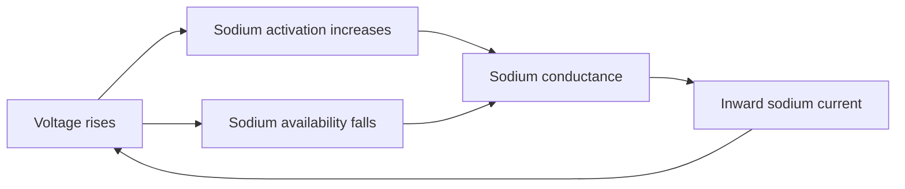

**Prediction confirmed.** Both regional blocks and the source closing-time
restoration were predicted to persist under refinement, and they do: the
blocks persist at a smaller time step and the restoration persists under joint
time and space refinement.

**Steep X.** The sodium inactivation closing-time factor. Its direct voltage
response is much larger than the pre-pulse change, and numerical changes are
smaller still.

**Action.** The source closing-time value is the lever that restores a
positive response in the diagnostic circuit. Time step, compartment size, and
pre-pulse period are not levers for this behavior. This explanation does not
establish a valid human spike, does not justify removing inactivation from the
default model, and does not identify a generally correct closing rate. The
electrical region map remains unqualified.

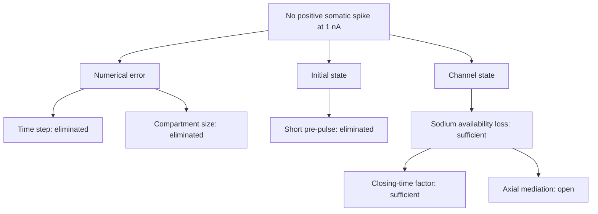

| Node | Split | Result | Evidence |
| --- | --- | --- | --- |
| N1 | Smaller time steps over the tested range | No positive spike; eliminated | [spike-time audit](evidence/h01-i-defaults-spike-time-audit.json) |
| N2 | Smaller compartments at the fine step | No positive spike; eliminated over the tested range | [spike-space audit](evidence/h01-i-defaults-spike-space-audit.json) |
| S1 | Longer pre-pulse period | Starting voltage changes; no positive spike; eliminated | [pre-pulse audit](evidence/h01-i-prepulse-audit.json) |
| C1 | Block availability loss in soma, axon, or both | Positive excursion in each case; persists at smaller step | [regional audit](evidence/h01-i-inactivation-regions-audit.json) |
| C2 | Restore source closing-time factor only | Positive excursion and recovery; persists under joint refinement | [source-value audit](evidence/h01-i-source-closing-refinement-audit.json) |
| C3 | Matched current balance, axon-only case | Reduced axial outflow explains the local rise; upstream segment not identified | [current balance audit](evidence/h01-i-regional-current-balance-audit.json) |
| rank | Direct response size of each intervention | Inactivation > pre-pulse >> numerical | [factor evidence](evidence/h01-i-factor-response-rss.md) |

## Y2. The transferred PV donor model does not retain its full response

**Behavior.** The frozen inhibitory donor model in BrainCell reproduces the
early spike peaks and widths of its source, but its later rise crossings drift
from event 7 onward (1.2 ms at event 8 over 270-329.5 ms at 0.27 nA). This
behavior concerns transfer on donor anatomy; it is separate from Y1.

**Explanation.** The drift is a spatial discretization difference, not a
simulator difference. The earlier comparisons matched the two meshes only by
mean segment length, so several dendritic branches held fewer BrainCell
compartments than NEURON segments. Copying the NEURON per-branch counts into
BrainCell is sufficient to remove the drift: with equal counts and the same
fixed step, the two simulators agree at every one of the eight events to below
1e-8 ms, and with equal counts against NEURON CVode the largest rise error is
0.044 ms, inside the 0.1 ms gate. Changing the NEURON integration from CVode
to a fixed step at the BrainCell dt moves no event by more than its gate, so
the integration scheme and the gate time level are not measurable contributors
at this dt.

**Prediction confirmed.** Stated before running: if mesh is the dominant
element, both matched-mesh cells pass and both MaxCVLen cells fail on rise
only. That pattern occurred. Halving dt in each simulator at the matched mesh
moved event 8 by 0.002 ms, so the gate is a valid decision limit.

**Steep X.** The per-branch compartment count.

**Action.** Every BrainCell-versus-NEURON comparison must copy the NEURON
per-branch counts (`--mesh-from`) rather than choose a maximum compartment
length. The earlier drift evidence and the axon-only 0.25 um control were read
through unequal meshes. This result qualifies the transfer for the first eight
events at this input and dt only; it does not identify a channel cause, does
not validate the human waveform, and does not cover the full 1270 ms train or
other inputs.

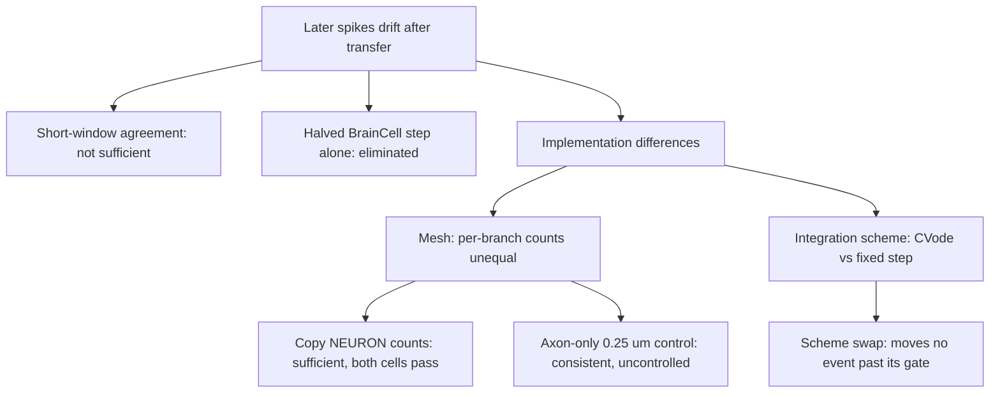

| Node | Split | Result | Evidence |
| --- | --- | --- | --- |
| W | Full-response comparison against the source | Early spikes agree; later events and counts differ | [full-response comparison](evidence/h01-pv-candidate-transfer-full.md) |
| T | Halve the BrainCell time step, physical parameters unchanged | First failed crossing remains outside the timing limit | [paired comparison](evidence/h01-pv-candidate-transfer-drift-halfdt-audit.json) |
| A0 | Refine only the BrainCell axon to 0.25 um | All gates pass 8/8; not a controlled swap | [axon-only control](evidence/h01-i-axon025-transfer-audit.json) |
| A1, B1 | 2x2 half-split: mesh x integration, everything else held equal | Decision "mesh": matched cells pass, MaxCVLen cells fail on rise; scheme swap within gate | [isolation split](evidence/h01-pv-transfer-isolation.md), [audit](evidence/h01-pv-transfer-isolation-audit.json) |

### Y2 registered prediction for SP2 (2026-09-07, no new observation)

Specification: [SP2 transfer isolation](specs/2026-09-07-h01-transfer-isolation.md);
manifest `evidence/h01-transfer-i-manifest.json`. No run has been made; this entry
registers the prediction before the first arm is launched.

**Prediction.** With the NEURON x9 per-branch counts copied (`--mesh-from`), the
BrainCell candidate passes every event of the full 270-1270 ms train at 0.19 and
0.27 nA against the CVode finalist reference and against NEURON fixed step at the
BrainCell dt: equal counts and every rise error within 0.1 ms (expected largest
0.044 ms, the eight-event value). The MaxCVLen 2.5 um control fails on rise from
event 7 as before. The 0.23 nA spent holdout behaves as the other two inputs.

**Rejection.** Any A1 event beyond its gate while the dt-halving pair at the same
mesh and dt is under half the gate on every event. If A1 fails at event k while the
NEURON fixed-step arm passes, the difference is an implementation difference at
event k and the next split is a channel-by-channel state comparison at that event;
if both fail, the time level is open and Y2 is reassessed rather than closed.

**Precondition found while preparing the arms.** The BrainCell I candidate profile
carries the pre-finalist somatic Kv3 closing factor 0.5; the finalist NEURON
reference carries 2.0. The scorer refuses to score until the registry re-key
registers a finalist I profile, so no full-train verdict can be read through the
present profile.

2026-09-07 (no observation): the registry now carries the non-default I mode `finalist`
(somatic Kv3 closing 2.0, everything else the candidate) and the E mode `b3`
([spec](specs/2026-09-07-h01-experimental-profile-modes.md)); the manifest names
`finalist`, `--check-alignment` reports no mismatch against `e-kv3-close2-027.json`, so the
held-equal alignment is checkable and scoring is no longer refused. Every arm is still
untested.

## Y3. The PV candidate's spike train differs from the human recording

**Behavior.** Against the human recording, the candidate's first spike lasts
too long, its post-spike minimum is too shallow and too late, its approach to
the first spike is too slow at low input, and at high input it does not
sustain late firing.

**Explanation.** Four partial mechanisms are supported; no single sufficient
condition reproduces the whole train.

1. *First-spike duration.* Faster sodium inactivation shortens the first spike
   while preserving spike generation, so inactivation timing contributes
   causally to the excessive duration. During the early fall, sodium
   activation remains high and the driving voltage grows, so inward sodium
   current can increase while the inactivation gate closes; Kv3 current
   opposes it.
2. *Peak.* At the observed soma peak, neighbouring soma membrane supplies
   axial current to the probe compartment and the attached dendrites draw
   current away. Net axial outflow balances most of the applied and net ionic
   inflow, so little current remains to change stored charge and the local
   voltage stops rising. The peak cannot be understood from sodium and
   potassium alone.
3. *Return and minimum.* Reducing somatic Ca_LVA conductance, increasing
   somatic Kv3 conductance, and faster Kv3 gating each advance the voltage
   return. Faster opening and faster closing have opposite effects on the
   falling crossing and the minimum, so the two phases are not
   interchangeable. Total duration can hide these opposing phase errors.
4. *Late firing.* Stronger axonal SK conductance is sufficient to reproduce the
   added first-spike delay seen when SK increases in both regions; the
   soma-only change is not. Calcium removal acts on concentration above rest,
   so slower removal alters later intervals while leaving first onset nearly
   unchanged; this separates a memory of prior activity from an immediate
   conductance change. A steeper inactivation curve restores late firing at
   high input; the raw slope parameter changes both equilibrium availability
   and gate speed, so the rescue is not attributed to either alone.

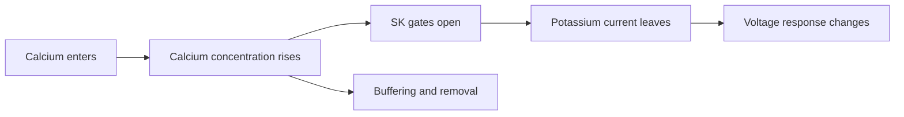

**Prediction confirmed.** The first-spike shortening from faster inactivation
persists across the two checked meshes. The high-input absence of late spikes
persists on the finer mesh. The slope rescue persists on the finer mesh, with
the first-return mismatch. On fine axonal meshes, the final-onset shift follows
the predicted squared-compartment-length dependence within the declared limit.

**Steep X.** Not separated across the whole train. Sodium inactivation timing
dominates first-spike duration. Early and late timing require separate
constraints; total spike count cannot establish the adaptation history.

**Action.** Calibration must constrain the post-spike minimum voltage and its
time from the peak, and the rising and falling phases separately. Interventions
that only change one of peak, minimum, or interval are not independent
controls: added somatic sodium advances onset and raises the peak; a Kv3
conductance increase also delays onset and narrows the spike; faster recovery
alone and slower recovery alone both fail to restore high-input late firing;
SK is not necessary for the second-spike delay after faster inactivation.
Somatic SK observations alone cannot explain the onset effect. None of the
tested candidates is a human waveform fit. Every Y3 result was obtained in
NEURON; the Y2 split shows that a BrainCell reading of these results requires
the copied per-branch mesh.

```mermaid
flowchart TD
    Y3[PV train differs from human] --> D[First-spike duration]
    Y3 --> P[Peak and onset]
    Y3 --> R[Return and minimum]
    Y3 --> L[Late firing and adaptation]
    D --> D1[Faster inactivation: shortens; contributes]
    D --> D2[Faster recovery alone: does not shorten]
    P --> P1[Axial outflow sets the peak]
    P --> P2[Somatic sodium density: not an independent onset control]
    P --> P3[Applied current alone does not set the local slope]
    R --> R1[Ca_LVA reduction: advances return]
    R --> R2[Kv3 conductance: advances return, shifts onset]
    R --> R3[Kv3 gating speed: opening and closing oppose]
    R --> R4[Minimum depth and delay: located, cause open]
    L --> L1[SK necessity for second-spike delay: eliminated]
    L --> L2[Axonal SK: sufficient for onset delay]
    L --> L3[Calcium removal and entry: change late intervals, not early]
    L --> L4[Recovery speed either direction: not sufficient]
    L --> L5[Steeper inactivation curve: restores high-input firing]
    L --> L6[Late-interval mesh sensitivity: axonal discretization]
```

| Node | Split | Result | Evidence |
| --- | --- | --- | --- |
| D1, D2 | Faster inactivation; faster recovery alone | Shorter first spike; recovery alone does not shorten; increased firing also without recovery change | [inactivation and recovery test](evidence/h01-pv-recovery-causal-test.md), [spatial robustness](evidence/h01-pv-inactivation-mesh-audit.json) |
| P1 | Local charge balance at the peak | Net axial outflow balances inflow | [charge balance](evidence/h01-pv-charge-balance-audit.json), [channel currents](evidence/h01-pv-spike-current-audit.json) |
| P2 | Somatic vs axon-only sodium increase | Somatic advances onset and raises peak; axon-only does not | [regional sodium](evidence/h01-pv-onset-sodium.md) |
| P3 | Independent local balance during the approach | Slower low-input approach consistent with axial and membrane flows | [onset balance](evidence/h01-pv-onset-balance.md) |
| R1 | Reduce somatic Ca_LVA | Deeper, later minimum; reaches falling levels earlier relative to peak; still lags human | [conductance split](evidence/h01-pv-calva-return.md), [falling crossings](evidence/h01-pv-return-crossings.md) |
| R2 | Increase somatic Kv3 conductance | Advances return, deepens minimum, delays onset, narrows spike | [Kv3 split](evidence/h01-pv-kv3-return.md) |
| R3 | Faster Kv3 gating; opening vs closing | Smaller onset shift; opening and closing give opposite return effects; exact equivalence rejected | [timing split](evidence/h01-pv-kv3-fast.md), [phase comparison](evidence/h01-pv-kv3-phases.md) |
| R4 | Direct minima against the recording | Minimum too shallow and too late; cause not isolated | [direct minima](evidence/h01-pv-postspike-minima.md) |
| L1 | Remove SK after faster inactivation | Second-spike delay persists | [SK necessity](evidence/h01-pv-sk-necessity-audit.json) |
| L2 | Axonal vs somatic SK increase | Axonal sufficient for first-spike delay; somatic not | [regional SK](evidence/h01-pv-sk-region-audit.json) |
| L3 | Calcium removal, entry scaling, and their combination | Late intervals change with little first-onset change; entry scaling overshoots and is rejected; early and late timing need separate constraints | [calcium removal](evidence/h01-pv-calcium-candidate-audit.json), [adaptation comparison](evidence/h01-pv-opening-adaptation.md), [entry scaling](evidence/h01-pv-calcium-entry.md), [burst comparison](evidence/h01-pv-burst-adaptation.md), [response-time comparison](evidence/h01-pv-calcium-response.md) |
| L4 | Faster recovery; slower recovery | Neither restores high-input late firing; recovery speed does not test equilibrium sodium | [recovery split](evidence/h01-pv-recovery-rescue.md), [opposite direction](evidence/h01-pv-recovery-slow.md), [gate account](evidence/h01-pv-gate-equilibrium.md) |
| L5 | Steeper inactivation curve | Restores high-input late firing; first return still too slow and too shallow | [slope intervention](evidence/h01-pv-slope5.md) |
| L6 | Refine axon, soma, or dendrites alone | Only axonal refinement reproduces the late-interval change | [regional mesh](evidence/h01-pv-regional-mesh.md) |

### Y3 under the recorded input

**Behavior.** Every Y3 result above used bias 0. The recordings carry a
31.445 pA acquisition bias at both calibration inputs
([input datum](evidence/h01-pv-input-datum.json)). With that bias applied from
t = 0, the source fires 22 and 39 events (human 12 and 43) with a first peak
24.8 mV too high, and the frozen candidate fires 26 and 59 with the peak within
2 mV. Every passive sample sits 2.0 to 4.1 mV above the human sample in both
models. The zero-bias residuals are retired; the bias is part of the input.

**Explanation.** Within the candidate's five sub-systems, the count is an
interdependency of three. Fast sodium inactivation (G1a, closing-time factor
0.15) is necessary and sufficient for the human-like first spike: every cell
with it has the peak within 4.4 mV and the duration within 0.05 ms; every cell
without it has the peak 23 mV too high and the duration 0.47 ms too long. The
same change raises every recovery minimum by about 6 mV and raises excitability
so that, without the somatic density change (G4), the cell blocks at 0.27 nA.
G4 is necessary, given G1a, to sustain firing at 0.27 nA. Axonal calcium
handling (G3) is the brake on both counts: removing it gives 84 and 143 events;
adding it to the source gives 5 and 8. The inactivation slope (G1b) has no
measurable effect. Somatic Kv3 gating (G2) has the largest complete effect on the
minima but does not reverse the shift that G1a introduces.

Every one of the eight matrix cells has a high-to-low count ratio between 0.04
and 2.3 against the human 3.6. No member of the partition moves the low-input
count without the high-input count. The passive samples are unchanged by every
swap. The threshold under the recorded bias is therefore set outside G1 to G4,
by leak, leak reversal, or Ih; that family was not tested.

**Prediction confirmed.** Stated before each stage: the source and candidate
over-fire with bias; mesh refinement moves no early row; the G1a and G3 pair
alone would not reproduce the count if a third player existed, and it did not
(source plus G1a plus G3 blocks at 0.27 nA with 3 events); the three missing
matrix cells fell where predicted (99/4, 7/11, 26/45). One prediction was
refuted: G1b was predicted to carry the count and carries nothing.

**Steep X.** None for the count. Sparsity holds per observation: G1a for the
first-spike shape, G3 for the count level, G4 for high-input block.

**Action.** The frozen I candidate fails the contract at 19 of 24 evaluations
([result](evidence/h01-i-campaign-result.md)). The diagnostic H01 closing-time
override is the G1a member seen from the other side: removing it restores the
source's shape error. The next split, if approved, is a bounded passive-family
dose on the cell with G1b, G2, and G4 on the source (24 and 43 events, minima
within 2.1 mV) using the five reserved evaluations. The source's own count
under the recorded input (22 versus 12) also asks whether the published fit
applied this bias; that is a source-protocol question, not a model split.

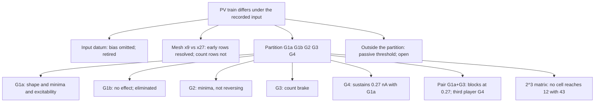

| Node | Split | Result | Evidence |
| --- | --- | --- | --- |
| IN | Candidate with recorded bias | 26 and 59 events; minima unchanged | [input datum](evidence/h01-pv-input-datum.json) |
| M | Candidate at x9 and x27 with bias | Early rows within 0.05 ms and 0.2 mV; counts 26/59 vs 25/53 | [Stage 0](evidence/h01-i-campaign/stage0-decision.json) |
| P1-P5 | Each sub-system into the source and out of the candidate | Count changes G1a +43/-36 and -21/-50; G3 -17/-31 and +58/+84; G4 0/-1 and -2/-55; G2 +2/+6 and -6/-18; G1b 0/0 and -2/-1 | [Stage A](evidence/h01-i-campaign/stage-a-decision.json) |
| P6 | G1a with G3 into the source and out of the candidate | 17/3 and 24/43 | [Stage B](evidence/h01-i-campaign/stage-b-decision.json) |
| P7 | Three missing cells of the matrix | 99/4, 7/11, 26/45 | [Stage C](evidence/h01-i-campaign/stage-c-decision.json), [matrix](evidence/h01-i-campaign/stage-c-matrix.json) |

### Y3 under the energetic search (2026-09-06, supersedes the mechanism statements above)

The subsections above name sub-systems as causes. Under the book's rule that a
causal explanation states necessary and sufficient conditions and the mechanism,
not a structural label, Y3 is restated from the Stage 3 charge budgets
([result](evidence/h01-i-energetic-result.md), budgets closing to 1e-15 pC).

**Input datum.** The recorded 31.4 pA is a holding current the published fit
absorbed: the model at zero bias rests within 0.07 mV of the human held baseline
and with the bias 2.4 mV above it ([forensics](evidence/h01-pv-bias-forensics.md)).
Every statement below is under the command-only input; every bias-on residual
above is retired, including the "+2 to +4 mV passive family".

**Behavior.** Short spike (peak +19 mV, fall −336 V/s, threshold −60.5 mV),
trough −79 mV, early burst of 6 to 10 ms cycles, then 25 to 120 ms cycles with
the threshold climbing to −52 mV.

**Explanation.** The loop requires that sodium inflow end within the upstroke:
0.18 pC of sodium through the fall against 3.5 pC in the published fit, so that
0.5 pC rather than 3.8 pC of potassium repolarises the soma and the net current
reverses at +18 mV rather than +44 mV. The trough requires somatic Kv3 (block
without it) and is set by the potassium activation carried past the end of the
short spike: its tail below −73 mV carries the soma, and through the 0.16 nA
axial path the coupled dendrites, to −80 mV before the passive return balances.
The trough is not a local balance (0.036 nA of Kv3 at the trough at −73 and at
−80 mV) and not a total-charge effect (0.53 to 0.62 pC through the fall); opening
and closing rates are one interdependent lever, and somatic Ca_LVA opposes the
depth by about 1 mV per unit of density. The count and late cycles require
axonal SK accumulating cycle to cycle (57 and 138 spikes without it).

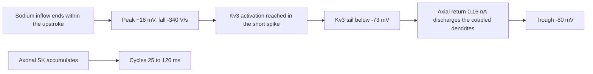

**Prediction, partly confirmed.** Written before the 0.23 nA holdout was opened:
trough −79.5 ± 0.8 (observed −79.4, human −78.9), fall −345 ± 5 (−345, human
−327), peak 17.7 ± 0.3 (17.8, human 18.9), threshold −60.9 ± 0.3 (−60.9, human
−61.0), late trough −80.4 ± 0.5 (−80.4, human −79.6). Predicted failures: count
24 to 28 (26, human 31), late threshold −60.5 (−60.4, human −55.2). Bands
missed: cycle 2 predicted 22 to 27 ms (observed 20.7), late cycle 45 to 55
(43.6). Unpredicted failure: late fall −334 against −294. These passes are at
the repeatability limits (peak 2.07 mV); against the approved contract (exact
count, 1 mV) the holdout fails on count and on the first peak by 0.15 mV, so
the finalist is not an accepted cell ([record](evidence/h01-prediction-i.md)).

**Steep X.** Elemental family (Matryoshka, [decision](evidence/h01-matryoshka2-decision.md)):
the loop, then the trough. Both are now inside the human repeat limits at three
inputs.

**Action.** The pair of unexplained rows, the post-trough drive (early burst)
and the accommodation along the train, is returned to the user with one
evaluation in reserve. Neither is somatic Ca_LVA (Stage F). They lie in the
cyclical and temporal families and point at a slow state the model lacks.

| Node | Split | Result | Evidence |
| --- | --- | --- | --- |
| R | Charge per boundary per cycle, source and candidate | Sodium through the fall 3.5 vs 0.18 pC; Kv3 3.8 vs 0.53 pC; closure 1e-15 pC | [budgets](evidence/h01-i-energetic-stage-r-budgets.md) |
| X | One boundary removed at a time | Kv3 necessary (block); Ca_LVA opposes trough 1.4 to 2.1 mV; SK is the count brake | [budgets](evidence/h01-i-energetic-stage-x-budgets.md) |
| D | Kv3 closing swapped both ways | No reversal (1.4 to 1.8 and 1.0 mV) | [budgets](evidence/h01-i-energetic-stage-d-budgets.md) |
| E | Opening 0.5× with closing 1× and 2× | Trough −80.1/−79.0 and −81.7/−80.7 mV; loop unchanged; burst lost | [budgets](evidence/h01-i-energetic-stage-e-budgets.md) |
| F | Ca_LVA 1.0 and 2.0 on the deep arm | Trough +1 and +3 mV; cycle 2 shortens 1 to 8 ms (limit 12.8): not the drive | [budgets](evidence/h01-i-energetic-stage-f-budgets.md) |
| P | Holdout 0.23 nA | Claimed rows pass; predicted failures occur | [prediction](evidence/h01-prediction-i.md) |

### Y3 trough audit (2026-09-07, SP4 stage 0; narrows the open post-trough row, does not close it)

**Observed.** On the retained finalist traces (`e-kv3-close2`, command-only input,
x9 mesh, CVode 1e-10; [audit JSON](evidence/h01-i-trough-audit.json),
[decision](evidence/h01-i-reserve/stage-0-decision.json)) the somatic NaTg
inactivation gate has recovered by the time the human refires: soma h at the
trough is 0.88 to 0.90 (0.19 nA) and 0.82 to 0.85 (0.27 nA); at trough + 6 ms it
is 0.986 to 0.988 and 0.976 to 0.982 (medians 0.988 and 0.983, both above the
pre-registered 0.7); at trough + 10 ms 0.977 to 0.982 and 0.944 to 0.969. Somatic
Kv3 m has fallen to 0.001 by trough + 6 ms. The soma sits at -77 to -75 mV
(0.19 nA) and -74.3 to -70 mV (0.27 nA) 6 to 10 ms after the trough, 15 to 20 mV
below the -60.5 mV threshold, and the recorded axon midpoint is 0.7 to 1.5 mV
*below* the soma throughout the trough and its recovery (e.g. -80.5 against -79.0
at the 0.27 nA cycle-1 trough). The axial current into the soma from its
neighbours is outward at every trough sample: -0.16 nA (0.19 nA) and -0.23 to
-0.26 nA (0.27 nA). The source (published fit) at the same cycles has soma h 0.49
to 0.62 at the trough and 0.86 to 0.95 at trough + 6 ms, refiring within 5.8 ms
at 0.27 nA; its axon also sits 3 to 8 mV below its soma.

**Reading.** Sodium availability at the soma is not what limits the finalist's
refiring: the gate is 98 % available within 6 ms, above the level at which the
source refires. What is absent after the trough is an inward drive: no compartment
adjacent to the soma is depolarised relative to it, and the axon probe is more
hyperpolarised than the soma. Y3's open post-trough row is therefore narrowed
from "drive or recovery/availability" to drive on the existing axon-first
initiation pathway; the reserve evaluation registered in
`evidence/h01-i-reserve-manifest.json` (axonal NaTg x1.5 with the somatic x1.1
retained, cap 1, not yet run) tests whether axonal sodium density supplies it.
Nothing here closes the row: the audit is a reading of state, not an intervention,
and the drive's boundary is still unidentified.

| Node | Split | Result | Evidence |
| --- | --- | --- | --- |
| A | Soma NaTg h at trough, +6, +10 ms, finalist vs source, both inputs | 0.98 at +6 ms in the finalist (rule: >= 0.7); source 0.86 to 0.95 | [audit](evidence/h01-i-trough-audit.md) |
| A | Axial current into the soma and axon-soma difference after the trough | Outward -0.16 / -0.23 nA; axon 0.7 to 1.5 mV below the soma | same |

## Y4. The layer-2 excitatory candidate fires with wrong timing and recovery

**Behavior.** Under the recorded 110 pA input (sweep 43) the candidate does not fire and
its voltage shows excess depolarization and the wrong post-pulse return. Under
the active input it fires the recorded five spikes. The first interval is
8.32 ms too short and the second is 51.57 ms too long. The fifth onset is
64.48 ms late. Individual recovery minima and spike phases also differ from
the human datum. Count agreement does not establish response agreement.

**Explanation.** No single parameter family is sufficient for the combined
response; two families act on separate observation groups. Calcium handling
(F3, the somatic removal time) is necessary for the five-event count and sets
the late intervals: removing it from the candidate restores a sixth event and
the source's negative late-interval errors, and adding it to the source removes
an extra event. The passive and Ih family (F5, distributed Ih with a shifted
passive reversal) alone sets every subthreshold sample: without it the 1120 ms
residual is 1.76 mV in every run, with it 0.39 mV. Added together to the source
these two families are sufficient for a five-spike train whose interval errors
are all within 10.5 ms and for the candidate's subthreshold residuals, but they
leave the recovery minima at the source's values (first minimum 1.6 mV too
negative, second 4.4 mV). The remaining families, sodium gate law (F1), Kv3
gate law (F2), and somatic sodium density (F4), are what move the minima
toward the human values, and the same three push intervals 2 and 4 late
(+52 ms and +21 ms in the frozen candidate). Somatic sodium density carries the
rising and falling phases. The frozen candidate is therefore a trade: minima
bought with interval error.

**Prediction confirmed.** Stated before the paired swap: adding F3+F5 to the
source gives five events and the candidate's subthreshold residual; removing
them from the candidate gives extra events, negative late intervals, and the
source's subthreshold residual. Five of six checks held. The miss was the
prediction that intervals 2 and 4 would be positive like the candidate's; they
are -0.07 ms and +10.5 ms, which locates the candidate's late intervals in
F1/F2/F4 rather than in F3/F5. At CVode 1e-11 the added-pair run changes no
ranked residual by more than its numerical limit; the removed-pair run changes
two event-3 phase residuals by 0.00044 ms against a 0.00042 ms limit, so those
two phase contrasts are within solver noise while every count, interval,
minimum, and subthreshold contrast is unaffected.

**Steep X.** Per observation group, not pooled: intervals and event count, F3;
subthreshold samples, F5; rising and falling phases, F4; recovery minima, none
separated (F4, F1, F2 within a factor of 1.2 of each other). The pooled
normalized RSS names no family, because the groups have different scales.
Coarse mesh (nseg 3) was rejected as a search setting at Stage 0.

**Action.** Omitted bias, a constant voltage offset, solver tolerance, mesh,
somatic Ih density alone, Ih location alone, uniform leak, and passive reversal
alone are not sufficient levers; each was tested. The family search replaces
single-parameter tuning: the next split is inside F1, F2, and F4, on the
source-plus-F3-plus-F5 base, asking which member deepens the minima without
lengthening intervals 2 and 4. A close late voltage, a correct event count, or
accurate peaks does not establish the correct dynamic response. The
[acceptance table](evidence/h01-l2-acceptance-table.md) fixes every required
observation; no allowance is agreed, so no candidate passes. See the
[campaign result](evidence/h01-l2-campaign-result.md) and the
[validation reassessment](specs/2026-09-05-h01-validation-reassessment.md).

```mermaid
flowchart TD
    Y4[Layer-2 candidate: wrong timing and recovery] --> B[Input and datum]
    Y4 --> Q[Subthreshold shape]
    Y4 --> A[Active train]
    B --> B1[Omitted bias: eliminated]
    B --> B2[Constant voltage offset: eliminated]
    Q --> Q1[Ih density x2: eliminated]
    Q --> Q2[Ih location: eliminated]
    Q --> Q3[Uniform leak: eliminated]
    Q --> Q4[Distributed Ih amount: return sign changes, shape fails]
    Q --> Q5[Passive reversal: changes late direction, amplitude wrong]
    A --> A1[Faster calcium removal: shortens late intervals]
    A --> A2[Slower NaTs opening: lengthens rise, lowers peaks]
    A --> A3[NaTs opening plus density: peaks within 0.40 mV; minima too negative]
    A --> A4[Kv3 closing halved: removes four spikes]
    A --> A5[Kv3 closing minus 10%: five spikes, minima improve]
    A5 --> A6[Calcium removal 657 ms: later intervals closer]
    A --> A7[Sodium recovery while availability rises: worsens intervals 2-3]
    A --> A8[Somatic sodium density 0.9: delays onset, worsens intervals]
    A --> A9[Slower somatic calcium removal: later intervals lengthen]
    Y4 --> FAM[Conditional effects: no single family controls the full response]
    FAM --> FC[Calcium change needed for five spikes in full-candidate context]
    FAM --> FP[Calcium plus Ih/leak gives five spikes in source context]
    FP --> FT[Same count; different second interval]
```

| Node | Split | Result | Evidence |
| --- | --- | --- | --- |
| B1 | Add the recorded negative bias | Delays first spike; extra events remain; initial offset nearly removed in sweep 43 (110 pA) but adaptation and return still wrong | [bias split, active](evidence/h01-l2-recorded-bias-result.md), [bias split, subthreshold](evidence/h01-l2-sweep43-bias-result.md) |
| B2 | Subtract the starting voltage | Excess depolarization and wrong return remain | [subthreshold comparison](evidence/h01-l2-midpoint-sweep43-comparison.md) |
| Q1 | Double somatic Ih density | Adaptation and below-baseline return not restored | [Ih split](evidence/h01-l2-sweep43-ih-result.md) |
| Q2 | Move Ih to uniform soma and dendrite, same total | Shape not restored | [location split](evidence/h01-l2-ih-location-result.md) |
| Q3 | Increase regional passive leak together | Late depolarization reduced; adaptation not restored; two spikes where reference has five | [leak split](evidence/h01-l2-sweep43-leak-result.md), [active check](evidence/h01-l2-leak-active-result.md) |
| Q4 | Larger distributed Ih amount | Return slightly below start; start shifts up; adaptation wrong | [amount split](evidence/h01-l2-distributed-ih75-result.md) |
| Q5 | More negative passive reversal with Q4 fixed | Late response rising to falling; five spikes under active input; every interval too long | [passive-reversal split](evidence/h01-l2-leak-reversal-result.md), [active response](evidence/h01-l2-reversal-active-result.md), [separate phases](evidence/h01-l2-reversal-spike-phases.md) |
| A1 | Faster calcium removal in the Q5 setting | Later intervals shorten; one overshoots; minima unchanged | [removal split](evidence/h01-l2-reversal-calcium125-result.md) |
| A2 | Slower NaTs opening | Rise lengthens; peaks too low; three minima too shallow | [opening split](evidence/h01-l2-sodium-opening-result.md) |
| A3 | Slower opening plus more NaTs conductance | All five peaks within 0.40 mV; minima too negative; later spikes late; subthreshold directions preserved | [density split](evidence/h01-l2-sodium-opening-density130-result.md), [subthreshold response](evidence/h01-l2-density130-subthreshold-result.md) |
| A4 | Halve Kv3 closing time | One spike; sustained depolarized response | [closing split](evidence/h01-l2-kv3-closing-half-result.md) |
| A5 | Reduce Kv3 closing time by 10% | Five spikes; three minima within 0.19 mV; second minimum too negative; first interval too short | [smaller split](evidence/h01-l2-kv3-closing-ninety-result.md) |
| A6 | Removal time 679.277 to 657.046 ms on A5 | Each later interval shorter and closer; first interval changes 0.013 ms; second interval still too long | [calcium split](evidence/h01-l2-kv3-ninety-ca133-result.md) |
| A7 | Slow sodium recovery only while availability rises | First interval lengthens; next two interval errors worsen | [layer-2 sodium split](evidence/h01-l2-sodium-recovery-result.md) |
| A8 | Somatic sodium density 0.9 | First spike delayed and lower; narrower; first three interval errors worsen | [density split](evidence/h01-l2-sodium-density090-result.md) |
| A9 | Slower somatic calcium removal | Later intervals lengthen; first peak and minimum unchanged; first interval still too short | [layer-2 removal split](evidence/h01-l2-calcium-removal-result.md) |
| FAM | Forward and reverse family changes, then paired changes | No single pooled RSS dominant family; five-spike count does not determine the individual intervals | [campaign results](evidence/h01-l2-campaign-result.md), [active tolerance audit](evidence/h01-l2-paired-active-tolerance-audit.json) |

### Y4 under the approved contract: the F1, F2, F4 matrix

**Behavior.** With calcium handling (F3) and the passive-Ih family (F5) on the
source, the eight combinations of the sodium gate law (F1), the Kv3 gate law
(F2), and the somatic sodium density (F4) all fire five events and all fail the
contract ([matrix](evidence/h01-e-campaign2/stage-a-decision.json)).

**Explanation.** The base (no F1, F2, F4) has interval 2 within 0.1 ms and the
second recovery minimum 4.4 mV too negative. Each member that raises the minima
lengthens interval 2: F1 raises them 2.1 mV (0.9 mV net reduction of the
absolute error) for 12 ms, F2 raises them 1.9 mV (1.1 mV net) for 27 ms, F4
lowers the minima further. No member, and no pair, raises the second minimum to within
1 mV without pushing interval 2 past 1 ms; the two rows are coupled through the
same channels in this model. The late subthreshold samples (1520 to 2120 ms)
are 1.2 to 1.7 mV too positive in every cell to 0.01 mV: F1, F2, and F4 do not
touch them, and F5 as defined fixes the onset region only. That row family
therefore names a sub-system outside F1 to F5, the late return under
hyperpolarising input, which is set by Ih kinetics or leak, not by the spike
channels.

**Prediction confirmed.** Stated before the six runs: F1 and F2 move the minima
toward zero and F4 away; F2 carries most of interval 2; no cell passes minima
and crossings together. All held. The dose split was not run: a dose of F1 or
F2 cannot pass the subthreshold rows, so it cannot change the verdict.

**Steep X.** None. F2 for interval 2, F1 for the minima per unit interval,
F4 for the rising and falling phases (0.11 ms with, 0.17 ms without).

**Action.** The E campaign fails at 6 of 24 evaluations
([result](evidence/h01-e-campaign2-result.md)). The next split, if approved, is
inside the passive-Ih family on the base cell: the Ih time constant and the
leak conductance against the ten subthreshold samples under 0.11 nA, before any
spike-channel dose. Eighteen evaluations remain in reserve.

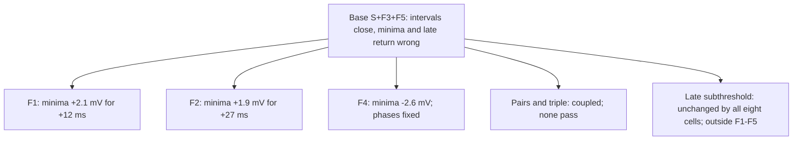

### Y4 under the energetic search (2026-09-06, supersedes the mechanism statements above)

Restated as conditions and mechanism from the Stage 3 charge budgets
([result](evidence/h01-e-energetic-result.md), closure 1e-14 pC). Under the
Isolation limits the one unmistakable row is the maximum rise rate (human 351
V/s, candidate 641, source 1019: 48 to 115 units); threshold (+3 mV), peak,
minimum and fall are real or parked, and the "late subthreshold return" is
inside two human repeat limits ([isolation](evidence/h01-isolation-decision.md)).

**Explanation.** The soma's dV/dt equals the sodium current it receives minus
the axial, potassium and leak currents, over its capacitance. At the fastest
rise 85 to 90 percent of the 2.5 to 3.1 nA of somatic sodium leaves axially,
so the rate is load-limited: doubling the dendritic capacitance lowers it from
641 to 480 V/s (predicted 496), but the same sodium must reach +36 mV and the
peak falls 6 mV with the trough 8 mV shallower; halving the sodium collapses the
spike. The human's shoulder (100 to 250 V/s near −45 mV before the main rise)
is the mark of a spike arriving from an initiation site through the axial path,
with the somatic sodium activating later from −56 mV to carry the peak. That
condition cannot hold in Allen 626170538: the genome places every active
conductance in the soma and leaves the axon stub, dendrites and apical tree
passive. The Steep X is outside the model family.

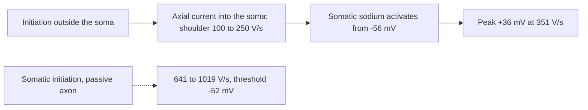

**Prediction.** Load arm confirmed on the rise rate, failed on the peak (Stage
X); initiation arms could not run (no axonal sodium row, Stage Y). Holdout
sweep 53 prediction: [record](evidence/h01-prediction-e.md).

**Action.** The family change (an initiation site in the axon) is the user's
decision; two evaluations of about 15 minutes each would test it.

| Node | Split | Result | Evidence |
| --- | --- | --- | --- |
| R | Charge per boundary at the fastest rise | Sodium 2.5 to 3.1 nA, axial 2.2 to 2.6 nA, capacitive 0.4 to 0.7 nA | [budgets](evidence/h01-e-energetic-stage-r-budgets.md) |
| X | Sodium halved; dendritic capacitance doubled | Collapse; rise 480 V/s with peak −6 mV and trough +8 mV | [budgets](evidence/h01-e-energetic-stage-x-budgets.md) |
| Y | Axonal sodium tripled | No sodium row in the axon: perisomatic fit | [decision](evidence/h01-e-energetic/stage-y-decision.json) |

## Y5. Synaptic delivery in the illustrative H01 pair

**Behavior.** In the prior illustrative pair (`810151953`, `678539249`), an E output event is followed by a
delayed conductance increase and a voltage rise in I, and I does not fire. With
the I model using the source closing-time restoration, an I event is followed
by an earlier fall and a later spike in E.

**Explanation.** The E-to-I projection is necessary and sufficient for the
initial I voltage rise: removing only that projection removes the conductance,
and the I voltage is unchanged before delivery and rises when conductance
arrives. The I-to-E projection is necessary and sufficient for the E delay:
removing only that projection preserves the I response and the E voltage
before arrival. A synaptic conductance moves voltage toward its reversal
potential and changes the load seen by other current sources, so an inhibitory
conductance can delay excitation without a negative voltage change. With both
contacts enabled, the delayed E event delays the arrival of excitation at I, so
an inhibitory timing change propagates through the next connection.

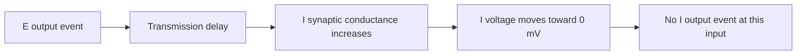

**Prediction confirmed.** The E delay persists at both tested time steps.

**Steep X.** Not applicable; each projection was tested by removal.

**Action.** Delivery alone does not establish a firing response or inhibitory
feedback. Both cells receive external input in the four-way check, and I fires
before E input arrives, so the circuit does not show that E recruits I or that
activity sustains itself. The contacts are inferred; these conclusions apply to
the diagnostic model, not to a measured connection in the donor, and full
numerical and human qualification remain open.

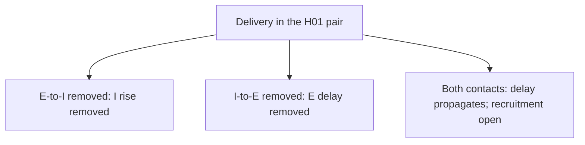

| Node | Split | Result | Evidence |
| --- | --- | --- | --- |
| E1 | Remove only the E-to-I projection | Conductance and voltage rise removed; no I event either way | [E delivery audit](evidence/h01-ei-circuit-e-delivery-audit.json) |
| I1 | Remove only the I-to-E projection | E fires earlier without inhibition; delay persists at both steps | [I delivery audit](evidence/h01-i-restored-circuit-delivery-audit.json) |
| F1 | Both contacts, both cells driven | Delayed E event delays excitation at I; I fires before E input arrives | [four-control audit](evidence/h01-i-restored-four-control-audit.json) |

The measured default uses a different pair: I `5584343344` to E `4157825456`.
Its source endpoint identities and cable placements are checked. Those checks
establish the anatomical path, not its physiological response. The delivery
results above must not be transferred to this pair without a direct test.
The synthetic wiring fixture confirms the same implementation rule: with E
above the inhibitory reversal potential, a delivered conductance lowers E
voltage; removing only the edge removes that effect. Qualification of the
default profiles' firing and full numerical robustness remains open.

### Y4 under the usable-tier campaign (2026-09-07, supersedes the energetic-search statement)

The energetic search closed Y4 as a structural FAIL: a perisomatic fit cannot make
the human's two-stage upstroke. The usable-tier campaign
([result](evidence/h01-e-usable-result.md)) changed the family and searched it in
eight evaluations.

**Explanation.** Threshold and upstroke shape require an initiation site outside the
soma: with transient sodium in the axon stub the axon reaches threshold first and
drives the soma through the axial path, which is the dV/dt plateau the human shows
from −52 to −42 mV; the somatic sodium then carries the peak, and its density sets
the main rise and peak (0.9 lands 659 V/s and 37.8 mV without block). The late rate
and the count are set by the resistance the calcium displacement builds cycle to
cycle (SK driven by the calcium pool): halving SK and speeding calcium removal act
additively on the late cycles (246 → 134 ms at 310 pA) without moving threshold,
peak, trough or width. The early cycles are set by the supply reaching threshold and
were already right.

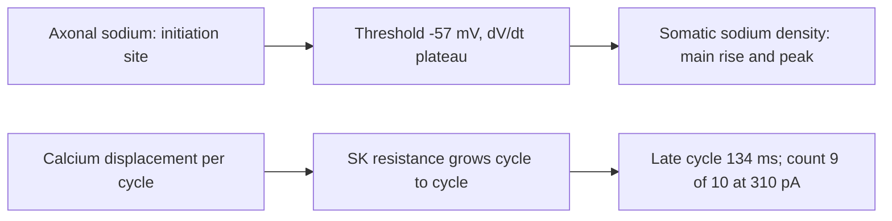

**Predictions.** Every stage's bands were written first; misses recorded: the shoulder
form (plateau, not a local maximum), the 0.65 arm's trough (block), the B0 count
(initiation does not set it), the SK band by 9 ms, the leak arm's AHP clause.

**Not explained.** The last 10 to 20 ms of late cycle, the rise excess over 351 V/s
(dendritic load), the width (1.01 against 0.91 ms), the resting potential (−84 against
−72). Sweep 55 was not opened; the cap closed first.

### Y4 registered predictions for the gain split (SP3, registered 2026-09-07, no observation yet)

No run has been made; this block records what was predicted so that a miss can later be
scored against the prediction. Spec: [gain split](specs/2026-09-07-h01-e-gain-split.md);
manifest `docs/evidence/h01-e-gain-manifest.json` (cap 4, `prior_evaluations 0`).

**Matryoshka reading (from retained tables, no run).** The frozen B3 profile's counts
5/8, 10/10, 13/12 (human/model at 250/310/350 pA) give a human f-I slope of 0.083
spikes/pA between 250 and 310 pA against a model slope of 0.033 (0.075 vs 0.050 between
310 and 350; 0.087 vs 0.039 Hz/pA in mean-full-cycle rate). Late cycles are uniform within
each input (model 184-157 ms at 250 pA, 121-116 ms at 310 pA), so the error is a gain error
repeating across cycles, not an adaptation error; SK doses translate the curve and cannot
rotate it. Rest -84 vs literature -72 mV is parked because the donor's own pre-pulse
samples match the model within 1 mV. Controlling property named: a current present
between spikes at low input and absent at high input, distributed Ih or the linear leak.

**Registered predictions.**

| Stage | Arm | Prediction | Rejection |
| --- | --- | --- | --- |
| 0 | `g0-b3` (B3 at sweeps 43, 50, 53, 56) | sweep-43 onset and late-return rows within 1 mV; sweep-56 count 1 (five human repeats, range 0, exact) and first-spike latency within the repeat limit; 250/310 reproduce 8 and 10 spikes | sweep 43 fails 1 mV: B3's Stage B levers broke F5; G arms judged on the change of the 43 rows |
| G | `g1-ih-half` (`ih_density_factor 37.5`) | 250 pA count 5-7, late cycles >= 200 ms; 310 pA count 9-10, rate within 1.5 Hz; baseline -1 to -3 mV; sweep-43 return moves <= 1 mV; 200 pA count 1 | 310 count < 9, or 250 count still >= 8 |
| G | `g2-leak-150` (`leak_factor 1.5`, reversal unchanged) | both counts fall, 250 pA proportionally more (250 <= 6, 310 >= 8); 200 pA count 0-1 | 250 and 310 fall by the same spike count (pure shift) |
| G3 | reserve dose of the better arm (dose written into `stage-g-decision.json` first) | 250 count 5 +/- 1, 310 rate within 1.5 Hz, sweep 43 within 1 mV, 200 count 1 | as the chosen arm |

**Status.** Y4 stays open. Sweep 54 (330 pA) is sealed as the new E holdout
(`h01-prediction-e3.json` must exist before export; its Allen count metadata, 12 spikes, was
visible). PASS at cap promotes nothing without the SP2 transfer gate; FAIL at cap names the
reassessment (gain set outside the passive family: human slow Na inactivation or Kv7/M
kinetics absent from the Allen genome, or a second human L2/3 donor with a recorded f-I
curve). The observation entry replaces this block when `stage-g0-decision.json` and
`stage-g-decision.json` land, in the same commit.

### Y5 under the population edge list

The C3 relationship-index scan of all 104 proofread cells returns 123
candidate directed contacts on 31 pairs, of which 3 are endpoint-verified in
the proofread volume; the I-to-E default 8105899 is one of them
([edge list](evidence/h01-resolved-edge-list.json)). The only E-to-I
candidate between the measured pair, 54906016, reads the I cell one slice from
its postsynaptic voxel and background at its presynaptic voxel, so the
reciprocal E-to-I projection is not measured. The E-to-I conclusions above
remain statements about illustrative wiring. The circuit ships the measured
I-to-E contact as default and the E-to-I contact only as an opt-in labelled
inferred.

In the measured pair, the recorded I contact voltage stays below -80 mV under
the stated 1 nA soma pulse. It emits no event. The initially empty synapse
therefore receives no event, and its conductance stays zero. This locates the
missing delivery before the synapse response. The recorded I soma reaches
only -29.53 mV. Every one of the 14,685 I compartments remains below
-29.41 mV in the complete sampled 8 ms baseline. There is no hidden positive
excursion elsewhere in that record. The full-compartment recorder preserves
the circuit soma, contact, conductance, and event traces exactly.
[Direct response](evidence/h01-measured-ie-first-response-audit.json),
[all-compartment check](evidence/h01-measured-i-allcv-baseline-audit.json).

More soma depolarization does not ensure an output event in this model.
At 2 nA the I soma reaches -13.92 mV, but the contact-voltage change is at
most 0.0394 mV compared with 1 nA. The contact still emits no event.
E voltage and conductance remain exactly unchanged. Thus, the larger soma
response does not cross the modeled event-delivery boundary. It does not
by itself separate failed spike initiation from failed propagation.
[Direct input split](evidence/h01-measured-ie-i2na-response-audit.json).

At the original 1 nA input, changing only the I sodium-inactivation closing
time from its candidate factor of 0.15 to 1 produces a complete soma
excursion through -20 mV, with peak +34.07 mV. The pre-pulse traces are
exactly unchanged. Thus, the closing-time change controls the loss of this
soma excursion in the tested model context. The measured contact emits at
8.355 ms and peaks at +28.25 mV at 8.465 ms. The first 8 ms of the longer
record match the earlier circuit exactly. Thus, the earlier absence of a
contact event in this condition was caused by ending observation too soon.
This is a diagnostic channel law, not a human-qualified replacement.
[Closing-time response](evidence/h01-measured-ie-source-closing-response-audit.json),
[complete contact arrival](evidence/h01-measured-i-source-closing20-audit.json).

Direct CV traces show the excursion reaching successive locations along
the modeled soma-to-contact path. Each curve below is a local voltage,
not a spatial average. The dashed line marks the earlier observation limit.
[Locations and samples](evidence/h01-measured-i-propagation-audit.json).

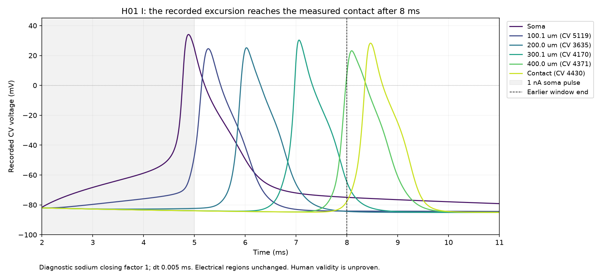

In the restored-closing condition, the measured edge delivers conductance to
E at 8.855 ms, 0.5 ms after I emits. Removing only this edge removes the
conductance and E voltage effect. I's full trace is exactly unchanged, and
E's local and soma traces are exactly equal before delivery. This establishes
the edge as the cause of the observed E response under the stated input.

The initial local E response is depolarizing: local voltage is below the
borrowed -80 mV reversal. The current pulls that compartment toward -80 mV;
its direction reverses when local voltage crosses the reversal. Soma voltage
alone would give the wrong initial direction because it differs from the
receptor voltage. E emits no event in either control. Thus, delivery is
demonstrated, but suppression of E firing and numerical robustness remain
unverified. The source inhibitory label does not by itself establish the
sign of each local voltage change.
[Measured edge-removal comparison](evidence/h01-measured-delivery20-paired-audit.json).

The absence of E spikes under that short input does not establish that E
cannot spike. With the edge absent, a 5 nA pulse from 8 to 18 ms produces two
complete E excursions with positive peaks. The E channel profile is unchanged.
I's first 20 ms remain exactly equal to the earlier disconnected record.
Thus, E spiking in this condition does not require the I-to-E edge. Amplitude,
onset, and duration changed together, so this result does not identify which
input feature is necessary. Human-response and numerical qualification remain
open. [Direct E response](evidence/h01-measured-E5-overlap-disconnected-audit.json).

With that E input fixed, enabling only the measured edge changes local E
voltage after delivery. I stays exactly unchanged, and E matches before
delivery. The first local current is inward, as predicted from the receptor
voltage below -80 mV. Both E spikes remain, with unchanged sampled event
times at the first two step sizes. A smaller step resolves a one-sample delay
in the second emitted event. The second interpolated onset delay is 0.001124,
0.001140, and 0.001137 ms across the three steps. Thus, the edge causes a local
response and a small onset delay in these discrete runs. It does not remove
an E spike. Both controls pass the declared waveform limits between the two
finer steps. At the finer step, halving maximum compartment length also
preserves the waveform checks and second onset delay: 0.001137 versus
0.001143 ms. I stays identical between edge controls, and E matches before
delivery. The contact coordinates and detector midpoints remain unchanged.
This gives bounded numerical support for the delay in this diagnostic
condition. It does not establish spike removal or human-response accuracy.
[Active E edge comparison](evidence/h01-measured-E5-overlap-paired-audit.json),
[paired half-step comparison](evidence/h01-measured-E5-overlap-paired-halfdt-audit.json).
[Paired finer-step comparison](evidence/h01-measured-E5-overlap-paired-quarterdt-audit.json).
[Paired spatial comparison](evidence/h01-measured-E5-overlap-paired-cv5-audit.json).

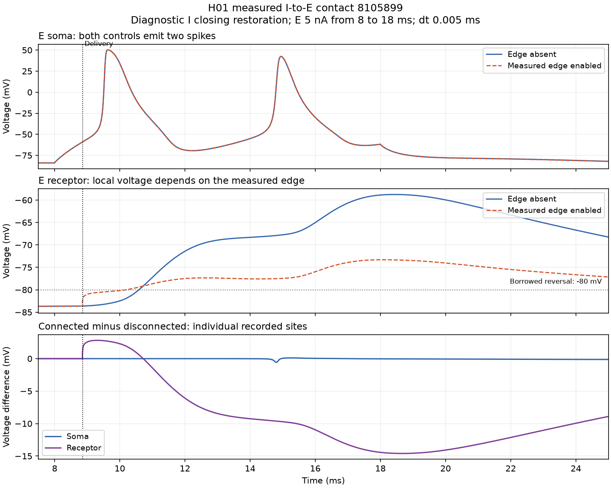

Time-step choice still affects the diagnostic I waveform beyond the declared
limit. Halving the step changes its soma peak by 0.1112 mV, above the 0.1 mV
limit. The E soma and I contact excursions pass their stated checks. This
localizes the failed numerical observation to the I soma peak; it does not
identify a unique channel or integration term as the cause of the error.
[Time-step comparison](evidence/h01-measured-E5-overlap-disconnected-halfdt-audit.json).

Further step refinement reduces this I soma peak difference to 0.0560 mV.
The 0.0025-to-0.00125 ms disconnected comparison passes all declared soma
and contact excursion checks. This supports time-step error as a controllable
source of the failed peak comparison. It does not identify a unique internal
solver term, establish a continuous-time limit, or validate the human response.
[Finer-step comparison](evidence/h01-measured-E5-overlap-disconnected-quarterdt-audit.json).

The electrical map assigns the measured I contact to the dendrite fallback.
That region has Ih but no fast sodium channel. Most of the soma-to-contact
path also uses this fallback. This map is an inference from sparse labels.
No change to this map was needed for the observed contact event with restored
closing time. That arrival does not validate each inferred electrical region.
[Region map](evidence/h01-measured-ie-region-audit.json),
[source path](evidence/h01-measured-i-contact-path-audit.json).

This path also includes six source samples decoded as dendrite and two as
astrocyte by the importer. Filling it with axon parameters would cross these
conflicting labels. Such a map is a model hypothesis, not a measured axon
classification. Keep source codes unchanged.
[Source-label audit](evidence/h01-measured-i-path-label-conflicts.json).

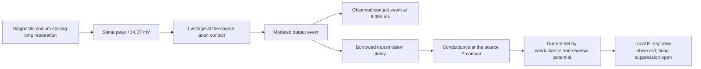

#### Y5 edge list, 2026-09-07: merge check on the 71-candidate pair and scan coverage (SP7)

Observed ([merge check](evidence/h01-pair-merge-check.json)): the pair `4157825456` /
`5654281423` carries 71 of the 123 candidates (57 in one direction, 14 in the other; type
codes 2 and 1 in both directions). No C3 label is shared by the two cells in the released
1,500-sample list or in the 26-cell 3,000-sample checkpoint (neither cell is among the 26).
At the annotation voxels, 70 of 71 rows read background for both endpoints in the proofread
volume and one row reads the pre cell at its pre voxel with background at the post voxel; no
row reads one nonzero label at both ends and no row reads the expected cells at both ends;
none is within the 2-voxel box. Verdict: suspected merge **undetermined**. The saved data
excludes a direct two-cell C3 merge at the sampled labels and excludes an ordinary verified
contact; it cannot tell a C3 label merged with a third object from a mis-placed annotation,
because both leave background at the endpoints. This leaves Y5 open on that pair; the 71
stay candidates only, and the decisive observation (the C3 label at each of the 142 endpoint
voxels against each cell's sampled `c3_ids`) is registered as the next online step.

Coverage ([coverage](evidence/h01-export-scan-coverage.json),
[listing](evidence/h01-c3-export-listing.json)): the C3 synapse export holds 166 shards
(32.86 GB); 9 are local and scanned (8,991,719 records), so `full_export_scanned` is false
as "9 of 166 shards scanned", a measured denominator that was previously unknown. The
3,000-sample rescan stands at 26 of 104 cells; a one-cell dry run under the watchdog
([record](evidence/h01-c3-scan-dry-run-3000.watchdog.json)) completed in 70.0 s with no
kill. Absence of a contact is not established by either scan.

## Y6. Per-type donors

Population cells are simulated with a human-fitted donor's physiology; a donor whose layer and
class match the cell's released tags is "type-matched", any other is "borrowed". Before SP6, 30
of 104 cells were type-matched (L2 pyramids on Allen 541563728, L5 interneurons on HL5BN1).

### Y6 first donor, HL5MN1 (SP6c, 2026-09-07; acquisition and registry only, no run)

Observed (acquisition facts, `evidence/h01-sst-acquisition.json`; decision
`evidence/h01-donors/stage-hl5mn1-decision.json`):

- The ModelDB 267587 file `biophys_HL5MN1.hoc` (GPL-3.0, commit dd472f19) and the ModelDB 267595
  file `biophys_HL23SST.hoc` (commit 4b970fb5) differ only in the procedure name; every density,
  kinetic shift and passive value is identical. The "derived from" of the Cerebral Cortex methods
  is a rename.
- The recordings behind the fit are Allen specimen 571700636 (`H17.06.006.11.09.05`, MTG layer 3,
  aspiny, 35 y male): NWB 618228061 fetched (sha256 `218aa144...`), IVSCC 1.0, 50 kHz, Long
  Square 1020-2020 ms; Yao et al. 2022 (bioRxiv v5) names the cell "putative SST (Neuron ID:
  571700636)"; the SWC header names the same specimen. Subtype stays unknown for H01 tags.
- The eleven `.mod` files and `NeuronTemplate.hoc` are byte-identical to the HL5BN1 import; the
  template gives `HL5MN1` a different axon (`delete_axon(3,1.75,1,1)`: 20 + 30 um tapered
  initial segment plus a 1000 um leakless myelin of cm 0.02).
- Human targets read from the NWB at a -20 mV crossing: 14 spikes at 100 pA (sweep 44; repeats
  45-47 give 14, 13, 12), 34 at 150 pA (sweep 35); first spikes 24.16 and 13.0 ms after onset;
  pre-step voltage -77 mV with 43-53 pA held.

Registry consequence (`h01_cell_types.DONORS["l3-sst-interneuron-hl5mn1"]`): the seven L3
interneurons without modifiers resolve to it; the type-matched count is 37 of 104
(`evidence/h01-population-types.md`). L1, L2, L4 interneurons and the modified L5 interneurons stay
on HL5BN1, labelled.

Not observed: any simulated response. The NEURON reproduction at the two registered inputs
(manifest `evidence/h01-sst-reproduction-manifest.json`, prediction: counts 14 and 34 exactly;
rejection: a count off by more than 1) is untested because the machine was reserved for SP1
when this section was written. Y6 is therefore **open**: the donor is imported and type-matched,
its physiology is not yet reproduced in this project's solver, and its BrainCell transfer is
blocked by a known mechanism difference (HL5MN1 soma NaTg `vshiftm 13, vshifth 15, slopem 7` and
default Ih shifts versus the HL5BN1 values hardcoded in `h01_pv_rates`).

## Measurement function qualification

The simulation is the measurement function. Its numerical error must be small
against the human error it must resolve before a physical split can be read.
The checks below support that discrimination for the named observations only.
They do not prove convergence at every time or input, and a small numerical
change never identifies a channel cause.

Current samples must use the same time level. The staggered solver advances
voltage before it updates channel gates; a current computed from the updated
gates is not the current law used for that voltage step, and mixing the samples
leaves a residual without a failure of the discrete charge balance.

| Candidate and observation | Check | Result | Evidence |
| --- | --- | --- | --- |
| H01 I, voltage-step balance | Matching time levels | Balance closes within its stated limit; bookkeeping only | [balance](evidence/h01-i-current-balance-discrete.json) |
| PV candidate, selected observations | Time step and mesh | Refinement differences recorded | [numerical audit](evidence/h01-pv-numerical-audit.json) |
| PV, first-spike shortening | Two meshes | Effect persists | [spatial robustness](evidence/h01-pv-inactivation-mesh-audit.json) |
| PV, high-input late-spike absence | Finer mesh | Absence persists; full voltage still changes | [failure mesh](evidence/h01-pv-failure-mesh.md) |
| PV, slope rescue | Finer mesh | Rescue and first-return mismatch persist; later times and count change | [candidate spatial check](evidence/h01-pv-slope5-mesh.md) |
| PV, late intervals | Tighter CVode tolerance at fixed mesh | Onsets much closer than under spatial refinement; count preserved | [regional mesh](evidence/h01-pv-regional-mesh.md) |
| PV, final onset | Fine axonal meshes | Shift follows squared compartment length within the limit; event sequence within successive-mesh limits | [fine-mesh qualification](evidence/h01-pv-axon2187-qualification.md) |
| L2 control, 43 pA samples | Tolerance tightened by ten | Error directions persist | [tolerance check](evidence/h01-l2-subthreshold-tolerance-comparison.md) |
| L2 control, 43 pA samples | Successive spatial refinement | Error directions persist with small changes | [spatial refinement](evidence/h01-l2-subthreshold-spatial-comparison.md) |
| L2 reversal candidate, 43 pA | Tighter tolerance; spatial refinement | Directions persist | [tolerance](evidence/h01-l2-reversal-tolerance-result.md), [spatial](evidence/h01-l2-reversal-spatial-result.md) |
| L2 reversal candidate, spike phases | Spatial refinement; tighter tolerance | Error signs persist with small phase changes | [spatial](evidence/h01-l2-reversal-active-spatial-result.md), [tolerance](evidence/h01-l2-reversal-active-tolerance-result.md) |
| L2 slower-opening candidate, phases | Tighter tolerance | Each phase changes below 0.000422 ms | [tolerance check](evidence/h01-l2-sodium-opening-tolerance-result.md) |
| L2 control, minima | Tighter tolerance; two meshes | Below 0.000002658 mV and 0.001330 mV; human errors much larger | [minimum review](evidence/h01-l2-density130-minima-numerical-review.md) |
| L2 density candidate, spikes | Tighter tolerance | Each phase below 0.000417 ms; rising-phase human errors above 0.12 ms persist | [tolerance check](evidence/h01-l2-density130-tolerance-result.md) |
| L2 density candidate, spikes | Segments threefold | Onset changes at most 0.0357 ms; each phase below 0.000347 ms | [spatial comparison](evidence/h01-l2-density130-spatial-result.md) |
| L2 Kv3 half candidate, post-spike voltages | Tighter tolerance | One-spike outcome persists; below 0.000000830 mV | [tolerance comparison](evidence/h01-l2-kv3-half-tolerance-result.md) |
| L2 Kv3 ninety candidate, minima | Tighter tolerance | Spike limits pass; each minimum below 0.000001881 mV | [tolerance comparison](evidence/h01-l2-kv3-ninety-tolerance-result.md) |
| L2 sodium-recovery candidate | Independent solver; successive spatial refinement | Direct events pass at this input | [layer-2 sodium split](evidence/h01-l2-sodium-recovery-result.md) |
| PV transfer, matched mesh, events 1-8 | Halve dt in NEURON and in BrainCell | Event 8 moves 0.002 ms in each; all gates pass | [isolation split](evidence/h01-pv-transfer-isolation.md) |
| PV transfer, matched mesh | NEURON CVode 1e-10 vs fixed dt 0.000625 | Largest rise change 0.044 ms; gates pass | [isolation audit](evidence/h01-pv-transfer-isolation-audit.json) |
| L2 campaign controls | nseg 3 vs nseg 9 at CVode 1e-10, active input | Five phase changes exceed one fifth of the smallest source-candidate-corner contrast; coarse setting rejected | [Stage 0 preservation](evidence/h01-l2-campaign/stage0-active-preservation.json) |
| L2 paired-swap runs | CVode 1e-10 vs 1e-11 at nseg 9 | Added pair: every ranked residual within its limit (max 0.0002 ms); removed pair: two event-3 phase residuals at 0.00044 ms vs 0.00042 ms limit, counts and all other contrasts unchanged | [prediction check](evidence/h01-l2-campaign-fine/stage-b-prediction-check.json) |
| Verified 4-cell network, solver cost (SP1) | dt 0.005 ms; 0.05, 1, 1 (repeat), 10 ms as detached idle-machine jobs | Init + run fits a + b*steps with a = 245.4 s, b = 0.0576 s/step, 200*b = 11.5 s per simulated ms; two-repeat decision limit on b 0.971 s/step (184.5 s at 1 ms), max residual 44.5 s: the four points are linear within the limit and b is below its own limit (resolved only through the 10 ms point). Construction 243.6-280.2 s; peak RSS 1,330-1,350 MB. The 0.05 ms point (270.0 s) sits within the 157 s anchor + limit; the run-to-run spread, not the step count, dominates under 1 ms. The `staggered` control at 1 ms was killed after 600 s of silence (untested) at 8,100 MB peak RSS. Numerical limit only; leaves every Y-section open | [throughput](evidence/h01-network-throughput.json), [page](evidence/h01-network-throughput.md) |

The response-size ranking in the [factor evidence](evidence/h01-i-factor-response-rss.md)
compares specified interventions on a fixed observation grid. It selects the
next diagnostic boundary. It does not prove mediation or supply missing
biological uncertainty.

## Unresolved

- Y1: which upstream axonal segment reduces the outflow in the axon-only case;
  whether the electrical region map is correct.
- Y2: transfer of the full 1270 ms train and the other inputs at the copied
  mesh; whether equal counts also equal compartment placement on every branch.
  SP2 prediction registered 2026-09-07 (see the Y2 entry); the finalist I profile is
  registered and alignment checks, the arms are untested.
- Y3: the post-trough inward drive that refires the human within 6 to 10 ms
  of a −79 mV trough (not somatic Ca_LVA), and the accommodation along the
  train (threshold −61 to −55 mV, late fall slowing to −294 V/s); one
  evaluation in reserve. Closed on 2026-09-06 by the energetic search: the
  bias question (held state, command-only input; the "passive family" was the
  double-counted bias), the loop (sodium inflow ending within the upstroke) and
  the trough (Kv3 activation carried past the spike, its tail below −73 mV),
  each predicted on the closed 0.23 nA holdout.
- Y4: the initiation site. The human's two-stage upstroke (shoulder, 351 V/s,
  threshold −56 mV) needs a spike that arrives at the soma from outside it;
  the fit is perisomatic. Family change is the user's decision. Closed on
  2026-09-06: the late subthreshold return is inside two human repeat limits;
  the rise rate is load-limited but the load cannot be the lever (peak and
  trough move with it).
- Y6: the HL5MN1 reproduction (registered, untested) and the kinetic-shift parameters the
  `H01PV_*` channels need before the donor can be transferred to BrainCell.
- Y5: numerical robustness, reciprocal behavior, and qualified cell models.
  The measured E-to-I candidate contact (annotation 54906016, excitatory type)
  found by the C3 edge list awaits endpoint verification.

## Evidence index

Sources: [source and datum evidence](evidence/h01-pv-acquisition-audit.md),
[human pyramidal sources](evidence/h01-active-wilbers-sources.json),
[H01 anatomy](https://h01-release.storage.googleapis.com/landing.html).
The per-behavior tables above index the remaining records.

A yes/no decision applies to a specified causal claim and its tested conditions.
Keep the continuous direct response that supports the decision.
Distinguish a contradicted prediction, an invalid test, and an unresolved explanation.
Only supported conclusions belong in the explanations. Unresolved links stay explicit.
