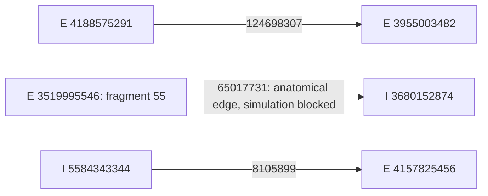

# H01 verified connection network

Current continuation (2026-09-08): all 104 largest soma-bearing components
import with source segments preserved; all 104 electrical cells now construct
with 808,495 compartments and two projections. A 40-cell network also initializes
and runs 1 ms with finite traces. See the
[current readiness evidence](evidence/h01-population-status.md) and
[104-cell result](evidence/h01-ready-104-result.md). This supersedes the earlier
reader failure and 12-cell runtime limit described below; full-104 execution,
driven response and physiological qualification remain open.

The offline topology contains all 104 source neuron IDs: 79 E (+1) and 25 I
(-1). Three synapses have exact endpoint identity checks in the saved population
audit. This is a partial connection map. The saved topology reflects the
1,500-sample scan: 123 candidates, 3 verified, 120 excluded with reasons. The
completed 3,000-sample scan (104 of 104 cells,
[edge list](evidence/h01-resolved-edge-list-3000.json)) lists 126 candidates,
still 3 verified; the 3 new candidates all fail the 5-voxel recheck at one
endpoint ([recheck](evidence/h01-endpoint-recheck-5voxel-3000.json)), so the
verified set is unchanged.

| Synapse | Sending cell | Receiving cell | Type | BrainCell placement |
| --- | --- | --- | --- | --- |
| 124698307 | 4188575291 | 3955003482 | E to E | Both endpoints on soma-containing component 0 |
| 65017731 | 3519995546 | 3680152874 | E to I | Source is component 55, a separate fragment with no soma; simulation blocked |
| 8105899 | 5584343344 | 4157825456 | I to E | Both endpoints on soma-containing component 0 |

Thus the topology has six incident neurons and 98 neurons without an accepted
edge. The subset with supported simulation placements has four neurons and two synapses,
in two separate pairs. No cable joins the separate source fragment to its soma.
The importer does not invent that missing cable or replace it with a soma event.
The real four-neuron construction now passes: four cells, two projections,
and 75,605 compartments in 163.3 seconds (the earlier pre-caching build took
331.2 s). Two repeated morphology-table builds caused the earlier delay; scoped
lookup caches remove that redundant work.
The construction record is [saved here](evidence/h01-verified-network-build.json).
A compiled one-step run of the real circuit exists: dt 0.005 ms, duration
0.005 ms, initialization plus run 157.0 s, finite traces saved to
`h01-verified-network-traces.npz`. No run of this four-cell network longer than
the throughput checks (10/200/2000 steps,
[throughput](evidence/h01-network-throughput.md)) exists. See the
[validation record](evidence/h01-verified-network-validation.md).



## Use

From the H01 worktree, export the topology and construct the supported subset:

```powershell
.cache/validation/Scripts/python.exe -m examples.h01_verified_network --topology docs/evidence/h01-verified-network.json --output .cache/h01/verified-network --build
```

Omit `--build` for export only. Omit `--topology` to repeat the offline source
component and cable projection checks from the saved endpoint audit. No network
download or cell fitting occurs. Use `--disconnected` to construct the same cells
and receptor sites with no projections. Optional `--duration-ms` runs a compiled
simulation; default zero constructs only. The default soma current is zero.
`--current-na` selects a common assumed pulse from 2 to 5 ms.

The Python interface is
`braintrace.datasets.h01_network.make_h01_network(topology, archive, annotations)`.
It returns the BrainCell network and its actual construction evidence. The
network populations use names `cell_<source ID>`. The builder checks source
hashes, locations, cell types, and synapse direction again before construction.
Cells with no constructible contacts remain in the exported node inventory.
The runner prints elapsed time at each construction stage and saves the
construction record before starting any requested simulation.

## Files and signs

- [Topology and placement evidence](evidence/h01-verified-network.json): all
  cell IDs, original tags, Dale signs, verified contacts, component locations,
  source hashes, and construction blockers.
- `h01-verified-network.npz`: `cell_ids`, `dale_sign`, `contact_count`, and
  `assumed_signed_weight_us`. Each matrix has shape 104 by 104. Row is sender;
  column is receiver. These matrices include all three verified contacts.
  `placed_contact_count` and `placed_assumed_signed_weight_us` contain only
  the two contacts with supported simulation placements. The JSON field
  `construction_ready` means the cable placement gates passed; it is not a
  completed full-scale execution result.
- `h01-verified-network-build.json`: actual populations and projections,
  blocked contacts, electrical profiles, inputs, and execution status.

Signed weights use the sending cell's Dale sign. BrainCell conductances are
nonnegative; the sending cell selects excitatory or inhibitory receptor
parameters. Default assumed magnitudes are 0.01 uS for E and 0.02 uS for I,
delay 0.5 ms, reversals 0/-80 mV, and decay constants 2/5 ms. These are the
existing diagnostic circuit settings, not measured properties of the contacts.

The builder uses the existing frozen E/I candidates and the existing inferred
electrical region policy. It does not apply the earlier sodium override or
promote the newer potassium finalist. Human waveform validation still fails.
H01 cells use a BrainCell subclass that caches integer indices and ordered
branch views only during discretization. The instance lookup methods are
restored after each build. No installed BrainCell code is changed.
The current event engine permits only one output site per source cell; it
rejects multiple distinct source sites rather than broadcasting the wrong
terminal event. The present two simulated contacts do not require that feature.

Example 21/pp-prop training integration is not implemented by this change.

The first one-step execution attempt failed with MemoryError in the dense
axial operator ([failure log, kept as history](evidence/h01-network-execution-2026-09-06-memory-failure.log)).
The same-day fix (sparse 1D DHS static source, `h01_staggered_scan`) resolved
it: the network initializes and steps once (0.005 ms) in 157.0 s with finite
traces ([build record](evidence/h01-verified-network-build.json)). This is a
numerical smoke run, not a physiological pass; longer windows are covered in
[h01-network-throughput.md](evidence/h01-network-throughput.md) and the
[validation record](evidence/h01-verified-network-validation.md).
